<p align="center">
  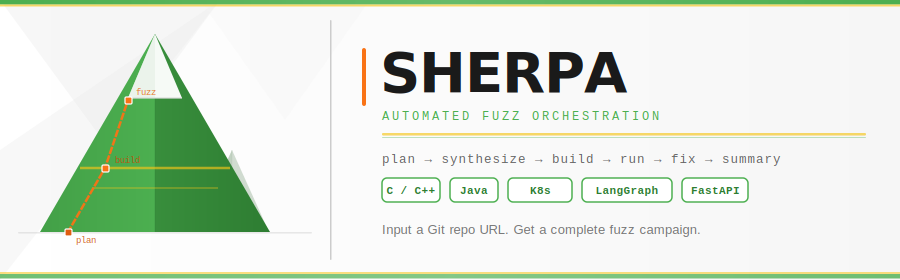
</p>

# SHERPA

## 1. 项目定位

Sherpa 是一个面向 **C/C++ 与 Java 仓库** 的自动化 fuzz 编排系统。输入一个 Git 仓库 URL，系统会自动完成：

`plan -> synthesize -> build -> run -> (optional fix_build/fix_crash) -> summary`

当前主运行路径是 Web 模式（FastAPI + LangGraph + Docker runtime）。

### 1.1 当前实现中的关键事实

1. 仅支持 Docker 执行（Docker-only policy）。
2. `decide` 节点已删除，路由由条件函数直接决定。
3. `plan` 节点负责输出后续策略（是否 crash 后修复、最多修复轮次）。
4. OpenCode 提示词不再硬编码，统一在 `harness_generator/src/langchain_agent/prompts/opencode_prompts.md`。
5. 前端配置聚焦常用项：API Key、仓库 URL、总时长、单次时长、`Max Tokens`。
6. 新增 OpenCode Provider 配置界面：支持多 Provider（含 Minimax）编辑 `base_url/api_key/models/headers/options`，后端会自动生成运行时 `opencode.json`。
7. 断点续跑默认手动触发：启动阶段不自动恢复，需调用 `POST /api/task/{job_id}/resume`。
8. run 阶段并行批次预算已显式记录到 `run_batch_plan`，用于回放预算分配与超时行为。
9. OpenCode 已集成 GitNexus MCP，默认在每次调用前自动分析“仓库快照”增强代码关系理解（避免污染待修复仓库）。

---

## 2. 总体架构

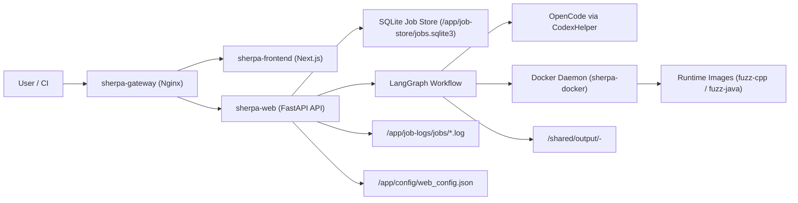

### 2.1 模块职责

| 模块 | 文件 | 作用 |
|---|---|---|
| Web API | `harness_generator/src/langchain_agent/main.py` | 配置管理、任务提交、任务状态聚合、日志落盘与分类 |
| 任务状态存储 | `harness_generator/src/langchain_agent/job_store.py` | SQLite 任务状态持久化与重启恢复 |
| Workflow | `harness_generator/src/langchain_agent/workflow_graph.py` | 节点定义、状态路由、失败策略、summary 输出 |
| Workflow 公共工具 | `harness_generator/src/langchain_agent/workflow_common.py` | 通用校验、预算控制、prompt 模板加载与渲染 |
| Workflow Summary | `harness_generator/src/langchain_agent/workflow_summary.py` | 运行产物盘点、run summary/fuzz effectiveness 输出 |
| Fuzz 执行器 | `harness_generator/src/fuzz_unharnessed_repo.py` | clone/build/run/crash triage/bundle |
| OpenCode 封装 | `harness_generator/src/codex_helper.py` | 调用 CLI、超时/重试、done 语义 |
| 配置层 | `harness_generator/src/langchain_agent/persistent_config.py` | 持久化配置、环境变量同步、key 脱敏 |
| 前端 | `frontend-next/` (Next.js 14 + TS + MUI + TanStack Query + Zustand) | 提交任务、绑定会话、进度/日志/错误可视化 |
| Prompt 模板 | `harness_generator/src/langchain_agent/prompts/opencode_prompts.md` | plan/synthesize/fix_* 统一模板 |

---

## 3. 容器拓扑与启动过程

### 3.1 docker-compose 拓扑

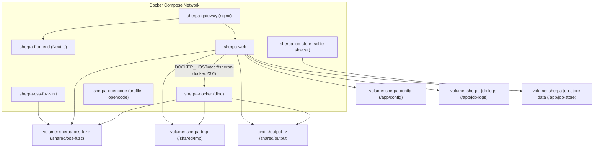

### 3.2 启动时序

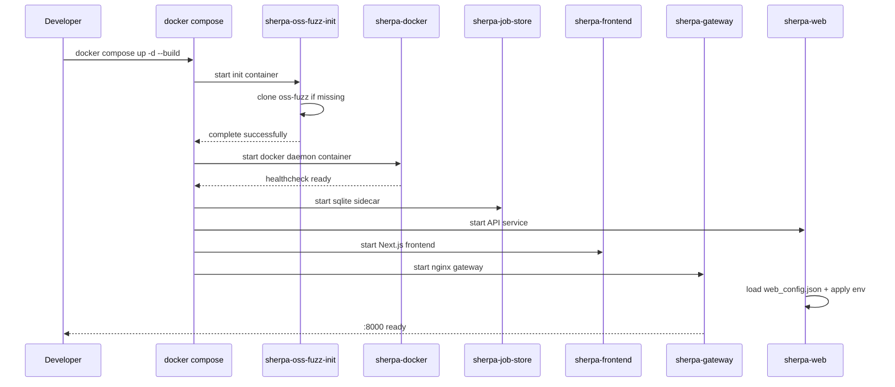

### 3.3 关键 compose 配置点

1. `DOCKER_BUILDKIT=0` 在 `sherpa-web` 中默认开启，规避部分环境缺少 buildx 的问题。
2. dind 默认启用 xuanyuan 镜像加速：`SHERPA_DOCKER_REGISTRY_MIRROR=https://7m856d3fdvb9yp.xuanyuan.run`，也可通过本地环境变量覆盖。
3. `/shared/output` 是主产物目录（当前映射到仓库 `./output`）。
4. `sherpa-web` 和 `sherpa-docker` 共享 `sherpa-tmp` 与 `sherpa-oss-fuzz`，保证容器内路径一致。
5. `sherpa-gateway` 统一入口：`/` -> `sherpa-frontend`，`/api/*` -> `sherpa-web`。
6. `sherpa-job-store` 与 `sherpa-web` 共享 `sherpa-job-store-data`，用于持久化任务状态 SQLite。
7. `sherpa-job-store` 启动时会初始化 `/data/jobs.sqlite3` 并收紧权限（目录 `0770`、文件 `0660`）。

### 3.4 容器职责（明确分工）

| 容器 | 职责 | 对外暴露 |
|---|---|---|
| `sherpa-gateway` | 唯一入口网关，转发 UI/API | `:8000` |
| `sherpa-frontend` | Next.js 前端页面与交互 | 内部 `:3000` |
| `sherpa-web` | FastAPI API + workflow 编排 + 任务状态/日志 | 内部 `:8001` |
| `sherpa-job-store` | SQLite sidecar（任务状态库管理与运维入口） | 无 |
| `sherpa-docker` | Docker daemon（dind），负责构建/运行 fuzz 容器 | 内部 `:2375` |
| `sherpa-oss-fuzz-init` | 初始化/校验 oss-fuzz 工作目录 | 无 |

---

## 4. 快速开始（开发环境）

### 4.1 前置条件

1. Docker Desktop / OrbStack（兼容 Docker API）。
2. Docker Compose plugin。
3. 可用的 OpenAI 兼容 API Key（常见为 DeepSeek/OpenAI/OpenRouter）。

### 4.2 首次启动建议（镜像预热）

首次部署或网络不稳定环境，建议先预热运行时镜像，再启动 compose，避免任务内现场构建导致长时间停在 `init/plan`。

```bash
# 预热 opencode 运行镜像（使用国内镜像源基底）
docker build -t sherpa-opencode:latest \
  -f docker/Dockerfile.opencode \
  --build-arg OPENCODE_BASE_IMAGE=m.daocloud.io/docker.io/library/node:20-slim \
  .

# 预热 C/C++ fuzz 运行镜像
docker pull m.daocloud.io/docker.io/library/ubuntu:24.04
docker tag m.daocloud.io/docker.io/library/ubuntu:24.04 ubuntu:24.04
docker build -t sherpa-fuzz-cpp:latest -f docker/Dockerfile.fuzz-cpp .
```

快速验收：

```bash
docker run --rm sherpa-opencode:latest sh -lc 'opencode --version && gitnexus --version'
docker run --rm sherpa-fuzz-cpp:latest sh -lc 'clang --version | head -n 1 && python3 --version'
```

### 4.3 启动

```bash
docker compose up -d --build
```

### 4.4 访问与健康检查

- 统一入口（Gateway）: `http://localhost:8000`
- 前端（Next.js，经网关访问）: `http://localhost:8000/`
- API（FastAPI，经网关访问）: `http://localhost:8000/api/*`

```bash
curl -s http://localhost:8000/api/system | jq
```

### 4.5 提交最小任务

```bash
curl -s http://localhost:8000/api/task \
  -H 'Content-Type: application/json' \
  -d '{
    "jobs": [
      {
        "code_url": "https://github.com/madler/zlib.git",
        "docker": true,
        "docker_image": "auto",
        "total_time_budget": 900,
        "run_time_budget": 300,
        "max_tokens": 1000
      }
    ],
    "auto_init": true,
    "build_images": true
  }' | jq
```

---

## 5. 代码目录导览

```text
.
├── docker/
│   ├── Dockerfile.web
│   ├── Dockerfile.fuzz-cpp
│   ├── Dockerfile.fuzz-java
│   ├── Dockerfile.opencode
│   └── requirements.web.txt
├── harness_generator/
│   ├── docs/
│   ├── src/
│   │   ├── langchain_agent/
│   │   │   ├── main.py
│   │   │   ├── workflow_graph.py
│   │   │   ├── persistent_config.py
│   │   │   ├── prompts/opencode_prompts.md
│   │   ├── fuzz_unharnessed_repo.py
│   │   └── codex_helper.py
│   └── requirements.txt
├── tests/
├── docker-compose.yml
└── README.md
```

---

## 6. 任务模型与状态聚合

### 6.1 任务层级

Sherpa 采用父子任务模型：

1. `task`：批次级任务（父任务，提交入口）。
2. `fuzz`：单仓库执行任务（子任务，真正执行 workflow）。

### 6.2 状态定义

子任务（`fuzz`）会出现以下状态：

- `queued`
- `running`
- `resuming`
- `recoverable`
- `success`
- `resumed`
- `error`
- `resume_failed`

父任务（`task`）聚合时会做状态归一：

- `queued` -> `queued`
- `running` / `resuming` / `recoverable` -> `running`
- `success` / `resumed` -> `success`
- `error` / `resume_failed` -> `error`

### 6.3 聚合规则（父任务）

1. 任一子任务 `queued/running/resuming/recoverable` -> 父任务 `running`
2. 全部结束且至少一个 `error` -> 父任务 `error`
3. 全部 `success` -> 父任务 `success`

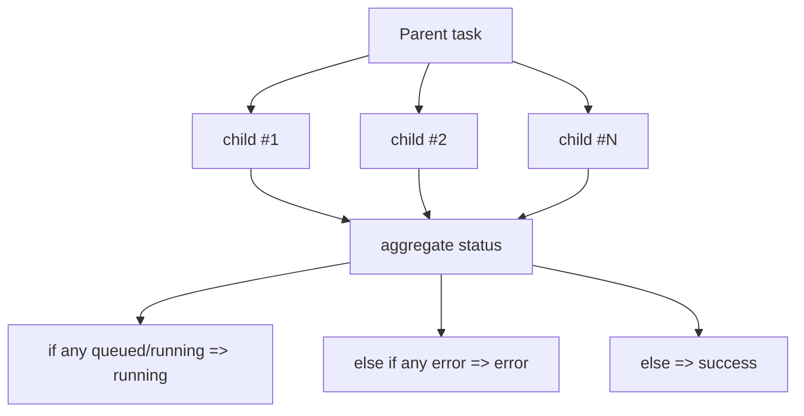

---

## 7. 工作流状态机（核心执行路径）

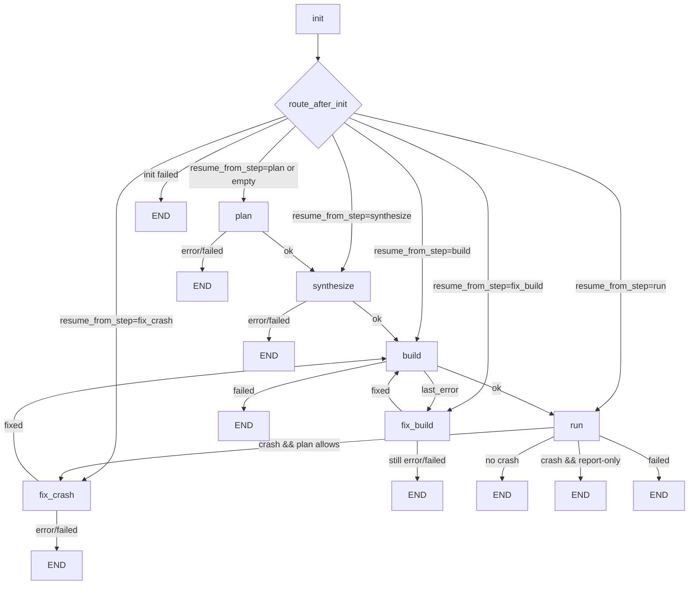

### 7.1 节点与 LLM 职责表

| 节点 | 是否调用 LLM/OpenCode | 主要职责 | 关键输出 |
|---|---|---|---|
| `init` | 否 | 初始化 generator、预算、repo_root | 初始化状态 |
| `plan` | 是 | 生成 fuzz 目标与策略 | `fuzz/PLAN.md`, `fuzz/targets.json`, `plan_fix_on_crash`, `plan_max_fix_rounds` |
| `synthesize` | 是 | 生成 harness/build 脚手架 | `fuzz/build.py` + harness 源 |
| `build` | 否 | 实际构建并提取错误摘要 | `fuzz/build_full.log`, `fuzz/out/*` |
| `fix_build` | 条件调用 | 本地热修 + OpenCode 修 build 错误 | 修改 `fuzz/*`、清空 `last_error` |
| `run` | 否 | 并行运行 fuzz、收集 crash/metrics | `run_details`, crash 文件 |
| `fix_crash` | 条件调用 | 基于 crash 分析修复 harness 或上游代码 | `fix.patch`, `fix_summary.md` |
| workflow end | 否 | 产出最终总结 | `run_summary.md/json`, `fuzz_effectiveness.md/json` |

### 7.2 已移除节点

- `decide` 节点已删除。
- 路由通过 `_route_after_*` 函数直接决策。

---

## 8. plan / synthesize / fix 的真实行为

### 8.1 `plan` 节点在做什么

`plan` 不只是“挑目标”，还承担执行策略定义：

1. 输出 `fuzz/targets.json`（后续 synthesize/build 输入）。
2. 输出 `fuzz/PLAN.md`（包含建议、约束、策略）。
3. 从 `PLAN.md` 解析策略：
   - `Crash policy: report-only|fix`
   - `Max fix rounds: N`
4. 生成 `codex_hint` 给后续节点做约束增强。

### 8.2 `synthesize` 节点在做什么

1. 生成或更新 `fuzz/build.py`。
2. 生成至少一个 harness 源文件（`.c/.cc/.cpp/.java`）。
3. 如依赖系统包，写 `fuzz/system_packages.txt`（包名列表，不写 shell）。

### 8.3 `fix_build` 节点在做什么

先本地热修，再必要时调用 OpenCode。

本地热修覆盖典型问题：

1. `-stdlib=libc++` 造成 ABI 不匹配。
2. `main` 符号冲突（注入 `-Dmain=vuln_main` 等）。
3. `cannot find -lz` 链接失败。

若热修不足，再把结构化错误 + 完整构建日志文件路径传给 OpenCode 修复。

### 8.4 `fix_crash` 节点在做什么

1. 读取 `crash_info.md` + `crash_analysis.md`。
2. 若判定 `HARNESS ERROR`，走 harness 修复模板。
3. 否则按上游代码缺陷修复模板执行。
4. 生成 `fix.patch`、`fix_summary.md`，并拷贝进 challenge bundle。

---

## 9. 构建与运行在不同环境（关键认知）

OpenCode 编辑发生在其自身环境，但 build/run 在 fuzz runtime 容器里执行。Prompt 中已明确告知该事实。

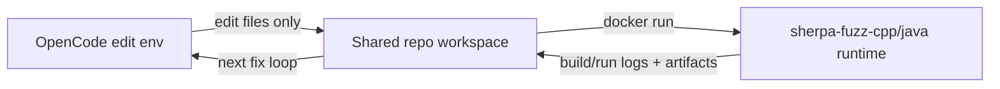

这意味着：

1. OpenCode 不能假设当前 shell 环境等同 build/run 环境。
2. build 失败修复应依赖日志与文件，不依赖“本地能运行”。

---

## 10. 双预算模型与并行执行模型

### 10.1 预算字段

1. `total_time_budget`：整个 workflow 的总预算（硬上限）。
2. `run_time_budget`：单次 fuzz 批次预算（运行阶段上限）。

### 10.2 预算切分逻辑（run 阶段）

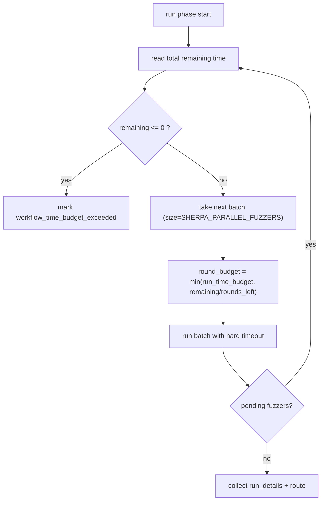

### 10.3 并行度控制

- 环境变量：`SHERPA_PARALLEL_FUZZERS`（默认 `2`，上限被代码限制）。
- 若仅一个 fuzzer，则强制串行。

### 10.4 并行运行可观测字段

`run` 节点会输出 `run_batch_plan`（按轮次）：

1. `round`: 第几轮批次。
2. `batch_size`: 当前批次 fuzzer 数量。
3. `pending_before`: 本轮执行前待运行数量。
4. `rounds_left`: 预计剩余轮次。
5. `remaining_total_budget_sec`: 本轮开始时总剩余预算。
6. `round_budget_sec`: 分配给本轮的 run 预算。
7. `hard_timeout_sec`: 本轮容器硬超时。

---

## 11. API 对接说明

### 11.1 接口总览

| 方法 | 路径 | 说明 |
|---|---|---|
| `GET` | `/api/config` | 读取配置（密钥脱敏） |
| `PUT` | `/api/config` | 更新配置并立即应用 |
| `GET` | `/api/system` | 系统状态与运行中任务 |
| `POST` | `/api/task` | 提交父任务（可含多个 repo 子任务） |
| `GET` | `/api/task/{job_id}` | 查询单任务详情（父任务聚合视图） |
| `POST` | `/api/task/{job_id}/resume` | 手动恢复中断任务（支持从记录的 workflow step 续跑） |
| `GET` | `/api/tasks?limit=N` | 最近任务列表（会话选择器） |

### 11.2 `POST /api/task` 请求体（推荐）

```json
{
  "jobs": [
    {
      "code_url": "https://github.com/madler/zlib.git",
      "email": null,
      "model": "deepseek/deepseek-reasoner",
      "max_tokens": 1000,
      "time_budget": 900,
      "total_time_budget": 900,
      "run_time_budget": 300,
      "docker": true,
      "docker_image": "auto"
    }
  ],
  "auto_init": true,
  "build_images": true,
  "images": null,
  "force_build": false,
  "oss_fuzz_repo_url": null,
  "force_clone": false
}
```

返回：

```json
{
  "job_id": "<parent_task_id>",
  "status": "queued"
}
```

### 11.3 `GET /api/task/{job_id}` 关键字段

1. `status`: 聚合状态。
2. `children_status`: 子任务统计。
3. `children`: 子任务详情（含 `log`, `log_file`, `error`, `result`）。
4. 恢复相关字段（子任务）：`resume_from_step`, `resume_attempts`, `last_resume_reason`。
5. run 阶段诊断字段：`run_details` 与 `run_batch_plan`（用于并行轮次预算排查）。

### 11.4 `POST /api/task/{job_id}/resume` 说明

1. 支持 task/fuzz 两类 job_id：
   1. task：恢复其可恢复子任务；
   2. fuzz：直接恢复该子任务。
2. 恢复优先从保存的 `resume_from_step` 继续；若缺少必要上下文会进入 `resume_failed` 并给出结构化原因。
3. 同一任务重复调用具备幂等保护，不会重复并发调度。

### 11.5 前后端时序

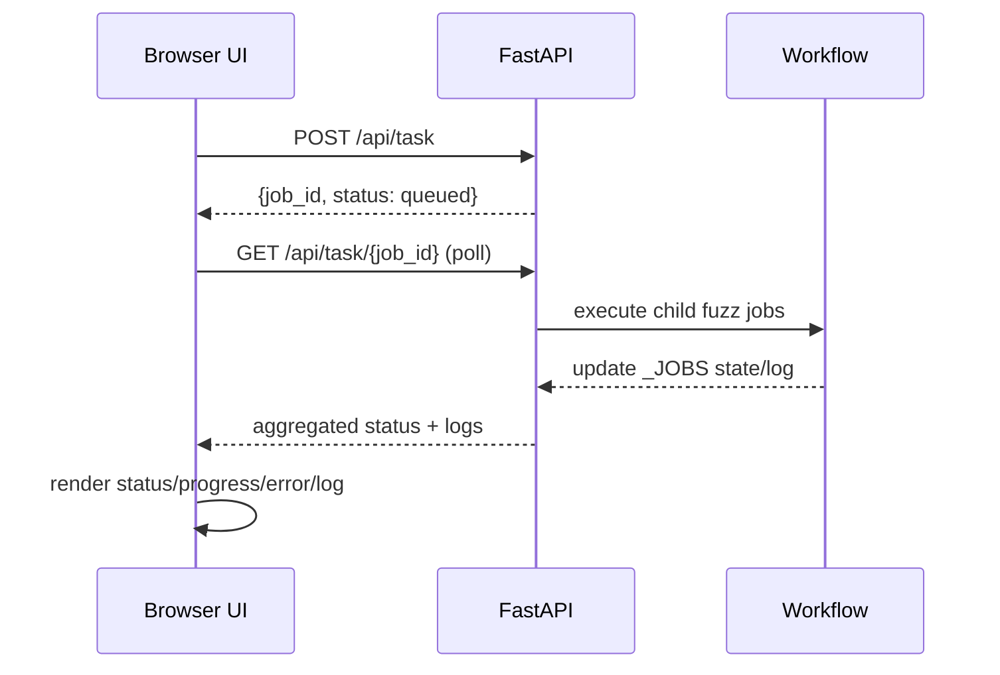

### 11.6 断点续跑时序（从当前 step 继续）

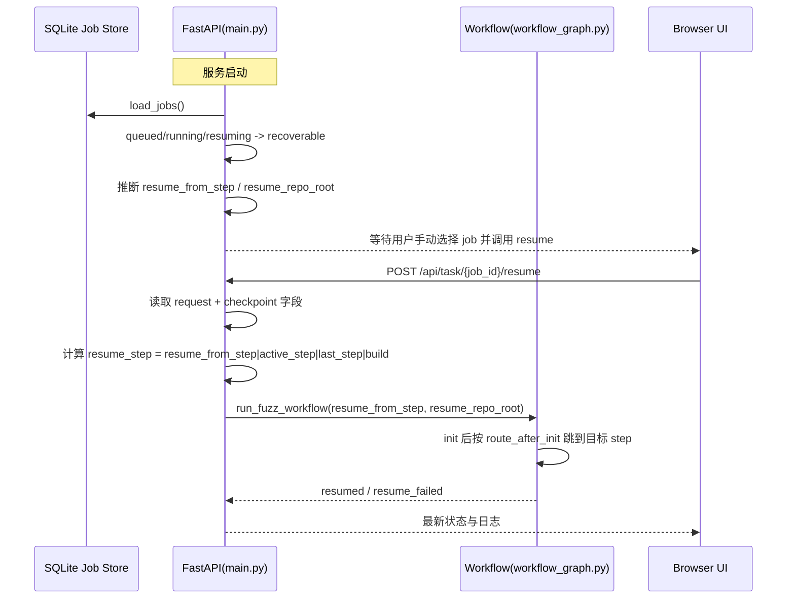

### 11.7 Checkpoint 提取与恢复字段更新

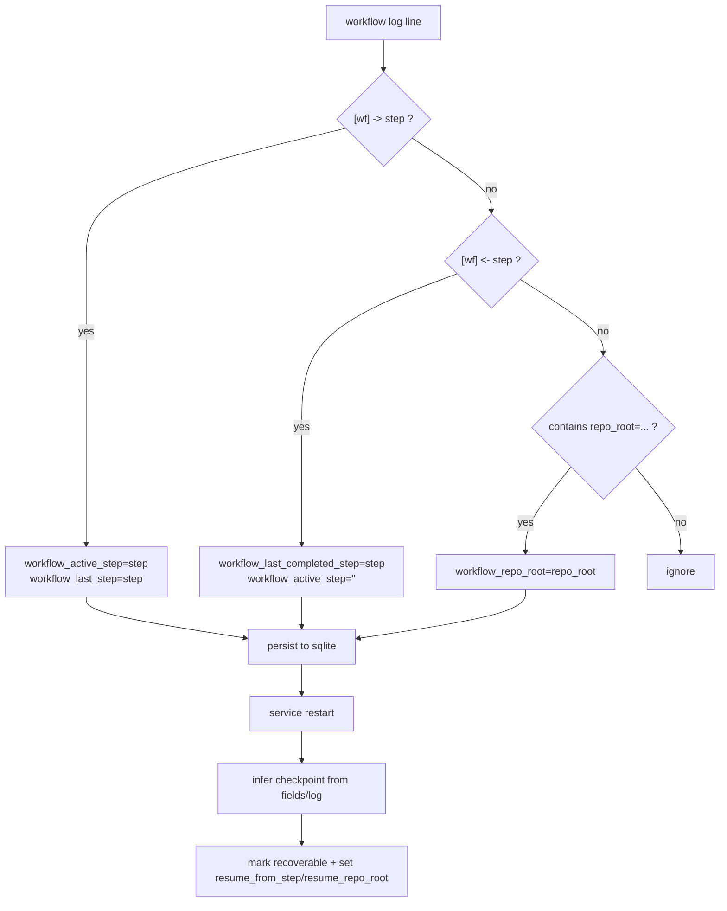

### 11.8 失败后恢复 step 选择决策树

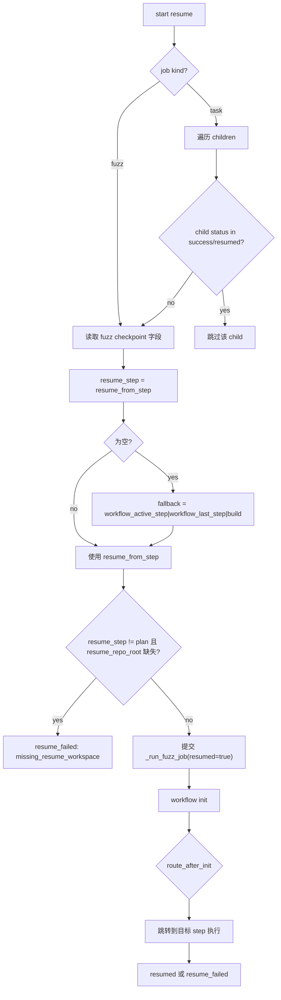

---

## 12. 前端行为说明（当前版本）

前端工程：

- `frontend-next/app/*`
- `frontend-next/components/*`
- `frontend-next/lib/api/*`
- `frontend-next/store/useUiStore.ts`

### 12.1 页面重点

1. 任务触发（仓库 URL、总时长、单次时长）。
2. 会话绑定（任务列表 + 手动 task id）。
3. 任务状态、阶段进度、错误详情、事件日志。
4. API Key 保存（持久化到后端配置）。

### 12.2 日志分类（避免误报）

前端通过显式前缀规则识别日志级别，不会把普通运行日志全部归为错误。

分类入口：`frontend-next/components/logUtils.ts` 中的 `detectLevel(line)`。

规则示例：

1. 明确失败：`Traceback`、`Docker build failed`、`error during connect` 等。
2. 警告：`DEPRECATED`、`warning:`。
3. 普通事件：`[wf]`、`[job]`、`[OpenCodeHelper]`、命令回显行。

### 12.3 日志自动滚动

任务日志更新后，前端会调用自动滚动逻辑将事件窗滚到底部，避免手动追踪。

---

## 13. 配置系统（持久化 + 环境注入）

配置模型定义：`WebPersistentConfig`。

### 13.1 配置存储

1. 主配置文件：`config/web_config.json`。
2. OpenCode 环境文件：`config/web_opencode.env`。

### 13.2 配置字段（核心）

| 字段 | 说明 |
|---|---|
| `openai_api_key` | OpenAI 兼容 key（DeepSeek 等） |
| `openai_base_url` | OpenAI 兼容 base URL |
| `openai_model` | OpenAI 模型名 |
| `opencode_model` | OpenCode 模型名 |
| `opencode_providers` | OpenCode Provider 配置列表（provider/base_url/api_key/models/headers/options） |
| `openrouter_api_key` | OpenRouter key（可选） |
| `fuzz_time_budget` | 默认预算 |
| `fuzz_use_docker` | Docker 开关（后端强制 true） |
| `fuzz_docker_image` | 默认镜像（`auto`/显式 tag） |
| `oss_fuzz_dir` | 本地 oss-fuzz 路径 |
| `sherpa_git_mirrors` | Git 镜像配置 |
| `sherpa_docker_*_proxy` | Docker 代理相关配置 |

### 13.3 配置优先级（简化理解）

1. 任务请求字段（如 `docker_image`、budget）。
2. 持久化配置默认值（web_config）。
3. 代码内兜底默认值。

### 13.4 密钥保护

- `GET /api/config` 会将 key 字段置空，仅返回 `*_set=true/false` 标记。
- `PUT /api/config` 若 key 传 `null`，保留旧 key，不覆盖。

---

## 14. Prompt 模板系统

模板文件：`harness_generator/src/langchain_agent/prompts/opencode_prompts.md`

### 14.1 模板列表

1. `plan_with_hint`
2. `synthesize_with_hint`
3. `fix_build_execute`
4. `fix_crash_harness_error`
5. `fix_crash_upstream_bug`
6. `plan_fix_targets_schema`

### 14.2 渲染机制

1. 使用 `<!-- TEMPLATE: name --> ... <!-- END TEMPLATE -->` 包裹模板。
2. 运行时通过 `_render_opencode_prompt(name, **kwargs)` 做 `{{var}}` 替换。
3. 模板缺失或文件缺失时直接抛错，避免静默降级。

---

## 15. 产物目录与文件生命周期

### 15.1 单任务输出根目录

- `/shared/output/<repo>-<shortid>/`

### 15.2 关键产物

| 文件/目录 | 产出节点 | 用途 |
|---|---|---|
| `fuzz/PLAN.md` | `plan` | 目标与策略说明 |
| `fuzz/targets.json` | `plan` | 目标清单（后续输入） |
| `fuzz/build.py` | `synthesize` | 构建入口 |
| `fuzz/build_full.log` | `build` | 完整构建日志，供 fix_build 使用 |
| `fuzz/out/<fuzzer>` | `build` | 可执行 fuzzer |
| `fuzz/corpus/*` | `run` | 种子与语料 |
| `fuzz/out/artifacts/*` | `run` | 崩溃样本与工件 |
| `crash_info.md` | `run` | 崩溃信息 |
| `crash_analysis.md` | `run` | 崩溃分类（含 HARNESS ERROR 判定） |
| `reproduce.py` | `run` | 复现脚本 |
| `fix.patch` | `fix_crash` | 修复补丁 |
| `fix_summary.md` | `fix_crash` | 修复摘要 |
| `run_summary.md/json` | workflow end | 最终运行报告 |
| `fuzz/out/fuzz_effectiveness.md/json` | workflow end | fuzz 效果统计 |

### 15.3 文件流转图

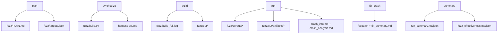

---

## 16. 构建失败：原因与可自动修复范围

### 16.1 常见失败因素

1. 构建脚本路径或目标名不一致。
2. 链接参数错误（例如 `-lz` 不可解析）。
3. `main` 符号冲突导致 libFuzzer 链接失败。
4. `-stdlib=libc++` 与当前 runtime ABI 不匹配。
5. 环境类问题（Docker daemon 不可达、DNS/网络超时、磁盘满）。

### 16.2 fix_build 决策树

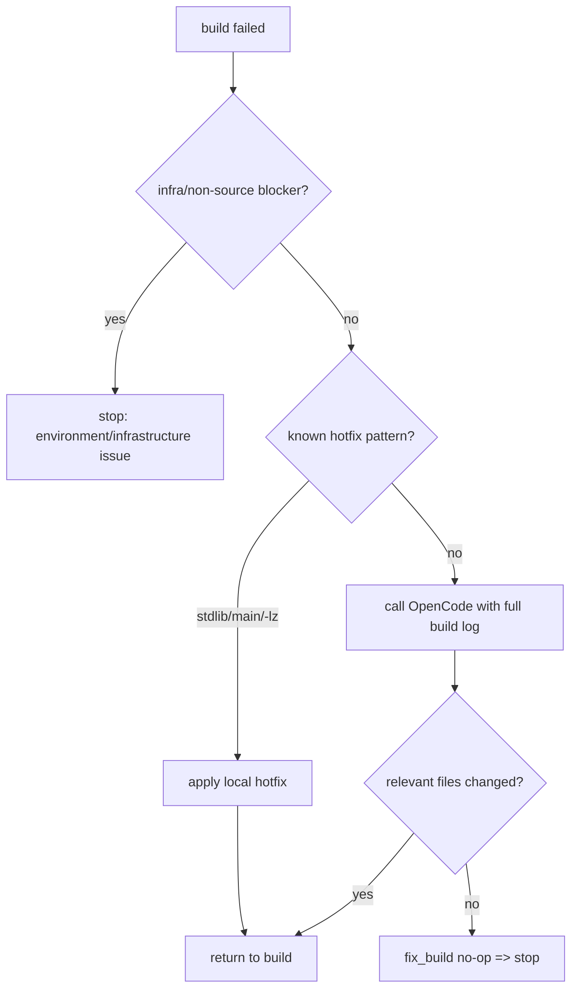

### 16.3 可由 OpenCode 解决的问题（当前系统）

1. harness 源代码错误（include、函数签名、调用方式）。
2. `fuzz/build.py` 编译参数、源路径、输出路径错误。
3. 缺失最小 build glue。
4. 目标选择与实现偏差导致的编译失败。

### 16.4 通常不能由 OpenCode 直接解决的问题

1. Docker daemon 完全不可用。
2. 网络层拉镜像失败（TLS 握手超时、DNS 故障）且无备用源。
3. 宿主机资源耗尽（磁盘、内存）导致构建中止。
4. 仓库本身非 C/C++/Java 且仍强行使用不匹配 runtime。

---

## 17. 失败追踪与排障手册

### 17.1 先看哪里

1. API 返回中的 `error` 与 `children[].error`。
2. `log_file` 指向的任务日志。
3. 输出目录下 `fuzz/build_full.log`。
4. `run_summary.md/json` 与 `fuzz_effectiveness.md/json`。

### 17.2 常用排障命令

```bash
# 1) 看容器状态
docker compose ps

# 2) 看 web 与 dind 日志
docker compose logs -f sherpa-web
docker compose logs -f sherpa-docker
docker compose logs -f sherpa-job-store

# 3) 看最近任务列表
curl -s 'http://localhost:8000/api/tasks?limit=20' | jq

# 4) 看指定任务
curl -s 'http://localhost:8000/api/task/<task_id>' | jq

# 5) 检查 dind 健康
DOCKER_HOST=tcp://127.0.0.1:2375 docker info

# 6) 查看 SQLite 任务状态库
docker compose exec sherpa-job-store sqlite3 /data/jobs.sqlite3 '.tables'
docker compose exec sherpa-job-store sqlite3 /data/jobs.sqlite3 'select job_id,status,updated_at from jobs order by updated_at desc limit 20;'
```

### 17.3 典型错误与处理建议

| 现象 | 根因方向 | 建议 |
|---|---|---|
| `BuildKit is enabled but buildx missing` | 构建器能力不匹配 | 保持 `DOCKER_BUILDKIT=0` 或安装 buildx |
| `lookup sherpa-docker ... no such host` | 容器网络/DNS 问题 | 检查 compose 网络与服务名、重建容器 |
| `TLS handshake timeout` 拉基础镜像失败 | 到 Docker Hub 网络不稳 | 配置公共镜像加速、重试、检查代理 |
| 卡在 `plan` 且日志停在 `building opencode image` | 首次动态构建 `sherpa-opencode`（npm 全局安装慢） | 先手动预构建 `sherpa-opencode:latest`，再提交任务 |
| 卡在 `init` 且日志停在 `building sherpa-fuzz-cpp` | 首次动态构建 `sherpa-fuzz-cpp`（apt 下载慢） | 先手动预构建 `sherpa-fuzz-cpp:latest`，再提交任务 |
| `remote rejected ... workflow ... without workflow scope` | HTTPS/OAuth 凭证缺少 GitHub `workflow` 权限 | 刷新或重建凭证并加入 `workflow` scope，或改用 SSH 推送 |
| 长时间 running 无进展 | 预算过大或卡在外部依赖 | 查看 workflow 日志 step，缩短预算定位 |
| 多轮 fix 无效果 | 同签名反复失败 | 检查 `same_*_repeats` 保护是否触发 |

补充说明（当前实现）：

1. Docker 网络预检查是 best-effort；若本地无 `busybox:latest`，预检查会自动跳过，不会误报为 DNS 故障。
2. `no such host` 诊断已收窄：仅在 registry 相关上下文下归类为 registry DNS 问题，避免误判 `sherpa-docker` 服务名异常。

### 17.4 镜像预热（推荐）

在网络不稳定或首次部署时，建议先预热运行时镜像，避免任务内现场构建导致“看起来卡住”。

```bash
# 预热 opencode 运行镜像（使用国内镜像源基底）
docker build -t sherpa-opencode:latest \
  -f docker/Dockerfile.opencode \
  --build-arg OPENCODE_BASE_IMAGE=m.daocloud.io/docker.io/library/node:20-slim \
  .

# 预热 C/C++ fuzz 运行镜像
docker pull m.daocloud.io/docker.io/library/ubuntu:24.04
docker tag m.daocloud.io/docker.io/library/ubuntu:24.04 ubuntu:24.04
docker build -t sherpa-fuzz-cpp:latest -f docker/Dockerfile.fuzz-cpp .
```

快速验收：

```bash
docker run --rm sherpa-opencode:latest sh -lc 'opencode --version && gitnexus --version'
docker run --rm sherpa-fuzz-cpp:latest sh -lc 'clang --version | head -n 1 && python3 --version'
```

---

## 18. 前端对接重点

### 18.1 会话绑定逻辑

1. `GET /api/tasks` 加载会话列表。
2. 用户选择 task 或手输 ID。
3. 前端周期轮询 `GET /api/task/{id}`。
4. 若 task 结束（success/error），停止轮询并刷新列表。

### 18.2 进度展示逻辑

1. 从日志解析 `"[wf] -> step"` 与 `"[wf] <- step"`。
2. 推导每个 step 的 `pending/running/done/error`。
3. 错误面板只在明确失败条件时显示。

### 18.3 自动滚动

日志渲染后自动滚动到底，避免手动拉到底部追踪最新事件。

---

## 19. 测试与质量保障

测试目录：`tests/`

当前覆盖重点：

1. API 配置脱敏、Docker-only 约束。
2. build 阶段重试与热修行为。
3. run 阶段 crash 检测、预算终止、metrics 结构。
4. summary 与 fuzz_effectiveness 产物写入。

### 19.1 运行测试

```bash
pytest -q tests
```

### 19.2 建议的最小回归清单

1. 提交 zlib 仓库任务能跑通主流程。
2. 故意制造 build 失败，验证 `build_full.log` 和 `fix_build` 行为。
3. 前端绑定历史会话，验证进度和错误分区显示。
4. 验证 `run_summary.md/json` 与 `fuzz_effectiveness.md/json` 结构稳定。

当前基线验证（2026-02-25）：

1. `tests/test_workflow_run_detection.py`
2. `tests/test_opencode_stability_guards.py`
3. `tests/test_workflow_build_resilience.py`
4. `tests/test_api_stability.py`
5. `tests/test_job_store_persistence.py`
6. 结果：`44 passed`

---

## 20. 运维参数速查

### 20.1 常用环境变量

| 变量 | 默认值 | 说明 |
|---|---|---|
| `DOCKER_HOST` | `tcp://sherpa-docker:2375` | web 调 dind |
| `DOCKER_BUILDKIT` | `0` | 避免 buildx 依赖问题 |
| `SHERPA_PARALLEL_FUZZERS` | `2` | run 阶段并行数 |
| `SHERPA_WEB_JOB_LOG_DIR` | `/app/job-logs/jobs` | 任务日志目录 |
| `SHERPA_WEB_JOB_STORE_MODE` | `sqlite` | 任务状态存储模式，`sqlite` 或 `memory` |
| `SHERPA_WEB_JOB_DB_PATH` | `/app/job-store/jobs.sqlite3` | SQLite 任务状态库路径 |
| `SHERPA_WEB_RESTORE_LOG_MAX_CHARS` | `200000` | 重启恢复时从日志文件回填到 API 的最大字符数 |
| `SHERPA_WEB_AUTO_RESUME_ON_START` | `0` | 保留兼容字段，当前默认不做启动自动恢复（仅手动调用 `/api/task/{job_id}/resume`） |
| `SHERPA_OUTPUT_DIR` | `/shared/output` | 输出根目录 |
| `SHERPA_DEFAULT_OSS_FUZZ_DIR` | `/shared/oss-fuzz` | oss-fuzz 本地根目录 |
| `SHERPA_GITNEXUS_AUTO_ANALYZE` | `1` | OpenCode 调用前自动执行 GitNexus 分析快照 |
| `SHERPA_GITNEXUS_SKIP_EMBEDDINGS` | `1` | GitNexus 自动分析时默认跳过 embeddings（更快） |
| `SHERPA_OPENCODE_CONFIG_PATH` | `/app/config/opencode.generated.json` | OpenCode 运行时配置文件路径（由后端自动生成） |
| `SHERPA_DOCKER_REGISTRY_MIRROR` | `https://7m856d3fdvb9yp.xuanyuan.run` | Docker 镜像源（可覆盖） |
| `SHERPA_DOCKER_NETWORK_PRECHECK` | `1` | Docker 网络预检查开关（可设 `0` 跳过） |
| `SHERPA_DOCKER_PROXY_HOST` | `host.docker.internal` | 本机代理主机映射 |

### 20.2 日志分流

`main.py` 会按 level/category 写分流日志，例如：

- `<job>.level.error.log`
- `<job>.cat.workflow.log`
- `<job>.cat.docker.log`

用于前端或外部系统按维度检索。

### 20.3 Job Store 权限说明

`sherpa-job-store` 启动时会初始化：

1. `/data` 目录权限：`0770`
2. `/data/jobs.sqlite3` 文件权限：`0660`

该策略用于避免 `permission denied` 的同时减少 world-writable 风险。

---

## 21. 安全与协作约定

1. 不把个人镜像源、个人代理、个人 key 写入仓库文件。
2. 使用 `config/web_config.json` 与容器环境做本地化注入。
3. `output/`、运行日志、配置目录默认应被 `.gitignore` 忽略。
4. 对外共享日志时注意脱敏（key、token、私有仓库地址）。

---

## 22. 二次开发指南

### 22.1 新增 workflow 节点（推荐步骤）

1. 在 `workflow_graph.py` 增加 `def _node_xxx(...)`。
2. 在 `build_fuzz_workflow()` 中 `add_node` + `add_conditional_edges`。
3. 在 `FuzzWorkflowState` 中补充状态字段。
4. 在 `run_summary` 输出中补充可观测字段。
5. 在 `tests/` 增加节点行为测试。

### 22.2 新增 Prompt 模板

1. 在 `opencode_prompts.md` 新增模板块。
2. 通过 `_render_opencode_prompt("template_name", ...)` 调用。
3. 保持“仅编辑文件，不执行命令”的统一约束语义。

### 22.3 新增前端面板

1. 在 `frontend-next/components/*` 新增面板组件。
2. 在 `frontend-next/lib/api/hooks.ts` 接入数据轮询。
3. 在 `frontend-next/store/useUiStore.ts` 管理会话绑定与日志 UI 状态。

---

## 23. 多图速览（便于对接汇报）

### 图 A：系统架构

见 [第 2 节](#2-总体架构) 架构图。

### 图 B：容器拓扑

见 [第 3 节](#3-容器拓扑与启动过程) 拓扑图。

### 图 C：启动时序

见 [第 3 节](#3-容器拓扑与启动过程) 时序图。

### 图 D：工作流状态机

见 [第 7 节](#7-工作流状态机核心执行路径)。

### 图 E：环境隔离关系

见 [第 9 节](#9-构建与运行在不同环境关键认知)。

### 图 F：预算切分流程

见 [第 10 节](#10-双预算模型与并行执行模型)。

### 图 G：API 调用时序

见 [第 11 节](#11-api-对接说明)。

### 图 H：build 失败修复决策树

见 [第 16 节](#16-构建失败原因与可自动修复范围)。

### 图 I：产物流转图

见 [第 15 节](#15-产物目录与文件生命周期)。

### 图 J：断点续跑时序

见 [第 11 节](#11-api-对接说明) 中 `11.6`。

### 图 K：Checkpoint 提取与恢复

见 [第 11 节](#11-api-对接说明) 中 `11.7`。

### 图 L：失败后恢复 step 选择决策树

见 [第 11 节](#11-api-对接说明) 中 `11.8`。

---

## 24. FAQ（按当前代码行为）

### Q1：`plan` 节点和 `decide` 节点的关系？

A：当前无 `decide` 节点。`plan` 输出策略后，路由函数直接决策。

### Q2：哪个节点写后续 build/fuzz 必需文件？

A：`synthesize` 写 `fuzz/build.py` 和 harness；`build` 产出 `fuzz/out/<fuzzer>`。

### Q3：构建失败时会不会把 traceback/完整日志给 fix？

A：会。`build_full.log` 会落盘，并在 `fix_build` 阶段作为关键上下文传入。

### Q4：build/run 和 OpenCode 在同一容器吗？

A：不是。OpenCode 编辑环境与 fuzz runtime 是分离的。

### Q5：为什么前端有时会显示 warning 但任务未失败？

A：warning 与 error 分级独立；只有显式失败条件才进入错误面板。

### Q6：能否并行跑多个 fuzzer？

A：可以，`SHERPA_PARALLEL_FUZZERS` 控制并行度，run 阶段按批次执行。

---

## 25. 推荐对接流程（团队协作）

1. 研发先阅读第 7/8/16 节，理解状态机与失败路径。
2. 平台确认第 3/20 节，完成容器与网络基建。
3. 测试依据第 19 节建立回归脚本。
4. 前端依据第 12/18 节对齐状态字段和日志分级。
5. 联调时统一围绕 `run_summary.json` 与 `fuzz_effectiveness.json` 对账。

---

## 26. 许可证

本项目许可证见 `LICENSE`。
