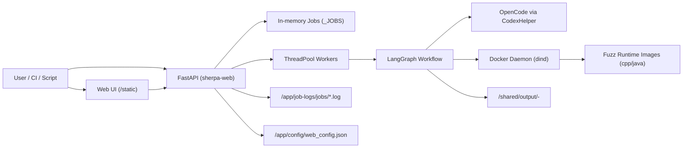
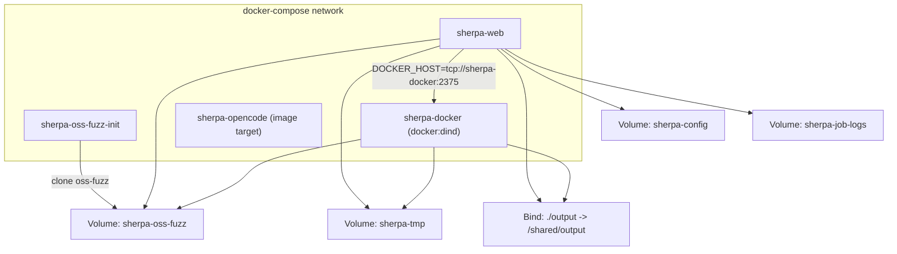
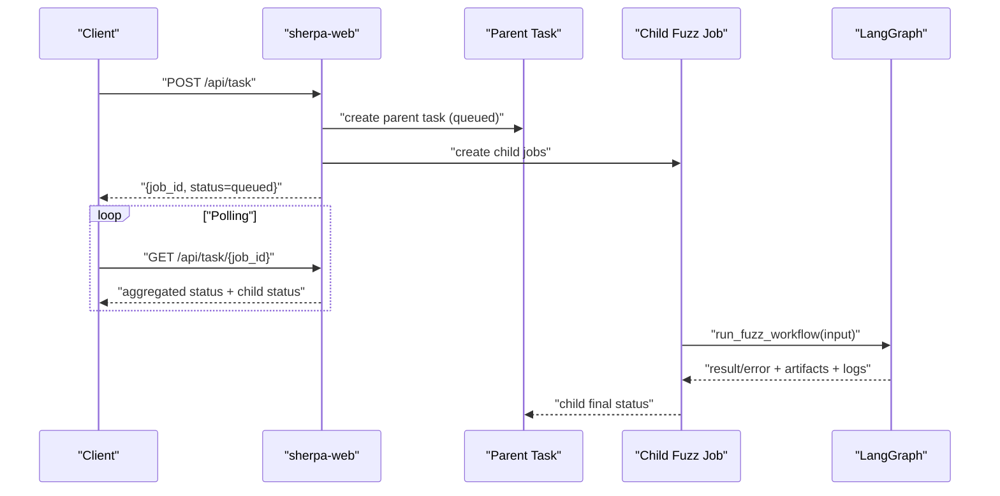
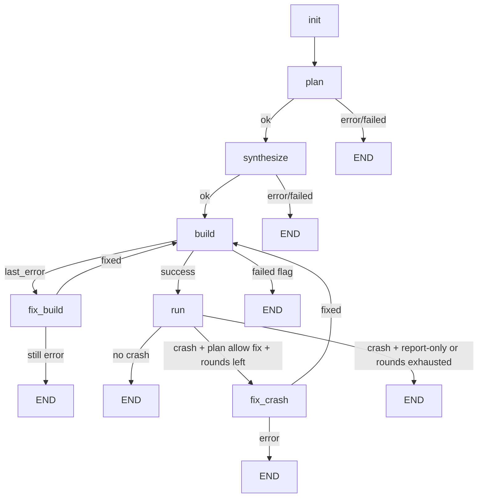
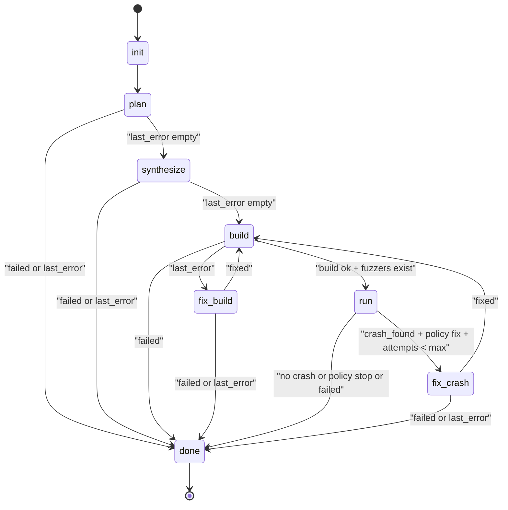
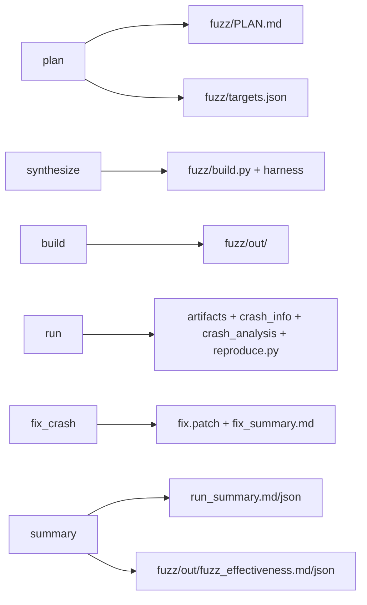
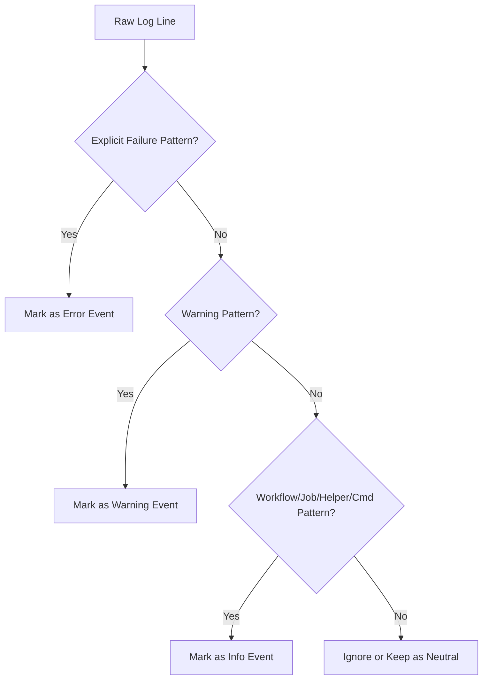
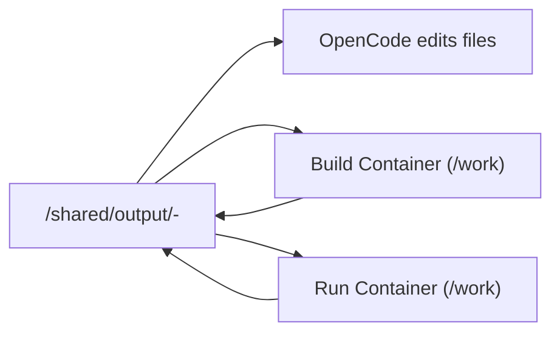
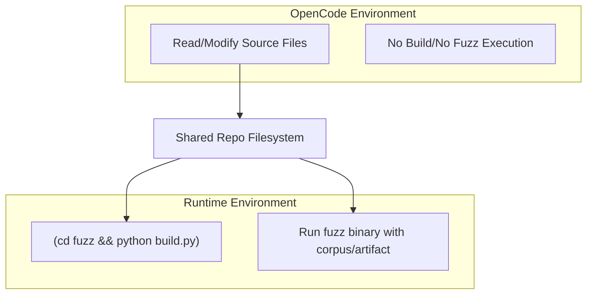
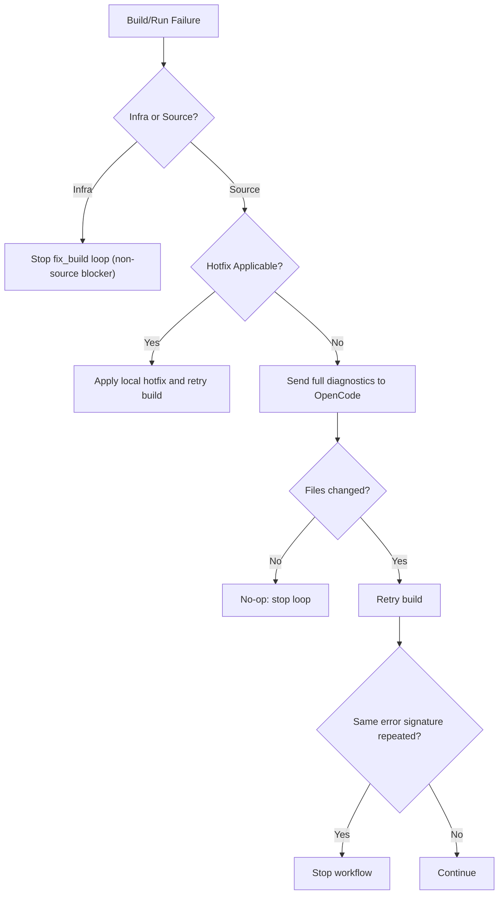

# SHERPA 对接文档（Integration Handoff）

本 README 按“团队对接文档”格式组织，面向研发、测试、平台、运维协作。  
当前内容基于仓库现状（Docker-only 主路径 + FastAPI + LangGraph + OpenCode）。

---

## 目录

1. [项目定位](#1-项目定位)
2. [系统总览图](#2-系统总览图)
3. [容器与网络拓扑](#3-容器与网络拓扑)
4. [端到端执行链路](#4-端到端执行链路)
5. [LangGraph 工作流](#5-langgraph-工作流)
6. [节点职责与产物](#6-节点职责与产物)
7. [API 契约](#7-api-契约)
8. [配置与环境变量](#8-配置与环境变量)
9. [日志、进度与错误语义](#9-日志进度与错误语义)
10. [卷与数据流转](#10-卷与数据流转)
11. [失败分类与排障](#11-失败分类与排障)
12. [部署与运维](#12-部署与运维)
13. [测试与质量基线](#13-测试与质量基线)
14. [对接检查清单](#14-对接检查清单)
15. [关键文件索引](#15-关键文件索引)

---

## 1. 项目定位

SHERPA 是“自动 fuzz 编排服务”，目标是对任意 Git 仓库自动执行：

`plan -> synthesize -> build -> run -> (optional fix_crash) -> summary`

当前主路径特征：

1. Docker-only（禁止非 Docker 模式任务）。
2. `decide` 节点已移除，策略由 `plan` 节点输出并驱动后续路由。
3. OpenCode 提示词已从代码硬编码迁移到模板文件：
   `harness_generator/src/langchain_agent/prompts/opencode_prompts.md`

---

## 2. 系统总览图



---

## 3. 容器与网络拓扑



容器角色：

1. `sherpa-web`: API + 前端 + 工作流调度。
2. `sherpa-docker`: 独立 Docker daemon，执行 build/run。
3. `sherpa-oss-fuzz-init`: 初始化本地 oss-fuzz checkout。
4. `sherpa-opencode`: OpenCode 专用镜像（按需）。

---

## 4. 端到端执行链路

### 4.1 批量任务时序图



### 4.2 单仓库执行路径图



---

## 5. LangGraph 工作流

## 5.1 状态机（更细粒度）



## 5.2 `plan`/`decide` 现状说明

1. `plan` 负责生成 `fuzz/PLAN.md` 与 `fuzz/targets.json`。
2. `plan` 还负责输出后续建议（`codex_hint`）和 crash 后策略：
   - `Crash policy: report-only|fix`
   - `Max fix rounds: N`
3. `decide` 节点已删除；路由改为 `_route_after_*` 条件函数。

---

## 6. 节点职责与产物

## 6.1 节点职责矩阵

| 节点 | 是否调用 LLM/OpenCode | 关键职责 | 写入文件 |
|---|---|---|---|
| `init` | 否 | 初始化 generator、预算、目录 | 工作目录 |
| `plan` | 是 | 目标规划、策略输出 | `fuzz/PLAN.md`, `fuzz/targets.json` |
| `synthesize` | 是 | 生成 harness + build 脚本 | `fuzz/build.py`, harness, 可选 `fuzz/system_packages.txt` |
| `build` | 否 | 执行构建、重试、签名检测 | `fuzz/build_full.log`, `fuzz/out/*` |
| `fix_build` | 条件触发 | 本地 hotfix + OpenCode 修复 | 修改 `fuzz/*` 与最小 build glue |
| `run` | 否 | 跑 fuzzer、判定 crash、收集指标 | `fuzz/corpus/*`, `fuzz/out/artifacts/*`, `crash_info.md`, `crash_analysis.md`, `reproduce.py` |
| `fix_crash` | 条件触发 | harness/upstream 修复 | `fix.patch`, `fix_summary.md` |
| `end` | 否 | 汇总报告 | `run_summary.md/json`, `fuzz_effectiveness.md/json` |

## 6.2 产物流图



## 6.3 “build 和 fuzz 后续写文件在哪个节点”

1. `synthesize`：写 `fuzz/build.py` 与 harness，供后续 `build` 使用。
2. `build`：写 `fuzz/out/*` 可执行 fuzzer，供后续 `run` 使用。
3. `run`：写 `crash_info.md`/`crash_analysis.md`/`reproduce.py`，供后续 `fix_crash` 使用。

---

## 7. API 契约

## 7.1 `POST /api/task`

用途：提交父任务 + 子任务列表。

示例：

```json
{
  "jobs": [
    {
      "code_url": "https://github.com/madler/zlib.git",
      "model": "deepseek/deepseek-reasoner",
      "max_tokens": 1000,
      "total_time_budget": 900,
      "run_time_budget": 900,
      "docker": true,
      "docker_image": "auto"
    }
  ],
  "auto_init": true,
  "build_images": true,
  "force_build": false
}
```

返回：

```json
{
  "job_id": "parent_task_id",
  "status": "queued"
}
```

约束：

1. Docker-only 强制开启。
2. `total_time_budget` 控制总流程时长。
3. `run_time_budget` 控制单次 fuzz 运行预算。

## 7.2 `GET /api/task/{job_id}`

返回父任务聚合状态、子任务状态、日志路径、错误信息等。

## 7.3 `GET /api/tasks?limit=50`

返回最近任务列表，前端“会话绑定”面板依赖此接口。

## 7.4 `GET /api/system`

返回：

1. 服务 uptime/time
2. 任务计数
3. 活跃任务
4. 日志目录状态
5. 当前配置摘要

## 7.5 `GET /api/config` / `PUT /api/config`

配置持久化至 `config/web_config.json`（容器中 `/app/config` 挂载卷）。  
`PUT` 时会保留已有 secret（前端传 `null` 不会清空）。

---

## 8. 配置与环境变量

## 8.1 配置模型（核心字段）

`WebPersistentConfig` 关键字段：

1. `openai_api_key/openai_base_url/openai_model/opencode_model`
2. `openrouter_api_key/openrouter_base_url/openrouter_model`
3. `fuzz_time_budget/fuzz_docker_image`
4. `oss_fuzz_dir`
5. `sherpa_git_mirrors`
6. `sherpa_docker_http_proxy/https_proxy/no_proxy/proxy_host`

## 8.2 关键环境变量矩阵

| 变量 | 作用 | 典型值 |
|---|---|---|
| `DOCKER_HOST` | web 调用 dind | `tcp://sherpa-docker:2375` |
| `DOCKER_BUILDKIT` | 构建器模式 | `0` |
| `SHERPA_OUTPUT_DIR` | 输出根目录 | `/shared/output` |
| `SHERPA_DEFAULT_OSS_FUZZ_DIR` | oss-fuzz checkout | `/shared/oss-fuzz` |
| `SHERPA_CODEX_CLI` | OpenCode CLI 名称 | `opencode` |
| `SHERPA_OPENCODE_DOCKER_IMAGE` | OpenCode 容器镜像 | `sherpa-opencode:latest` |
| `SHERPA_ACCEPT_DIFF_WITHOUT_DONE` | 无 sentinel 接受 diff | `0` |
| `SHERPA_WEB_JOB_LOG_DIR` | Job 日志目录 | `/app/job-logs/jobs` |
| `SHERPA_WORKFLOW_MAX_STEPS` | workflow 步数上限 | `20` |
| `SHERPA_WORKFLOW_BUILD_LOCAL_RETRIES` | build 本地重试次数 | `2` |

---

## 9. 日志、进度与错误语义

## 9.1 日志分层

主日志：`/app/job-logs/jobs/<job_id>.log`  
分流日志：

1. 等级：`*.level.info.log|warn.log|error.log`
2. 类别：`*.cat.workflow.log|build.log|docker.log|opencode.log|...`

## 9.2 前端如何避免误报

前端按正则分层识别：

1. 显式失败（Traceback、`Docker build failed`、`error during connect`）=> error
2. `WARN/DEPRECATED/warning:` => warn
3. workflow/job/helper/command 普通事件 => info

## 9.3 日志分类流程图



---

## 10. 卷与数据流转

你关心的“仓库如何在不同步骤间传递”机制如下：

1. repo 克隆到输出目录（`/shared/output/<repo>-<id>`）。
2. build/run 以 volume 方式挂载到 runtime 容器 `/work`。
3. OpenCode 在独立环境编辑同一路径文件。
4. 节点间通过共享文件系统传递状态与产物。



## 10.1 运行环境边界图（关键）



---

## 11. 失败分类与排障

## 11.1 常见失败类型

1. 构建基础设施失败（daemon/network/proxy/磁盘/内存）
2. 源码构建失败（编译/链接/脚本错误）
3. 构建成功但无 fuzzer 二进制
4. run 非零退出且无 crash 证据
5. 同错误签名重复达到阈值

## 11.2 决策树



## 11.3 高频报错与处置

1. `BuildKit is enabled but the buildx component is missing`
   - 回退 `DOCKER_BUILDKIT=0`，并确认 daemon 能力。
2. `lookup sherpa-docker ... no such host`
   - 当前进程不在 compose 网络或 `DOCKER_HOST` 错误。
3. 长时间卡住
   - 检查 `total_time_budget/run_time_budget` 与 `SHERPA_WORKFLOW_MAX_STEPS`。

---

## 12. 部署与运维

## 12.1 启动

```bash
docker compose up -d --build
```

## 12.2 基础检查

```bash
# 系统状态
curl -s http://localhost:8000/api/system

# 提交任务
curl -s http://localhost:8000/api/task \
  -H 'Content-Type: application/json' \
  -d '{"jobs":[{"code_url":"https://github.com/madler/zlib.git","docker":true,"docker_image":"auto"}]}'
```

## 12.3 服务入口

1. UI: `http://localhost:8000/`
2. API: `http://localhost:8000/api/*`

---

## 13. 测试与质量基线

测试目录：`tests/`

重点覆盖：

1. API 稳定性（配置、任务提交、聚合状态）
2. build 重试/clean 重试/路径 fallback
3. run crash 判定与 metrics 采集
4. targets schema 校验与稳定性守护
5. path translation 与容器命令拼接
6. summary 与 fuzz_effectiveness 产出

执行：

```bash
pytest -q
```

---

## 14. 对接检查清单

联调前建议逐项确认：

1. `sherpa-web` 与 `sherpa-docker` 均健康。
2. 模型密钥已配置（OpenAI 或 OpenRouter）。
3. `./output` 可写、容量足够。
4. 前端可读 `/api/tasks` 与 `/api/task/{id}`。
5. 运维知道 `total_time_budget` 与 `run_time_budget` 是两层预算。
6. 告警以“任务状态 + 显式失败模式”为准，避免纯关键字误报。

---

## 15. 关键文件索引

1. `harness_generator/src/langchain_agent/main.py`
2. `harness_generator/src/langchain_agent/workflow_graph.py`
3. `harness_generator/src/fuzz_unharnessed_repo.py`
4. `harness_generator/src/codex_helper.py`
5. `harness_generator/src/langchain_agent/persistent_config.py`
6. `harness_generator/src/langchain_agent/prompts/opencode_prompts.md`
7. `harness_generator/src/langchain_agent/static/index.html`
8. `harness_generator/src/langchain_agent/static/script.js`
9. `docker-compose.yml`
10. `docker/Dockerfile.web`
11. `docker/Dockerfile.fuzz-cpp`
12. `docker/Dockerfile.fuzz-java`
13. `docker/Dockerfile.opencode`

---

## 附录：与历史版本差异摘要

1. `decide` 节点已移除。
2. `plan` 节点承接策略输出（包括结束策略）。
3. OpenCode 提示词统一由 md 文件管理，不再硬编码在 Python 源码。

