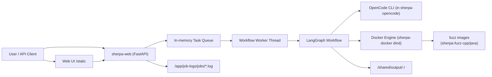
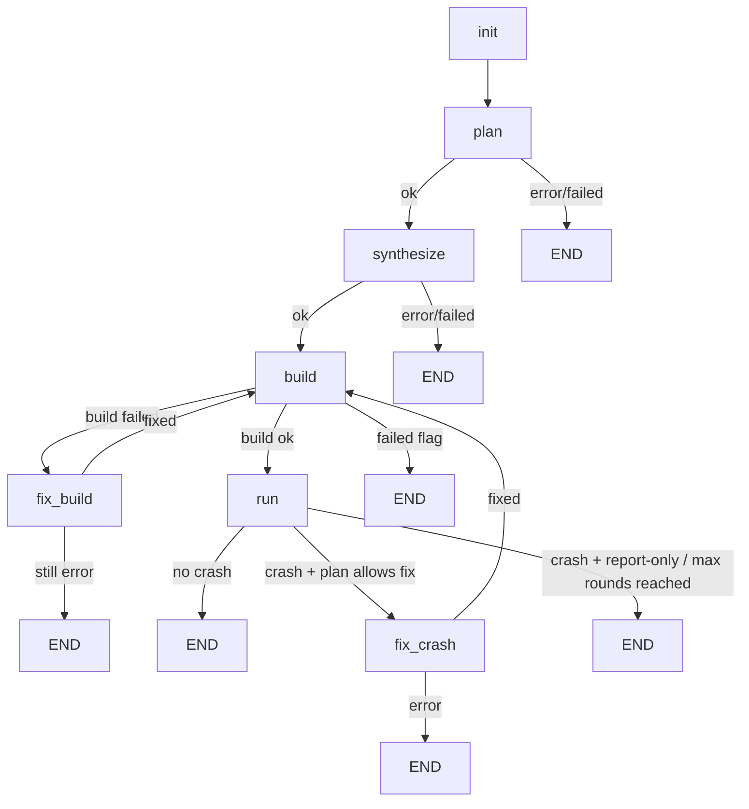
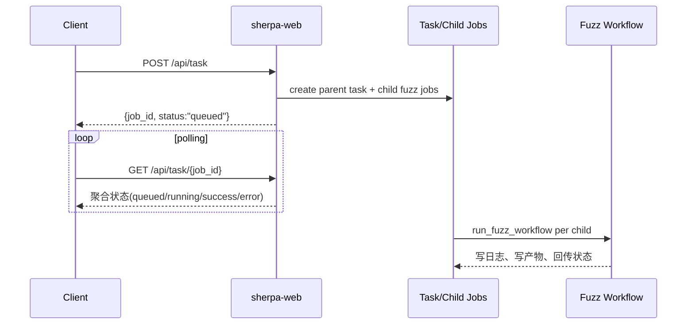
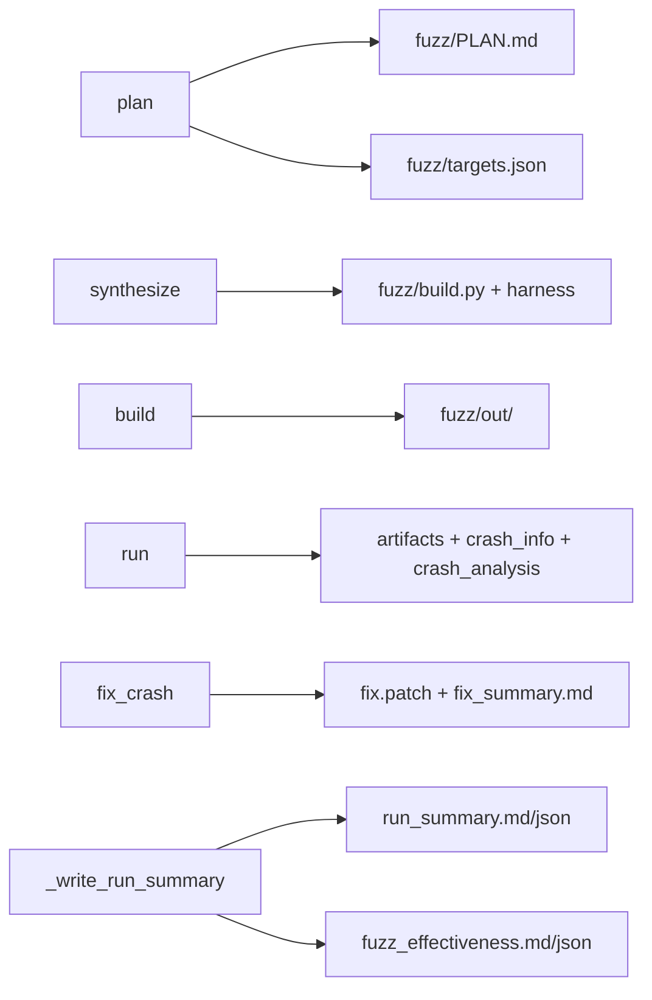

# SHERPA

SHERPA 是一个面向批量 GitHub 仓库的自动化 Fuzz 编排服务。
当前主路径是 Docker-only：通过 Web API 提交任务，系统自动完成 `plan -> synthesize -> build -> run -> (可选 fix)`，并落盘日志与报告。

## 当前进展（与旧文档相比）

- 已移除 `decide` 节点，流程不再经过单独决策节点。
- `plan` 节点现在同时负责：
  - 生成 `fuzz/PLAN.md` 与 `fuzz/targets.json`
  - 给后续 `synthesize/build` 提供可执行建议（hint）
  - 通过 `PLAN.md` 决定 crash 后是 `report-only` 还是进入 `fix_crash`
- 结束流程由 `plan` 产出的策略控制，并统一写出 `run_summary.md/json` 报告。
- OpenCode 提示词已从代码中抽离，统一在：
  - `harness_generator/src/langchain_agent/prompts/opencode_prompts.md`

## 一图看系统



## 执行路径图（单仓库）



## 任务生命周期（批量）



## LangGraph 中 LLM 的职责

### `plan` 节点

- 通过 OpenCode 生成：
  - `fuzz/PLAN.md`
  - `fuzz/targets.json`
- 从 `PLAN.md` 解析策略：
  - `Crash policy: report-only|fix`
  - `Max fix rounds: N`
- 输出 `codex_hint` 给后续 `synthesize/fix_build` 使用。

### `decide` 节点

- 当前实现中已删除。
- 原先决策职责已并入 `plan` + 路由函数（`_route_after_*`）。

### 其他仍使用 LLM 的节点

- `synthesize`：根据 plan 生成 harness 与构建脚本。
- `fix_build`：先做本地热修；必要时用 LLM 生成 OpenCode 指令并修复源码。
- `fix_crash`：根据 crash 分析走 harness 修复或 upstream 修复。

## 哪个节点写哪些文件

| 节点 | 主要写入文件 | 用途 |
|---|---|---|
| `plan` | `fuzz/PLAN.md`, `fuzz/targets.json` | 规划目标、定义后续策略 |
| `synthesize` | `fuzz/build.py`, `fuzz/*harness*`, `fuzz/system_packages.txt`(可选) | 产出可构建 harness |
| `build` | `fuzz/out/*` | 生成可执行 fuzzer |
| `run` | `fuzz/corpus/*`, `fuzz/out/artifacts/*`, `crash_info.md`, `crash_analysis.md`, `reproduce.py` | 运行与崩溃分析 |
| `fix_crash` | `fix.patch`, `fix_summary.md` | 输出修复补丁 |
| `workflow end` | `run_summary.md`, `run_summary.json`, `fuzz/out/fuzz_effectiveness.md/json` | 统一报告 |

## 报告与产物流



## API

### `POST /api/task`

提交批量任务（每个 job 必须 Docker 运行）。

示例：

```json
{
  "jobs": [
    {
      "code_url": "https://github.com/madler/zlib.git",
      "time_budget": 900,
      "max_tokens": 1000,
      "docker": true,
      "docker_image": "auto"
    }
  ],
  "auto_init": true,
  "build_images": true,
  "force_build": false
}
```

### `GET /api/task/{job_id}`

返回父任务聚合状态 + 子任务明细（running/success/error 统计）。

### `GET /api/tasks`

拉取最近任务列表，便于前端会话面板展示。

### 其他接口

- `GET /api/config`
- `PUT /api/config`
- `GET /api/system`

## 输出与日志

- 默认产物目录：`./output`（容器内 `/shared/output`）
- 单任务目录形态：`<repo>-<8位id>/`
- 主日志：`/app/job-logs/jobs/<job_id>.log`
- 日志拆分：
  - 等级：`<job_id>.level.info.log` / `warn.log` / `error.log`
  - 类别：`<job_id>.cat.workflow.log` / `build.log` / `opencode.log` / `docker.log` / ...

当前前端按等级/类别展示日志；正常运行日志不会直接当成错误，只有命中错误关键字或任务状态为 `error` 才作为错误态展示。

## 部署（Docker Compose）

```bash
docker compose up -d --build
```

默认入口：

- Web UI: `http://localhost:8000/`
- API: `http://localhost:8000/api/*`

关键服务：

- `sherpa-web`: FastAPI + 静态前端
- `sherpa-docker`: dind 守护进程（web 通过 `DOCKER_HOST=tcp://sherpa-docker:2375` 调用）
- `sherpa-oss-fuzz-init`: 初始化 oss-fuzz checkout
- `sherpa-opencode`: OpenCode 运行镜像

## 常见问题与排障

### 1) `BuildKit is enabled but the buildx component is missing`

现有代码已在构建失败时自动回退到 `DOCKER_BUILDKIT=0` 重试。若仍失败，确认：

- 当前调用是否真的在 `sherpa-web` 容器内（而不是宿主机错误环境）
- `docker` CLI 与 daemon 是否匹配（`docker info`）

### 2) `lookup sherpa-docker ... no such host`

说明当前进程不在 compose 网络里，或环境变量污染：

- 若在宿主机调试，清理错误的 `DOCKER_HOST=tcp://sherpa-docker:2375`
- 若在容器内调试，确认 `sherpa-docker` 服务健康且同网络

### 3) OrbStack / Docker Desktop 代理导致拉取或构建异常

优先检查宿主机 Docker daemon 的代理与镜像源配置是否有效；项目内仅保留通用配置，不写入个人私有源。

## 关键目录

- `harness_generator/src/langchain_agent/main.py`: Web API 与任务编排入口
- `harness_generator/src/langchain_agent/workflow_graph.py`: LangGraph 节点与路由
- `harness_generator/src/langchain_agent/prompts/opencode_prompts.md`: OpenCode 提示词模板
- `harness_generator/src/langchain_agent/persistent_config.py`: Web 持久化配置
- `docker-compose.yml`: 容器拓扑
- `output/`: 每个任务的产物目录（已在 `.gitignore` 中忽略）

## 最小启动检查

```bash
# 1) 启动
docker compose up -d --build

# 2) 健康检查
curl -s http://localhost:8000/api/system | jq .ok

# 3) 提交一次任务
curl -s http://localhost:8000/api/task \
 -H 'Content-Type: application/json' \
 -d '{"jobs":[{"code_url":"https://github.com/madler/zlib.git","docker":true,"docker_image":"auto"}]}' | jq
```
