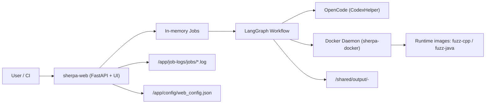
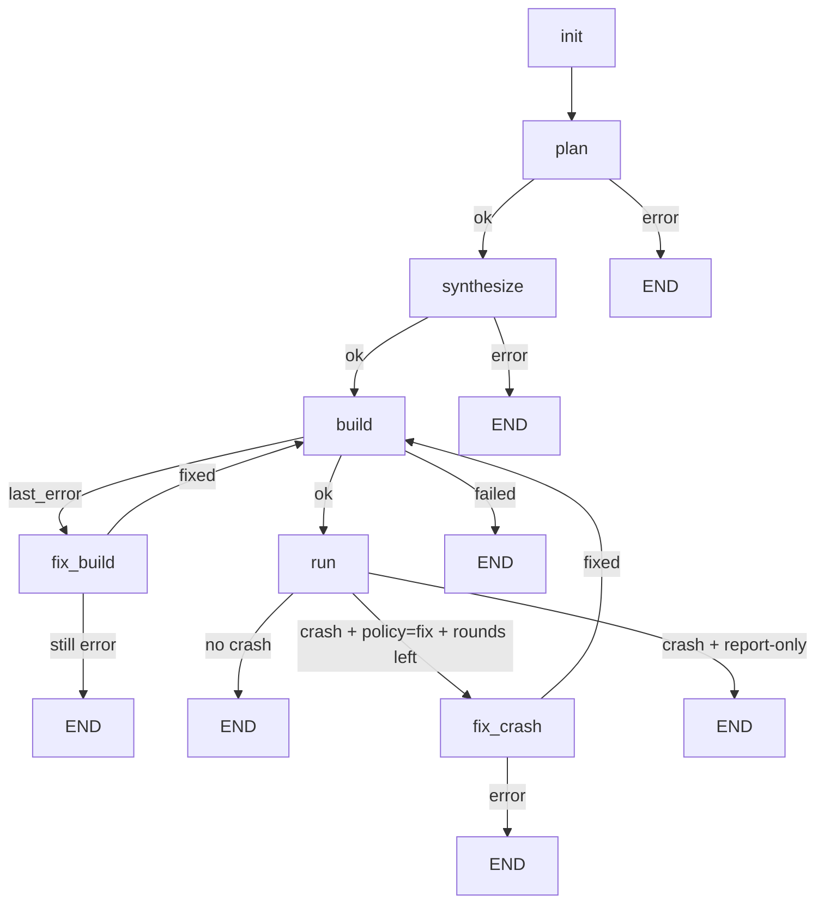

# SHERPA

面向 C/C++ 与 Java 仓库的自动化 fuzz 编排服务。  
核心目标：给定 Git 仓库 URL，自动完成 `plan -> synthesize -> build -> run -> summary`，并在策略允许时执行 `fix_build / fix_crash`。

---

## 1. 核心特性

- Docker-only 执行：任务必须在容器路径运行，避免本机环境漂移。
- LangGraph 工作流：显式节点路由，失败可观测、可追踪。
- OpenCode 参与关键节点：`plan`、`synthesize`、`fix_build`、`fix_crash`。
- 并行 fuzz：支持多个入口并行运行（`SHERPA_PARALLEL_FUZZERS`）。
- 双层预算：
  - `total_time_budget` 控制整条 workflow（硬限制）。
  - `run_time_budget` 控制单次 fuzz 运行预算（会结合剩余总预算动态切分）。
- 统一提示词模板：不再硬编码，集中在 `opencode_prompts.md`。
- 全链路产物输出：harness、build log、fuzz 效果、run summary、crash 分析。

---

## 2. 系统架构



容器角色：

- `sherpa-web`: API、前端、任务调度。
- `sherpa-docker`: dind，执行 build/run 容器命令。
- `sherpa-oss-fuzz-init`: 初始化本地 oss-fuzz 目录。
- `sherpa-opencode`: OpenCode 镜像（按需）。

---

## 3. 工作流执行图



节点说明（简版）：

| 节点 | 是否调用 LLM | 主要产物 |
|---|---|---|
| `plan` | 是 | `fuzz/PLAN.md`, `fuzz/targets.json` |
| `synthesize` | 是 | harness 文件、`fuzz/build.py` |
| `build` | 否 | `fuzz/build_full.log`, `fuzz/out/<fuzzer>` |
| `run` | 否 | `fuzz/out/fuzz_effectiveness.*`, crash 相关文件 |
| `fix_build` | 条件调用 | 对 `fuzz/*` 的最小修复 |
| `fix_crash` | 条件调用 | `fix.patch`, `fix_summary.md` |

说明：`decide` 节点已移除，路由策略由 `plan` 与条件函数决定。

---

## 4. 快速启动

### 4.1 前置要求

- Docker + Docker Compose Plugin
- 可用的 OpenAI 兼容 API Key（常见为 DeepSeek/OpenAI/OpenRouter）

### 4.2 启动

```bash
docker compose up -d --build
```

启动后访问：

- UI: [http://localhost:8000](http://localhost:8000)
- API: `http://localhost:8000/api/*`

健康检查：

```bash
curl -s http://localhost:8000/api/system
```

---

## 5. Web UI 使用

1. 在“配置”区域填写 API Key（当前前端主入口是 DeepSeek/OpenAI 兼容 key）。
2. 填写仓库 URL（例如 `https://github.com/madler/zlib.git`）。
3. 设置预算：
   - 总时长限制（秒）
   - 单次时长限制（秒）
4. 点击“开始模糊测试”。
5. 在“会话绑定”选择或粘贴 task id 进行实时追踪。

---

## 6. API 快速示例

### 6.1 提交任务

```bash
curl -s http://localhost:8000/api/task \
  -H 'Content-Type: application/json' \
  -d '{
    "jobs": [
      {
        "code_url": "https://github.com/madler/zlib.git",
        "docker": true,
        "docker_image": "auto",
        "total_time_budget": 900,
        "run_time_budget": 300,
        "max_tokens": 1000
      }
    ],
    "auto_init": true,
    "build_images": true
  }'
```

### 6.2 查询任务

```bash
curl -s http://localhost:8000/api/task/<task_id>
curl -s 'http://localhost:8000/api/tasks?limit=80'
```

### 6.3 配置接口

- `GET /api/config`
- `PUT /api/config`

后端会保持 `fuzz_use_docker=true`（Docker-only 策略）。

---

## 7. 预算语义（务必区分）

- `total_time_budget`
  - 整个 workflow 的总预算。
  - 预算耗尽会直接停止流程并返回 `workflow stopped (time budget exceeded)`。

- `run_time_budget`
  - 单次 fuzzer 运行预算上限。
  - 实际运行时会结合“剩余总预算”与并行批次数动态切分，防止总时长被 run 阶段拖穿。

---

## 8. 关键产物与目录

单任务输出根目录：

- `/shared/output/<repo>-<id>/`

核心文件：

- `fuzz/PLAN.md`
- `fuzz/targets.json`
- `fuzz/build.py`
- `fuzz/build_full.log`
- `fuzz/out/<fuzzer_binary>`
- `fuzz/out/fuzz_effectiveness.md`
- `fuzz/out/fuzz_effectiveness.json`
- `run_summary.md`
- `run_summary.json`
- （如有 crash）`crash_info.md`, `crash_analysis.md`, `reproduce.py`, `fix.patch`

日志文件：

- `/app/job-logs/jobs/<job_id>.log`

---

## 9. 关键配置项

持久化配置模型见：

- `harness_generator/src/langchain_agent/persistent_config.py`

常用字段：

- `openai_api_key`
- `openai_base_url`
- `openai_model`
- `opencode_model`
- `fuzz_time_budget`
- `fuzz_docker_image`（默认 `auto`）
- `oss_fuzz_dir`
- `sherpa_git_mirrors`（可选镜像加速）

---

## 10. 常见问题排障

### 10.1 Docker 连接问题

错误特征：

- `lookup sherpa-docker ... no such host`
- `Cannot connect to the Docker daemon`

检查：

- `docker compose ps`
- `DOCKER_HOST=tcp://sherpa-docker:2375` 是否生效
- `sherpa-docker` 是否 healthy

### 10.2 拉镜像网络问题

错误特征：

- `TLS handshake timeout`

建议：

- 优先检查宿主网络与 DNS。
- 必要时仅在本机 Docker daemon 配置公共 registry mirror（不要写死到项目文件）。

### 10.3 流程超时

错误特征：

- `workflow stopped (time budget exceeded)`

说明：

- 这是总预算硬限制触发。
- 调整 `total_time_budget`，并合理设置 `run_time_budget`。

### 10.4 docker clone 不稳定

说明：

- 当前实现已使用“临时目录 clone -> 成功后再切换”策略，降低 `.git/config` 锁/路径异常。
- 若仍不稳定，检查共享卷权限与磁盘空间。

---

## 11. 开发与测试

推荐在仓库根目录执行：

```bash
.venv/bin/python -m py_compile harness_generator/src/langchain_agent/workflow_graph.py
.venv/bin/python -m py_compile harness_generator/src/fuzz_unharnessed_repo.py
.venv/bin/pytest -q tests/test_workflow_run_detection.py
PYTHONPATH=$PWD/harness_generator/src:$PWD/harness_generator/src/langchain_agent \
  .venv/bin/pytest -q tests/test_workflow_build_resilience.py
```

---

## 12. 代码入口索引

- `harness_generator/src/langchain_agent/main.py`（Web/API）
- `harness_generator/src/langchain_agent/workflow_graph.py`（状态机）
- `harness_generator/src/fuzz_unharnessed_repo.py`（clone/build/run 核心执行器）
- `harness_generator/src/codex_helper.py`（OpenCode 调用）
- `harness_generator/src/langchain_agent/prompts/opencode_prompts.md`（提示词模板）
- `harness_generator/src/langchain_agent/static/index.html`（前端页面）
- `harness_generator/src/langchain_agent/static/script.js`（前端逻辑）

---

## 13. 深入文档

更完整的对接细节（字段、流程、故障分类）见：

- `harness_generator/docs/TECHNICAL_HANDOFF_ZH.md`
