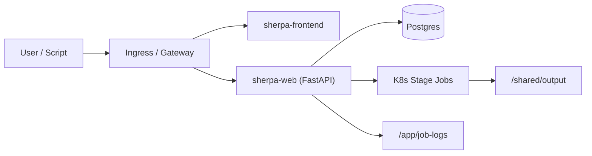
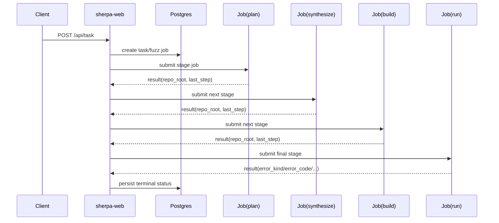
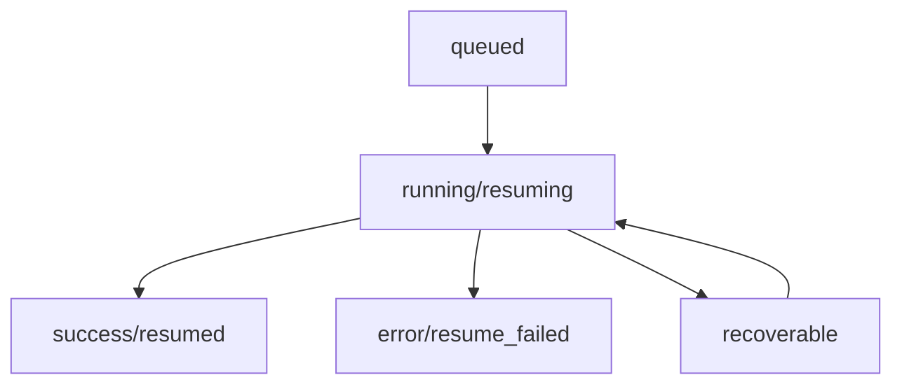
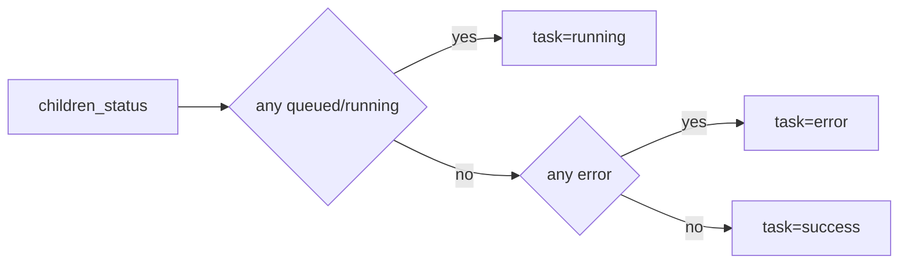
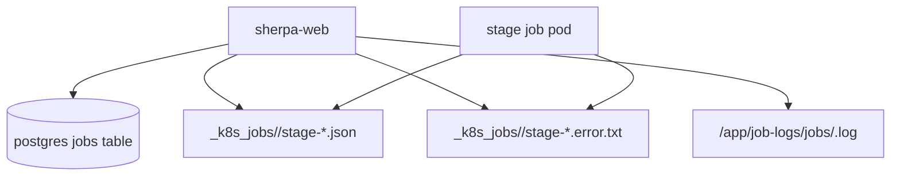

<p align="center">
  
</p>

# SHERPA

Sherpa 是一个面向 C/C++ 仓库的自动化 fuzz 编排系统。当前实现基线是 **Kubernetes + Native Runtime + 多阶段多 Job**。

## 1. 设计目标

1. 输入仓库 URL 后自动完成 `plan -> synthesize -> build -> run`。
2. 去除 inner Docker 依赖，避免 DinD 与 Docker daemon 稳定性问题。
3. 任务状态可持久化、可恢复、可观测。
4. 对外 API 保持简洁，兼容历史字段。

## 2. 当前基线（必须对齐）

1. 运行模式：Kubernetes-only。
2. 执行器：`k8s_job` only。
3. 存储：Postgres-only（`DATABASE_URL` 必填）。
4. 子任务执行：按阶段拆成独立 Job Pod 串行执行。
5. 任务恢复：默认手动触发 `POST /api/task/{job_id}/resume`。

## 3. 核心架构


```mermaid
flowchart LR
  U["User / Script"] --> IN["Ingress / Gateway"]
  IN --> FE["sherpa-frontend"]
  IN --> API["sherpa-web (FastAPI)"]
  API --> DB[("Postgres")]
  API --> JOBS["K8s Stage Jobs"]
  JOBS --> SHARED["/shared/output"]
  API --> LOGS["/app/job-logs"]
```

### 组件职责

1. `sherpa-web`：任务编排、状态写库、阶段 Job 管理、API 服务。
2. `sherpa-frontend`：任务提交、进度与日志展示。
3. `postgres`：任务状态与恢复上下文持久化。
4. `k8s stage jobs`：按阶段执行 workflow（plan/synthesize/build/run）。

## 4. 执行模型（多阶段多 Job）

单个 fuzz 子任务不再由一个 Pod 跑完整流程，而是按阶段拆分：

1. `plan` Job（`stop_after_step=plan`）
2. `synthesize` Job
3. `build` Job
4. `run` Job

阶段间通过 `repo_root + resume_from_step` 续接。


```mermaid
sequenceDiagram
  participant C as Client
  participant A as sherpa-web
  participant D as Postgres
  participant P as Job(plan)
  participant S as Job(synthesize)
  participant B as Job(build)
  participant R as Job(run)

  C->>A: POST /api/task
  A->>D: create task/fuzz job
  A->>P: submit stage job
  P-->>A: result(repo_root, last_step)
  A->>S: submit next stage
  S-->>A: result(repo_root, last_step)
  A->>B: submit next stage
  B-->>A: result(repo_root, last_step)
  A->>R: submit final stage
  R-->>A: result(error_kind/error_code/...)
  A->>D: persist terminal status
```

## 5. 代码实现位置（关键路径）

1. `/Users/zuens2020/Documents/Sherpa/harness_generator/src/langchain_agent/main.py`
- API 入口与任务主编排。
- 阶段 Job 提交与等待：`_execute_k8s_job`。
- 子任务主循环：`_run_fuzz_job`（当前已切为分阶段编排）。

2. `/Users/zuens2020/Documents/Sherpa/harness_generator/src/langchain_agent/k8s_job_worker.py`
- Job Pod 入口。
- 解 payload，调用 `fuzz_logic`，写 `result.json/error.txt`。

3. `/Users/zuens2020/Documents/Sherpa/harness_generator/src/langchain_agent/fuzz_relative_functions.py`
- `fuzz_logic` 参数归一化与 workflow 调用桥接。

4. `/Users/zuens2020/Documents/Sherpa/harness_generator/src/langchain_agent/workflow_graph.py`
- LangGraph 节点与路由。
- `stop_after_step` 控制单阶段结束。

## 6. 状态机与恢复机制

### 子任务状态


```mermaid
flowchart TD
  Q["queued"] --> R["running/resuming"]
  R --> S["success/resumed"]
  R --> E["error/resume_failed"]
  R --> RC["recoverable"]
  RC --> R
```

### 父任务聚合


```mermaid
flowchart LR
  C["children_status"] --> Q{"any queued/running"}
  Q -->|"yes"| RUN["task=running"]
  Q -->|"no"| E{"any error"}
  E -->|"yes"| ERR["task=error"]
  E -->|"no"| OK["task=success"]
```

### 恢复策略

1. 任务重启恢复基于数据库快照与 workflow checkpoint 字段。
2. 手动恢复时从 `resume_from_step`（缺省回退到 `build`）继续。
3. 恢复上下文不足时标记 `resume_failed` 并返回结构化错误。

## 7. 可观测字段（前后端统一）

任务详情与列表建议固定消费：

1. `job_id`
2. `status`
3. `runtime_mode`
4. `phase`
5. `error_code`
6. `error_kind`
7. `error_signature`
8. `k8s_job_name`
9. `k8s_job_names`
10. `children_status`

字段使用建议：

1. `status` 用于大盘状态颜色。
2. `phase` 用于定位卡点。
3. `error_code/error_kind/error_signature` 用于错误归类与重复失败判断。
4. `k8s_job_names` 用于按阶段拉日志。

## 8. API 约定

| 方法 | 路径 | 用途 |
|---|---|---|
| `GET` | `/api/config` | 读取配置（脱敏） |
| `PUT` | `/api/config` | 更新配置 |
| `GET` | `/api/system` | 系统状态快照 |
| `GET` | `/api/metrics` | Prometheus 指标 |
| `POST` | `/api/task` | 提交任务 |
| `GET` | `/api/task/{job_id}` | 任务详情 |
| `POST` | `/api/task/{job_id}/resume` | 手动续跑 |
| `POST` | `/api/task/{job_id}/stop` | 停止任务 |
| `GET` | `/api/tasks` | 任务列表 |

兼容字段说明：

1. `docker` / `docker_image` 目前仅用于兼容旧调用。
2. 在 `k8s_job` 基线下，它们不参与运行时决策。

## 9. 配置矩阵

### 必填配置

1. `DATABASE_URL`：Postgres 连接串。
2. provider API key（当前默认 MiniMax 路径）。

### 常用运行配置

1. `SHERPA_EXECUTOR_MODE=k8s_job`
2. `SHERPA_PARALLEL_FUZZERS`：run 阶段并发数。
3. `SHERPA_RUN_UNLIMITED_ROUND_BUDGET_SEC`：不限时模式单轮上限。
4. `SHERPA_WEB_AUTO_RESUME_ON_START`：是否开机自动恢复。

## 10. 数据与文件流


```mermaid
flowchart TB
  API["sherpa-web"] --> DB[("postgres jobs table")]
  API --> O1["_k8s_jobs/<job_id>/stage-*.json"]
  API --> O2["_k8s_jobs/<job_id>/stage-*.error.txt"]
  API --> L["/app/job-logs/jobs/<job_id>.log"]
  JOB["stage job pod"] --> O1
  JOB --> O2
```

路径说明：

1. 阶段结果：`/shared/output/_k8s_jobs/<job_id>/stage-XX-<stage>.json`
2. 阶段错误：`/shared/output/_k8s_jobs/<job_id>/stage-XX-<stage>.error.txt`
3. Web 聚合日志：`/app/job-logs/jobs/<job_id>.log`

## 11. 本地最小启动

```bash
kubectl apply -k k8s/base
kubectl -n sherpa get pods
kubectl -n sherpa port-forward svc/sherpa-web 8001:8001
curl -sS http://127.0.0.1:8001/api/health
curl -sS http://127.0.0.1:8001/api/system | jq
```

提交任务样例：

```bash
curl -sS -X POST http://127.0.0.1:8001/api/task \
  -H 'Content-Type: application/json' \
  -d '{
    "jobs": [{
      "code_url": "https://github.com/madler/zlib.git",
      "total_time_budget": 900,
      "run_time_budget": 900,
      "max_tokens": 1000
    }]
  }'
```

## 12. 排障手册（最短流程）

1. 查详情：`GET /api/task/{job_id}`。
2. 关注 `phase/error_code/error_kind`。
3. 取 `k8s_job_names` 并逐个拉对应 Job 日志。
4. 判断是可恢复错误还是环境错误。
5. 执行 `resume` 或 `stop`。

## 13. 安全与合规

1. 日志输出经过敏感信息脱敏（key/token/password/bearer）。
2. `/api/config` 不回显明文密钥。
3. 持久化配置写入后尝试 `0600` 权限收敛。
4. 建议生产启用最小权限 RBAC 与网络策略。

## 14. 延伸文档

1. 对接文档：`/Users/zuens2020/Documents/Sherpa/docs/DOCKER_TO_K8S_HANDOFF.md`
2. 本地启动：`/Users/zuens2020/Documents/Sherpa/docs/k8s/LOCAL_K8S_QUICKSTART.md`
3. 运行手册：`/Users/zuens2020/Documents/Sherpa/docs/k8s/RUNBOOK.md`
4. 发布门禁：`/Users/zuens2020/Documents/Sherpa/docs/k8s/RELEASE_GATE.md`
5. Cloudflare 接入：`/Users/zuens2020/Documents/Sherpa/docs/k8s/CLOUDFLARE_TUNNEL.md`
