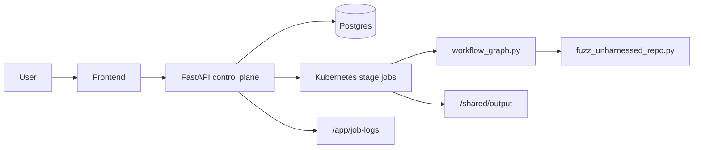
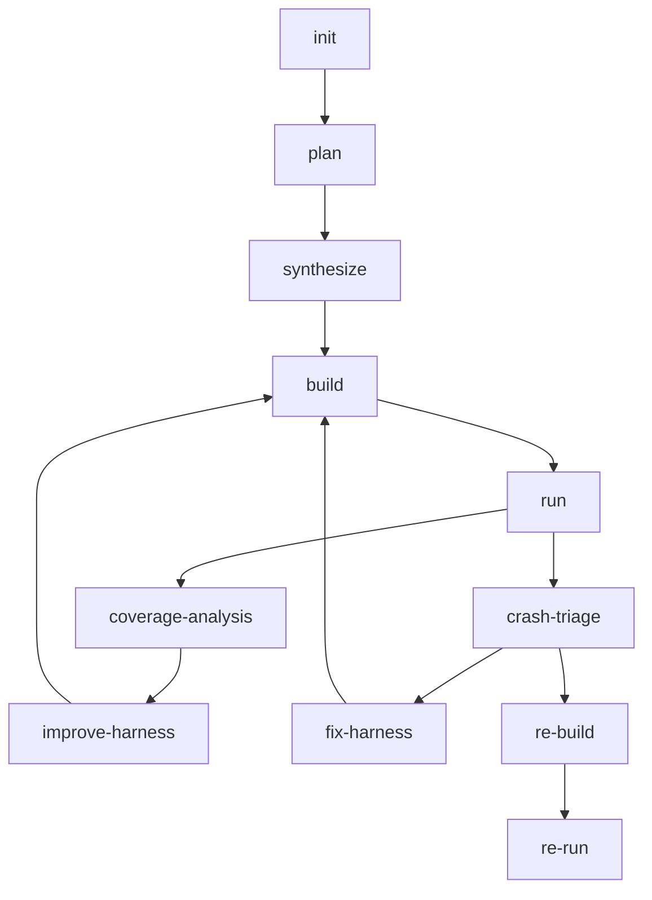

# Sherpa

Sherpa is an automated fuzz orchestration system for public repositories. A user submits a repository URL, and Sherpa drives the repository through planning, scaffold synthesis, build, seed bootstrap, fuzz execution, coverage-guided improvement, crash triage, and crash repro.

Sherpa is not a “generate one harness” tool. Its value is the workflow around that harness:

- choose runtime-viable targets instead of arbitrary functions
- generate external harness/build scaffolds instead of depending on repo-native fuzzers
- bootstrap seeds from repo examples, AI generation, and controlled mutation
- classify build/run/crash outcomes into the next actionable stage
- preserve artifacts, reports, and task state so the workflow is recoverable

## Current Architecture

```mermaid
flowchart LR
  U["User"] --> FE["Frontend"]
  FE --> API["FastAPI control plane"]
  API --> DB[("Postgres")]
  API --> JOB["Kubernetes stage jobs"]
  JOB --> WF["workflow_graph.py"]
  WF --> GEN["fuzz_unharnessed_repo.py"]
  JOB --> OUT["/shared/output"]
  API --> LOGS["/app/job-logs"]
```

Control plane vs execution plane:

- Control plane: `harness_generator/src/langchain_agent/main.py`
- Workflow state machine: `harness_generator/src/langchain_agent/workflow_graph.py`
- Execution primitives: `harness_generator/src/fuzz_unharnessed_repo.py`
- Frontend: `frontend-local-sync-app/` and `frontend-next/`

## Current Main Workflow

```mermaid
flowchart TD
  INIT["init"] --> PLAN["plan"]
  PLAN --> SYN["synthesize"]
  SYN --> BUILD["build"]
  BUILD --> RUN["run"]
  RUN --> CA["coverage-analysis"]
  CA --> IH["improve-harness"]
  IH --> BUILD
  RUN --> TRIAGE["crash-triage"]
  TRIAGE --> FH["fix-harness"]
  FH --> BUILD
  TRIAGE --> RB["re-build"]
  RB --> RR["re-run"]
```

Stage responsibilities:

- `plan`: produce target planning artifacts and execution intent
- `synthesize`: generate harness/build scaffold under `fuzz/`
- `build`: compile the scaffold and enforce execution-target consistency
- `run`: generate/bootstrap seeds, execute fuzzers, collect quality signals
- `coverage-analysis`: decide whether to continue in-place improvement or stop
- `improve-harness`: improve the current target without switching targets
- `crash-triage`: classify a crash as harness bug, upstream bug, or inconclusive
- `fix-harness`: repair harness-side bugs only
- `re-build` / `re-run`: rebuild and replay the crash path in a separate repro chain

## Core Capabilities

### Target planning

Sherpa does not treat every exported function as a fuzz target. `plan` creates a ranked target set with:

- target type
- seed profile
- runtime viability
- depth / bias metadata
- execution target selection

Key artifacts:

- `fuzz/PLAN.md`
- `fuzz/targets.json`
- `fuzz/selected_targets.json`
- `fuzz/execution_plan.json`
- `fuzz/target_analysis.json`

### Scaffold synthesis

Sherpa generates an external scaffold under `fuzz/`:

- harness source
- `build.py` or `build.sh`
- `README.md`
- `repo_understanding.json`
- `build_strategy.json`
- `build_runtime_facts.json`
- `harness_index.json`

The workflow treats `execution_plan.json` and `harness_index.json` as a consistency contract.

### Seed generation

Seed bootstrap is profile-aware rather than purely random:

- repo examples first
- AI-generated seeds with seed-profile constraints
- controlled mutation (`radamsa`) where appropriate
- soft filtering, archive validity checks, and seed scoring

Seed quality is written back for later stages:

- `seed_quality_<target>.json`
- workflow `SeedFeedback`
- workflow `coverage_quality_oracle`

### Coverage improvement

When a run plateaus without a crash, Sherpa does not immediately switch targets. It first evaluates:

- seed family gaps
- corpus retention and noise
- target depth and runtime match
- execution target coverage gaps

Then it either:

- performs in-place harness/seed improvement, or
- replans with deeper or more promising targets

### Crash handling

Crash handling is split into:

1. discovery during `run`
2. classification in `crash-triage`
3. harness-side repair in `fix-harness` if needed
4. isolated rebuild/replay in `re-build` and `re-run`

This separation exists so Sherpa does not confuse a harness bug with an upstream library bug.

## Runtime Artifacts

Typical task workspace:

- `/shared/output/<repo>-<shortid>/`

Common artifacts:

- `run_summary.json`
- `run_summary.md`
- `crash_info.md`
- `crash_analysis.md`
- `crash_triage.json`
- `crash_triage.md`
- `repro_context.json`
- `fuzz/*`

Kubernetes stage metadata:

- `/shared/output/_k8s_jobs/<job_id>/stage-*.json`
- `/shared/output/_k8s_jobs/<job_id>/stage-*.error.txt`

## API Surface

Frontend-facing APIs are exposed by `main.py`:

- `POST /api/task`
- `GET /api/task/{job_id}`
- `POST /api/task/{job_id}/resume`
- `POST /api/task/{job_id}/stop`
- `GET /api/tasks`
- `GET /api/system`
- `PUT /api/config`

See [docs/API_REFERENCE.md](docs/API_REFERENCE.md) for the current contract.

## Deployment Model

Current production-oriented deployment model:

- FastAPI backend + Postgres as long-running services
- frontend as a separate UI service
- short-lived Kubernetes Jobs per stage
- non-root runtime assumptions
- shared output rooted at `/shared/output`

See:

- [docs/README.md](docs/README.md)
- [docs/API_REFERENCE.md](docs/API_REFERENCE.md)
- [docs/CODEBASE_TECHNICAL_ANALYSIS.md](docs/CODEBASE_TECHNICAL_ANALYSIS.md)
- [docs/TECHNICAL_DEEP_DIVE.md](docs/TECHNICAL_DEEP_DIVE.md)
- [docs/STANDARD_CHANGE_PROCESS.md](docs/STANDARD_CHANGE_PROCESS.md)
- [docs/k8s/DEPLOY.md](docs/k8s/DEPLOY.md)

## Recommended Reading Order

1. [docs/README.md](docs/README.md)
2. [docs/CODEBASE_TECHNICAL_ANALYSIS.md](docs/CODEBASE_TECHNICAL_ANALYSIS.md)
3. [docs/TECHNICAL_DEEP_DIVE.md](docs/TECHNICAL_DEEP_DIVE.md)
4. [docs/API_REFERENCE.md](docs/API_REFERENCE.md)
5. [docs/k8s/DEPLOY.md](docs/k8s/DEPLOY.md)

## Development Flow

Standard branch flow:

- develop on `codex/*`
- validate through `dev`
- release from `main`

Detailed process: [docs/STANDARD_CHANGE_PROCESS.md](docs/STANDARD_CHANGE_PROCESS.md)
