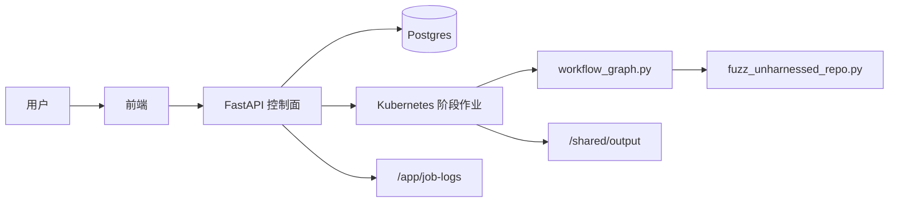
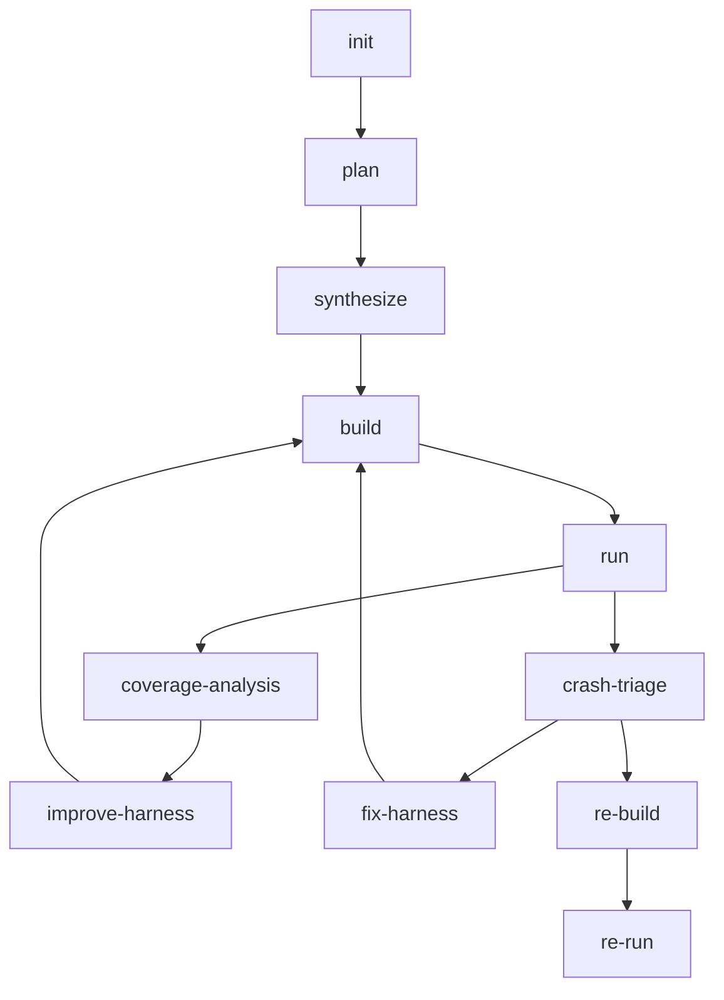

  

# Sherpa

Sherpa 是一个面向公开仓库的自动化 fuzz 编排系统。用户提交仓库 URL 后，Sherpa 会驱动该仓库依次完成目标规划、脚手架生成、构建、种子初始化、fuzz 执行、基于覆盖率的改进、崩溃分诊与崩溃复现。

Sherpa 不是“生成一个 harness 就结束”的工具。它真正的价值在于围绕 harness 构建出的完整工作流：

- 选择运行时真正可行的目标，而不是随意挑函数
- 生成外置 harness / build 脚手架，而不是依赖仓库自带的 fuzz 配置
- 从仓库样例、AI 生成与受控变异中初始化种子
- 将构建 / 运行 / 崩溃结果分类到下一步可执行阶段
- 保留产物、报告和任务状态，使整个流程可恢复

## 当前架构

```mermaid
flowchart LR
  U["用户"] --> FE["前端"]
  FE --> API["FastAPI 控制面"]
  API --> DB[("Postgres")]
  API --> JOB["Kubernetes 阶段作业"]
  JOB --> WF["workflow_graph.py"]
  WF --> GEN["fuzz_unharnessed_repo.py"]
  JOB --> OUT["/shared/output"]
  API --> LOGS["/app/job-logs"]
```

控制面与执行面的划分：

- 控制面：`harness_generator/src/langchain_agent/main.py`
- 工作流状态机：`harness_generator/src/langchain_agent/workflow_graph.py`
- 执行原语：`harness_generator/src/fuzz_unharnessed_repo.py`
- 前端：`frontend-local-sync-app/` 与 `frontend-next/`

## 当前主工作流

```mermaid
flowchart TD
  INIT["init"] --> PLAN["plan"]
  PLAN --> SYN["synthesize"]
  SYN --> BUILD["build"]
  BUILD --> RUN["run"]
  RUN --> CA["coverage-analysis"]
  CA --> IH["improve-harness"]
  IH --> BUILD
  RUN --> TRIAGE["crash-triage"]
  TRIAGE --> FH["fix-harness"]
  FH --> BUILD
  TRIAGE --> RB["re-build"]
  RB --> RR["re-run"]
```

各阶段职责：

- `plan`：生成目标规划产物与执行意图
- `synthesize`：在 `fuzz/` 下生成 harness / build 脚手架
- `build`：编译脚手架，并校验执行目标与产物一致性
- `run`：生成 / 初始化种子、执行 fuzzer、收集质量信号
- `coverage-analysis`：判断应继续原地改进还是停止
- `improve-harness`：在不切换目标的前提下改进当前目标
- `crash-triage`：将崩溃分类为 harness 问题、上游问题或不确定
- `fix-harness`：仅修复 harness 侧缺陷
- `re-build` / `re-run`：在独立复现链路中重建并回放崩溃路径

## 核心能力

### 目标规划

Sherpa 不会把每个导出函数都当作 fuzz 目标。`plan` 阶段会生成一个带排序的目标集合，包含：

- 目标类型
- 种子画像
- 运行时可行性
- 深度 / 偏置元数据
- 执行目标选择结果

关键产物：

- `fuzz/PLAN.md`
- `fuzz/targets.json`
- `fuzz/selected_targets.json`
- `fuzz/execution_plan.json`
- `fuzz/target_analysis.json`

### 脚手架生成

Sherpa 会在 `fuzz/` 下生成外置脚手架：

- harness 源码
- `build.py` 或 `build.sh`
- `README.md`
- `repo_understanding.json`
- `build_strategy.json`
- `build_runtime_facts.json`
- `harness_index.json`

工作流将 `execution_plan.json` 与 `harness_index.json` 视为一致性契约。

### 种子生成

Sherpa 的种子初始化是基于画像的，而不是纯随机：

- 优先复用仓库样例
- 在种子画像约束下生成 AI 种子
- 视情况执行受控变异（`radamsa`）
- 做软过滤、归档有效性检查与种子评分

种子质量结果会回写给后续阶段：

- `seed_quality_<target>.json`
- 工作流内的 `SeedFeedback`
- 工作流内的 `coverage_quality_oracle`

### 覆盖率改进

当 `run` 阶段没有发现崩溃但覆盖率进入平台期时，Sherpa 不会立刻切换目标，而会先评估：

- 种子家族缺口
- 语料保留与噪声情况
- 目标深度与运行时匹配程度
- 执行目标覆盖缺口

随后再决定：

- 在原目标上继续改进 harness / 种子，或
- 重新规划更深或更有潜力的目标

### 崩溃处理

崩溃链路被拆成四步：

1. 在 `run` 中发现崩溃
2. 在 `crash-triage` 中做分类
3. 如有必要，在 `fix-harness` 中修复 harness 侧问题
4. 在 `re-build` / `re-run` 中独立重建并复现

这样做的目的是避免把 harness 缺陷误判成上游库缺陷。

## 运行时产物

典型任务工作目录：

- `/shared/output/<repo>-<shortid>/`

常见产物：

- `run_summary.json`
- `run_summary.md`
- `crash_info.md`
- `crash_analysis.md`
- `crash_triage.json`
- `crash_triage.md`
- `repro_context.json`
- `fuzz/*`

Kubernetes 阶段元数据：

- `/shared/output/_k8s_jobs/<job_id>/stage-*.json`
- `/shared/output/_k8s_jobs/<job_id>/stage-*.error.txt`

## API 概览

前端使用的 API 由 `main.py` 暴露：

- `POST /api/task`
- `GET /api/task/{job_id}`
- `POST /api/task/{job_id}/resume`
- `POST /api/task/{job_id}/stop`
- `GET /api/tasks`
- `GET /api/system`
- `PUT /api/config`

当前接口契约见 [docs/API_REFERENCE.md](docs/API_REFERENCE.md)。

## 部署模型

当前面向生产的部署模型为：

- FastAPI 后端 + Postgres 作为常驻服务
- 前端作为独立 UI 服务
- 每个阶段由短生命周期 Kubernetes Job 执行
- 默认采用非 root 运行时假设
- 共享输出目录位于 `/shared/output`

更多信息见：

- [docs/README.md](docs/README.md)
- [docs/API_REFERENCE.md](docs/API_REFERENCE.md)
- [docs/CODEBASE_TECHNICAL_ANALYSIS.md](docs/CODEBASE_TECHNICAL_ANALYSIS.md)
- [docs/TECHNICAL_DEEP_DIVE.md](docs/TECHNICAL_DEEP_DIVE.md)
- [docs/STANDARD_CHANGE_PROCESS.md](docs/STANDARD_CHANGE_PROCESS.md)
- [docs/k8s/DEPLOY.md](docs/k8s/DEPLOY.md)

## 推荐阅读顺序

1. [docs/README.md](docs/README.md)
2. [docs/CODEBASE_TECHNICAL_ANALYSIS.md](docs/CODEBASE_TECHNICAL_ANALYSIS.md)
3. [docs/TECHNICAL_DEEP_DIVE.md](docs/TECHNICAL_DEEP_DIVE.md)
4. [docs/API_REFERENCE.md](docs/API_REFERENCE.md)
5. [docs/k8s/DEPLOY.md](docs/k8s/DEPLOY.md)

## 开发流程

标准分支流程：

- 在 `codex/*` 上开发
- 通过 `dev` 分支完成验证
- 由 `main` 执行发布

详细流程见 [docs/STANDARD_CHANGE_PROCESS.md](docs/STANDARD_CHANGE_PROCESS.md)。
