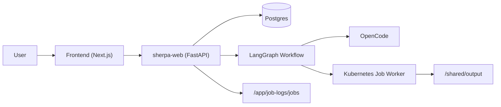
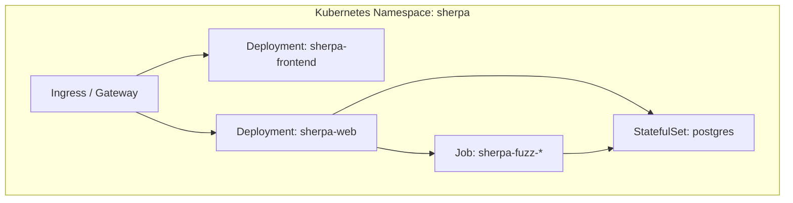
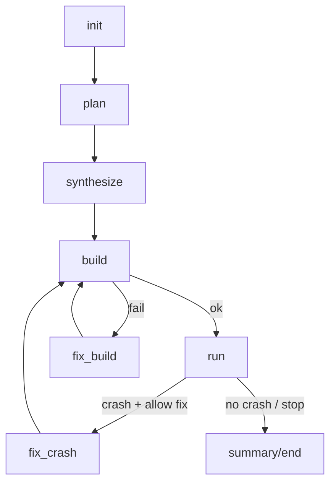
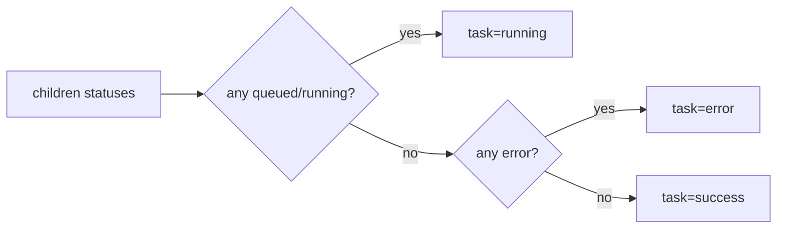

<p align="center">
  
</p>

# SHERPA

Sherpa 是一个自动化 fuzz 编排系统（当前主目标：C/C++ 仓库）。

输入仓库 URL 后，系统执行：

`plan -> synthesize -> build -> run -> (fix_build/fix_crash) -> summary`

## 当前基线（重要）

1. **运行模式仅 Kubernetes**（本地与部署统一）。
2. 执行器仅支持 `k8s_job`（`local_thread` 已下线）。
3. 状态存储为 **Postgres-only**（`DATABASE_URL` 必填）。
4. 子任务执行为 **多阶段多 Job**：`plan/synthesize/build/run` 串行独立 Job Pod。
5. 关键观测字段统一：`job_id`、`runtime_mode`、`phase`、`error_code`、`error_kind`、`error_signature`。
6. 默认手动续跑：`POST /api/task/{job_id}/resume`。

---

## 1. 文档入口

1. Docker 背景对接文档：`/Users/zuens2020/Documents/Sherpa/docs/DOCKER_TO_K8S_HANDOFF.md`
2. 本地 K8s 快速启动：`/Users/zuens2020/Documents/Sherpa/docs/k8s/LOCAL_K8S_QUICKSTART.md`
3. Cloudflare Tunnel 内网接入：`/Users/zuens2020/Documents/Sherpa/docs/k8s/CLOUDFLARE_TUNNEL.md`
4. K8s 部署说明：`/Users/zuens2020/Documents/Sherpa/docs/k8s/DEPLOY.md`
5. 运行手册：`/Users/zuens2020/Documents/Sherpa/docs/k8s/RUNBOOK.md`
6. 发布回滚门禁：`/Users/zuens2020/Documents/Sherpa/docs/k8s/RELEASE_GATE.md`
7. E2E 报告（zlib）：`/Users/zuens2020/Documents/Sherpa/docs/k8s/E2E_ZLIB_REPORT.md`
8. 映射说明：`/Users/zuens2020/Documents/Sherpa/docs/k8s/MAPPING.md`

---

## 2. 架构图


```mermaid
flowchart LR
  U["User"] --> FE["Frontend (Next.js)"]
  FE --> API["sherpa-web (FastAPI)"]
  API --> DB[(Postgres)]
  API --> WF["LangGraph Workflow"]
  WF --> OC["OpenCode"]
  WF --> KJOB["Kubernetes Job Worker"]
  KJOB --> OUT["/shared/output"]
  API --> LOG["/app/job-logs/jobs"]
```


```mermaid
flowchart TB
  subgraph K8s["Kubernetes Namespace: sherpa"]
    ING["Ingress / Gateway"]
    FE2["Deployment: sherpa-frontend"]
    WEB["Deployment: sherpa-web"]
    PG["StatefulSet: postgres"]
    WJ["Job: sherpa-fuzz-*"]
  end

  ING --> FE2
  ING --> WEB
  WEB --> PG
  WEB --> WJ
  WJ --> PG
```

---

## 3. 工作流与状态


```mermaid
flowchart TD
  I["init"] --> P["plan"]
  P --> S["synthesize"]
  S --> B["build"]
  B -->|"ok"| R["run"]
  B -->|"fail"| FB["fix_build"]
  FB --> B
  R -->|"crash + allow fix"| FC["fix_crash"]
  FC --> B
  R -->|"no crash / stop"| E["summary/end"]
```


```mermaid
flowchart LR
  C["children statuses"] --> Q{"any queued/running?"}
  Q -->|"yes"| RS["task=running"]
  Q -->|"no"| ER{"any error?"}
  ER -->|"yes"| RE["task=error"]
  ER -->|"no"| OK["task=success"]
```

### 关键返回字段

1. `job_id`
2. `status`
3. `runtime_mode`
4. `phase`
5. `error_code`
6. `error_kind`
7. `error_signature`
8. `children_status`

---

## 4. API 摘要

| 方法 | 路径 | 用途 |
|---|---|---|
| `GET` | `/api/config` | 读配置（密钥脱敏） |
| `PUT` | `/api/config` | 更新配置 |
| `GET` | `/api/system` | 系统状态 |
| `GET` | `/api/metrics` | Prometheus 指标 |
| `POST` | `/api/task` | 提交任务 |
| `GET` | `/api/task/{job_id}` | 任务详情 |
| `POST` | `/api/task/{job_id}/resume` | 手动续跑 |
| `POST` | `/api/task/{job_id}/stop` | 停止任务 |
| `GET` | `/api/tasks` | 任务列表 |

---

## 5. 本地运行（Kubernetes）

推荐直接使用：

`/Users/zuens2020/Documents/Sherpa/docs/k8s/LOCAL_K8S_QUICKSTART.md`

最小检查：

```bash
kubectl apply -k k8s/base
kubectl -n sherpa get pods
kubectl -n sherpa port-forward svc/sherpa-web 8001:8001
curl -sS http://127.0.0.1:8001/api/health
curl -sS http://127.0.0.1:8001/api/metrics | head
```

---

## 6. 配置关键项

1. `DATABASE_URL`：Postgres 连接串（必填）。
2. `SHERPA_EXECUTOR_MODE`：仅支持 `k8s_job`。
3. `SHERPA_PARALLEL_FUZZERS`：run 阶段并发。
4. `SHERPA_RUN_UNLIMITED_ROUND_BUDGET_SEC`：不限时任务的单轮上限。
5. `MINIMAX_API_KEY`：默认 provider 密钥来源。
6. `fuzz_use_docker` / `fuzz_docker_image`：仅兼容保留字段；在 `k8s_job` 下不参与运行时决策（native baseline）。

---

## 7. 运维与回滚

1. 运行手册：`/Users/zuens2020/Documents/Sherpa/docs/k8s/RUNBOOK.md`
2. 发布门禁：`/Users/zuens2020/Documents/Sherpa/docs/k8s/RELEASE_GATE.md`

应用回滚：

```bash
kubectl -n sherpa rollout undo deploy/sherpa-web
kubectl -n sherpa rollout undo deploy/sherpa-frontend
```

---

## 8. 迁移里程碑（已完成）


```mermaid
gantt
  title "K8s Migration"
  dateFormat  YYYY-MM-DD
  axisFormat  %m/%d
  section Milestones
  "M1 Infra & Routing" :done, m1, 2026-03-01, 1d
  "M2 K8s Job Executor" :done, m2, 2026-03-02, 1d
  "M3 Postgres-only" :done, m3, 2026-03-02, 1d
  "M4 Observability/CI/E2E" :done, m4, 2026-03-03, 1d
  "Release Gate" :done, rg, 2026-03-03, 1d
```

---

## 9. 安全说明

1. 日志链路包含敏感信息脱敏（key/token/bearer）。
2. 配置文件写入后尝试 `0600` 权限。
3. `/api/config` 不回显明文密钥。
