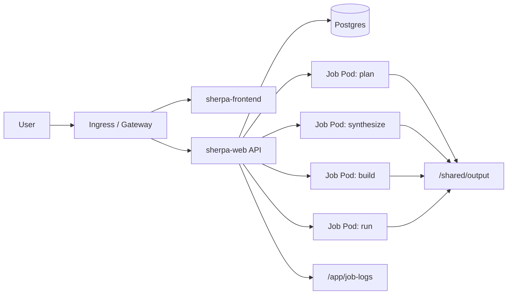
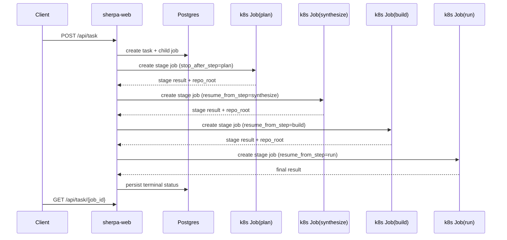
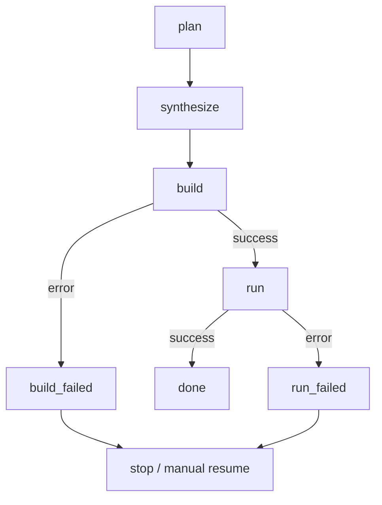
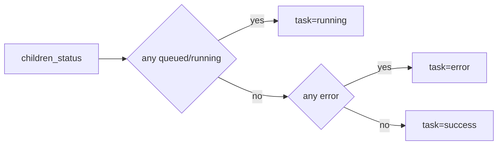

<p align="center">
  
</p>

# SHERPA

Sherpa 是一个面向 C/C++ 仓库的自动化 fuzz 编排系统，运行基线为 **Kubernetes + Native Runtime**。

## 1. 当前基线

1. 运行模式仅 Kubernetes（本地与部署统一）。
2. 执行器仅支持 `k8s_job`。
3. 状态存储为 Postgres-only（`DATABASE_URL` 必填）。
4. 子任务按阶段拆分为多 Job Pod 串行执行：`plan -> synthesize -> build -> run`。
5. 默认手动续跑：`POST /api/task/{job_id}/resume`。

## 2. 文档导航

1. 对接文档：`/Users/zuens2020/Documents/Sherpa/docs/DOCKER_TO_K8S_HANDOFF.md`
2. 本地快速启动：`/Users/zuens2020/Documents/Sherpa/docs/k8s/LOCAL_K8S_QUICKSTART.md`
3. 部署说明：`/Users/zuens2020/Documents/Sherpa/docs/k8s/DEPLOY.md`
4. 运行手册：`/Users/zuens2020/Documents/Sherpa/docs/k8s/RUNBOOK.md`
5. 发布门禁：`/Users/zuens2020/Documents/Sherpa/docs/k8s/RELEASE_GATE.md`
6. Tunnel 接入：`/Users/zuens2020/Documents/Sherpa/docs/k8s/CLOUDFLARE_TUNNEL.md`

## 3. 架构总览


```mermaid
flowchart LR
  U["User"] --> IN["Ingress / Gateway"]
  IN --> FE["sherpa-frontend"]
  IN --> API["sherpa-web API"]
  API --> DB[("Postgres")]
  API --> S1["Job Pod: plan"]
  API --> S2["Job Pod: synthesize"]
  API --> S3["Job Pod: build"]
  API --> S4["Job Pod: run"]
  S1 --> OUT["/shared/output"]
  S2 --> OUT
  S3 --> OUT
  S4 --> OUT
  API --> LOG["/app/job-logs"]
```

## 4. 执行链路（多 Pod 分阶段）


```mermaid
sequenceDiagram
  participant C as Client
  participant A as sherpa-web
  participant D as Postgres
  participant J1 as k8s Job(plan)
  participant J2 as k8s Job(synthesize)
  participant J3 as k8s Job(build)
  participant J4 as k8s Job(run)

  C->>A: POST /api/task
  A->>D: create task + child job
  A->>J1: create stage job (stop_after_step=plan)
  J1-->>A: stage result + repo_root
  A->>J2: create stage job (resume_from_step=synthesize)
  J2-->>A: stage result + repo_root
  A->>J3: create stage job (resume_from_step=build)
  J3-->>A: stage result + repo_root
  A->>J4: create stage job (resume_from_step=run)
  J4-->>A: final result
  A->>D: persist terminal status
  C->>A: GET /api/task/{job_id}
```

## 5. 阶段状态机


```mermaid
flowchart TD
  P["plan"] --> S["synthesize"]
  S --> B["build"]
  B -->|"success"| R["run"]
  B -->|"error"| BF["build_failed"]
  R -->|"success"| DONE["done"]
  R -->|"error"| RF["run_failed"]
  BF --> STOP["stop / manual resume"]
  RF --> STOP
```

## 6. 任务聚合状态机


```mermaid
flowchart LR
  C["children_status"] --> Q{"any queued/running"}
  Q -->|"yes"| RUN["task=running"]
  Q -->|"no"| E{"any error"}
  E -->|"yes"| ERR["task=error"]
  E -->|"no"| OK["task=success"]
```

## 7. 关键可观测字段

1. `job_id`
2. `status`
3. `runtime_mode`
4. `phase`
5. `error_code`
6. `error_kind`
7. `error_signature`
8. `children_status`
9. `k8s_job_name` / `k8s_job_names`

说明：
1. `status` 看成败。
2. `phase` 看卡点。
3. `error_code/error_kind/error_signature` 看失败归类与是否重复。
4. `k8s_job_names` 用于定位每个阶段对应 Pod。

## 8. API 摘要

| 方法 | 路径 | 用途 |
|---|---|---|
| `GET` | `/api/config` | 读取配置（脱敏） |
| `PUT` | `/api/config` | 更新配置 |
| `GET` | `/api/system` | 系统状态 |
| `GET` | `/api/metrics` | Prometheus 指标 |
| `POST` | `/api/task` | 提交任务 |
| `GET` | `/api/task/{job_id}` | 任务详情 |
| `POST` | `/api/task/{job_id}/resume` | 手动续跑 |
| `POST` | `/api/task/{job_id}/stop` | 停止任务 |
| `GET` | `/api/tasks` | 任务列表 |

兼容说明：
1. `docker` / `docker_image` 为兼容字段。
2. 在 `k8s_job` 基线下，这两个字段不参与运行时决策。

## 9. 本地最小启动

```bash
kubectl apply -k k8s/base
kubectl -n sherpa get pods
kubectl -n sherpa port-forward svc/sherpa-web 8001:8001
curl -sS http://127.0.0.1:8001/api/health
curl -sS http://127.0.0.1:8001/api/system | jq
```

提交任务示例：

```bash
curl -sS -X POST http://127.0.0.1:8001/api/task \
  -H 'Content-Type: application/json' \
  -d '{
    "jobs": [{
      "code_url": "https://github.com/madler/zlib.git",
      "total_time_budget": 900,
      "run_time_budget": 900,
      "max_tokens": 1000
    }]
  }'
```

## 10. 运维与排障

1. 看详情：`status + phase + error_code`。
2. 看指标：`/api/metrics`。
3. 看日志：`web 日志 + 对应 stage Job 日志`。
4. 需要终止时，调用 `POST /api/task/{job_id}/stop`，系统会清理该任务阶段 Job。

## 11. 安全约束

1. 日志链路启用敏感信息脱敏（token/key/password）。
2. `/api/config` 不回显明文密钥。
3. 持久化配置文件写入后尝试收敛文件权限（0600）。
