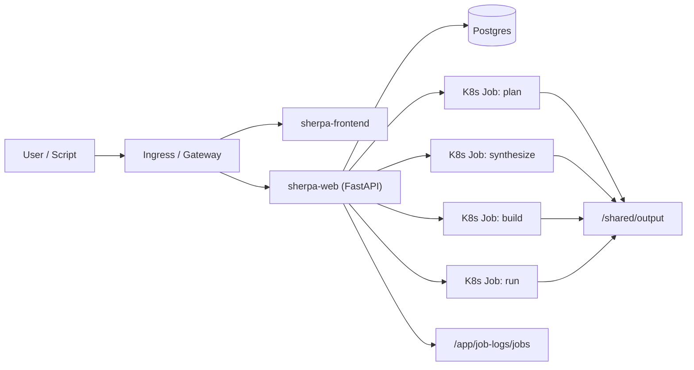
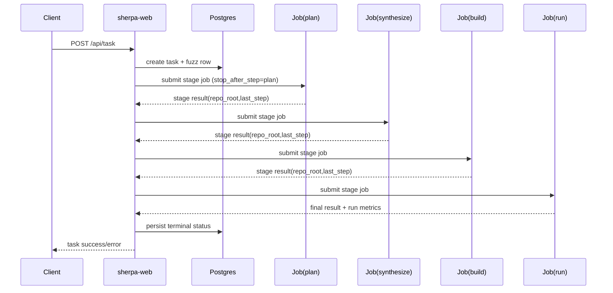
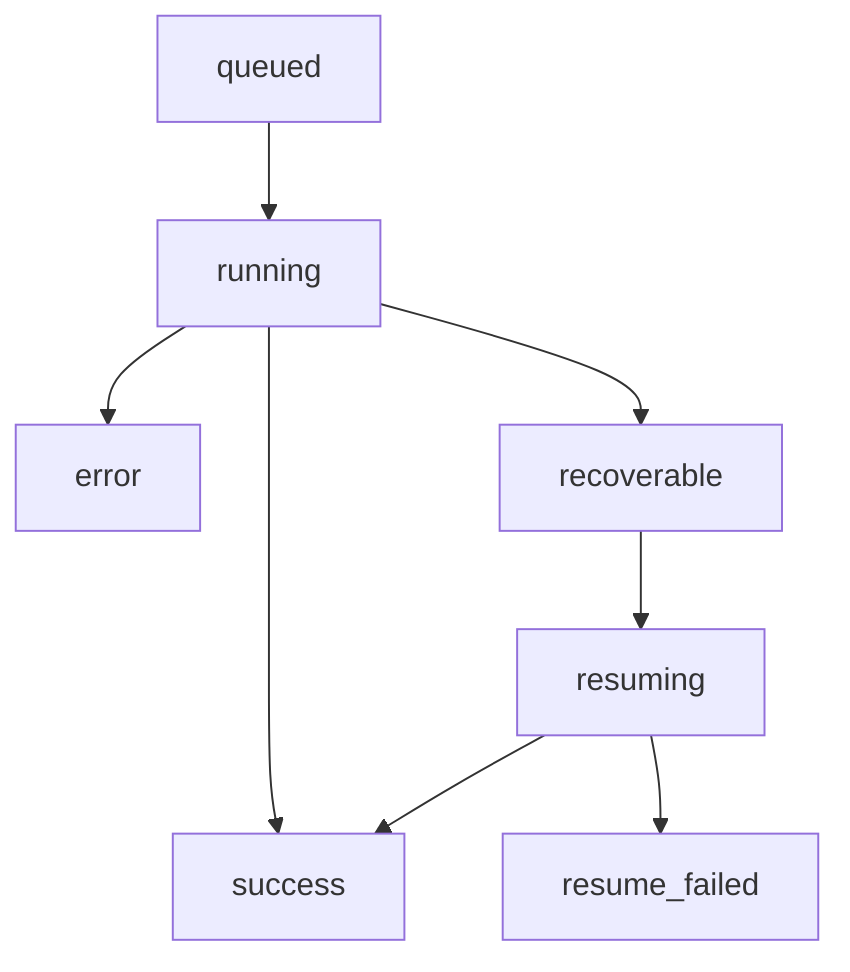
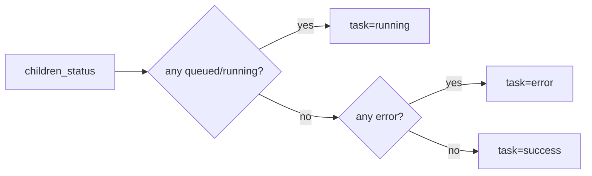
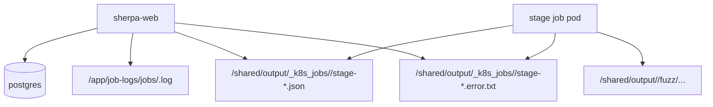
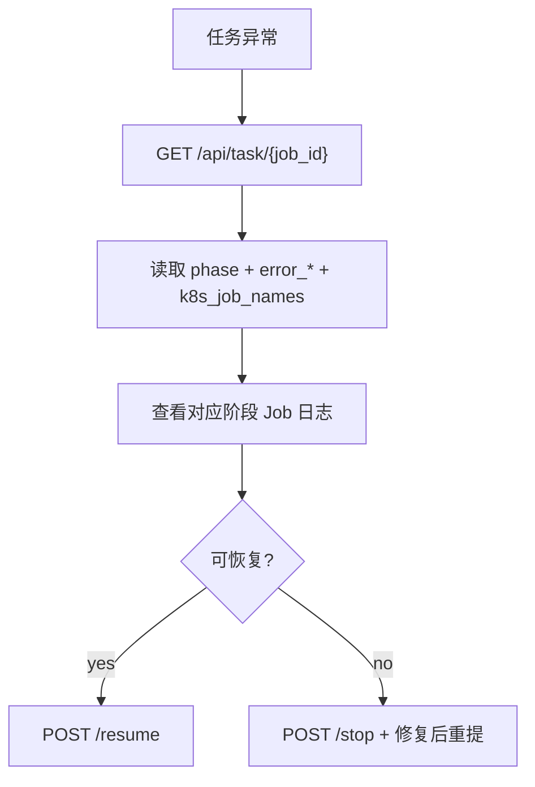
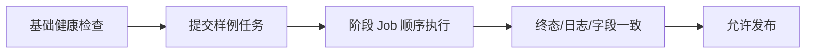
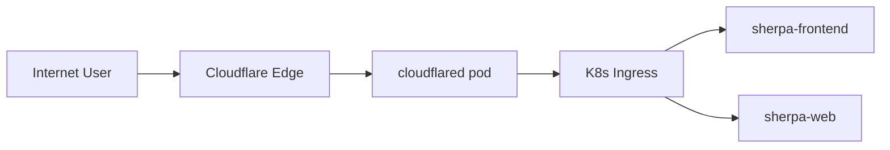

<p align="center">
  
</p>

# SHERPA

Sherpa 是面向 C/C++ 仓库的自动化 fuzz 编排系统，当前生产口径为：

- Kubernetes-only
- Postgres-only
- Native Runtime（不在 workflow 内再调用 inner Docker）
- 多阶段多 Job 执行（`plan -> synthesize -> build -> run`）

本文档是项目主对接文档，重点覆盖当前 K8s 方案、核心特性、执行流程、部署与排障。

---

## 1. 项目目标

Sherpa 解决的问题是：给一个陌生 C/C++ 仓库 URL，自动完成可执行 fuzz 链路，并输出可追踪结果。

核心目标：

1. 自动生成并迭代 harness，而不是手工写每个目标。
2. 在真实运行时中完成 build + run，并可持续修复失败。
3. 任务状态可观测、可恢复、可审计。
4. 基于 K8s 做阶段级隔离，降低单 Pod 长流程耦合与污染。

---

## 2. 当前基线（必须对齐）

以下是当前代码与部署的统一事实：

1. 执行器：`k8s_job`。
2. runtime：`native`（worker 容器内原生执行）。
3. 数据层：`Postgres`（`DATABASE_URL` 必填）。
4. 工作流：分阶段 Job 串行推进。
5. 恢复：支持 stop / 手动 resume。
6. 前端：任务提交、会话绑定、日志与进度展示。

> 兼容字段 `docker` / `docker_image` 仍可能出现在请求和回包中，但不再作为当前运行路径的决策核心。

---

## 3. 架构总览


```mermaid
flowchart LR
  U["User / Script"] --> IN["Ingress / Gateway"]
  IN --> FE["sherpa-frontend"]
  IN --> API["sherpa-web (FastAPI)"]
  API --> DB[("Postgres")]
  API --> J1["K8s Job: plan"]
  API --> J2["K8s Job: synthesize"]
  API --> J3["K8s Job: build"]
  API --> J4["K8s Job: run"]
  J1 --> OUT["/shared/output"]
  J2 --> OUT
  J3 --> OUT
  J4 --> OUT
  API --> LOGS["/app/job-logs/jobs"]
```

### 3.1 组件职责

1. `sherpa-web`
- 对外 API。
- 任务编排、阶段调度、状态落库。
- 聚合阶段结果，输出统一可观测字段。

2. `sherpa-frontend`
- 提交任务与配置。
- 轮询任务状态，展示阶段进度与日志。

3. `postgres`
- 持久化任务/子任务状态。
- 支撑恢复、统计与查询。

4. `k8s stage jobs`
- 每个阶段一个 Job Pod。
- 按 stop-after-step 执行后退出。

---

## 4. 执行流程（分阶段多 Job）

### 4.1 单子任务阶段序列


```mermaid
sequenceDiagram
  participant C as Client
  participant W as sherpa-web
  participant D as Postgres
  participant P as Job(plan)
  participant S as Job(synthesize)
  participant B as Job(build)
  participant R as Job(run)

  C->>W: POST /api/task
  W->>D: create task + fuzz row
  W->>P: submit stage job (stop_after_step=plan)
  P-->>W: stage result(repo_root,last_step)
  W->>S: submit stage job
  S-->>W: stage result(repo_root,last_step)
  W->>B: submit stage job
  B-->>W: stage result(repo_root,last_step)
  W->>R: submit stage job
  R-->>W: final result + run metrics
  W->>D: persist terminal status
  W-->>C: task success/error
```

### 4.2 为什么拆成多 Job

相比“单 Job 跑完整 workflow”：

1. 阶段边界清晰：定位故障更快。
2. 失败重试颗粒度更细：按阶段补救。
3. 环境污染更小：阶段级生命周期隔离。
4. 可观测性更强：`k8s_job_names` 可直接映射执行历史。

### 4.3 阶段产物如何传递

阶段间通过共享目录和状态字段续接：

1. `repo_root`：阶段操作的仓库根目录。
2. `resume_from_step`：下一阶段起点。
3. `_k8s_jobs/<job_id>/stage-*.json`：阶段结果。
4. `_k8s_jobs/<job_id>/stage-*.error.txt`：阶段错误详情。

---

## 5. 任务状态机与恢复

### 5.1 子任务状态


```mermaid
flowchart TD
  Q["queued"] --> R["running"]
  R --> S["success"]
  R --> E["error"]
  R --> RC["recoverable"]
  RC --> RS["resuming"]
  RS --> S
  RS --> RF["resume_failed"]
```

### 5.2 父任务聚合逻辑


```mermaid
flowchart LR
  C["children_status"] --> A{"any queued/running?"}
  A -->|yes| RUN["task=running"]
  A -->|no| B{"any error?"}
  B -->|yes| ERR["task=error"]
  B -->|no| OK["task=success"]
```

### 5.3 stop / resume 行为

1. `POST /api/task/{job_id}/stop`
- 标记取消请求。
- 停掉未完成阶段 Job。
- 保留上下文用于后续恢复。

2. `POST /api/task/{job_id}/resume`
- 读取恢复上下文。
- 从指定阶段继续（默认按已有规则回退）。
- 续跑结果与新阶段日志继续落盘。

---

## 6. 关键可观测字段（前后端统一口径）

任务详情建议固定消费以下字段：

1. `job_id`
2. `status`
3. `runtime_mode`
4. `phase`
5. `error_code`
6. `error_kind`
7. `error_signature`
8. `k8s_job_name`
9. `k8s_job_names`
10. `children_status`
11. `workflow_last_step`
12. `workflow_active_step`

字段用途建议：

1. `status/phase`：前端状态色与主进度。
2. `error_*`：根因分类与重复问题归并。
3. `k8s_job_names`：阶段日志精准定位。
4. `children_status`：父任务聚合可视化。

---

## 7. API 清单

| 方法 | 路径 | 说明 |
|---|---|---|
| `GET` | `/api/health` | 健康检查 |
| `GET` | `/api/system` | 系统状态快照 |
| `GET` | `/api/metrics` | Prometheus 指标 |
| `GET` | `/api/config` | 读取配置（脱敏） |
| `PUT` | `/api/config` | 更新配置 |
| `POST` | `/api/task` | 提交任务 |
| `GET` | `/api/task/{job_id}` | 任务详情 |
| `GET` | `/api/tasks` | 任务列表 |
| `POST` | `/api/task/{job_id}/stop` | 停止任务 |
| `POST` | `/api/task/{job_id}/resume` | 手动续跑 |
| `GET` | `/docs` | Swagger UI（同域 API 文档） |
| `GET` | `/redoc` | ReDoc（同域 API 文档） |
| `GET` | `/openapi.json` | OpenAPI Schema |

---

## 8. 目录与文件流


```mermaid
flowchart TB
  API["sherpa-web"] --> DB[("postgres")]
  API --> JL["/app/job-logs/jobs/<job_id>.log"]
  API --> KR["/shared/output/_k8s_jobs/<job_id>/stage-*.json"]
  API --> KE["/shared/output/_k8s_jobs/<job_id>/stage-*.error.txt"]
  JOB["stage job pod"] --> KR
  JOB --> KE
  JOB --> OUT["/shared/output/<repo-id>/fuzz/... "]
```

常见路径：

1. 阶段结果：`/shared/output/_k8s_jobs/<job_id>/stage-XX-<stage>.json`
2. 阶段错误：`/shared/output/_k8s_jobs/<job_id>/stage-XX-<stage>.error.txt`
3. 聚合日志：`/app/job-logs/jobs/<job_id>.log`
4. 运行产物：`/shared/output/<repo-id>/fuzz/out` 与 `.../artifacts`

---

## 9. 部署与启动（K8s）

### 9.1 前置条件

1. 可用 Kubernetes 集群（Docker Desktop K8s/kind/minikube 均可）。
2. `kubectl` 可连接当前集群。
3. 已准备 `DATABASE_URL` 与 provider API key（当前默认 MiniMax）。

### 9.2 部署基础栈

```bash
kubectl apply -k k8s/base
kubectl -n sherpa get pods
kubectl -n sherpa get svc
kubectl -n sherpa get ingress
```

### 9.3 本地访问

```bash
kubectl -n sherpa port-forward svc/sherpa-web 8001:8001
kubectl -n sherpa port-forward svc/sherpa-frontend 3000:3000

curl -sS http://127.0.0.1:8001/api/health
curl -sS http://127.0.0.1:8001/api/system | jq
```

---

## 10. 端到端示例（zlib）

### 10.1 提交任务

```bash
curl -sS -X POST http://127.0.0.1:8001/api/task \
  -H 'Content-Type: application/json' \
  -d '{
    "jobs": [{
      "code_url": "https://github.com/madler/zlib.git",
      "total_time_budget": 900,
      "run_time_budget": 900,
      "max_tokens": 1000
    }]
  }'
```

### 10.2 轮询与控制

```bash
curl -sS http://127.0.0.1:8001/api/tasks?limit=20
curl -sS http://127.0.0.1:8001/api/task/<job_id>
curl -sS -X POST http://127.0.0.1:8001/api/task/<job_id>/stop
curl -sS -X POST http://127.0.0.1:8001/api/task/<job_id>/resume
```

### 10.3 验收重点

1. 阶段顺序：`plan -> synthesize -> build -> run`。
2. `k8s_job_names` 完整可追踪。
3. `phase/error_code/error_kind/error_signature` 可解释。
4. 终态与日志一致。

---

## 11. 运维与排障

### 11.1 快速诊断命令

```bash
kubectl -n sherpa get pods
kubectl -n sherpa get svc
kubectl -n sherpa get ingress
kubectl -n sherpa logs deploy/sherpa-web --tail=200
kubectl -n sherpa logs deploy/sherpa-frontend --tail=200
kubectl -n sherpa logs statefulset/postgres --tail=200
```

### 11.2 阶段级定位

1. 先查 `/api/task/<job_id>` 的 `phase/error_*`。
2. 取 `k8s_job_names`，逐个拉日志：

```bash
kubectl -n sherpa logs job/<stage-job-name> --tail=200
```

3. 同时检查阶段结果文件：
- `stage-XX-<stage>.json`
- `stage-XX-<stage>.error.txt`

### 11.3 标准排障流程


```mermaid
flowchart TD
  A["任务异常"] --> B["GET /api/task/{job_id}"]
  B --> C["读取 phase + error_* + k8s_job_names"]
  C --> D["查看对应阶段 Job 日志"]
  D --> E{"可恢复?"}
  E -->|yes| F["POST /resume"]
  E -->|no| G["POST /stop + 修复后重提"]
```

---

## 12. 发布门禁（上线前）

1. 核心 Pod 全部 `Ready`。
2. `/api/health` = 200。
3. `/api/system` 返回 runtime 基线与关键配置。
4. 样例任务可完整走完阶段链路。
5. 阶段日志与 API 回包字段一致。


```mermaid
flowchart LR
  A["基础健康检查"] --> B["提交样例任务"]
  B --> C["阶段 Job 顺序执行"]
  C --> D["终态/日志/字段一致"]
  D --> E["允许发布"]
```

回滚示例：

```bash
kubectl -n sherpa rollout undo deploy/sherpa-web
kubectl -n sherpa rollout undo deploy/sherpa-frontend
```

---

## 13. Cloudflare Tunnel（内网域名接入）

目标：将 `sherpa.<your-domain>` 通过 Cloudflare Tunnel 指向集群 Ingress。


```mermaid
flowchart LR
  U["Internet User"] --> CF["Cloudflare Edge"]
  CF --> T["cloudflared pod"]
  T --> IN["K8s Ingress"]
  IN --> FE["sherpa-frontend"]
  IN --> API["sherpa-web"]
```

部署：

```bash
kubectl apply -k k8s/overlays/cloudflare
kubectl -n sherpa get pods | rg cloudflared
```

常见错误：

1. `1033`：Tunnel 连接器未在线。
2. `1016`：DNS 记录未生效或指向错误。
3. `404 (nginx)`：Ingress host/path 不匹配。

---

## 14. 从 Docker 心智迁移到 K8s 心智

| Docker 习惯 | K8s 对应 | Sherpa 实际 |
|---|---|---|
| `docker-compose service` | Deployment / StatefulSet | web / frontend / postgres |
| `docker run one-shot` | Job | 阶段 Job（plan/synthesize/build/run） |
| bind volume | PVC | shared-output / shared-tmp / job-logs |
| `.env` | ConfigMap + Secret | 配置与密钥注入 |
| gateway container | Ingress | `/` 与 `/api/*` 路由 |

迁移核心不是“把 compose 改写成 yaml”，而是把“单容器串行思维”改为“阶段化编排思维”。

---

## 15. 安全与配置建议

1. 密钥仅放 Secret，不写入仓库。
2. `/api/config` 只返回脱敏值。
3. 日志启用敏感字段脱敏（token/key/password/bearer）。
4. 生产集群建议开启最小权限 RBAC 与 NetworkPolicy。

---

## 16. 代码入口（关键文件）

1. `/Users/zuens2020/Documents/Sherpa/harness_generator/src/langchain_agent/main.py`
- 任务 API、状态聚合、阶段 Job 编排。

2. `/Users/zuens2020/Documents/Sherpa/harness_generator/src/langchain_agent/k8s_job_worker.py`
- 阶段 Job Pod 入口、result/error 写回。

3. `/Users/zuens2020/Documents/Sherpa/harness_generator/src/langchain_agent/fuzz_relative_functions.py`
- `fuzz_logic` 桥接。

4. `/Users/zuens2020/Documents/Sherpa/harness_generator/src/langchain_agent/workflow_graph.py`
- workflow 节点、路由、`stop_after_step` 阶段执行控制。

---

## 17. docs 子文档索引

1. `/Users/zuens2020/Documents/Sherpa/docs/DOCKER_TO_K8S_HANDOFF.md`
2. `/Users/zuens2020/Documents/Sherpa/docs/K8S_MIGRATION_CHECKLIST.md`
3. `/Users/zuens2020/Documents/Sherpa/docs/PROJECT_HANDOFF_STATUS.md`
4. `/Users/zuens2020/Documents/Sherpa/docs/k8s/LOCAL_K8S_QUICKSTART.md`
5. `/Users/zuens2020/Documents/Sherpa/docs/k8s/DEPLOY.md`
6. `/Users/zuens2020/Documents/Sherpa/docs/k8s/DEPLOYMENT_DETAILED.md`
7. `/Users/zuens2020/Documents/Sherpa/docs/k8s/RUNBOOK.md`
8. `/Users/zuens2020/Documents/Sherpa/docs/k8s/RELEASE_GATE.md`
9. `/Users/zuens2020/Documents/Sherpa/docs/k8s/CLOUDFLARE_TUNNEL.md`
10. `/Users/zuens2020/Documents/Sherpa/docs/k8s/MAPPING.md`
11. `/Users/zuens2020/Documents/Sherpa/docs/k8s/E2E_ZLIB_REPORT.md`
12. `/Users/zuens2020/Documents/Sherpa/docs/k8s/DEPLOY_ISSUES_NON_NETWORK.md`

---

## 18. 快速检查清单（对接时）

1. 是否明确当前运行基线是 K8s + Native + Postgres。
2. 是否知道阶段 Job 顺序与每阶段日志入口。
3. 是否按 `phase/error_*` 进行排障，而不是只看最终报错。
4. 是否掌握 `stop/resume` 的操作路径。
5. 是否能在本地通过 zlib 任务完成一次完整 E2E。

如果以上 5 项都能完成，对接基本合格。
