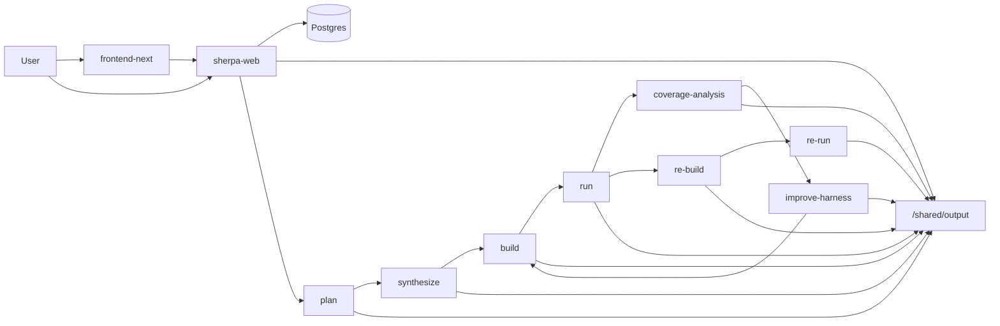

<p align="center">
  
</p>

# Sherpa

Sherpa 是一个面向 C/C++ 仓库的自动化 fuzz 编排系统。输入仓库 URL 后，系统会在 Kubernetes 上按阶段调度任务，自动完成 target 规划、harness 生成、构建、seed bootstrap、fuzz 运行、覆盖率驱动改进，以及 crash 复现。

当前仓库的真实主线以代码为准，不再依赖历史 README 叙述。当前线上主流程由 `FastAPI + Postgres + stage-per-job Kubernetes workflow` 驱动，核心代码位于：

- `harness_generator/src/langchain_agent/main.py`
- `harness_generator/src/langchain_agent/workflow_graph.py`
- `harness_generator/src/fuzz_unharnessed_repo.py`
- `frontend-next/`
- `k8s/base` 与 `k8s/overlays/*`

## 核心能力

- `plan` 阶段输出 `fuzz/PLAN.md`、`fuzz/targets.json`、`fuzz/target_analysis.json`
- `targets.json` 强制包含：`name`、`api`、`lang`、`target_type`、`seed_profile`
- `synthesize` 生成单 target fuzz scaffold，并支持 partial scaffold completion
- `build` / `fix_build` 支持规则修复、错误签名、quick-check、env rebuild
- `run` 默认先 AI 生成 seed，再复用 repo examples，并可接 `radamsa` 变异
- `run` 支持 plateau 检测、首个 crash 提前收口、typed seed bootstrap
- `coverage-analysis` / `improve-harness` 形成覆盖率反馈闭环
- `re-build` / `re-run` 是独立 crash 复现链路
- `repro_context.json` 用于跨 job 持久化 crash 上下文
- `k8s_job` 模式下 OpenCode 原生运行于 worker 容器，不依赖内嵌 Docker CLI

## 当前工作流


```mermaid
flowchart LR
  U["User"] --> FE["frontend-next"]
  U --> API["sherpa-web"]
  FE --> API
  API --> DB[("Postgres")]
  API --> OUT["/shared/output"]

  API --> P["plan"]
  P --> S["synthesize"]
  S --> B["build"]
  B --> R["run"]
  R --> CA["coverage-analysis"]
  CA --> IH["improve-harness"]
  IH --> B
  R --> RB["re-build"]
  RB --> RR["re-run"]
  RR --> OUT
  P --> OUT
  S --> OUT
  B --> OUT
  R --> OUT
  CA --> OUT
  IH --> OUT
  RB --> OUT
```

### 路由语义

- `plan -> synthesize -> build -> run` 是基础主链路。
- `run` 发现 crash 时进入 `re-build -> re-run`。
- `run` 无 crash 但进入平台期时，先进入 `coverage-analysis`。
- `coverage-analysis` 优先触发当前 target 的 in-place improve；连续无收益且有预算时才允许 replan。
- `workflow_recommended_next` 由工作流状态动态计算，外层调度不再硬编码固定尾序列。

## 关键状态文件

每个任务工作目录一般位于：

- `/shared/output/<repo>-<shortid>`

常见文件：

- `fuzz/PLAN.md`
- `fuzz/targets.json`
- `fuzz/target_analysis.json`
- `fuzz/build.py` 或 `fuzz/build.sh`
- `run_summary.json`
- `run_summary.md`
- `repro_context.json`
- `.repro_crash/`

Kubernetes stage 元数据位于：

- `/shared/output/_k8s_jobs/<job_id>/stage-*.json`
- `/shared/output/_k8s_jobs/<job_id>/stage-*.error.txt`

聚合日志位于：

- `/app/job-logs/jobs/<job_id>.log`

## Seed bootstrap

当前 `run` 阶段的 seed bootstrap 是三段式：

1. repo examples 复用
2. AI 定向补种
3. `radamsa` 变异

`seed_profile` 决定 seed prompt 和 repo example 过滤规则，例如：

- `parser-structure`
- `parser-token`
- `parser-format`
- `parser-numeric`
- `decoder-binary`
- `archive-container`
- `serializer-structured`
- `document-text`
- `network-message`
- `generic`

## 平台期与改进闭环

当前系统在 `run` 中会记录 plateau 信息，并在 `coverage-analysis` 中生成这些关键字段：

- `coverage_loop.round`
- `coverage_loop.plateau_detected`
- `coverage_loop.seed_profile`
- `coverage_loop.improve_mode`
- `coverage_loop.replan_effective`
- `coverage_loop.stop_reason`
- `coverage_loop.repo_examples_*`
- `coverage_loop.target_depth_*`

目标是避免“长时间空跑”以及“空 replan”。

## 当前部署口径

- 线上只看 `k8s_job` 路径
- `sherpa-web`、`frontend-next`、`postgres` 为常驻 Deployment
- 各个 workflow stage 由短生命周期 Job 执行
- `OpenCode` 在 k8s worker 中原生执行
- `GitNexus` 当前不在运行时主链路中

## 文档索引

- `docs/README.md`：文档入口
- `docs/CODEBASE_TECHNICAL_ANALYSIS.md`：代码级技术解析
- `docs/k8s/DEPLOYMENT_DETAILED.md`：部署与故障树
- `docs/k8s/RUNBOOK.md`：运维与排障
- `harness_generator/README.md`：后端工具链说明
- `harness_generator/docs/TECHNICAL_HANDOFF_ZH.md`：中文技术交接文档

## 开发检查

后端常用：

```bash
python -m py_compile harness_generator/src/langchain_agent/main.py harness_generator/src/langchain_agent/workflow_graph.py harness_generator/src/fuzz_unharnessed_repo.py
pytest -q tests/test_workflow_run_detection.py tests/test_workflow_build_resilience.py
```

前端常用：

```bash
cd frontend-next
npm test
npm run build
```

## 当前已知重点问题类型

- `synthesize` partial scaffold 但未写 sentinel
- `fix_build` 需要区分 source 问题、system package 问题、link 问题
- plateau 最后一轮预算收口
- target 过浅导致 fuzz 收益低
- repo_examples 误吸收源码文件

这些问题的当前实现状态和约束，以下文档已按代码现状同步更新。
