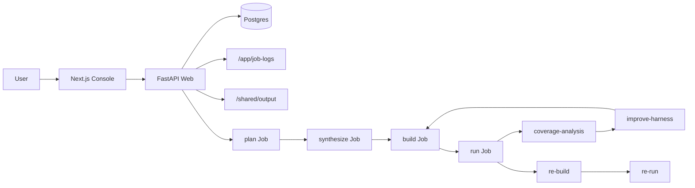

  

# Sherpa

Sherpa 是一个面向 C/C++ 仓库的自动化 fuzz 编排系统。用户输入仓库地址后，系统会通过 `FastAPI + Postgres + Kubernetes stage jobs` 执行完整的 fuzz 生命周期：目标规划、harness 生成、构建修复、seed bootstrap、fuzz 运行、覆盖率驱动改进，以及 crash 复现。

## 系统定位

Sherpa 解决的不是“生成一个 harness”这一件事，而是把 fuzz 工程中的高重复步骤串成一个可恢复、可观测、可迭代的自动化流水线：

- 自动分析任意公开仓库并生成 target 候选
- 为单个 target 生成外部 harness 和 build scaffold
- 自动修复常见构建错误并沉淀错误分类
- 自动生成初始 corpus，并结合 repo examples、AI 补种和 `radamsa` 做 bootstrap
- 自动运行 fuzzer，识别 plateau、crash、OOM、timeout 等运行结果
- 基于覆盖率和质量信号继续改当前 target，而不是盲目重新规划
- 进入独立的 crash 复现链路，产出可追踪的复现场景

## 当前真实架构

```mermaid
flowchart LR
  U["User"] --> FE["Next.js Console"]
  FE --> API["FastAPI Web"]
  API --> DB[("Postgres")]
  API --> LOGS["/app/job-logs"]
  API --> OUT["/shared/output"]

  API --> PLAN["plan Job"]
  PLAN --> SYN["synthesize Job"]
  SYN --> BUILD["build Job"]
  BUILD --> RUN["run Job"]
  RUN --> CA["coverage-analysis"]
  CA --> IH["improve-harness"]
  IH --> BUILD
  RUN --> RB["re-build"]
  RB --> RR["re-run"]
```

当前线上统一口径：

- 常驻服务只有 `sherpa-web`、`sherpa-frontend`、`postgres`
- 各工作流阶段由短生命周期 Kubernetes Job 执行
- OpenCode 在 worker 容器内原生运行，不依赖嵌套 Docker CLI
- 运行时默认按 non-root 设计，临时文件优先使用容器内 `/tmp`

## 核心模块

### `Sherpa/harness_generator/src/langchain_agent/main.py`

负责 Web API、任务调度、作业状态聚合、Kubernetes Job manifest 生成，以及系统级观测信息输出。

### `Sherpa/harness_generator/src/langchain_agent/workflow_graph.py`

定义工作流状态机和各阶段节点，是 Sherpa 的核心编排入口。这里负责：

- `plan -> synthesize -> build -> run` 主链路
- `coverage-analysis -> improve-harness` 闭环
- `re-build -> re-run` crash 复现链路
- build/run 失败分类
- 关键状态字段与 `run_summary.json` 写回

### `Sherpa/harness_generator/src/fuzz_unharnessed_repo.py`

负责底层仓库 clone、构建、运行、repo example 复用、seed bootstrap、以及 OpenCode 合成步骤的直接执行。

### `Sherpa/frontend-next/`

Next.js 控制台。前端主要承担配置编辑、任务提交、任务进度展示、系统概况展示，不承载工作流逻辑。

### `Sherpa/k8s/base/`

常驻服务与 PVC 的基础清单。当前 k8s 基础层定义了：

- `sherpa-web`
- `sherpa-frontend`
- `postgres`
- `serviceaccount + rbac`
- `configmap`
- 共享 PVC

## 工作流阶段

### 1. `plan`

对目标仓库做初步结构分析，输出：

- `fuzz/PLAN.md`
- `fuzz/targets.json`
- `fuzz/target_analysis.json`

当前 target schema 的关键字段包括：

- `name`
- `api`
- `lang`
- `target_type`
- `seed_profile`

### 2. `synthesize`

根据 plan 选中的 target 生成：

- harness 源文件
- `fuzz/build.py` 或 `fuzz/build.sh`
- `fuzz/README.md`
- `fuzz/observed_target.json`
- `fuzz/build_strategy.json`

当前默认原则是不复用仓库自带 fuzz target，而是统一生成外部 scaffold。

### 3. `build`

执行 build scaffold。系统会在进入实际构建前做静态预检，避免以下错误前提：

- 假设仓库存在某个猜测出来的 fuzz target
- 直接走 `cmake --build --target xxx-fuzzer`
- 缺少明确的 fuzzer entry 策略

### 4. `fix_build`

按 build 失败类型进入定向修复，而不是泛化重试。当前重点分类包括：

- `build_strategy_mismatch`
- `missing_fuzzer_main`
- `missing_link_symbols`
- `include_path_mismatch`

### 5. `run`

`run` 阶段先做 seed bootstrap，再实际运行 fuzzer。当前 seed bootstrap 是三段式：

1. repo examples
2. AI 补种
3. `radamsa` 变异

运行阶段会结构化记录：

- `run_error_kind`
- `terminal_reason`
- `cov/ft` 增长
- plateau 状态
- crash / OOM / timeout 分类

### 6. `coverage-analysis` 与 `improve-harness`

当 `run` 没有 crash 且覆盖率进入平台期时，Sherpa 优先做当前 target 的 in-place 改进，而不是直接回到 plan。

只有在以下条件成立时才允许 replan：

- 连续改进无收益
- 当前预算允许
- replan 能产生实质变化

### 7. `re-build` 与 `re-run`

crash 复现阶段单独执行，不复用主链路的“继续探索”逻辑。复现链路会持久化 `repro_context.json` 和相关报告，保证复现结果可追踪。

## 当前部署形态

### Kubernetes

线上执行模式是 `k8s_job`，配置位于：

- `Sherpa/k8s/base/`
- `Sherpa/k8s/overlays/`

关键配置项：

- `ConfigMap` 提供默认运行时参数，如 `TMPDIR=/tmp`、`SHERPA_GIT_MIRRORS`
- `web-deployment.yaml` 给常驻服务注入代理和 non-root 约束
- 动态 worker Job 由 `main.py` 生成 manifest，并显式注入代理与 git mirrors

### Docker Compose

本地开发链路保留在 `Sherpa/docker-compose.yml`。它主要用于：

- 快速本地起一套完整服务
- 初始化共享卷权限
- 本地验证前后端与网关行为

## 关键运行时产物

任务目录通常位于：

- `/shared/output/<repo>-<shortid>`

常见产物：

- `fuzz/PLAN.md`
- `fuzz/targets.json`
- `fuzz/target_analysis.json`
- `fuzz/build.py`
- `fuzz/observed_target.json`
- `fuzz/build_strategy.json`
- `run_summary.json`
- `run_summary.md`
- `repro_context.json`

Kubernetes stage 元数据位于：

- `/shared/output/_k8s_jobs/<job_id>/stage-*.json`
- `/shared/output/_k8s_jobs/<job_id>/stage-*.error.txt`

## 当前工程约束

- 默认禁止直接复用仓库自带 fuzz target
- 运行时临时文件默认只写容器内 `/tmp` 路径
- `run` / `repro_crash` 默认禁止 AI 改写源码参与验证结果判断
- `dev` 是集成验证分支，`main` 只接受来自 `dev` 的变更

## 推荐阅读顺序

1. [文档入口](/docs/README.md)
2. [代码级技术分析](/docs/CODEBASE_TECHNICAL_ANALYSIS.md)
3. [比赛展示版技术解读](/docs/COMPETITION_TECHNICAL_BRIEF.md)
4. [标准变更流程](/docs/STANDARD_CHANGE_PROCESS.md)
