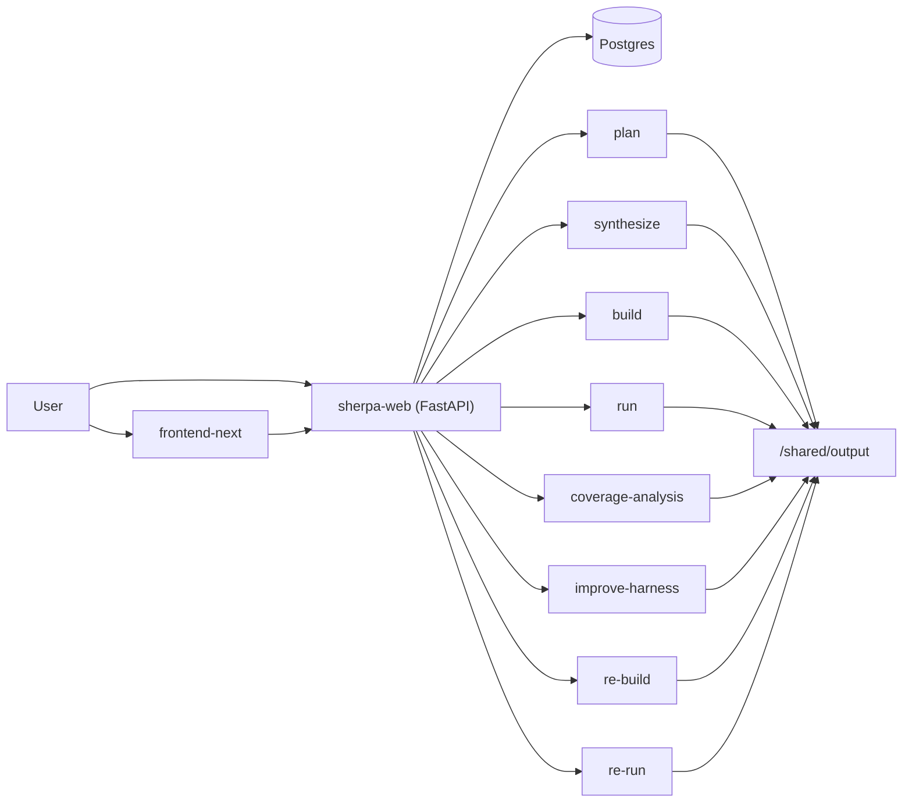

<p align="center">
  
</p>

# Sherpa

Sherpa 是一个面向 C/C++ 仓库的自动化 fuzz 编排系统。输入仓库 URL 后，系统会在 Kubernetes 上按阶段执行任务，产出 harness、构建产物、运行日志、崩溃样本与复现结果。

当前主线能力：

- Kubernetes 分阶段执行（stage-per-job）
- Postgres 状态持久化
- 覆盖率分析与可选 harness 改进链路
- 崩溃复现拆分为 `re-build` 与 `re-run`
- Dev / Prod 双环境工作流部署

---

## 1. 系统架构


```mermaid
flowchart LR
  U["User"] --> FE["frontend-next"]
  U --> API["sherpa-web (FastAPI)"]
  FE --> API

  API --> DB[(Postgres)]
  API --> S1["plan"]
  API --> S2["synthesize"]
  API --> S3["build"]
  API --> S4["run"]
  API --> S5["coverage-analysis"]
  API --> S6["improve-harness"]
  API --> S7["re-build"]
  API --> S8["re-run"]

  S1 --> OUT["/shared/output"]
  S2 --> OUT
  S3 --> OUT
  S4 --> OUT
  S5 --> OUT
  S6 --> OUT
  S7 --> OUT
  S8 --> OUT
```

核心组件：

1. `sherpa-web`
- 任务提交、阶段调度、状态聚合、恢复执行。

2. `frontend-next`
- 参数配置、任务提交、日志和进度展示。

3. `postgres`
- 任务与子任务状态持久化。

4. `k8s stage jobs`
- 每个阶段独立 Job，执行完成即退出。

---

## 2. 阶段模型

默认阶段序列：

1. `plan`
2. `synthesize`
3. `build`
4. `run`
5. `coverage-analysis`
6. `improve-harness`
7. `re-build`
8. `re-run`

说明：

1. `run` 如果发现 crash，会进入 `re-build/re-run` 复现链路。
2. `coverage-analysis` 只在未发现 crash 且满足条件时标记 `coverage_should_improve=true`。
3. `improve-harness` 负责准备下一轮改进提示，但当前 k8s 外层调度是固定阶段队列，不会在同一次 stage 列表中无限回环。

---

## 3. 覆盖率循环参数

前端/API 可配置：

- `coverage_loop_max_rounds`（1~5）

含义：

1. 控制最多允许的 coverage 改进轮次。
2. 该值会传入工作流状态并参与 `coverage-analysis` 决策。
3. 实际“多轮回跑”是否发生，取决于外层阶段调度策略与恢复逻辑，而不仅是该参数本身。

---

## 4. 崩溃复现语义

`re-build`：

1. fresh clone 代码（走 init 的 clone 逻辑）。
2. 复用 run 阶段上下文所需输入。
3. 重新构建复现所需二进制。

`re-run`：

1. 使用 `re-build` 产物 + crash artifact 复现。
2. 输出 `re_run_report` 与复现状态字段。

失败回流：

1. `re-build` 或 `re-run` 失败可触发回流到 `plan`（受重启上限约束）。
2. 回流时会携带失败上下文，供下一轮规划使用。

---

## 5. 目录结构

- `/Users/zuens2020/Documents/Sherpa/harness_generator/src/langchain_agent`
  - 编排、状态机、k8s job worker、API 主逻辑
- `/Users/zuens2020/Documents/Sherpa/harness_generator/src/fuzz_unharnessed_repo.py`
  - 仓库处理、构建与运行执行细节
- `/Users/zuens2020/Documents/Sherpa/frontend-next`
  - Next.js 前端
- `/Users/zuens2020/Documents/Sherpa/k8s/base`
  - 基础 K8s 清单
- `/Users/zuens2020/Documents/Sherpa/k8s/overlays/dev`
  - Dev 覆盖层
- `/Users/zuens2020/Documents/Sherpa/k8s/overlays/prod`
  - Prod 覆盖层
- `/Users/zuens2020/Documents/Sherpa/.github/workflows`
  - 部署与检查工作流

---

## 6. 本地开发启动

### 6.1 前置

1. Python 3.10+
2. Node.js 20+
3. PostgreSQL（或容器）
4. Kubernetes 集群与 `kubectl`（如需完整链路）

### 6.2 后端

```bash
cd /Users/zuens2020/Documents/Sherpa
python3 -m venv .venv
source .venv/bin/activate
pip install -r /Users/zuens2020/Documents/Sherpa/docker/requirements.web.txt
```

### 6.3 前端

```bash
cd /Users/zuens2020/Documents/Sherpa/frontend-next
npm ci
npm run dev
```

---

## 7. API 入口

常用接口：

1. `GET /api/health`
2. `GET /api/system`
3. `POST /api/task`
4. `GET /api/task/{job_id}`
5. `POST /api/task/{job_id}/stop`
6. `POST /api/task/{job_id}/resume`
7. `GET /docs`
8. `GET /openapi.json`

---

## 8. 部署与环境策略

### 8.1 Dev

1. 用于验证变更。
2. 可配置为部署前重置数据（按当前工作流实现）。
3. 域名、Tunnel、Secret 与 Prod 隔离。

### 8.2 Prod

1. 以滚动更新为主，保留历史数据。
2. 不执行 Dev 式重置。
3. 强调稳定与可回滚。

### 8.3 CI/CD 基线

1. 功能分支 -> PR 到 `dev`
2. `dev` 验证通过后 -> PR 到 `main`
3. `main` 合并后触发生产部署

---

## 9. 输出与日志

关键产物目录：

1. `/shared/output/<repo>-<id>`
2. `/shared/output/_k8s_jobs/<job_id>/stage-*.json`
3. `/app/job-logs/jobs/<job_id>.log`

定位问题建议顺序：

1. 先看对应 stage 的 `stage-*.json` 和 `stage-*.error.txt`
2. 再看任务聚合日志
3. 最后看 Pod events 与容器日志

---

## 10. 常见问题

### 10.1 `node_ready_no_metrics_warn:metrics_api_not_available`

含义：

1. Metrics API 不可用的告警。
2. 通常不阻塞任务执行。
3. 若要消除告警，需要补齐集群 Metrics Server 或调整节点探测策略。

### 10.2 `git clone` 失败

优先检查：

1. 出网与 DNS
2. 代理/镜像配置
3. clone fallback 源可用性

### 10.3 re-run 报 `workspace missing` / `missing last_fuzzer`

说明：

1. `re-build` 上下文未完整传递或产物未落盘。
2. 需检查阶段间 `stage_ctx` 更新与读取。

---

## 11. 文档导航

更细文档见：

- `/Users/zuens2020/Documents/Sherpa/docs/k8s/DEPLOY.md`
- `/Users/zuens2020/Documents/Sherpa/docs/k8s/RUNBOOK.md`
- `/Users/zuens2020/Documents/Sherpa/docs/STANDARD_CHANGE_PROCESS.md`
- `/Users/zuens2020/Documents/Sherpa/k8s/README.md`

---

## 12. License

See `/Users/zuens2020/Documents/Sherpa/LICENSE`.
