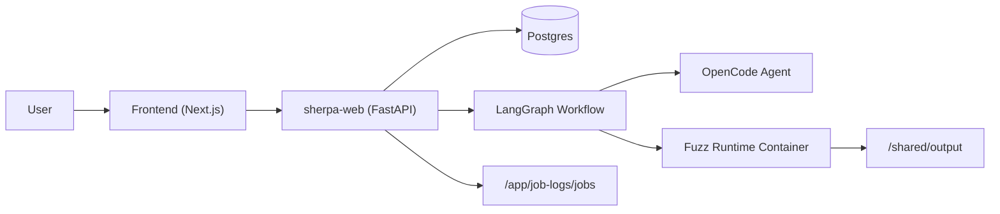
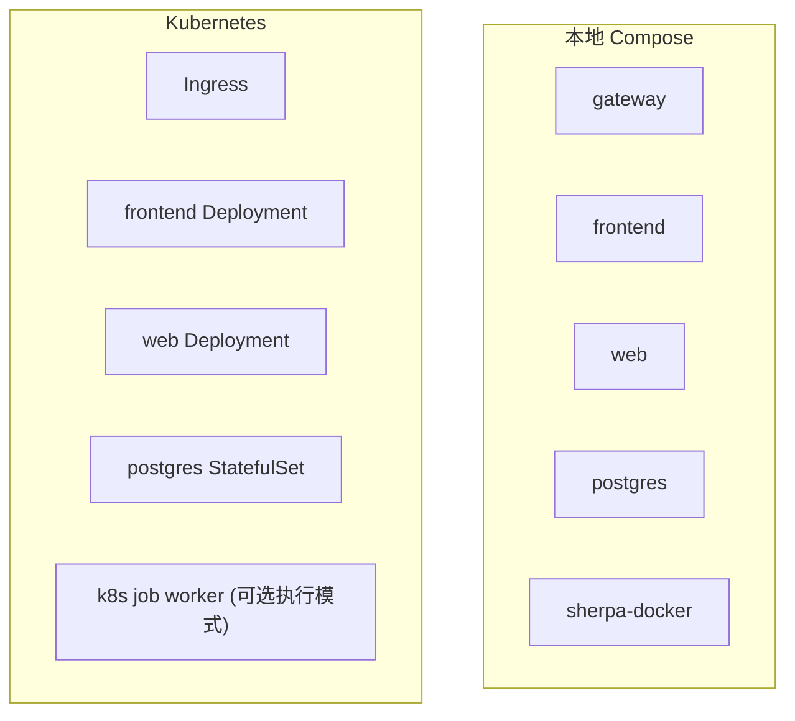
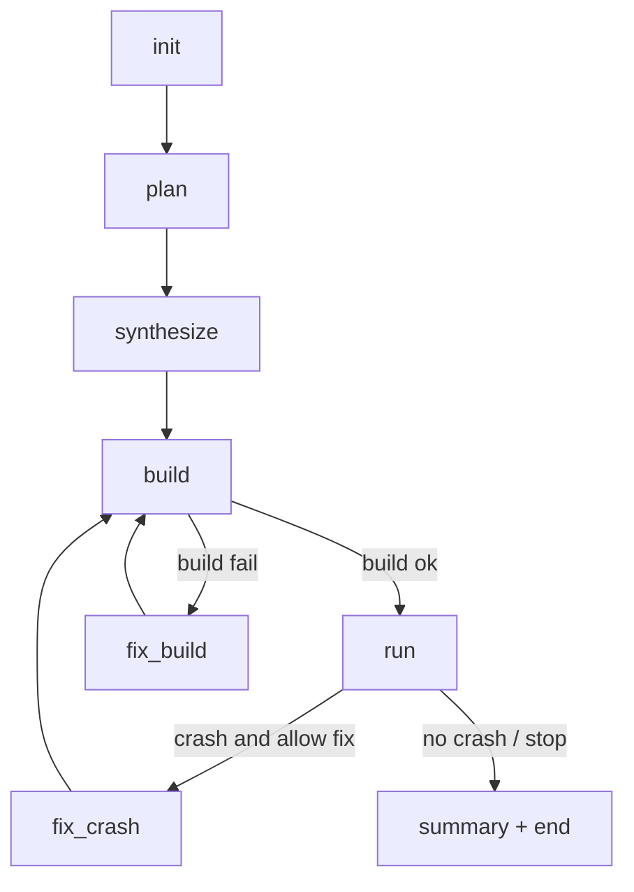
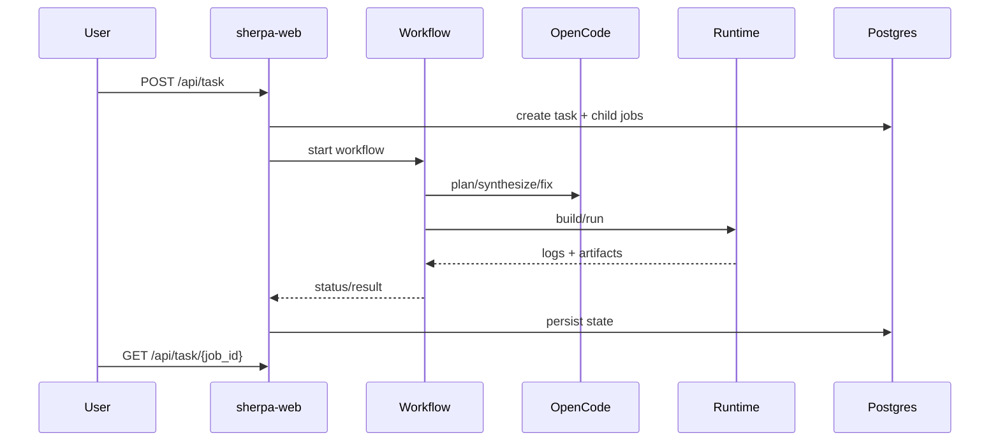
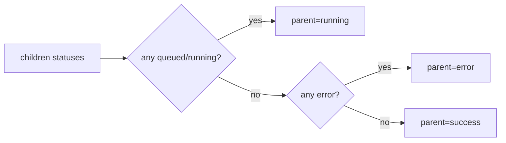
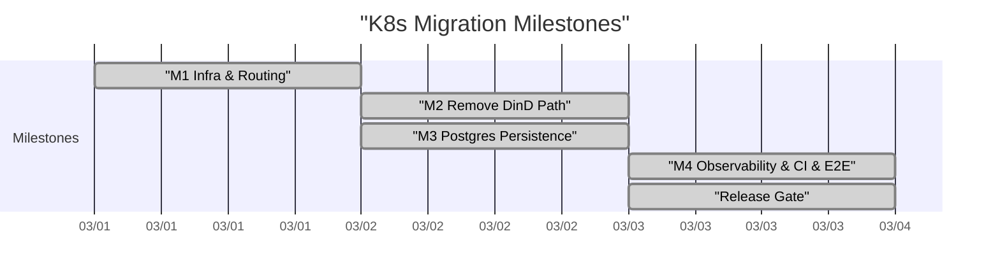

<p align="center">
  
</p>

# SHERPA

Sherpa 是一个面向 C/C++ 仓库的自动化 fuzz 工作流系统。输入仓库 URL 后，系统会执行：

`plan -> synthesize -> build -> run -> (fix_build / fix_crash) -> summary`

当前文档以“迁移收口后的现状”为准：

1. 任务状态存储为 **Postgres-only**（`DATABASE_URL` 必填）。
2. Web API 为统一控制面，前端通过 `/api/*` 访问。
3. 断点续跑默认手动触发（`POST /api/task/{job_id}/resume`）。
4. 可观测字段统一为 `job_id`、`phase`、`error_code`，并提供 `/api/metrics`。

---

## 1. 文档导航

### 1.1 先看这里

1. Kubernetes 部署：`/Users/zuens2020/Documents/Sherpa/docs/k8s/DEPLOY.md`
2. 运行手册（排障/回滚/重试）：`/Users/zuens2020/Documents/Sherpa/docs/k8s/RUNBOOK.md`
3. 发布回滚门禁：`/Users/zuens2020/Documents/Sherpa/docs/k8s/RELEASE_GATE.md`
4. E2E 验收样例（zlib）：`/Users/zuens2020/Documents/Sherpa/docs/k8s/E2E_ZLIB_REPORT.md`
5. Compose->K8s 映射：`/Users/zuens2020/Documents/Sherpa/docs/k8s/MAPPING.md`

### 1.2 代码入口

1. API 与任务调度：`/Users/zuens2020/Documents/Sherpa/harness_generator/src/langchain_agent/main.py`
2. 工作流图与节点：`/Users/zuens2020/Documents/Sherpa/harness_generator/src/langchain_agent/workflow_graph.py`
3. 执行器（clone/build/run）：`/Users/zuens2020/Documents/Sherpa/harness_generator/src/fuzz_unharnessed_repo.py`
4. OpenCode 封装：`/Users/zuens2020/Documents/Sherpa/harness_generator/src/codex_helper.py`
5. 配置与持久化：`/Users/zuens2020/Documents/Sherpa/harness_generator/src/langchain_agent/persistent_config.py`

---

## 2. 总体架构


```mermaid
flowchart LR
  U["User"] --> FE["Frontend (Next.js)"]
  FE --> API["sherpa-web (FastAPI)"]
  API --> DB[(Postgres)]
  API --> WF["LangGraph Workflow"]
  WF --> OC["OpenCode Agent"]
  WF --> RT["Fuzz Runtime Container"]
  RT --> OUT["/shared/output"]
  API --> LOG["/app/job-logs/jobs"]
```

### 2.1 运行形态


```mermaid
flowchart TB
  subgraph Local["本地 Compose"]
    GW["gateway"]
    FE2["frontend"]
    WEB["web"]
    PG["postgres"]
    DIND["sherpa-docker"]
  end

  subgraph K8s["Kubernetes"]
    ING["Ingress"]
    FEK["frontend Deployment"]
    WEBK["web Deployment"]
    PGK["postgres StatefulSet"]
    JOB["k8s job worker (可选执行模式)"]
  end
```

---

## 3. 工作流执行路径


```mermaid
flowchart TD
  I["init"] --> P["plan"]
  P --> S["synthesize"]
  S --> B["build"]
  B -->|"build ok"| R["run"]
  B -->|"build fail"| FB["fix_build"]
  FB --> B
  R -->|"crash and allow fix"| FC["fix_crash"]
  FC --> B
  R -->|"no crash / stop"| E["summary + end"]
```

### 3.1 各节点职责

| 节点 | 是否调用 LLM | 输出 |
|---|---|---|
| `plan` | 是 | `fuzz/PLAN.md`、`fuzz/targets.json` |
| `synthesize` | 是 | harness 源码、`fuzz/build.py` |
| `build` | 否 | `fuzz/out/*` 或构建错误 |
| `fix_build` | 条件 | 修复 `fuzz/*` 后重试 build |
| `run` | 否 | 运行结果、artifact、`run_details` |
| `fix_crash` | 条件 | 崩溃修复补丁与说明 |

### 3.2 数据与日志流


```mermaid
sequenceDiagram
  participant U as User
  participant API as sherpa-web
  participant WF as Workflow
  participant OC as OpenCode
  participant RT as Runtime
  participant DB as Postgres

  U->>API: POST /api/task
  API->>DB: create task + child jobs
  API->>WF: start workflow
  WF->>OC: plan/synthesize/fix
  WF->>RT: build/run
  RT-->>WF: logs + artifacts
  WF-->>API: status/result
  API->>DB: persist state
  U->>API: GET /api/task/{job_id}
```

---

## 4. 任务模型与状态

### 4.1 任务层级

1. `task`：父任务（批次入口）。
2. `fuzz`：子任务（单仓库执行）。

### 4.2 状态聚合规则


```mermaid
flowchart LR
  C["children statuses"] --> G{"any queued/running?"}
  G -->|yes| SR["parent=running"]
  G -->|no| E{"any error?"}
  E -->|yes| SE["parent=error"]
  E -->|no| SS["parent=success"]
```

### 4.3 关键返回字段

1. `job_id`
2. `status`
3. `phase`
4. `error_code`
5. `children_status`

---

## 5. 快速开始

### 5.1 环境准备

1. Docker / OrbStack
2. Docker Compose
3. `MINIMAX_API_KEY`
4. （K8s）`kubectl` + 可访问集群

### 5.2 本地启动

```bash
docker compose up -d --build
curl -sS http://localhost:8000/api/health
```

### 5.3 提交一个任务

```bash
curl -sS -X POST http://localhost:8000/api/task \
  -H 'Content-Type: application/json' \
  -d '{
    "jobs": [{
      "code_url": "https://github.com/madler/zlib.git",
      "docker": true,
      "docker_image": "auto",
      "total_time_budget": 900,
      "run_time_budget": 900,
      "max_tokens": 1000
    }]
  }'
```

### 5.4 查询与控制

```bash
# 查询任务
curl -sS http://localhost:8000/api/task/<job_id>

# 任务列表
curl -sS 'http://localhost:8000/api/tasks?limit=20'

# 手动恢复
curl -sS -X POST http://localhost:8000/api/task/<job_id>/resume

# 停止任务
curl -sS -X POST http://localhost:8000/api/task/<job_id>/stop
```

---

## 6. API 摘要

| 方法 | 路径 | 用途 |
|---|---|---|
| GET | `/api/config` | 读配置（密钥脱敏） |
| PUT | `/api/config` | 更新配置 |
| GET | `/api/system` | 系统状态 |
| GET | `/api/metrics` | Prometheus 指标 |
| POST | `/api/task` | 提交任务 |
| GET | `/api/task/{job_id}` | 任务详情 |
| POST | `/api/task/{job_id}/resume` | 手动恢复 |
| POST | `/api/task/{job_id}/stop` | 手动停止 |
| GET | `/api/tasks` | 任务列表 |

---

## 7. 配置要点

1. `DATABASE_URL`：Postgres 连接串（必填）。
2. `SHERPA_EXECUTOR_MODE`：`local_thread` 或 `k8s_job`。
3. `SHERPA_PARALLEL_FUZZERS`：run 阶段并发数。
4. `SHERPA_RUN_UNLIMITED_ROUND_BUDGET_SEC`：不限时时单轮上限。
5. `MINIMAX_API_KEY`：默认 provider 密钥来源。

---

## 8. 运维与排障

### 8.1 推荐排障顺序

1. `GET /api/system`
2. `GET /api/metrics`
3. `GET /api/task/{job_id}`
4. Web / Runtime 日志

### 8.2 常见问题

1. `DATABASE_URL is required`：数据库连接未配置。
2. 任务长期 running：先看 `phase` 与 `error_code`，再看子任务日志。
3. 构建失败：优先确认 runtime 镜像可拉取与网络可用性。

---

## 9. Kubernetes 迁移现状（SHE-52）


```mermaid
gantt
  title "K8s Migration Milestones"
  dateFormat  YYYY-MM-DD
  axisFormat  %m/%d
  section Milestones
  "M1 Infra & Routing" :done, m1, 2026-03-01, 1d
  "M2 Remove DinD Path" :done, m2, 2026-03-02, 1d
  "M3 Postgres Persistence" :done, m3, 2026-03-02, 1d
  "M4 Observability & CI & E2E" :done, m4, 2026-03-03, 1d
  "Release Gate" :done, gate, 2026-03-03, 1d
```

相关文档：

1. `/Users/zuens2020/Documents/Sherpa/docs/k8s/MAPPING.md`
2. `/Users/zuens2020/Documents/Sherpa/docs/k8s/DEPLOY.md`
3. `/Users/zuens2020/Documents/Sherpa/docs/k8s/RUNBOOK.md`
4. `/Users/zuens2020/Documents/Sherpa/docs/k8s/RELEASE_GATE.md`
5. `/Users/zuens2020/Documents/Sherpa/docs/k8s/E2E_ZLIB_REPORT.md`

---

## 10. 安全说明

1. API 与任务日志链路已加入敏感信息脱敏（key/token/bearer）。
2. 运行时配置文件写入后会尝试设置 `0600` 权限。
3. `/api/config` 返回不回显明文密钥。

---

## 11. 说明

1. 以 `docs/k8s/*` 与本 README 为当前对接基线。
2. 旧的历史文档若与本 README 冲突，以本 README 和 `docs/k8s` 为准。
