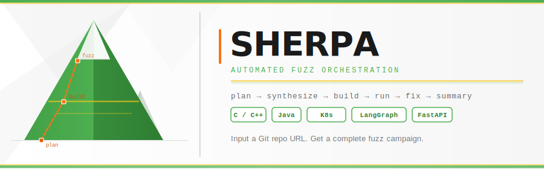
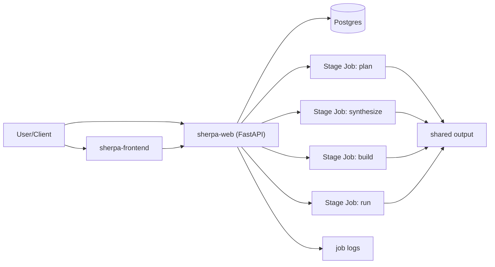

<p align="center">
  
</p>

# Sherpa

Sherpa 是一个面向 C/C++ 仓库的自动化 fuzz 编排系统：输入仓库 URL，自动执行 `plan -> synthesize -> build -> run`，输出可复现产物、日志与阶段结果。

当前项目基线：

- Kubernetes-only（执行器：`k8s_job`）
- Postgres-only（任务状态持久化）
- Native runtime（stage worker 在容器内原生执行，不再依赖 inner Docker）
- 多阶段多 Job（每阶段单独 K8s Job，串行推进）

---

## 1. 架构概览


```mermaid
flowchart LR
  U["User/Client"] --> FE["sherpa-frontend"]
  U --> API["sherpa-web (FastAPI)"]
  FE --> API

  API --> DB[(Postgres)]
  API --> P["Stage Job: plan"]
  API --> S["Stage Job: synthesize"]
  API --> B["Stage Job: build"]
  API --> R["Stage Job: run"]

  P --> OUT["shared output"]
  S --> OUT
  B --> OUT
  R --> OUT

  API --> LOG["job logs"]
```

组件职责：

1. `sherpa-web`
- API 入口、任务调度、阶段编排、状态聚合。
- 创建并追踪阶段 Job，持久化结果到 Postgres。

2. `sherpa-frontend`
- 配置与任务提交。
- 任务状态轮询与日志展示。

3. `postgres`
- 任务与子任务状态存储。
- 支持恢复、统计与历史查询。

4. `k8s stage jobs`
- 每阶段独立 Pod，阶段完成即退出。
- 通过共享目录 + 结构化 stage 结果在阶段间接力。

---

## 2. 执行模型

每个子任务固定按以下阶段运行：

1. `plan`
2. `synthesize`
3. `build`
4. `run`

阶段间传递关键上下文：

- `repo_root`
- `resume_from_step`
- `stop_after_step`
- stage result JSON / error TXT

阶段结果文件位置：

- `/shared/output/_k8s_jobs/<job_id>/stage-*.json`
- `/shared/output/_k8s_jobs/<job_id>/stage-*.error.txt`

任务聚合日志：

- `/app/job-logs/jobs/<job_id>.log`

---

## 3. 状态机与可观测字段

子任务常见状态：

- `queued`
- `running`
- `success`
- `error`
- `recoverable`
- `resuming`
- `resume_failed`

建议前端固定消费字段：

- `status`
- `phase`
- `runtime_mode`
- `error_code`
- `error_kind`
- `error_signature`
- `k8s_job_name`
- `k8s_job_names`
- `workflow_active_step`
- `workflow_last_step`

---

## 4. API 一览

| Method | Path | Purpose |
|---|---|---|
| GET | `/api/health` | 健康检查 |
| GET | `/api/system` | 系统信息 |
| GET | `/api/metrics` | Prometheus 指标 |
| GET | `/api/config` | 读取配置（脱敏） |
| PUT | `/api/config` | 更新配置 |
| POST | `/api/task` | 提交任务 |
| GET | `/api/task/{job_id}` | 查询任务 |
| GET | `/api/tasks` | 任务列表 |
| POST | `/api/task/{job_id}/stop` | 停止任务 |
| POST | `/api/task/{job_id}/resume` | 恢复任务 |
| GET | `/docs` | Swagger |
| GET | `/redoc` | ReDoc |
| GET | `/openapi.json` | OpenAPI Schema |

---

## 5. K8s 部署

### 5.1 最小前置条件

1. 可用 Kubernetes 集群。
2. `kubectl` 可连通目标集群。
3. 已准备 API key 与数据库参数（通过 Secret 注入）。

### 5.2 部署基础清单

```bash
kubectl apply -k k8s/base
kubectl -n sherpa get pods
kubectl -n sherpa get svc
kubectl -n sherpa get ingress
```

### 5.3 环境 Overlay

- 开发：`k8s/overlays/dev`
- 生产：`k8s/overlays/prod`

建议始终通过 CI workflow 进行部署，不手工漂移资源。

---

## 6. CI/CD 流程（当前规范）

分支职责：

- 功能分支：`codex/*`（或个人分支）
- 集成验证：`dev`
- 发布基线：`main`

强制流程：

1. 功能分支 -> PR 到 `dev`。
2. `Deploy Dev` 通过。
3. `dev` -> PR 到 `main`。
4. `Deploy Prod` 通过。

约束：

1. 禁止直推 `dev/main`。
2. `main` 只接收来自 `dev` 的 PR。
3. hotfix 允许临时直修时，必须回补到 `dev`。

---

## 7. Cloudflare Tunnel 现状

项目线上入口通过 cloudflared 对接域名。

默认策略：

1. 应用流量走部署流程中的 tunnel 配置（按环境注入 Secret）。
2. 域名由环境 Secret 管理，不写死在代码里。

排障优先检查：

1. `cloudflared` 是否在线。
2. Tunnel token 对应的 hostname 路由是否正确。
3. Ingress host 与 tunnel 目标是否一致。

---

## 8. 常见故障与处理

### 8.1 `Failed to connect github.com:443`

现象：init 阶段 clone 失败。

处理：

1. 确认运行镜像已更新到包含 clone fallback 修复的版本。
2. 配置 `SHERPA_GIT_MIRRORS`（可包含多个回退源）。
3. 检查集群节点出网与 DNS。

### 8.2 rollout 超时

现象：`rollout status ... timed out waiting for condition`。

处理：

1. 查看部署描述与 events。
2. 核对 PVC/PV 绑定与 storageClass。
3. 查看容器启动日志与 readiness 探针路径。

### 8.3 健康检查端口偶发失败

现象：`curl 127.0.0.1:18001` 连接失败。

处理：

1. 使用“等待 port-forward ready 后再 health check”的新版 workflow。
2. 失败时输出 `port-forward` 日志进行定位。

---

## 9. 目录速览

- `harness_generator/src/langchain_agent/`
  - API、编排、k8s job worker、状态机
- `harness_generator/src/fuzz_unharnessed_repo.py`
  - 仓库 clone、阶段执行、构建/运行细节
- `k8s/base`
  - 基础部署清单
- `k8s/overlays/dev`
  - 开发环境 overlay
- `k8s/overlays/prod`
  - 生产环境 overlay
- `.github/workflows`
  - `deploy-dev.yml`
  - `deploy-prod.yml`

---

## 10. 运维建议

1. 优先保证 `dev` 可重复部署与可观测，再推进 `prod`。
2. 所有“手工修复集群”动作，随后都要回写到仓库工作流或清单。
3. 任务问题先看 stage 结果文件，再看聚合日志，最后看 pod events。
4. 任何跨环境变更（dev/prod）必须显式验证隔离性。

---

## 11. License

See project license file.
