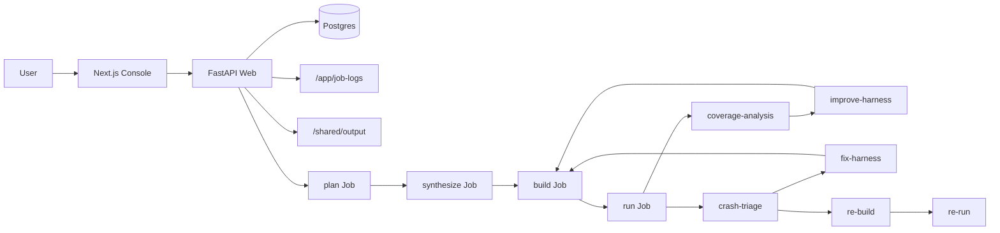

  

# Sherpa

Sherpa 是一个面向公开代码仓库的自动化 fuzz 编排系统。用户输入仓库地址后，系统会通过 `FastAPI + Postgres + Kubernetes stage jobs` 执行完整的 fuzz 生命周期：目标规划、harness 合成、构建、seed bootstrap、fuzz 运行、覆盖率改进，以及 crash triage / repro。

## 系统定位

Sherpa 解决的不是“生成一个 harness”这一件事，而是把 fuzz 工程里的高重复环节串成一个可恢复、可观测、可迭代的流水线：

- 自动分析仓库并生成 target 候选
- 为单个 target 生成外部 harness 和 build scaffold
- 对构建失败做分类修复和修复态回流
- 自动生成初始 corpus，并结合 repo examples、AI 补种和 `radamsa` bootstrap
- 自动运行 fuzzer，识别 plateau、crash、OOM、timeout 等运行结果
- 通过覆盖率和 seed 质量信号持续改当前 target，而不是盲目重规划
- 对 crash 进行 triage、修复和独立复现，保证结果可追踪

## 当前真实工作流

```mermaid
flowchart LR
  U["User"] --> FE["Next.js Console"]
  FE --> API["FastAPI Web"]
  API --> DB[("Postgres")]
  API --> LOGS["/app/job-logs"]
  API --> OUT["/shared/output"]

  API --> PLAN["plan Job"]
  PLAN --> SYN["synthesize Job"]
  SYN --> BUILD["build Job"]
  BUILD --> RUN["run Job"]
  RUN --> CA["coverage-analysis"]
  CA --> IH["improve-harness"]
  IH --> BUILD
  RUN --> TRIAGE["crash-triage"]
  TRIAGE --> FH["fix-harness"]
  FH --> BUILD
  TRIAGE --> RB["re-build"]
  RB --> RR["re-run"]
```

当前主线的真实含义是：

- `plan` 负责产出 target 规划和 seed/profile 约束
- `synthesize` 负责把一个 target 收敛成可执行 scaffold
- `build` 负责执行 scaffold，并在失败时把错误重新注入修复态
- `run` 负责 seed bootstrap、实际 fuzz 和质量信号采集
- `crash-triage` 负责判断 crash 更像 harness 问题还是上游库问题
- `fix-harness` 负责只修 harness 侧，不直接改上游库源码
- `coverage-analysis` / `improve-harness` 负责在 plateau 后继续做当前 target 的 in-place 改进
- `re-build` / `re-run` 负责 crash 复现链路

`fix_build`、`fix_crash` 等旧名字仍保留兼容逻辑，但当前主线不再把它们当作唯一的修复路由。

## 核心模块

### `harness_generator/src/langchain_agent/main.py`

负责 Web API、任务调度、作业状态聚合、Kubernetes Job manifest 生成，以及系统级观测信息输出。

### `harness_generator/src/langchain_agent/workflow_graph.py`

定义工作流状态机和各阶段节点，是 Sherpa 的核心编排入口。这里负责：

- `plan -> synthesize -> build -> run` 主链路
- `run -> crash-triage -> fix-harness -> build` crash 修复链路
- `run -> coverage-analysis -> improve-harness -> build` 覆盖率改进链路
- `re-build -> re-run` crash 复现链路
- build / run / replay 的错误分类与回流
- `repair_mode`、`restart_to_plan` 等关键状态字段

### `harness_generator/src/fuzz_unharnessed_repo.py`

负责底层仓库 clone、构建、运行、repo example 复用、seed bootstrap，以及 OpenCode 合成步骤的直接执行。

### `harness_generator/src/langchain_agent/prompts/`

保存各阶段的 OpenCode 提示词和全局策略，包含：

- 普通态 `plan` / `synthesize`
- 修复态 `plan` / `synthesize`
- `crash-triage`
- `fix-harness`
- `fix_build` 兼容提示

### `frontend-next/`

Next.js 控制台。前端主要承担配置编辑、任务提交、任务进度展示、系统概况展示，不承载工作流逻辑。

### `k8s/base/` 与 `k8s/overlays/`

常驻服务与工作负载的基础清单。当前基础层定义了：

- `sherpa-web`
- `sherpa-frontend`
- `postgres`
- `serviceaccount + rbac`
- `configmap`
- 共享输出卷

## 工作流阶段

### 1. `plan`

对目标仓库做初步结构分析，输出：

- `fuzz/PLAN.md`
- `fuzz/targets.json`
- `fuzz/target_analysis.json`

`targets.json` 的关键字段包括：

- `name`
- `api`
- `lang`
- `target_type`
- `seed_profile`

### 2. `synthesize`

根据 plan 选中的 target 生成：

- harness 源文件
- `fuzz/build.py` 或 `fuzz/build.sh`
- `fuzz/README.md`
- `fuzz/observed_target.json`
- `fuzz/build_strategy.json`

当前默认原则是不复用仓库自带 fuzz target，而是统一生成外部 scaffold。

### 3. `build`

执行 build scaffold，并在正式构建前做静态预检。系统会检查：

- 是否偷偷调用了仓库自带 fuzz target
- 是否缺失明确的 fuzzer entry 策略
- build scaffold 是否与 `build_strategy.json` 一致
- build 失败后是否需要进入修复态回流

### 4. `run`

`run` 阶段先做 seed bootstrap，再实际运行 fuzzer。当前 seed bootstrap 是三段式：

1. repo examples
2. AI 补种
3. `radamsa` 变异

运行阶段会结构化记录：

- `run_error_kind`
- `terminal_reason`
- `cov/ft` 增长
- plateau 状态
- crash / OOM / timeout 分类

### 5. `crash-triage`

对 `run` 阶段发现的 crash 做分类，输出三种结论：

- `harness_bug`
- `upstream_bug`
- `inconclusive`

这一步会结合 `crash_info.md`、`crash_analysis.md`、re-build / re-run 报告以及 crash 日志尾部。

### 6. `fix-harness`

只修 fuzz harness 侧问题，例如：

- 未捕获异常
- 错误的调用方式
- 入口函数或参数模型不对

这一步不直接改上游库源码。

### 7. `coverage-analysis` 与 `improve-harness`

当 `run` 没有 crash 且覆盖率进入平台期时，Sherpa 优先做当前 target 的 in-place 改进，而不是直接回到 `plan`。

只有在以下条件成立时才会进入更激进的重规划：

- 连续改进无收益
- 当前预算允许
- replan 能产生实质变化

### 8. `re-build` 与 `re-run`

crash 复现阶段单独执行，不复用主链路的继续探索逻辑。复现链路会持久化 `repro_context.json` 和相关报告，保证复现结果可追踪。

## 当前部署形态

### Kubernetes

线上执行模式是 `k8s_job`，配置位于：

- `k8s/base/`
- `k8s/overlays/`

关键运行约束：

- 常驻服务是 `sherpa-web`、`sherpa-frontend`、`postgres`
- 动态 worker Job 由 `main.py` 生成 manifest
- worker 内原生执行 OpenCode，不依赖嵌套 Docker CLI
- 运行时默认按 non-root 设计，临时文件优先使用容器内 `/tmp`

### Docker Compose

本地开发链路保留在 `docker-compose.yml`，主要用于：

- 快速本地起一套完整服务
- 初始化共享卷权限
- 验证前后端与 API 行为

## 关键运行时产物

任务目录通常位于：

- `/shared/output/<repo>-<shortid>`

常见产物：

- `fuzz/PLAN.md`
- `fuzz/targets.json`
- `fuzz/target_analysis.json`
- `fuzz/build.py`
- `fuzz/observed_target.json`
- `fuzz/build_strategy.json`
- `run_summary.json`
- `run_summary.md`
- `repro_context.json`
- `crash_triage.json`
- `crash_triage.md`

Kubernetes stage 元数据位于：

- `/shared/output/_k8s_jobs/<job_id>/stage-*.json`
- `/shared/output/_k8s_jobs/<job_id>/stage-*.error.txt`

## 当前工程约束

- 默认不复用仓库自带 fuzz target，而是统一生成外部 harness 与 build scaffold
- 运行时临时文件默认只写容器内 `/tmp` 路径
- `run` / `repro_crash` 默认禁止 AI 改写源码参与验证结果判断
- `dev` 是集成验证分支，`main` 只接受来自 `dev` 的变更

## 文档与 API

当前文档入口与接口说明以以下文件为准：

- [docs/README.md](docs/README.md)
- [docs/API_REFERENCE.md](docs/API_REFERENCE.md)
- [docs/CODEBASE_TECHNICAL_ANALYSIS.md](docs/CODEBASE_TECHNICAL_ANALYSIS.md)
- [docs/TECHNICAL_DEEP_DIVE.md](docs/TECHNICAL_DEEP_DIVE.md)
- [docs/STANDARD_CHANGE_PROCESS.md](docs/STANDARD_CHANGE_PROCESS.md)

如果你要接前端，优先看 [docs/API_REFERENCE.md](docs/API_REFERENCE.md)，它按当前真实返回字段整理了 `/api/task`、`/api/tasks`、`/api/system` 和配置接口。

## 推荐阅读顺序

1. [文档入口](docs/README.md)
2. [代码级技术分析](docs/CODEBASE_TECHNICAL_ANALYSIS.md)
3. [技术学习指南](docs/TECHNICAL_DEEP_DIVE.md)
4. [API 参考](docs/API_REFERENCE.md)
5. [标准变更流程](docs/STANDARD_CHANGE_PROCESS.md)
