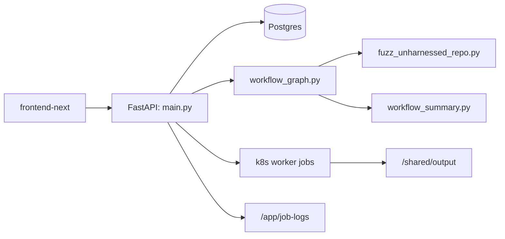
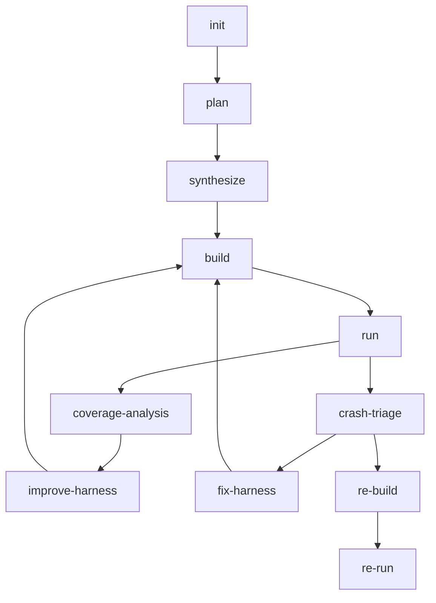

# Sherpa 代码级技术分析

本文基于当前仓库实现整理，目标是解释 Sherpa 的真实运行方式，而不是复述历史设计。

## 1. 系统目标

Sherpa 是一个面向公开代码仓库的自动化 fuzz 编排系统。它的核心目标不是“单次生成一个 harness”，而是把 fuzz 工程拆成可恢复、可解释、可观测的多阶段流水线：

- 从仓库 URL 自动规划 target
- 生成外部 harness 与 build scaffold
- 自动修 build 失败并把错误反馈回修复态
- 自动做 seed bootstrap
- 自动运行 fuzz 并提取质量信号
- 在 plateau 后继续改进当前 target
- crash 进入 triage / 修复 / 复现的独立闭环

## 2. 顶层结构

## 3. 模块职责

### `harness_generator/src/langchain_agent/main.py`

这是系统的 API 与调度入口，负责：

- FastAPI 生命周期初始化
- 配置持久化与运行时环境注入
- 任务创建、停止、恢复
- Postgres job store 读写
- 动态生成 Kubernetes worker Job manifest
- 聚合 stage 结果并对外暴露 `/api/*`
- 提供前端使用的动态块：
  - `overview`
  - `telemetry`
  - `execution.summary`
  - `tasks_tab_metrics`

### `harness_generator/src/langchain_agent/workflow_graph.py`

这是 Sherpa 的编排核心。它定义了：

- 工作流状态结构
- 各阶段节点实现
- 节点间跳转条件
- build / run / replay / triage 的错误分类
- summary 与关键产物落盘

系统行为的大部分“决策逻辑”都在这里。

### `harness_generator/src/fuzz_unharnessed_repo.py`

这是执行面，负责：

- clone 仓库
- 调用 OpenCode
- 执行 build scaffold
- bootstrap seeds
- 运行 fuzzer
- 解析输出
- 收集 crash、plateau、覆盖率等信号

它不做全局路由决策，而是为工作流节点提供执行原语。

### `harness_generator/src/langchain_agent/persistent_config.py`

负责 Web 配置的持久化与运行时文件生成，当前重点是：

- `web_config.json`
- `opencode.generated.json`
- `web_opencode.env`

默认运行时生成文件落在 `/tmp/sherpa-runtime`。

### `frontend-next/`

前端控制台只做以下事情：

- 展示系统状态
- 保存配置
- 提交任务
- 展示父任务 / 子任务 / 日志

它不参与后端工作流决策。

## 4. 工作流状态机

当前主线如下：

### `init`

负责仓库 clone、工作目录准备、上下文恢复。此阶段的真实工作目录通常位于：

- `/shared/output/<repo>-<shortid>`

### `plan`

负责产出 target 规划上下文，而不是直接生成 harness。

当前关键产物：

- `fuzz/PLAN.md`
- `fuzz/targets.json`
- `fuzz/target_analysis.json`

### `synthesize`

负责把计划中的 target 收敛为单个可执行 scaffold。当前阶段会写：

- harness 源文件
- `fuzz/build.py` 或 `fuzz/build.sh`
- `fuzz/README.md`
- `fuzz/observed_target.json`
- `fuzz/build_strategy.json`

当前默认策略是不复用仓库自带 fuzz target，而是统一生成外部 build scaffold。

### `build`

负责执行 scaffold，并在正式 build 前做静态预检。重点检查：

- 是否偷偷调用了仓库自带 fuzz target
- 是否缺失明确的 fuzzer entry 策略
- build scaffold 与 `build_strategy.json` 是否一致
- build 失败后是否需要进入 repair mode

build 失败时，当前主线会把错误、签名、stderr/stdout 尾部和 `repair_mode` 信息写回状态；`fix_build`/`fix_crash` 仍保留兼容逻辑，但主线不再依赖它们作为唯一修复路由。

### `run`

负责 seed bootstrap 和实际 fuzz 运行。运行阶段除了执行 fuzzer，还要收集：

- `cov`
- `ft`
- `exec/s`
- plateau
- crash
- timeout
- OOM

当前 seed bootstrap 是三段式：

1. repo examples
2. AI 补种
3. `radamsa` 变异

### `crash-triage`

对 `run` 阶段发现的 crash 做分类，输出三种结论：

- `harness_bug`
- `upstream_bug`
- `inconclusive`

这一步会结合 `crash_info.md`、`crash_analysis.md`、re-build / re-run 报告以及 crash 日志尾部。

### `fix-harness`

只修 harness 侧问题，例如：

- 未捕获异常
- 错误的调用方式
- 入口函数或参数模型不对

这一步不直接改上游库源码。

### `coverage-analysis` 与 `improve-harness`

当 `run` 没有 crash 且覆盖率进入平台期时，Sherpa 优先做当前 target 的 in-place 改进，而不是直接回到 `plan`。

只有在以下条件成立时才会进入更激进的重规划：

- 连续改进无收益
- 当前预算允许
- replan 能产生实质变化

### `re-build` 与 `re-run`

crash 复现阶段单独执行，不与主探索链路混在一起。复现链路会持久化 `repro_context.json` 和相关报告，保证复现结果可追踪。

## 5. build scaffold 设计

当前系统默认假设所有仓库都需要“外部 harness + 外部 build scaffold”，而不是直接复用仓库自带 fuzz target。

这意味着：

- `build.py` 需要明确描述库/源码如何构建
- harness 如何参与编译
- `libFuzzer main` 如何提供
- 依赖的 include dirs、link libs、extra sources 是什么

对应产物：

- `fuzz/build_strategy.json`
- `fuzz/build_runtime_facts.json`
- `fuzz/repo_understanding.json`

当前其中的核心字段包括：

- `build_system`
- `build_mode`
- `library_targets`
- `library_artifacts`
- `include_dirs`
- `extra_sources`
- `fuzzer_entry_strategy`

## 6. seed bootstrap 与运行质量

当前 `run` 的 seed bootstrap 会综合：

- repo examples
- AI 生成的 seeds
- `radamsa` 变异

`seed_profile` 决定 repo examples 的过滤规则和 AI 补种风格，例如：

- `parser-structure`
- `parser-token`
- `parser-format`
- `parser-numeric`
- `decoder-binary`
- `archive-container`
- `serializer-structured`
- `document-text`
- `network-message`
- `generic`

当前实现还会把 seed 质量信号写回工作流状态，用于后续的 coverage-analysis 和 repair-mode 决策。

## 7. 运行时与部署模型

### Kubernetes

当前线上模型是：

- `sherpa-web`：控制面服务
- `sherpa-frontend`：控制台 UI
- `postgres`：任务状态持久化
- 每个 workflow stage 对应一个短生命周期 worker Job

worker Job 由 `main.py` 动态生成 manifest。当前 manifest 会显式注入：

- payload
- provider / model
- git mirrors
- non-root 运行参数

### non-root 与共享输出

运行时默认按 non-root 设计。工作流中大量阶段产物会落到：

- `/shared/output`

这让 stage 之间的上下文、日志、报告和 crash artifact 能被后续阶段继续读取。

### 前端动态指标

前端控制台不直接计算业务指标，而是消费后端聚合块：

- `overview`
- `telemetry`
- `execution.summary`
- `tasks_tab_metrics`

这些字段从 `/api/system` 获取，`/api/tasks` 用于任务表格刷新。

## 8. 兼容层说明

当前仓库保留了一些兼容符号和旧节点名，例如：

- `fix_build`
- `fix_crash`
- `repro_crash`

它们主要用于历史任务恢复、旧状态兼容和调试回放。当前文档在描述主线流程时，应以 `plan / synthesize / build / run / crash-triage / fix-harness / coverage-analysis / improve-harness / re-build / re-run` 为准。

## 9. 阅读建议

如果你要快速接手代码，推荐顺序：

1. `README.md`
2. `docs/API_REFERENCE.md`
3. `docs/PROJECT_HANDOFF_STATUS.md`
4. `docs/TECHNICAL_DEEP_DIVE.md`
