# Sherpa 代码现状技术解析

本文**完全基于当前代码实现**整理，不依赖 README 或历史文档。目标不是做产品宣传，而是把当前仓库的真实设计、运行路径、状态流转、部署方式和约束条件讲清楚，让一个第一次接触项目的人可以直接从这份文档理解系统。

## 1. 项目一句话定义

Sherpa 是一个**面向任意开源仓库的 AI 驱动 fuzz workflow orchestration 平台**。

它的核心能力不是“单次生成一个 fuzz harness”，而是把完整的非 OSS-Fuzz 仓库 fuzz 流程拆成独立阶段，并放进 Kubernetes 中逐阶段执行：

- `plan`
- `synthesize`
- `build`
- `fix_build`
- `run`
- `coverage-analysis`
- `improve-harness`
- `re-build`
- `re-run`
- `fix_crash`

它同时提供：

- Web API 和前端控制台
- 任务与子任务状态持久化
- 按阶段恢复/继续执行
- 构建失败自动修复
- 覆盖率反馈回路
- crash 复现与回流到 plan
- 基于 Kubernetes Job 的隔离执行

从代码现状看，Sherpa 已经不是“本地脚本工具”，而是一套**后端调度器 + k8s stage executor + AI 代码生成/修复控制流 + 前端任务控制台**的系统。

---

## 2. 仓库结构总览

当前仓库最重要的目录如下：

```text
Sherpa/
├── frontend-next/                 # Next.js 前端控制台
├── harness_generator/             # 后端 API、工作流调度、fuzz 逻辑
│   └── src/
│       ├── langchain_agent/       # Web API + Workflow Graph + k8s worker
│       └── fuzz_unharnessed_repo.py
├── k8s/                           # 基础 k8s manifests 与 dev/prod/cloudflare overlays
├── docker/                        # Web / frontend 构建镜像用 Dockerfile 与依赖文件
├── tests/                         # 工作流、调度、前端 schema 等测试
├── .github/workflows/             # dev/prod 部署与 PR 流程
└── docs/                          # 辅助文档（本文也在这里）
```

### 2.1 代码分层图

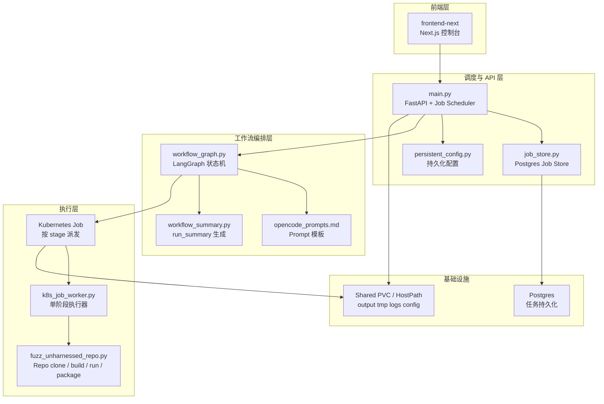

---

## 3. 系统设计思路

Sherpa 的设计不是“一个长进程从头跑到尾”，而是把工作流切成若干个**可独立启动、可单独失败、可按 step 恢复**的阶段。

这带来三个直接收益：

1. **隔离性**
- 每个 stage 都是独立 Kubernetes Job。
- 某个阶段的异常不会污染 web 服务进程。

2. **恢复性**
- 任务状态持久化在 Postgres。
- 工作目录和构建产物持久化在 shared output。
- 可以从 `build`、`run`、`re-build`、`re-run` 等阶段恢复。

3. **可插入控制逻辑**
- 在 `build` 和 `run` 中间可以加 `fix_build`。
- 在 `run` 后可以插 `coverage-analysis` 与 `improve-harness`。
- 在 `crash` 后可以切入 `re-build` / `re-run` / `fix_crash`。

### 3.1 整体控制流

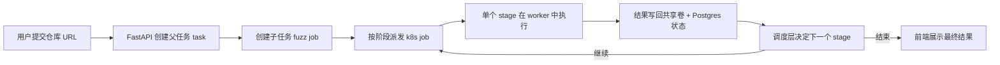

### 3.2 系统最重要的几个原则

#### 原则 1：Web 服务不直接跑 fuzz
Web 服务只做：

- 接收请求
- 保存状态
- 派发 k8s job
- 聚合结果

真正的 clone/build/run/repro 在 worker job 里完成。

#### 原则 2：repo output 目录是真实工作目录
对每个 repo，系统会在 shared output 下生成一个目录，例如：

```text
/shared/output/libarchive-xxxxxxx
```

这个目录承载：

- 克隆后的仓库源码
- `fuzz/` 子目录
- `run_summary.json`
- `run_summary.md`
- `repro_context.json`
- crash artifacts
- `re_build_report.*`
- `re_run_report.*`

它是整个 workflow 的**物理真相来源**。

#### 原则 3：阶段状态和磁盘状态双轨并存
Sherpa 不只依赖内存或 API 返回值，也不只依赖磁盘文件，而是两者结合：

- Postgres 里保存任务状态、结果摘要、恢复点
- output 目录里保存实际源码、产物、复现上下文和汇总文件

这就是为什么系统后来引入了 `repro_context.json`：因为仅靠 stage 间内存态透传不足够稳定。

---

## 4. 后端入口：FastAPI 调度器

核心文件：

- `harness_generator/src/langchain_agent/main.py`

它承担四个职责：

1. **提供 API**
2. **持久化任务**
3. **派发阶段 k8s job**
4. **在各 stage 结果之间做路由决策**

### 4.1 进程内核心对象

`main.py` 启动后维护几组全局状态：

- `_JOBS`：进程内 job 快照
- `_JOBS_LOCK`：线程锁
- `_JOB_STORE`：PostgresJobStore
- `_JOB_FUTURES`：线程池中的 future
- `executor`：`ThreadPoolExecutor`

它并不是用 asyncio 做复杂调度，而是：

- API 线程接收请求
- 将父任务/子任务提交到线程池
- 线程池里再调用 `_run_fuzz_job()`
- `_run_fuzz_job()` 逐阶段派发 k8s job

### 4.2 API 结构

后端当前暴露的主要接口：

- `GET /api/config`
- `PUT /api/config`
- `GET /api/system`
- `GET /api/metrics`
- `GET /api/health`
- `GET /api/tasks`
- `GET /api/task/{job_id}`
- `POST /api/task`
- `POST /api/task/{job_id}/resume`
- `POST /api/task/{job_id}/stop`
- `GET /api/opencode/providers/{provider}/models`
- `POST /api/opencode/providers/{provider}/models`

### 4.3 任务模型

Sherpa 的 API 模型分两层：

- `task`：父任务，聚合多个子 fuzz job
- `fuzz`：单个仓库 fuzz 子任务

### 4.4 提交任务时的数据流

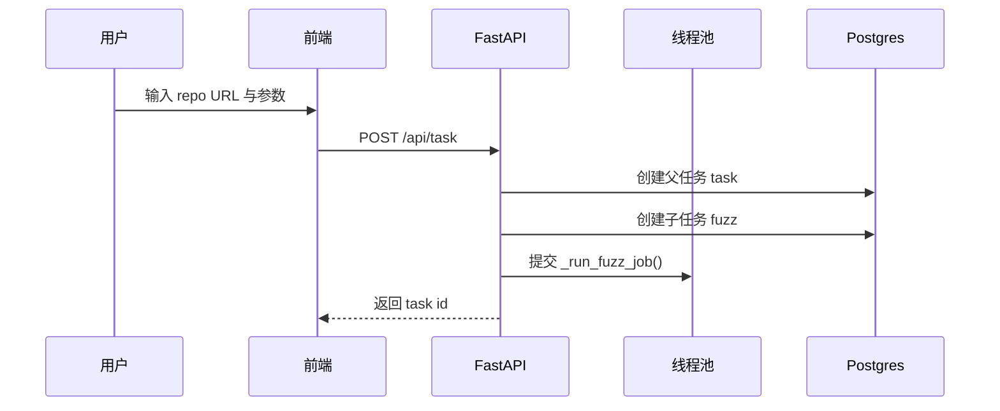

### 4.5 为什么要有父任务和子任务

Sherpa 的 API 设计允许一个任务包含多个子 job。虽然当前前端一次通常只提交一个 repo，但模型已经是“批量任务”模式：

- 父任务 `kind=task`
- 子任务 `kind=fuzz`

这样做的好处：

- 未来可以扩展成批量 fuzz 多个仓库
- 前端可以统一展示聚合进度
- stop/resume 可以对整组子任务做广播

---

## 5. 配置系统

核心文件：

- `harness_generator/src/langchain_agent/persistent_config.py`

### 5.1 配置的本质

这是一个**Web 持久化配置**层，而不是单纯环境变量封装。它把两类信息放在一起：

1. **模型/Provider 配置**
- OpenRouter
- OpenAI-compatible
- OpenCode provider 列表（当前默认是 MiniMax）

2. **workflow 默认参数**
- `fuzz_time_budget`
- `sherpa_run_unlimited_round_budget_sec`
- `max_fix_rounds`
- `same_error_max_retries`
- Git mirror / Docker proxy 等

### 5.2 当前 OpenCode provider 现状

从代码看，默认 provider 是 MiniMax，且按 Anthropic-compatible SDK 接线：

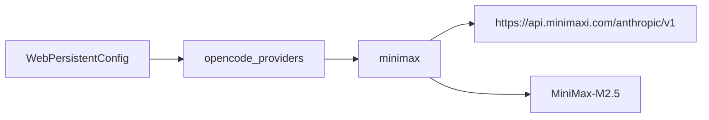

同时保留了：

- `openrouter_*`
- `openai_*`

因此系统并不是单一绑死在某个模型，而是：

- OpenCode 走 provider config
- LangChain 的 `ChatOpenAI` 兼容层走 OpenAI/OpenRouter 风格

### 5.3 配置生效方式

配置有三层来源：

1. 代码默认值
2. `config/web_config.json`
3. 环境变量覆盖

再由 `apply_config_to_env()` 写回运行环境，使得后续：

- workflow graph
- OpenCode helper
- provider model 拉取

都能读到同一份有效配置。

---

## 6. 前端控制台

核心目录：

- `frontend-next/`

这套前端不是营销页，而是**高频轮询型任务控制台**。

### 6.1 前端页面组织

主页面在：

- `frontend-next/app/page.tsx`

它装配了几个核心组件：

- `SystemOverviewCard`
- `ConfigPanel`
- `TaskProgressPanel`
- `LogPanel`
- `SessionPanel`

### 6.2 前端轮询模型

前端使用 React Query 定时拉取：

- system：2 秒
- tasks：3 秒
- task detail：2 秒

这意味着前端不是 websocket 推送，而是**主动轮询**。

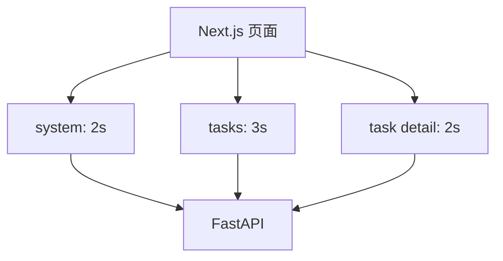

### 6.3 ConfigPanel 当前可配置项

前端目前能配置：

- 仓库 URL
- 总预算 `total_time_budget`
- 单轮预算 `run_time_budget`
- `max_tokens`
- `coverage_loop_max_rounds`
- `max_fix_rounds`
- `same_error_max_retries`
- `sherpa_run_unlimited_round_budget_sec`

这点很重要，因为这些字段已经不只是后端隐藏参数，而是正式前端能力。

### 6.4 前端提交任务的真实 payload

前端提交的是 `/api/task`，其中子任务字段包括：

- `code_url`
- `model`
- `max_tokens`
- `time_budget`
- `total_time_budget`
- `run_time_budget`
- `coverage_loop_max_rounds`
- `max_fix_rounds`
- `same_error_max_retries`

同时仍保留兼容字段：

- `docker: true`
- `docker_image: auto`

但在当前 k8s native 模式下，这两个字段实际不控制容器执行路径。

### 6.5 前端为什么看起来是“任务控制台”而不是普通表单页

因为它展示的不只是任务列表，还直接消费了 workflow 内部状态：

- `fix_build_attempts`
- `max_fix_rounds`
- `error_signature`
- `fix_build_terminal_reason`
- 子任务状态分布
- 活跃子任务日志

这意味着前端实际上是 workflow 的可视化壳。

---

## 7. 持久化：Postgres + 共享输出目录

Sherpa 的持久化不是单点，而是双系统：

1. **Postgres 保存任务状态**
2. **共享 output 保存工作目录与产物**

### 7.1 Postgres 中保存什么

核心文件：

- `harness_generator/src/langchain_agent/job_store.py`

真正运行时使用的是 `PostgresJobStore`。表结构很简单：

```sql
CREATE TABLE jobs (
    job_id TEXT PRIMARY KEY,
    kind TEXT,
    status TEXT,
    repo TEXT,
    created_at DOUBLE PRECISION,
    updated_at DOUBLE PRECISION,
    payload_json JSONB NOT NULL
)
```

所以任务状态不是拆成很多表，而是把完整 job snapshot 直接写进 `payload_json`。

### 7.2 output 目录保存什么

每个仓库对应一个 output 目录，里面既有源码，也有状态衍生文件：

```text
repo-root/
├── fuzz/
│   ├── PLAN.md
│   ├── targets.json
│   ├── build.py
│   ├── *.cc
│   ├── out/
│   │   ├── <fuzzer binaries>
│   │   └── artifacts/
│   └── corpus/
├── run_summary.json
├── run_summary.md
├── repro_context.json
├── crash_info.md
├── crash_analysis.md
├── re_build_report.json
├── re_run_report.json
└── ...
```

### 7.3 为什么需要 `repro_context.json`

这是近期代码中非常关键的稳定性补丁。

它的职责是把复现相关上下文落盘到 output 根目录：

- `repo_url`
- `last_fuzzer`
- `last_crash_artifact`
- `crash_signature`
- `re_workspace_root`
- `updated_at`

这样即使：

- stage 间内存态没透传完整
- `re-run` 是独立 job 恢复启动
- `run_summary.json` 没来得及写全

`re-build` / `re-run` 仍然可以从 `repro_context.json` 恢复上下文。

### 7.4 持久化关系图

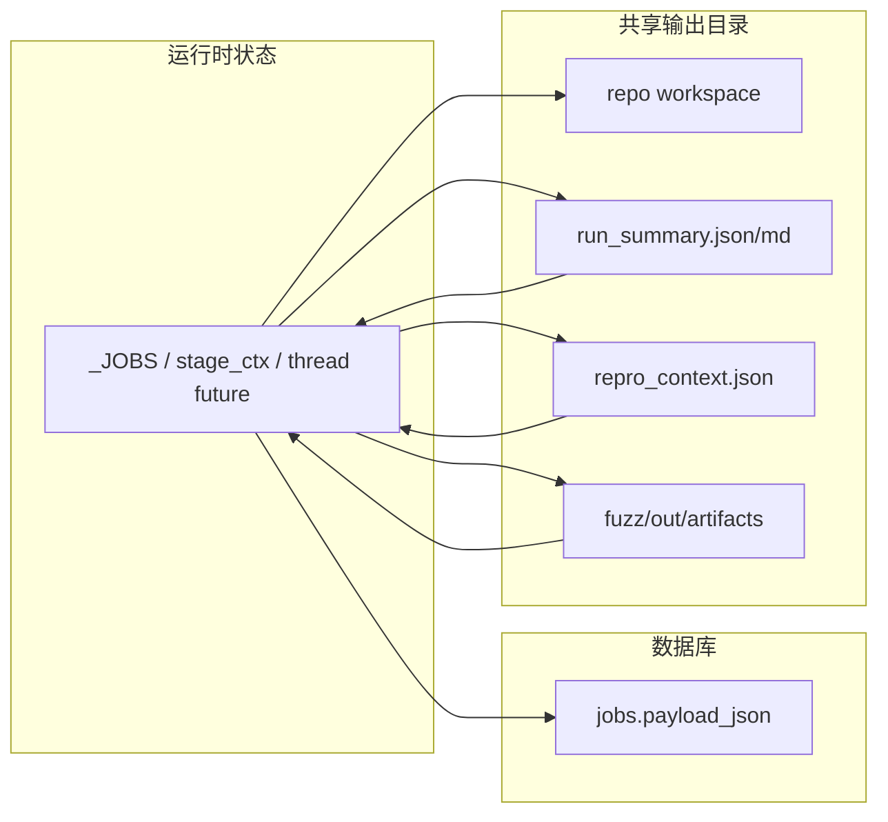

---

## 8. Kubernetes 执行模型

Sherpa 当前只支持一种执行模式：

- `k8s_job`

这一点在 `main.py` 里是硬编码策略，不是运行期多模式切换。

### 8.1 一个 stage 就是一个 Kubernetes Job

`main.py` 会构造 manifest，并启动：

- `python /app/harness_generator/src/langchain_agent/k8s_job_worker.py`

worker 从环境变量 `SHERPA_K8S_WORKER_PAYLOAD_B64` 中解出 payload，然后执行单个 stage。

### 8.2 为什么这比“一个 pod 从头跑到底”更适合 Sherpa

因为 Sherpa 不是稳定脚本，而是高分叉工作流：

- build 可能失败，需要 `fix_build`
- run 可能 crash，需要 `re-build`
- re 失败可能回到 `plan`
- 覆盖率低可能进入 `improve-harness`

如果全部在一个长 pod 中跑：

- 恢复点难做
- 失败归因难做
- 中途资源泄漏和超时处理更难

### 8.3 k8s worker 的共享卷布局

当前 worker 依赖这些共享路径：

- `/shared/tmp`
- `/shared/output`
- `/shared/oss-fuzz`
- `/app/config`
- `/app/job-logs`

虽然目录名里有 `oss-fuzz`，但当前非 OSS-Fuzz workflow 主要依赖的是 `output/tmp/logs/config`。

### 8.4 阶段派发流程

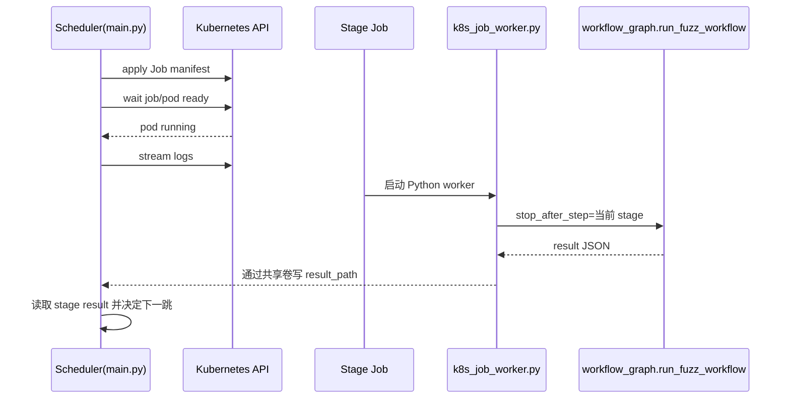

### 8.5 节点 pinning 机制

Sherpa 会尽量把连续 stage 放到同一个 node 上，但不是强制死绑。

逻辑大致是：

- 成功 stage 返回 node name
- 下一 stage 尝试继续 pin 到这个 node
- 调度前通过 `_k8s_node_can_run_job()` 做健康检查
- 如果 metrics API 不可用，返回：
  - `node_ready_no_metrics_warn:metrics_api_not_available`
- 这种 warning **不会阻止节点继续使用**，只是说明没有资源指标

所以你日志里频繁看到的 `node_ready_no_metrics_warn:metrics_api_not_available`，按当前代码语义，不是失败，只是节点可用但 metrics 缺失。

---

## 9. 工作流核心：LangGraph 状态机

核心文件：

- `harness_generator/src/langchain_agent/workflow_graph.py`

这是整个项目最关键的实现。

### 9.1 工作流节点图

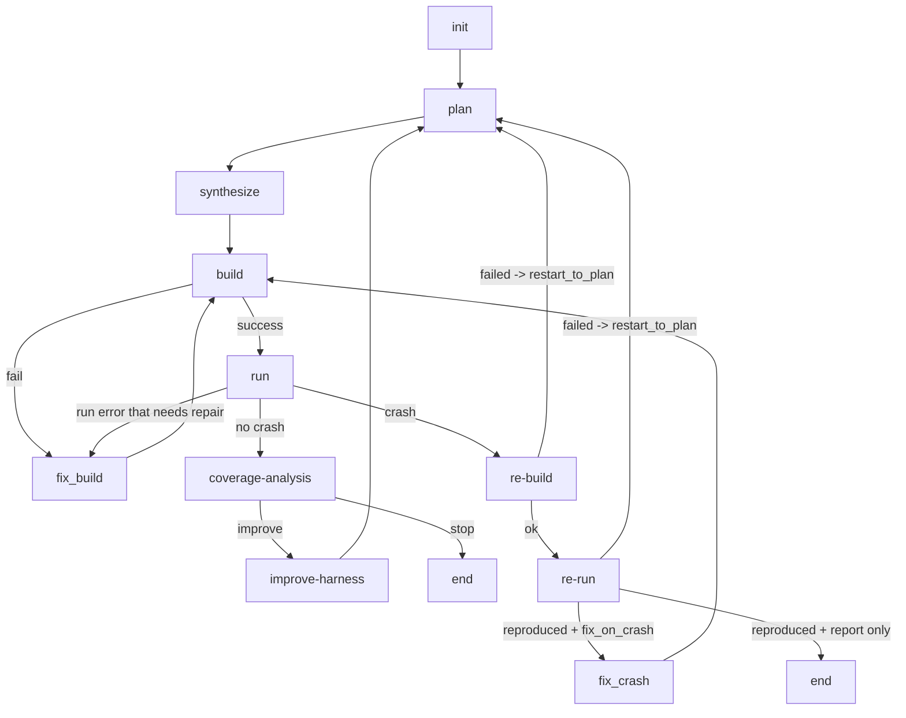

### 9.2 为什么要用图而不是硬编码 if/else

因为 Sherpa 的流程已经不是线性 pipeline，而是**多回环、多终态、多恢复点**：

- `build <-> fix_build`
- `run -> coverage-analysis -> improve-harness -> plan`
- `run -> re-build -> re-run -> plan`
- `re-run -> fix_crash -> build`

LangGraph 在这里的价值不是“AI 框架时髦”，而是：

- 节点职责明确
- 路由函数可单测
- stage-stop 能自然支持 k8s 分阶段派发

---

## 10. init：创建或恢复工作目录

`init` 负责：

- clone repo 或复用已有 repo_root
- 创建 `NonOssFuzzHarnessGenerator`
- 初始化 runtime state
- 从已有 `run_summary.json` / `repro_context.json` 恢复必要字段

### 10.1 init 的几种模式

#### 模式 A：新任务
- clone 仓库到 output
- 初始化 fuzz workflow 状态

#### 模式 B：resume 任务
- 使用已有 `resume_repo_root`
- 从磁盘恢复 summary 和 repro context

#### 模式 C：re-build / re-run 恢复
- 使用已有 repo_root
- 从 `repro_context.json` 恢复 `last_fuzzer`、`last_crash_artifact`、`re_workspace_root`

这就是为什么 init 是每个独立 stage job 的共同起点。

---

## 11. plan：规划 fuzz 目标

`plan` 的输出至少包括：

- `fuzz/PLAN.md`
- `fuzz/targets.json`

### 11.1 plan 的本质

不是让模型空想，而是让模型在当前仓库上完成：

- API 目标选择
- 语言标注
- 后续 synthesis 的分步提示

### 11.2 plan 的输入来源

- repo 源码
- 之前失败回流的信息（如果存在）
- `codex_hint`
- ANTLR assist context（如果发现 grammar/parser 结构）

### 11.3 ANTLR assist 当前真实含义

这一点必须说清楚。

当前代码里，ANTLR 不是运行时执行链，而是 **plan/synthesize 的 grammar-aware 静态提示增强器**。

它会：

- 扫描 grammar / parser / lexer / visitor / listener
- 生成 `fuzz/antlr_plan_context.json`
- 产出 `antlr_context_summary`
- 把摘要注入 `plan` 和 `synthesize` 提示词

### 11.4 plan 节点图

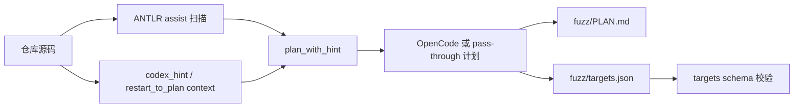

---

## 12. synthesize：生成 fuzz 代码骨架

`synthesize` 的职责是把 `plan` 落到实际 `fuzz/` 目录。

### 12.1 synthesize 产物

通常包括：

- 一个或多个 harness 源文件
- `fuzz/build.py`
- 必要时的 `fuzz/system_packages.txt`
- 说明性文件

### 12.2 synthesize 的重要约束

从 prompt 模板看，它强调：

- **先创建最小骨架**，再逐步完善
- 不允许执行 build/test
- 如果依赖系统包，写到 `fuzz/system_packages.txt`
- 不要强制 `-stdlib=libc++`
- 上游若已有 `main`，需要处理 libFuzzer main 冲突

这说明 Sherpa 在 synthesize 阶段已经显式地把很多“未来 build 会踩的坑”提前告诉模型了。

---

## 13. build：实际构建 harness

`build` 阶段会执行 `fuzz/build.py` 或 `fuzz/build.sh`。

### 13.1 build 的职责

- 让 `fuzz/out/` 中出现至少一个可执行 fuzzer binary
- 记录构建错误种类和错误签名
- 决定是否进入 `fix_build`

### 13.2 build 当前不是“一次性构建”

它包含一些内建容错：

- 重试一次
- 可能带 `--clean` 再试
- 某些 cwd 假设错误时切换 repo root / fuzz root

### 13.3 错误签名机制

Sherpa 不只看 stderr 文本，而是提炼 `build_error_signature`。这使得系统可以判断：

- 这轮修复后是不是同一类错误
- 是否已经连续重复相同错误
- 是否该 fail-fast

### 13.4 build 与 fix_build 的收敛图

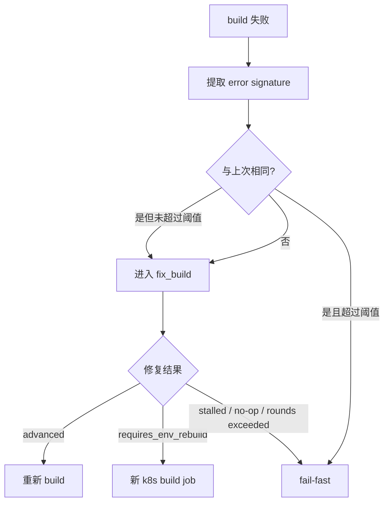

---

## 14. fix_build：Sherpa 最复杂的节点

`fix_build` 是整个系统工程含量最高的部分之一。

### 14.1 fix_build 要解决什么问题

单纯“AI 改代码然后重编译”会遇到几个经典问题：

- 改了，但没改对地方
- 改了，但其实没推进错误根因
- 改了 `system_packages.txt`，当前容器不可能立刻验证
- 改动落在仓库源码而不是 `fuzz/`，污染上游代码
- 同一个错误无限重试

Sherpa 当前代码已经围绕这些问题做了收敛控制。

### 14.2 fix_build 的限制策略

当前只允许修改：

- `fuzz/` 目录
- `./done`

任何仓库源码目录外溢修改都会被拒绝。

这意味着系统明确把 build 修复范围限定为：

- harness
- build glue
- fuzz 层依赖声明

而不是让 AI 随便篡改上游项目。

### 14.3 fix_build 的修复顺序

先规则，后 AI。

#### 规则修复优先处理的典型问题

- libFuzzer main / upstream `main` 冲突
- `-lz` 等链接错误
- include flag 崩坏
- compiler mismatch
- 缺少 `LLVMFuzzerTestOneInput`
- C/C++ 构建脚本错配
- 系统依赖缺失
- `fuzz/out` 路径错误

#### 如果规则没收敛，再进入 OpenCode

它会把：

- 完整构建日志
- 当前错误签名
- 历史修复记录
- 约束条件

都交给 `fix_build_execute` 模板。

### 14.4 为什么最近要加 `requires_env_rebuild`

这是当前代码的一个关键改进。

问题是：

- `OpenCode` 可能会正确地往 `fuzz/system_packages.txt` 写系统依赖
- 但当前这个 build job 容器已经启动，环境不会因为改了文本文件就自动装包

如果继续在同一容器里 quick-check，只会得到假失败。

所以当前策略是：

- 如果检测到修改了 `fuzz/system_packages.txt`
- 标记 `fix_effect = requires_env_rebuild`
- 标记 `fix_build_terminal_reason = requires_env_rebuild`
- 当前 job 不再把旧环境 quick-check 结果当最终失败
- 调度层直接插入一个新的 `build` job，在新环境中验证

这使得“环境依赖修复”和“源码修复”被区分开了。

### 14.5 quick-check 的真实含义

quick-check 不是完整验证，而是**当前容器内快速判断修复是否前进**。

它对以下情况有用：

- `build.py` 参数调整
- harness include / symbol 修正
- 链接参数修正

但对以下情况无效：

- 新增系统包
- 需要新镜像或新容器才能生效的环境变化

这就是为什么现在有 `requires_env_rebuild` 分支。

---

## 15. run：执行 fuzz，并在首个 crash 后收口

`run` 是另一个复杂节点。

### 15.1 run 做的事

- 发现所有 fuzzer binaries
- 为每个 fuzzer 准备 corpus / artifacts 目录
- 根据预算生成批次计划
- 调用 `_run_fuzzer()` 执行 libFuzzer
- 汇总每个 fuzzer 的 coverage / corpus / rss / rc
- 判断 crash / timeout / no-progress / idle timeout

### 15.2 `_run_fuzzer()` 的真实位置

底层真正跑 fuzzer 的逻辑在：

- `harness_generator/src/fuzz_unharnessed_repo.py`

它会负责：

- 组装命令
- 设置 `-artifact_prefix`
- 处理 max_total_time
- 识别 crash / timeout-like / oom-like artifact
- 返回结构化 `FuzzerRunResult`

### 15.3 为什么 run 最近又被修了一次

之前的行为是：

- 多个 fuzzer 可能在同一 `run` stage 中继续执行
- 即使某个 fuzzer 已经找到明确 crash，其他 fuzzer 还可能继续跑
- 导致 stage 长时间不收口
- `stage-04-run.json` 等结果也会延迟落盘

当前代码已经改成：

- 默认 `SHERPA_RUN_STOP_ON_FIRST_CRASH=1`
- 多 fuzzer 场景默认降为顺序执行
- 首个有效 crash 命中后，不再继续派发后续 fuzzer

这是一个很关键的系统级行为修正。

### 15.4 run 首 crash 收口流程

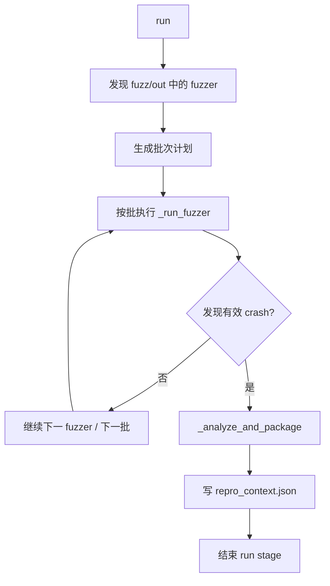

### 15.5 run 的结果结构

run 不只产出一个布尔值，而是产出：

- `run_details`
- `last_fuzzer`
- `last_crash_artifact`
- `crash_signature`
- `run_error_kind`
- `run_terminal_reason`
- `crash_evidence`

这些结果会进入：

- `run_summary.json`
- 后续 `re-build` / `re-run`
- 前端任务进度展示

---

## 16. coverage-analysis 与 improve-harness：覆盖率反馈回路

这是当前项目和普通“一次生成 harness”工具最大的结构差异之一。

### 16.1 当前覆盖率反馈的真正实现方式

Sherpa 不是直接把 libFuzzer coverage 做成复杂数据库分析，而是先做了一个**轻量回路**：

1. `run` 汇总 `run_details`
2. `coverage-analysis` 读取 coverage 结果
3. 判断是否还值得继续改善 harness
4. 如果值得，进入 `improve-harness`
5. `improve-harness` 不直接改代码，而是生成新的 `codex_hint`
6. 再回到 `plan`

所以这是一个：

- **coverage-informed planning loop**
- 而不是“直接自动改 harness 源码”的闭环

### 16.2 为什么 `improve-harness` 不直接改文件

这样设计有两个好处：

1. 保持 `plan/synthesize/build` 分工
2. 覆盖率改进也走和初始生成相同的规范路径

即：

- plan 决定目标策略
- synthesize 落地 fuzz 代码
- build 验证可构建

而不是在 `improve-harness` 中偷偷做源码直改。

### 16.3 覆盖率回路图

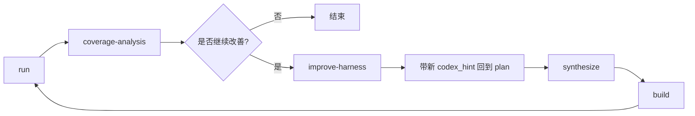

### 16.4 覆盖率回路的停机条件

只有在以下条件同时满足时才会进入改进：

- 当前没有 crash
- 没有 run 错误
- 当前 round 小于 `coverage_loop_max_rounds`
- `coverage-analysis` 判断值得继续

因此覆盖率回路不是无条件循环，而是受上限控制。

---

## 17. re-build / re-run：独立复现链路

Sherpa 的复现设计不是“直接拿当前工作目录二次运行”。

它显式分成两步：

- `re-build`
- `re-run`

### 17.1 re-build 的职责

- fresh clone 到 `.repro_crash/workdir`
- 复用 run 阶段 `fuzz/` 相关输出
- 在干净工作区重新 build
- 生成 `re_build_report.md/json`
- 更新 `repro_context.json` 中的 `re_workspace_root`

### 17.2 re-run 的职责

- 读取 `last_fuzzer`
- 读取 `last_crash_artifact`
- 使用 `re_workspace_root` 中的新构建二进制
- 对单一 crash artifact 做复现
- 生成 `re_run_report.md/json`

### 17.3 为什么要分两步

因为这两步的工程目标不同：

- `re-build` 关注“干净环境能不能重新构建”
- `re-run` 关注“同一输入能不能复现相同行为”

这样错误归因更清晰：

- 如果 `re-build` 失败，是构建链路问题
- 如果 `re-run` 失败，是复现链路或状态恢复问题

### 17.4 re 阶段失败后的回流

当前代码里，`re-build` 或 `re-run` 失败后不会直接静默终止，而是会写入：

- `restart_to_plan`
- `restart_to_plan_reason`
- `restart_to_plan_stage`
- `restart_to_plan_error_text`
- `restart_to_plan_report_path`
- `restart_to_plan_count`

然后回到 `plan`。

这意味着系统在 re 阶段失败时，会把失败上下文反灌回规划阶段，而不是简单报错终止。

### 17.5 re 上下文恢复链

当前恢复优先级大致是：

1. `repro_context.json`
2. `re_build_report.json`
3. `run_summary.json`
4. `fuzz/out/artifacts` 目录扫描

这是当前代码为解决 `last_crash_artifact` 丢失问题建立的多级恢复链。

---

## 18. fix_crash：针对 crash 的修复模式

`fix_crash` 的触发依赖于两层判断：

1. `re-run` 是否成功复现
2. `plan` 里是否允许 `fix_on_crash`

### 18.1 fix_crash 的两种模式

根据分析结果，系统区分：

- `HARNESS ERROR`
- 上游真实 bug

对应两类 prompt：

- `fix_crash_harness_error`
- `fix_crash_upstream_bug`

### 18.2 这意味着什么

Sherpa 当前不把所有 crash 都当上游漏洞，而是允许：

- 先识别 harness 自身 bug
- 如果是 harness 错误，则只修 fuzz 层
- 如果是上游 bug，则允许修改仓库源码

这是一个很重要的工程边界控制。

---

## 19. Prompt 体系：OpenCode 不是裸调用

核心文件：

- `harness_generator/src/langchain_agent/prompts/opencode_prompts.md`

Sherpa 当前不是在代码里临时拼 prompt，而是把 prompt 模板集中管理。

### 19.1 当前模板列表

主要包括：

- `plan_with_hint`
- `synthesize_with_hint`
- `fix_build_execute`
- `fix_crash_harness_error`
- `fix_crash_upstream_bug`
- `plan_fix_targets_schema`

### 19.2 prompt 设计现状

这些模板已经不是泛泛地说“帮我修复一下”，而是很工程化：

- 限定只允许改 `fuzz/`
- 明确 sentinel `./done`
- 强制先读 build log
- 明确不允许执行命令
- 明确 `system_packages.txt` 只代表新环境验证需求
- 明确若改 `system_packages.txt`，仍需继续完成其他 `fuzz/` 修改

### 19.3 为什么 `./done` 很重要

OpenCode 步骤不是通过“猜它什么时候结束”判断成功，而是通过 sentinel 文件：

- 模型必须写 `./done`
- 写入关键产物路径
- 缺失则步骤失败

这是一种非常务实的 agent 协调协议。

---

## 20. `fuzz_unharnessed_repo.py`：底层 repo 操作引擎

这个文件是后端工作流真正接触仓库、文件系统、编译和 fuzz 执行的底层实现。

### 20.1 它负责什么

- clone 仓库
- 选择镜像源
- 管理 `fuzz/` 目录
- 调用 build/run 命令
- 处理 artifacts/corpus
- 包装 crash 产物
- 生成报告

### 20.2 为什么它重要

`workflow_graph.py` 负责“决策和路由”，而 `fuzz_unharnessed_repo.py` 负责“真正干活”。

可以把两者理解为：

- `workflow_graph.py`：状态机控制层
- `fuzz_unharnessed_repo.py`：repo 执行器

### 20.3 Git clone 现实策略

代码中已经支持多个 git mirror：

- `SHERPA_GITHUB_MIRROR`
- `SHERPA_GIT_MIRRORS`

并在 host git clone 失败时尝试镜像 URL。这是为了提升在受限网络环境下的 clone 成功率。

---

## 21. 总结文件：`run_summary.json` 与 `run_summary.md`

核心文件：

- `harness_generator/src/langchain_agent/workflow_summary.py`

### 21.1 这不是简单日志摘要

它会主动汇总：

- build/run 结果
- error kind/code
- crash 相关字段
- `run_details`
- `last_fuzzer`
- `last_crash_artifact`
- plan 策略
- build/fix 策略
- re 阶段结果
- coverage loop 结果
- restart_to_plan 信息
- fuzz inventory
- artifact hashes

### 21.2 为什么它重要

因为它承担了两个角色：

1. 人类可读的任务总结
2. 后续 resume / repro 的辅助恢复来源

这也是为什么当前代码里会从 `run_summary.json` 回填 `last_crash_artifact`。

---

## 22. 部署架构

Sherpa 当前部署是一个典型的“三层应用 + 短命 stage jobs”结构。

### 22.1 基础工作负载

长期运行的核心资源：

- `deployment/sherpa-web`
- `deployment/sherpa-frontend`
- `statefulset/postgres`

短命资源：

- `job/sherpa-fuzz-...-plan-*`
- `job/sherpa-fuzz-...-build-*`
- `job/sherpa-fuzz-...-run-*`
- 等等

### 22.2 部署拓扑图

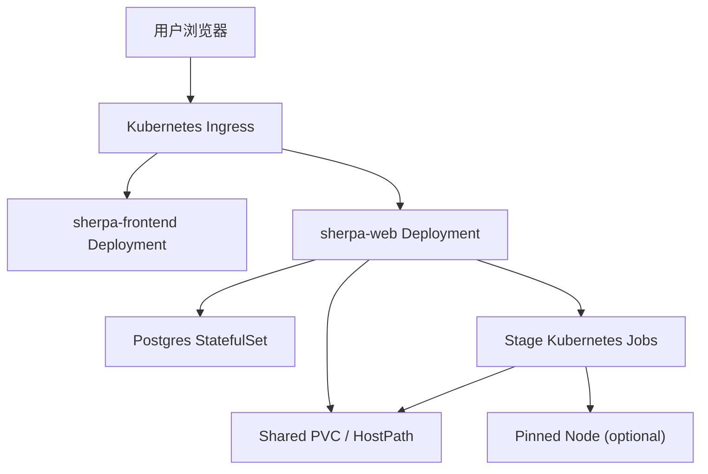

### 22.3 dev 与 prod 的重要差异

#### dev
- 命名空间：`sherpa-dev`
- 每次部署前**强制重置数据**
- 清理：namespace / retained PV / `/shared/dev/*` / `/home/deploy/output/dev`

#### prod
- 命名空间：`sherpa-prod`
- 明确禁止 reset
- 只做 apply + 条件镜像构建 + rollout

这两个策略已经体现在工作流代码里，不是口头约定。

### 22.4 为什么前端镜像有时看起来“没更新”

当前 GitHub Actions 采用的是**按需重建镜像**策略：

- 根据文件变更决定是否重建 web / frontend
- 如果判定没有变更，就不会重建对应镜像

所以前端部署是否更新，取决于：

- 变更检测规则
- 本地镜像是否已存在
- workflow 是否执行了对应 build/import

---

## 23. GitHub Actions 规则

当前仓库的 CI/CD 不是一套通用模板，而是已经体现了明确的分支治理。

### 23.1 分支规则

- `main` 只能从 `dev` 合入
- `dev` 的 PR 会自动开启 squash auto-merge

### 23.2 部署规则

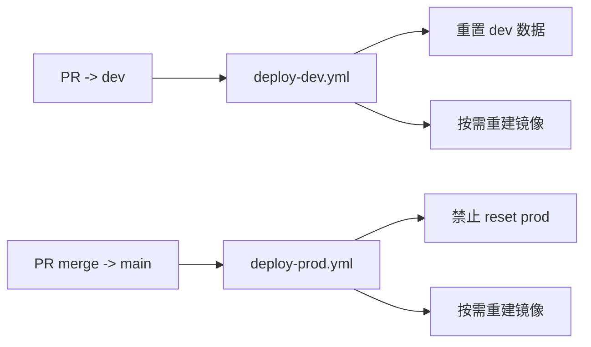

### 23.3 这套流程为什么重要

因为 Sherpa 的运行依赖共享 output 和数据库状态。没有明确的 dev/prod 数据策略，测试环境非常容易污染生产语义。

当前代码已经明确区分：

- dev：可破坏、每次重置
- prod：不可重置、增量发布

---

## 24. 当前系统的真实“主线时序”

下面这张图是从当前代码抽出的最接近真实运行的端到端时序。

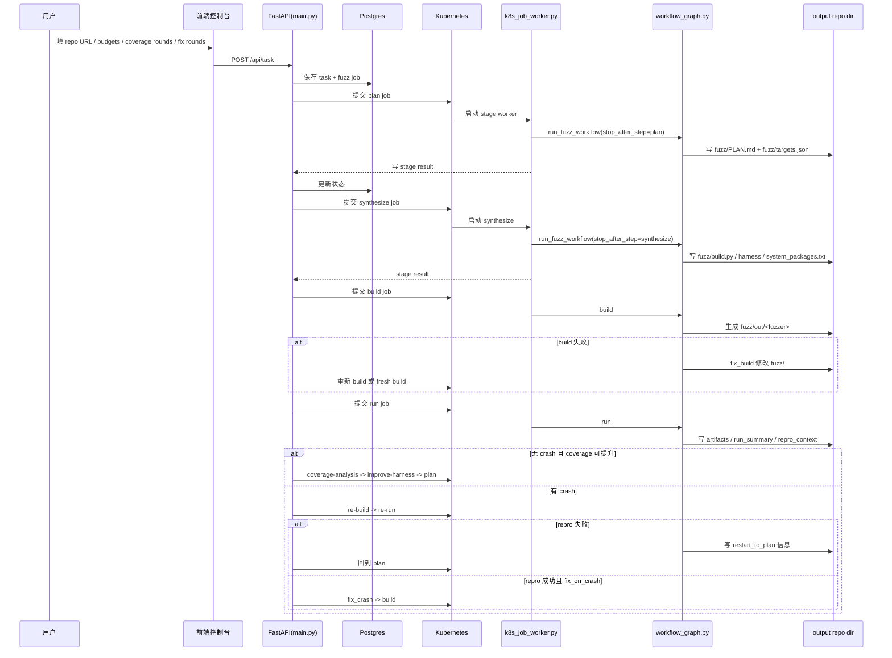

---

## 25. 当前代码体现出的几个工程取舍

### 25.1 取舍一：优先隔离性，而不是单任务吞吐最大化
Sherpa 选择“阶段化 k8s job”，这会引入额外调度延迟，但换来更强的：

- 隔离
- 恢复能力
- 路由灵活性
- 调试清晰度

### 25.2 取舍二：优先工作目录持久化，而不是纯 DB 驱动
它没有把所有状态压进数据库，而是把 repo output 当作第一现场。这样非常适合 fuzz 这种文件产物密集型任务。

### 25.3 取舍三：fix_build 先规则后 AI
这是非常现实的设计。构建失败里有大量重复性机械问题，完全让模型自由发挥，成本高且稳定性差。

### 25.4 取舍四：覆盖率回路先做轻量 prompt feedback，而不是复杂分析平台
当前实现没有上升到像 ClusterFuzz/FuzzBench 那样的重型 coverage 平台，而是先做“coverage 驱动的再规划”。

这是一种合理的渐进式工程路线。

---

## 26. 当前系统最关键的几个稳定性补丁（按代码现状）

以下内容已经在当前代码中，不是未来计划。

### 26.1 `repro_context.json`
解决跨 job / resume 时：

- `last_fuzzer`
- `last_crash_artifact`
- `re_workspace_root`

丢失的问题。

### 26.2 `fix_build` 收敛控制
通过：

- `max_fix_rounds`
- `same_error_max_retries`
- `build_error_signature`
- `fix_action_type`
- `fix_effect`

避免 build/fix 无限空转。

### 26.3 `requires_env_rebuild`
解决“修改 `system_packages.txt` 后旧容器内 quick-check 必然失败”的问题。

### 26.4 `run` 首 crash 收口
解决“已经发现 crash，但 `run` 还因为其他 fuzzer 继续执行而长时间不结束”的问题。

---

## 27. 当前系统的边界与非目标

从代码看，Sherpa 当前**没有**做以下事情：

### 27.1 不是完整 OSS-Fuzz 集成平台
虽然目录和变量里有 `oss-fuzz` 命名，但当前主流程是：

- 针对任意仓库
- native k8s job
- 非 OSS-Fuzz docker workflow

### 27.2 ANTLR 不是运行时语法执行引擎
当前只作为 prompt 上下文增强，不参与 build/run/re。

### 27.3 前端不是实时推送
当前是轮询，不是 websocket。

### 27.4 job 状态不是完全规范化关系模型
当前任务状态仍是 JSONB snapshot 风格。

---

## 28. 如何从代码角度理解 Sherpa 的“核心创新点”

如果只看表面，这像一个 AI 代码生成工具。但从代码结构看，Sherpa 的真正创新点在于：

### 28.1 它把 fuzz 过程拆成了可恢复的阶段图
不是“一次大模型生成 + 一次运行”，而是多阶段图。

### 28.2 它把 build failure 当作一等公民处理
`fix_build` 在当前代码里已经是完整子系统，而不是异常分支。

### 28.3 它把 crash 复现做成独立 clean-room 链路
`re-build` / `re-run` 的存在，使得 crash 不再只是“run 阶段日志里的一行”。

### 28.4 它已经开始把 coverage 纳入控制闭环
虽然还不是重型平台，但架构上已经为 adaptive fuzzing 打开了口子。

---

## 29. 给第一次接手这个项目的人：建议阅读顺序

如果你要真正读懂代码，建议按下面顺序走：

1. `frontend-next/app/page.tsx`
2. `frontend-next/components/ConfigPanel.tsx`
3. `frontend-next/lib/api/client.ts`
4. `harness_generator/src/langchain_agent/main.py`
5. `harness_generator/src/langchain_agent/job_store.py`
6. `harness_generator/src/langchain_agent/persistent_config.py`
7. `harness_generator/src/langchain_agent/workflow_graph.py`
8. `harness_generator/src/fuzz_unharnessed_repo.py`
9. `harness_generator/src/langchain_agent/workflow_summary.py`
10. `harness_generator/src/langchain_agent/prompts/opencode_prompts.md`
11. `k8s/base/*.yaml`
12. `k8s/overlays/dev` 与 `k8s/overlays/prod`
13. `.github/workflows/deploy-dev.yml` 与 `deploy-prod.yml`

### 29.1 推荐理解路径图

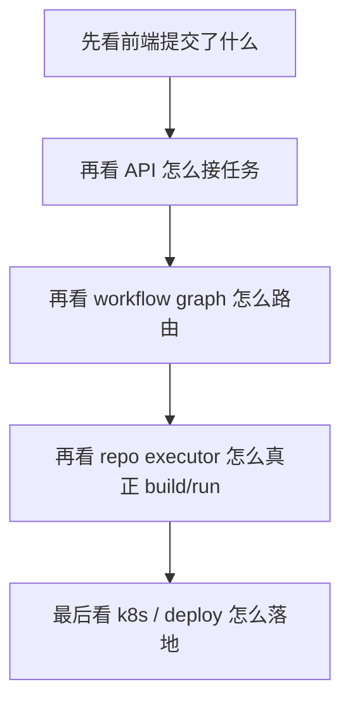

---

## 30. 最终总结

基于当前代码，Sherpa 可以被准确地定义为：

> 一个部署在 Kubernetes 上的、以 FastAPI 为调度入口、以 LangGraph 为工作流控制器、以 OpenCode 为代码生成/修复代理、以共享 output 目录为物理真相源的非 OSS-Fuzz 仓库 fuzz orchestration 平台。

它的当前核心能力已经包括：

- 任务提交与状态持久化
- 按 stage 的 k8s 执行
- plan/synthesize/build/fix_build/run 主流程
- coverage feedback 回路
- crash 分析、clean-room 重构建与复现
- re 失败回流到 plan
- 前端参数化控制 `coverage_loop_max_rounds` / `max_fix_rounds` / `same_error_max_retries`
- dev/prod 分离部署与按需镜像构建

如果只看代码现状，Sherpa 最像的不是“fuzz 脚本集合”，而是一个已经进入平台化阶段的**AI-assisted fuzz workflow operating system**。


---

## 附录 A：任务恢复与停止机制

这部分在主流程里容易被忽略，但对理解线上行为很关键。

### A.1 恢复机制不是“简单重跑”

`main.py` 在服务启动时会从 Postgres 恢复 jobs：

- 已完成任务：原样恢复为只读状态
- `queued / running / resuming` 的旧任务：恢复为 `recoverable`

恢复时会尽量推断：

- `resume_from_step`
- `resume_repo_root`
- `workflow_active_step`
- `workflow_last_step`

推断来源包括：

- job snapshot 自身字段
- stage 结果
- 日志解析

### A.2 resume 的真实语义

resume 不是从头开始，而是：

- 如果能确定 `resume_repo_root`
- 并能确定应恢复的 step
- 就直接从该 step 对应的 stage job 重新派发

例如：

- `resume_step = build`
- `resume_step = re-run`
- `resume_step = coverage-analysis`

### A.3 stop 的真实语义

stop 也不是单纯把 DB 状态改掉。

它会尝试做三件事：

1. 标记 job 为取消中
2. 取消线程池 future
3. 删除对应 k8s job

如果是父任务 stop，还会级联 stop 所有子任务。

### A.4 恢复/停止状态图

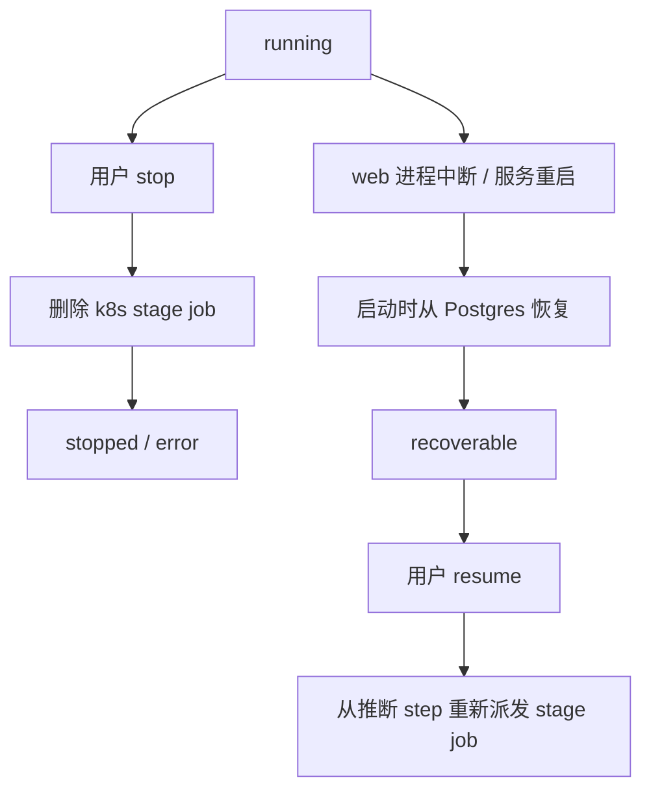

---

## 附录 B：日志、错误与可观测性

### B.1 为什么 Sherpa 的日志不是简单 stdout

Sherpa 的日志系统承担三层任务：

1. 给前端展示实时进度
2. 给恢复逻辑反推 stage checkpoint
3. 给故障分析提供结构化错误线索

### B.2 敏感信息脱敏

`main.py` 里有 `_redact_sensitive_text()`，会在日志和错误里脱掉：

- API key
- bearer token
- password
- secret 风格字段

这意味着前端日志面板虽然展示大量原始执行日志，但并不是完全裸透传。

### B.3 错误在系统里的几种层级

Sherpa 当前至少有四层错误概念：

1. **HTTP/API 错误**
- 参数校验失败
- provider 不存在
- resume 条件不满足

2. **调度错误**
- k8s job timeout
- k8s job failed
- node 不可用
- env rebuild 超限

3. **workflow 语义错误**
- build same-error repeated
- opencode no-op
- crash artifact missing
- workflow stopped (budget exceeded)

4. **fuzzer 运行错误**
- crash
- timeout-like artifact
- no-progress
- idle timeout
- OOM-like artifact

### B.4 为什么前端现在已经能看见 build 修复态

因为最近代码把以下字段作为一等输出暴露了：

- `fix_build_attempts`
- `max_fix_rounds`
- `build_error_signature_before`
- `build_error_signature_after`
- `fix_action_type`
- `fix_effect`
- `fix_build_terminal_reason`

这使得“AI 在修什么”和“是否已经收敛”第一次变得可观测。

---

## 附录 C：测试体系

Sherpa 当前的测试重心并不在 UI 视觉层，而在**工作流行为与边界条件**。

### C.1 当前最关键的测试方向

从 `tests/` 目录和近期代码可见，测试重点包括：

- `build/fix_build` 收敛
- 相同错误重复阈值
- env rebuild 分支
- `run` 首 crash 收口
- `re-run` 恢复 crash artifact
- prompt 模板装载
- k8s worker payload 路径

### C.2 为什么这些测试比“端到端 happy path”更重要

因为 Sherpa 的核心复杂度不在“能不能跑通一次”，而在：

- 卡住时能不能停
- 中断后能不能接
- 修复后是不是前进了
- 丢状态时能不能恢复

这决定了当前测试天然偏向状态机边界，而不是只做一次大集成测试。

---

## 附录 D：如果你要继续演进这个项目，优先级应该怎么看

基于当前代码现状，后续演进最自然的方向是：

1. **把 stage 结果落盘和 API 状态进一步统一**
- 现在已经有 `run_summary.json` 与 `repro_context.json`
- 下一步可以把更多“恢复关键字段”正式持久化，而不是散落在多个来源里

2. **强化 run 阶段的调度与中止策略**
- 当前已经支持首 crash 收口
- 下一步可以把 timeout/no-progress 的策略也做得更显式

3. **把 coverage loop 做得更“决策化”**
- 现在是 coverage-informed prompt feedback
- 未来可以加入更明确的 target ranking 和 corpus 策略

4. **把前端从轮询逐步升级为事件化**
- 当前 2s/3s 轮询足够实用
- 但 stage 数量增加后，事件流会更高效

5. **把部署与运维数据显式纳入 UI**
- 当前 UI 更偏 workflow 任务
- 未来可以补 `当前分支 / commit / overlay / k8s namespace / image source` 等运行环境信息

