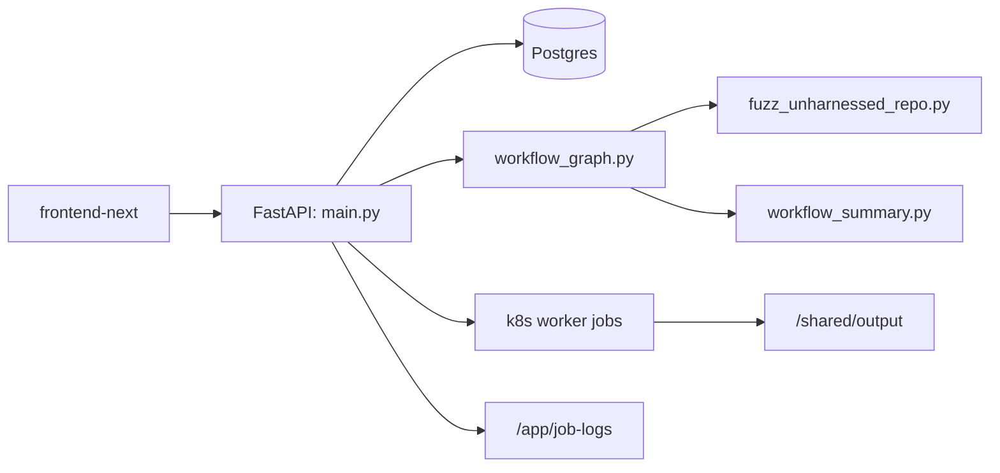
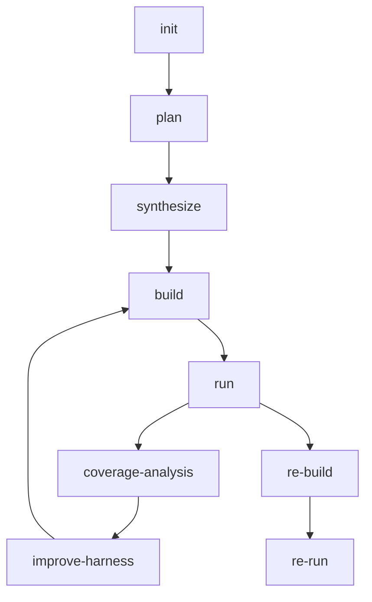

# Sherpa 代码级技术分析

本文档基于当前仓库代码重新整理，目标是解释 Sherpa 的真实实现，而不是复述历史版本的设计。

## 1. 系统目标

Sherpa 是一个针对 C/C++ 仓库的自动化 fuzz 编排系统。它的核心目标不是一次性生成 harness，而是把 fuzz 工程拆成可恢复、可解释、可观测的多阶段流水线：

- 从仓库 URL 自动规划 target
- 生成外部 harness 与 build scaffold
- 自动修 build 失败
- 自动做 seed bootstrap
- 自动运行 fuzz 并提取质量信号
- 在 plateau 后继续改进当前 target
- 对 crash 执行独立复现

## 2. 顶层结构

## 3. 模块职责

### `/harness_generator/src/langchain_agent/main.py`

这是系统的 API 与调度入口，负责：

- FastAPI 生命周期初始化
- 持久化配置加载与环境注入
- 任务创建、停止、恢复
- Postgres job store 读写
- 动态生成 Kubernetes worker Job manifest
- 聚合 stage 结果并对外暴露 `/api/*`

代码层面可以把它理解为“控制面”。

### `/harness_generator/src/langchain_agent/workflow_graph.py`

这是 Sherpa 的编排核心。它定义了：

- 工作流状态结构 `FuzzWorkflowState`
- 各阶段节点实现
- 节点间跳转条件
- build/run/coverage/repro 的错误分类
- summary 与关键产物落盘

系统行为的大部分“决策逻辑”都在这里。

### `/harness_generator/src/fuzz_unharnessed_repo.py`

这是“执行面”的底层实现，负责：

- clone 仓库
- 调用 OpenCode
- 执行 build scaffold
- bootstrap seeds
- 运行 fuzzer
- 解析运行输出
- 收集 crash、plateau、覆盖率等信号

它并不负责工作流阶段决策，而是为工作流节点提供执行原语。

### `/harness_generator/src/langchain_agent/persistent_config.py`

负责 Web 配置的持久化与运行时文件生成，当前重点是：

- `web_config.json`
- `opencode.generated.json`
- `web_opencode.env`

这部分已经围绕 non-root 做了收口，默认运行时生成文件落在 `/tmp/sherpa-runtime`。

### `/frontend-next/`

前端控制台只做以下事情：

- 展示系统状态
- 保存配置
- 提交任务
- 展示父任务/子任务/日志

它不参与后端工作流决策。

## 4. 工作流状态机

当前主链路如下：

### `init`

负责仓库 clone、工作目录准备、上下文恢复。此阶段的真实工作目录通常位于：

- `/shared/output/<repo>-<shortid>`

### `plan`

负责产出 target 规划上下文，而不是直接生成 harness。

当前关键产物：

- `fuzz/PLAN.md`
- `fuzz/targets.json`
- `fuzz/target_analysis.json`

其中 `targets.json` 当前最核心字段是：

- `name`
- `api`
- `lang`
- `target_type`
- `seed_profile`

### `synthesize`

负责把计划中的 target 收敛为单个可执行 scaffold。当前阶段会写：

- harness 源文件
- `fuzz/build.py` 或 `fuzz/build.sh`
- `fuzz/README.md`
- `fuzz/observed_target.json`
- `fuzz/build_strategy.json`

当前默认策略是不复用仓库自带 fuzz target，而是统一生成外部 build scaffold。

### `build`

负责执行 scaffold，并在正式 build 前做静态预检。重点检查：

- 是否偷偷调用了仓库自带 fuzz target
- 是否缺失明确的 fuzzer entry 策略
- build scaffold 与 `build_strategy.json` 是否一致

### `fix_build`

负责按错误类型修 build，不再围绕 target 名猜测做无效空转。当前显式分类包括：

- `build_strategy_mismatch`
- `missing_fuzzer_main`
- `missing_link_symbols`
- `include_path_mismatch`

### `run`

负责 seed bootstrap 和实际 fuzz 运行。运行阶段除了执行 fuzzer，还要收集：

- `cov`
- `ft`
- `exec/s`
- plateau
- crash
- timeout
- OOM

### `coverage-analysis`

把 `run` 阶段的信号转成下一步动作。当前策略不是“无脑 replan”，而是：

1. 先尝试当前 target 的 in-place improve
2. 连续无收益才考虑 replan
3. replan 必须带来 material change，否则直接 stop

### `re-build` / `re-run`

crash 复现是独立链路，不与主探索链路混在一起。其核心目的是让复现行为可追踪、可解释、可单独报告。

## 5. build scaffold 设计

当前系统默认假设所有仓库都需要“外部 harness + 外部 build scaffold”，而不是直接复用仓库自带 fuzz target。

这意味着：

- `build.py` 需要明确描述库/源码如何构建
- harness 如何参与编译
- `libFuzzer main` 如何提供
- 依赖的 include dirs、link libs、extra sources 是什么

对应产物：

- `fuzz/build_strategy.json`

当前其中的核心字段包括：

- `build_system`
- `build_mode`
- `library_targets`
- `library_artifacts`
- `include_dirs`
- `extra_sources`
- `fuzzer_entry_strategy`

## 6. seed bootstrap 与运行质量

当前 `run` 的 seed bootstrap 是三段式：

1. repo examples
2. AI 补种
3. `radamsa` 变异

`seed_profile` 会决定 repo examples 的过滤规则和 AI 补种风格，例如：

- `parser-structure`
- `parser-token`
- `parser-format`
- `parser-numeric`
- `decoder-binary`
- `archive-container`
- `serializer-structured`
- `document-text`
- `network-message`
- `generic`

## 7. 运行时与部署模型

### Kubernetes

当前线上模型是：

- `sherpa-web`：控制面服务
- `sherpa-frontend`：控制台 UI
- `postgres`：任务状态持久化
- 每个 workflow stage 对应一个短生命周期 worker Job

worker Job 由 `main.py` 动态生成 manifest。当前 manifest 会显式注入：

- payload
- provider/model
- git mirrors
- host proxy
- non-root `securityContext`

### non-root

当前系统默认按 non-root 运行设计。关键约束包括：

- 常驻服务与 worker 均使用普通用户运行
- 临时文件默认写入 `/tmp` 或 `/tmp/sherpa-runtime`
- 共享卷通过 initContainer/权限初始化保证可写

## 8. 状态产物与可观测性

每个任务的可观测信息主要分为三层：

### 任务工作目录

- `/shared/output/<repo>-<shortid>`

常见产物：

- `fuzz/PLAN.md`
- `fuzz/targets.json`
- `fuzz/target_analysis.json`
- `fuzz/observed_target.json`
- `fuzz/build_strategy.json`
- `run_summary.json`
- `run_summary.md`
- `repro_context.json`

### K8s stage 元数据

- `/shared/output/_k8s_jobs/<job_id>/stage-*.json`
- `/shared/output/_k8s_jobs/<job_id>/stage-*.error.txt`

### 聚合日志

- `/app/job-logs/jobs/<job_id>.log`

## 9. 当前工程亮点

从代码实现角度，Sherpa 当前最有代表性的工程点不是“用了 AI”，而是把 AI 放进了一个严格受约束的工作流中：

- 每个阶段有明确输入、输出和状态产物
- 关键失败都有结构化分类，而不是只看文本日志
- build scaffold 被收敛为显式策略，而不是临时猜测
- plateau 后优先局部改进，减少空 replan
- run/repro 阶段与 AI 改写逻辑隔离，避免验证污染

## 10. 当前设计取舍

### 为什么采用 stage-per-job

优点：

- 阶段隔离清晰
- 容易采集阶段级产物
- 便于失败分类和恢复

代价：

- stage 间状态传递复杂
- 对共享卷和元数据一致性要求高

### 为什么不复用仓库 fuzz target

因为“仓库存在 fuzz 基础设施”不等于“仓库存在当前 harness 对应的构建入口”。统一外部 scaffold 虽然更保守，但更一致、更可控。

### 为什么默认 non-root

这是为了把运行时路径设计、配置持久化、共享卷权限、临时文件策略提前工程化，而不是把权限问题留到线上。

## 11. 当前风险与边界

当前系统仍然有一些现实边界：

- 仓库 clone 仍然受外部网络和代理质量影响
- 外部 scaffold 对复杂构建系统的适配仍需持续强化
- 运行资源策略需要在“可调度”和“避免 OOM”之间取平衡
- summary/coverage 某些消费层字段仍有继续收紧空间

但从当前代码形态看，Sherpa 已经具备了比赛展示所需的完整主线：目标规划、生成、修复、运行、分析、复现、可观测性与部署闭环。
