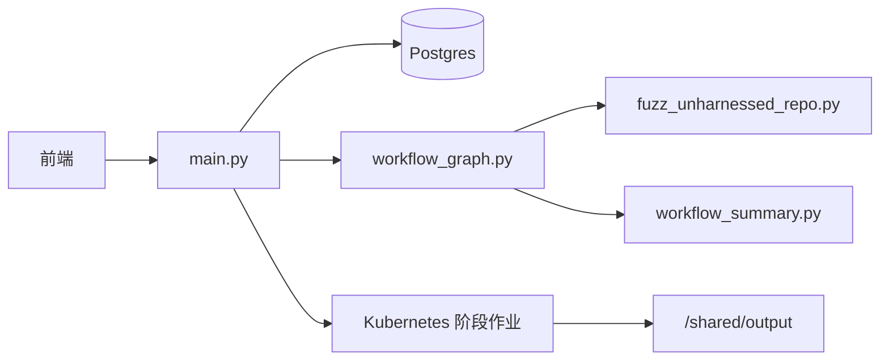
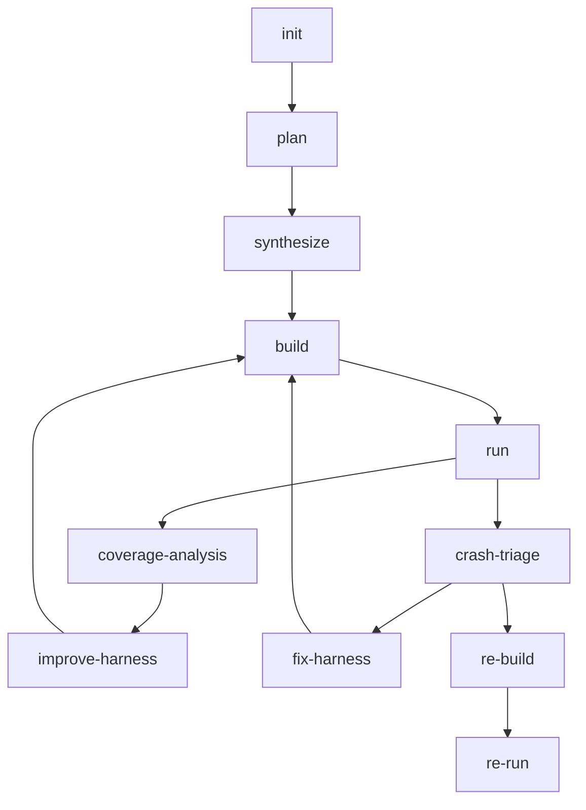

# Sherpa 代码库技术分析

本文档说明当前代码库结构，以及主运行路径是如何拼装起来的。

## 1. 系统目标

Sherpa 试图把“对一个仓库做 fuzz”的工程闭环自动化：

- 选择运行时可行的目标
- 生成外置脚手架
- 构建脚手架
- 生成并评估种子
- 运行 fuzzer 并采集质量信号
- 对崩溃进行分类
- 复现并验证崩溃路径

设计目标不是一次性生成 harness，而是构建一个具有明确产物与路由决策、可恢复的工作流。

## 2. 顶层结构

## 3. 主要代码入口

### `harness_generator/src/langchain_agent/main.py`

核心职责：

- 提供 FastAPI 路由
- 创建、恢复、停止任务
- 持久化并聚合作业信息
- 持久化运行时配置
- 分发阶段作业
- 聚合 `/api/system`、`/api/tasks`、`/api/task/*`

可将该文件视为控制面的事实来源。

### `harness_generator/src/langchain_agent/workflow_graph.py`

这是工作流状态机，定义了：

- 工作流状态结构
- 各阶段节点实现
- 阶段间路由决策
- 修复模式传递
- 覆盖率改进循环
- 崩溃分诊 / 复现链路

如果你想知道工作流为什么从一个阶段跳到另一个阶段，应先看这里。

### `harness_generator/src/fuzz_unharnessed_repo.py`

这是执行原语层，负责：

- clone 仓库
- 执行 OpenCode prompt
- 生成脚手架
- 执行构建
- 初始化种子
- 运行 fuzzer
- 打包崩溃产物
- 对种子质量打分与过滤

阅读它时，应把它当作“如何执行某一阶段”的实现层，而不是“下一阶段是什么”的决策层。

### `harness_generator/src/codex_helper.py`

该文件封装了 OpenCode 调用与阶段会话行为，重点包括：

- 感知阶段的任务准备逻辑
- prompt / 上下文拼装
- 会话复用规则
- done sentinel 处理

### `harness_generator/src/langchain_agent/opencode_skills/`

该目录包含 OpenCode 使用的阶段级行为契约。这些 skill 是工作流状态与阶段内编辑行为之间的指令边界。

## 4. 当前主线路工作流

### `plan`

产生规划产物，而不是可执行 harness：

- `fuzz/PLAN.md`
- `fuzz/targets.json`
- `fuzz/selected_targets.json`
- `fuzz/execution_plan.json`
- `fuzz/target_analysis.json`

关键目的：

- 选择运行时可行的目标
- 为目标分配 `target_type` 与 `seed_profile`
- 明确定义执行目标，而不是只保留随意的候选目标

### `synthesize`

在 `fuzz/` 下产出可执行脚手架：

- harness 源码
- `build.py` 或 `build.sh`
- `README.md`
- `repo_understanding.json`
- `build_strategy.json`
- `build_runtime_facts.json`
- `harness_index.json`

关键目的：

- 将规划意图转成可构建的 fuzz 脚手架
- 保证 `execution_plan.json` 与 `harness_index.json` 保持一致

### `build`

负责：

- 执行脚手架构建逻辑
- 校验执行目标覆盖情况
- 分类构建失败原因
- 产出结构化修复上下文

重要契约：

- 执行目标必须映射到真实 harness
- 仅仅 build 成功还不够，要求目标必须真的被构建出来
- 覆盖不足会被视为门禁失败，而不是静默成功

### `run`

负责：

- 初始化种子
- 并行或分批运行 fuzzer
- 抽取 `cov`、`ft`、`exec/s`、平台期、超时、OOM 与崩溃信号
- 打包崩溃产物
- 输出 `SeedFeedback` 与 `HarnessFeedback`

### `coverage-analysis`

负责判断当前目标应当：

- 继续原地改进
- 重新规划到更深 / 更优目标
- 因为没有合理下一步而停止

该阶段会消费：

- 覆盖率变化
- 平台期信号
- 种子质量
- 执行目标不匹配信息
- 目标深度元数据

### `improve-harness`

负责在不随意切换目标的前提下改进当前目标：

- 调整种子建模
- 调整语料 / 字典
- 改进 harness 调用路径
- 当原地策略不再合理时，移交给 replan

### `crash-triage`

负责将崩溃分类为：

- harness bug
- 上游 bug
- 结论不确定

它会使用崩溃日志、打包产物与复现链路信号。

### `fix-harness`

只负责修复 harness 侧问题，不用于修补上游产品代码。

### `re-build` / `re-run`

它们构成隔离的复现链路：

- 重建复现工作目录
- 重新执行崩溃输入
- 保留复现上下文与报告

这条链路的存在，是为了把“发现”与“验证”分开。

## 5. 产物模型

典型工作目录：

- `/shared/output/<repo>-<shortid>/`

重要文件：

- `fuzz/PLAN.md`
- `fuzz/targets.json`
- `fuzz/selected_targets.json`
- `fuzz/execution_plan.json`
- `fuzz/harness_index.json`
- `fuzz/repo_understanding.json`
- `fuzz/build_strategy.json`
- `fuzz/build_runtime_facts.json`
- `run_summary.json`
- `crash_info.md`
- `crash_analysis.md`
- `crash_triage.json`
- `repro_context.json`

每阶段作业产物：

- `/shared/output/_k8s_jobs/<job_id>/stage-*.json`
- `/shared/output/_k8s_jobs/<job_id>/stage-*.error.txt`

## 6. 种子与质量流水线

种子处理是画像驱动的，关键概念如下：

- `seed_profile` 决定期望的输入家族
- 能复用仓库样例时优先复用
- AI 生成负责补齐语义空白
- 变异是受控辅助手段，而不是唯一来源
- 过滤默认偏软，以避免过度裁剪
- 种子评分会写入 `seed_quality_<target>.json`

当前在工作流中传播的反馈结构包括：

- `SeedFeedback`
- `HarnessFeedback`
- `coverage_quality_oracle`

这些结构会被覆盖率改进与修复规划使用。

## 7. API 与前端映射

前端相关 API 由 `main.py` 实现：

- `POST /api/task`
- `GET /api/task/{job_id}`
- `POST /api/task/{job_id}/resume`
- `POST /api/task/{job_id}/stop`
- `GET /api/tasks`
- `GET /api/system`
- `PUT /api/config`

面向前端的重要聚合字段包括：

- `overview`
- `telemetry`
- `execution.summary`
- `tasks_tab_metrics`

精确字段语义见 [API_REFERENCE.md](API_REFERENCE.md)。

## 8. 部署模型

当前运行模型：

- 控制面服务以长期存活的 Deployment 形式运行
- 阶段执行发生在短生命周期 Kubernetes Job 中
- 输出与日志持久化在 Pod 生命周期之外
- 运行时默认假设非 root 执行

运维文档见：

- [k8s/DEPLOY.md](k8s/DEPLOY.md)
- [k8s/DEPLOYMENT_DETAILED.md](k8s/DEPLOYMENT_DETAILED.md)
- [k8s/RUNBOOK.md](k8s/RUNBOOK.md)

## 9. 后续推荐阅读

推荐顺序：

1. [../README.md](../README.md)
2. [TECHNICAL_DEEP_DIVE.md](TECHNICAL_DEEP_DIVE.md)
3. `harness_generator/src/langchain_agent/workflow_graph.py`
4. `harness_generator/src/fuzz_unharnessed_repo.py`
5. [API_REFERENCE.md](API_REFERENCE.md)
