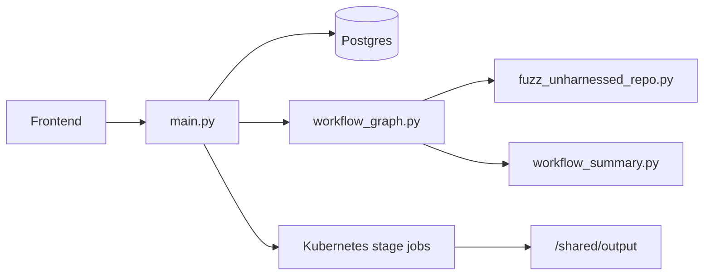
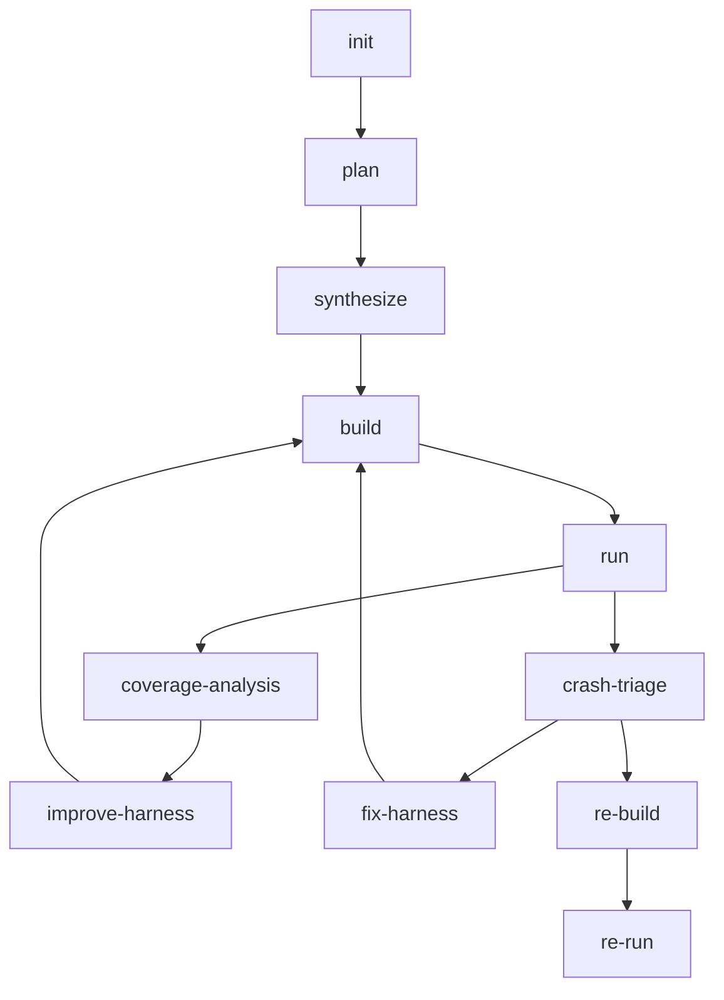

# Sherpa Codebase Technical Analysis

This document explains the current codebase structure and how the main runtime path is assembled.

## 1. System Objective

Sherpa automates the engineering loop around fuzzing a repository:

- select runtime-viable targets
- synthesize an external scaffold
- build the scaffold
- generate and evaluate seeds
- run fuzzers and collect quality signals
- classify crashes
- reproduce and validate crash paths

The design goal is not one-shot harness generation. It is a recoverable workflow with explicit artifacts and routing decisions.

## 2. Top-Level Structure

## 3. Main Code Entrypoints

### `harness_generator/src/langchain_agent/main.py`

Primary responsibilities:

- FastAPI routes
- task creation, resume, stop
- job persistence and aggregation
- runtime config persistence
- stage job dispatch
- `/api/system`, `/api/tasks`, `/api/task/*` aggregation

Treat this file as the control-plane source of truth.

### `harness_generator/src/langchain_agent/workflow_graph.py`

This is the workflow state machine. It defines:

- workflow state shape
- stage node implementations
- routing decisions between stages
- repair mode propagation
- coverage improvement loop
- crash triage / repro flow

If you want to know why the workflow moved from one stage to another, start here.

### `harness_generator/src/fuzz_unharnessed_repo.py`

This is the execution primitive layer. It handles:

- repository clone
- OpenCode prompt execution
- scaffold generation
- build execution
- seed bootstrap
- fuzzer execution
- crash packaging
- seed quality scoring and filtering

It should be read as the “how to perform a stage” layer, not the “what stage comes next” layer.

### `harness_generator/src/codex_helper.py`

This file wraps OpenCode invocation and stage-session behavior. Important areas:

- stage-aware task preparation
- prompt/context assembly
- session reuse rules
- done sentinel handling

### `harness_generator/src/langchain_agent/opencode_skills/`

This directory contains stage-specific behavior contracts used by OpenCode. These skills are the instruction boundary between workflow state and stage-local editing behavior.

## 4. Current Mainline Workflow

### `plan`

Produces planning artifacts, not executable harnesses:

- `fuzz/PLAN.md`
- `fuzz/targets.json`
- `fuzz/selected_targets.json`
- `fuzz/execution_plan.json`
- `fuzz/target_analysis.json`

Key purpose:

- select runtime-viable targets
- assign `target_type` and `seed_profile`
- define execution targets rather than arbitrary target candidates

### `synthesize`

Produces the executable scaffold under `fuzz/`:

- harness source
- `build.py` or `build.sh`
- `README.md`
- `repo_understanding.json`
- `build_strategy.json`
- `build_runtime_facts.json`
- `harness_index.json`

Key purpose:

- convert planning intent into a buildable fuzz scaffold
- keep `execution_plan.json` and `harness_index.json` aligned

### `build`

Responsible for:

- executing scaffold build logic
- validating execution-target coverage
- classifying build failures
- emitting structured repair context

Important build-side contracts:

- execution targets must map to real harnesses
- build success is not enough; required targets must actually be built
- undercoverage is treated as a gated failure, not silent success

### `run`

Responsible for:

- seed bootstrap
- parallel or batched fuzzer execution
- extracting `cov`, `ft`, `exec/s`, plateau, timeout, OOM, and crash signals
- packaging crash artifacts
- emitting `SeedFeedback` and `HarnessFeedback`

### `coverage-analysis`

Responsible for deciding whether the current target should:

- continue with in-place improvement
- replan to a deeper/better target
- stop because there is no justified next action

The stage consumes:

- coverage progression
- plateau signals
- seed quality
- execution target mismatches
- target depth metadata

### `improve-harness`

Responsible for current-target improvements without arbitrary target switching:

- seed modeling adjustments
- corpus/dictionary changes
- harness call-path improvements
- replan handoff when in-place strategy is no longer justified

### `crash-triage`

Responsible for classifying crashes into:

- harness bug
- upstream bug
- inconclusive

It uses crash logs, packaged artifacts, and repro-chain signals.

### `fix-harness`

Responsible only for harness-side correction. It is not intended to patch upstream product code.

### `re-build` / `re-run`

These form the isolated repro path:

- rebuild the repro workspace
- rerun the crashing input
- preserve repro context and reports

This chain exists to separate discovery from validation.

## 5. Artifact Model

Typical workspace:

- `/shared/output/<repo>-<shortid>/`

Important files:

- `fuzz/PLAN.md`
- `fuzz/targets.json`
- `fuzz/selected_targets.json`
- `fuzz/execution_plan.json`
- `fuzz/harness_index.json`
- `fuzz/repo_understanding.json`
- `fuzz/build_strategy.json`
- `fuzz/build_runtime_facts.json`
- `run_summary.json`
- `crash_info.md`
- `crash_analysis.md`
- `crash_triage.json`
- `repro_context.json`

Per-stage job artifacts:

- `/shared/output/_k8s_jobs/<job_id>/stage-*.json`
- `/shared/output/_k8s_jobs/<job_id>/stage-*.error.txt`

## 6. Seed and Quality Pipeline

Seed handling is profile-driven. Important concepts:

- `seed_profile` controls expected input families
- repo examples are reused where possible
- AI generation fills semantic gaps
- mutation is controlled, not the only source
- filtering is soft-by-default to avoid over-pruning
- seed scoring is written into `seed_quality_<target>.json`

Current feedback structures propagated through the workflow:

- `SeedFeedback`
- `HarnessFeedback`
- `coverage_quality_oracle`

These are used by coverage improvement and repair planning.

## 7. API and Frontend Mapping

Frontend-facing APIs are implemented in `main.py`:

- `POST /api/task`
- `GET /api/task/{job_id}`
- `POST /api/task/{job_id}/resume`
- `POST /api/task/{job_id}/stop`
- `GET /api/tasks`
- `GET /api/system`
- `PUT /api/config`

Important frontend-oriented aggregates:

- `overview`
- `telemetry`
- `execution.summary`
- `tasks_tab_metrics`

For exact field semantics, see [API_REFERENCE.md](API_REFERENCE.md).

## 8. Deployment Model

Current runtime model:

- control-plane services are long-lived Deployments
- stage execution happens in short-lived Kubernetes Jobs
- output and logs are persisted outside the pod lifecycle
- runtime assumes non-root execution

Operational docs:

- [k8s/DEPLOY.md](k8s/DEPLOY.md)
- [k8s/DEPLOYMENT_DETAILED.md](k8s/DEPLOYMENT_DETAILED.md)
- [k8s/RUNBOOK.md](k8s/RUNBOOK.md)

## 9. Where to Read Next

Recommended order:

1. [../README.md](../README.md)
2. [TECHNICAL_DEEP_DIVE.md](TECHNICAL_DEEP_DIVE.md)
3. `harness_generator/src/langchain_agent/workflow_graph.py`
4. `harness_generator/src/fuzz_unharnessed_repo.py`
5. [API_REFERENCE.md](API_REFERENCE.md)
