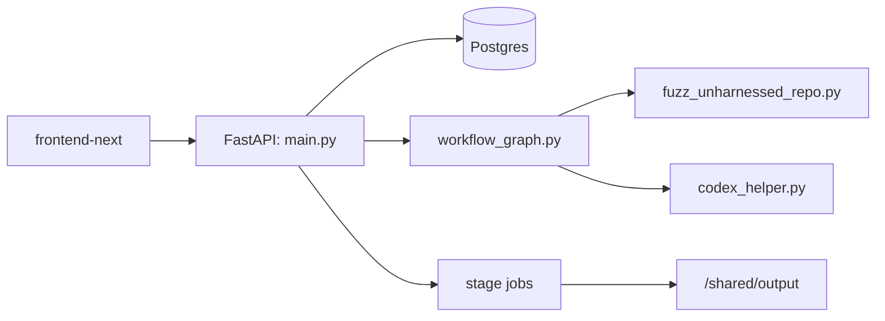
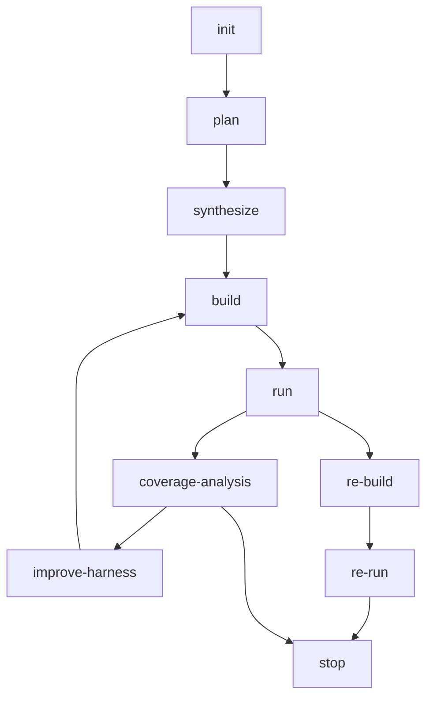

# Sherpa 代码级技术解析

本文档基于当前代码主线编写，目标是让第一次接触 Sherpa 的开发者能够直接理解系统的思路、架构、状态流和实现边界。

## 1. 系统目标

Sherpa 的目标不是单次“生成一个 harness”，而是围绕任意 C/C++ 仓库，形成一个可恢复、可迭代、可解释的 fuzz orchestration system：

- 自动分析仓库并选 target
- 自动生成 harness 与 build scaffold
- 自动构建并尝试修 build 失败
- 自动生成和扩展 seed corpus
- 自动运行 fuzz，并记录 plateau / crash / timeout
- 自动决定是继续改当前 target，还是重新规划 target
- 自动进入 crash 复现链路

## 2. 顶层结构

## 3. 核心模块职责

### `harness_generator/src/langchain_agent/main.py`
负责：
- API 暴露
- 任务创建/停止/恢复
- 阶段 Job 派发
- 聚合 stage 结果
- 根据 `workflow_recommended_next` 动态调度下一阶段

### `harness_generator/src/langchain_agent/workflow_graph.py`
负责：
- 状态机定义
- 各阶段节点实现
- build/run/coverage/repro 路由
- coverage loop
- replan 有效性判定
- summary 字段回写

### `harness_generator/src/fuzz_unharnessed_repo.py`
负责：
- clone/build/run 的底层执行
- OpenCode pass 封装
- seed bootstrap
- repo examples 过滤
- plateau 检测

### `harness_generator/src/codex_helper.py`
负责：
- 调用 `opencode`
- sentinel/idle-timeout/retry
- 只读命令白名单
- k8s 原生执行 OpenCode

## 4. 主工作流

## 5. plan

`plan` 的目标不是直接生成 harness，而是产出目标定义和规划上下文。

当前产物：
- `fuzz/PLAN.md`
- `fuzz/targets.json`
- `fuzz/target_analysis.json`
- `fuzz/antlr_plan_context.json`（如果能生成）

### `targets.json` 当前最小 schema

每个 target 必须至少包含：
- `name`
- `api`
- `lang`
- `target_type`
- `seed_profile`

### `target_type`
描述大类：
- `parser`
- `decoder`
- `archive`
- `image`
- `document`
- `network`
- `database`
- `serializer`
- `interpreter`
- `generic`

### `seed_profile`
描述 seed bootstrap 风格：
- `parser-structure`
- `parser-token`
- `parser-format`
- `parser-numeric`
- `decoder-binary`
- `archive-container`
- `serializer-structured`
- `document-text`
- `network-message`
- `generic`

### `target_analysis.json`
当前会汇总：
- 工具辅助 signal
- target depth score
- `depth_class`
- `selection_bias_reason`

计划阶段会尽量偏向更深 target，避免默认收敛到浅层 utility API。

## 6. synthesize

`synthesize` 根据 `targets.json` 收敛到单 target，并生成：
- harness 源文件
- `fuzz/build.py` 或 `fuzz/build.sh`
- `.options`
- `README.md`

### partial scaffold completion
如果 OpenCode 只写出了一部分 scaffold，但没完整写 sentinel，不再直接失败。当前实现会：
- 检查 harness 是否存在
- 检查 build script 是否存在
- 如果是 partial scaffold，则发 completion prompt 只补缺失项

## 7. build 与 fix_build

`build` 执行 `fuzz/build.py` 或 `fuzz/build.sh`。

### `fix_build`
`build` 失败时进入：
- 错误签名归一化
- 规则修复优先
- OpenCode 修复作为后续手段
- quick-check build
- `requires_env_rebuild` 则派 fresh build job

当前 summary 中会记录：
- `build_error_code`
- `error_signature_before/after`
- `fix_action_type`
- `fix_effect`
- `final_build_error_code`

## 8. seed bootstrap

`run` 前对每个 fuzzer 做三段式 seed bootstrap：

### repo examples
不是简单扫仓库文件，而是按 `seed_profile` 过滤：
- `parser-structure` 只偏结构化文本
- `parser-numeric/token/format` 不会再随便吸收 `.c/.h/.html`
- `generic` 也会过滤掉源码与文档模板

会额外记录：
- `repo_examples_filtered`
- `repo_examples_accepted_count`
- `repo_examples_rejected_count`

### AI seed generation
根据 `target_type + seed_profile` 注入更细 prompt。例如：
- `parser-numeric` 偏边界数字、截断、分隔符、非 ASCII
- `parser-format` 偏错配定界符和非法 specifier
- `parser-structure` 偏合法/非法结构、alias/tag/directive/nesting

### `radamsa`
用于补 malformed/boundary 变异 corpus。

## 9. run

`run` 的工作不只是“执行 fuzzer”，还会解析 libFuzzer 输出并更新状态。

### 当前关键行为
- 首个 crash 可提前收口
- plateau 可提前结束当前 fuzzer
- 记录 `cov/ft` 增长历史
- 汇总 `seed_counts` 与 `corpus_sources`

### plateau
当前会记录：
- `terminal_reason = coverage_plateau`
- `coverage_loop.round`
- `coverage_loop.improve_mode`
- `coverage_loop.stop_reason`

## 10. coverage-analysis

这是把 `run` 的观测转成后续动作的节点。

判断因素包括：
- 是否 crash
- 是否 plateau
- `coverage_loop_max_rounds`
- 当前 target 深度
- 是否已经做过 in-place improve
- replan 是否会有实质变化

### 两级策略
1. 先 `in_place`
- 只在当前 target 上改 harness / seed / dictionary / bootstrap
2. 再 `replan`
- 只有连续无收益且预算允许时才触发
- 且 replan 必须 material change，否则直接 stop

## 11. improve-harness

`improve-harness` 当前不是固定等价于“回 plan”。

- `in_place`：下一步直接回 `build`
- `replan`：允许回 `plan`
- 若 `replan_effective = false`：直接 stop

这样避免了旧版那种“每次 plateau 都回 `plan`，直到 stage dispatch limit”的空转。

## 12. crash 复现链路

### `re-build`
- fresh clone
- 复制 `fuzz/` 目录与必要上下文
- 重建复现环境

### `re-run`
- 使用 crash artifact 重放
- 不重新生成 seed
- 复用 `run` 阶段已生成的 corpus

### `repro_context.json`
持久化：
- `last_fuzzer`
- `last_crash_artifact`
- `crash_signature`
- `re_workspace_root`

## 13. k8s 执行模型

当前线上不是“k8s 外层 + inner Docker opencode”，而是：

- k8s stage job
- stage pod 内原生 `opencode`
- `SHERPA_OUTPUT_DIR=/shared/output`
- 结果通过 stage json 与 `run_summary.json` 回写

## 14. 为什么系统现在比旧版更稳

当前代码相对旧版，已经补了这些关键护栏：
- `targets.json` 强 schema
- `seed_profile`
- `target_analysis.json`
- partial scaffold completion
- `requires_env_rebuild`
- native build auto-install from `system_packages.txt`
- plateau 检测
- replan material change 校验
- repo examples 过滤
- `grep/rg` 永远允许
- k8s 原生 OpenCode

## 15. 当前仍值得关注的边界

- target 仍可能选浅，需要持续优化 depth bias
- `fix_build` 规则仍需扩展更多链接/ABI/build system 变体
- plateau 检测阈值仍需要更多真实仓库调优
- `radamsa` 与 repo examples 的混合策略仍要靠真实任务持续验证

## 16. 最实用的理解方式

如果你只记一件事，请记：

Sherpa 当前不是“线性跑完 8 个 stage 就结束”的系统，而是一个**基于阶段状态、动态路由、覆盖率反馈和 crash 复现的编排器**。真正的理解重点在于：

- `targets.json` 如何定义 target 与 seed 语义
- `run` 如何把 seed、coverage、plateau 转成状态
- `coverage-analysis` 如何决定继续、重选还是停止
- `repro_context.json` 如何支撑跨 job crash 复现
