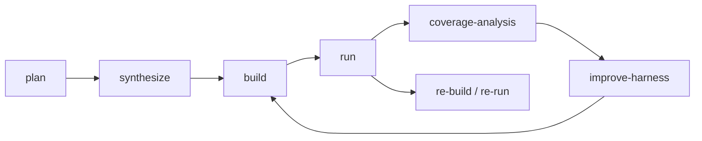
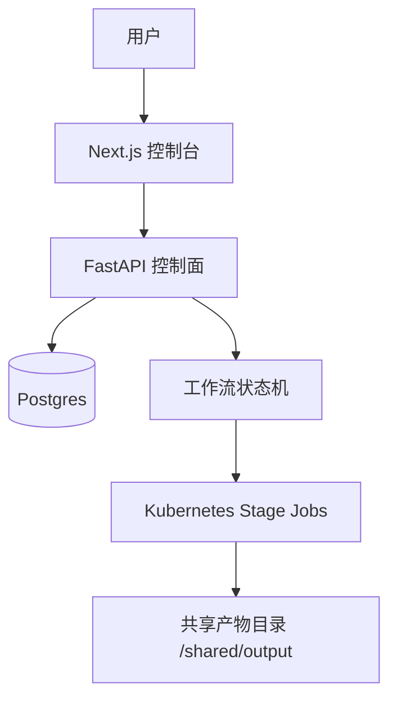

# Sherpa 比赛展示版技术解读

本文档面向比赛展示、路演和答辩，不追求逐行解释代码，而是回答三个问题：

1. Sherpa 解决了什么工程问题？
2. 系统为什么这样设计？
3. 当前实现有哪些可以展示的技术亮点？

## 1. 一句话介绍

Sherpa 是一个把“仓库级 fuzz 工程”自动化的系统。给它一个 C/C++ 仓库 URL，它会自动完成目标规划、harness 生成、构建修复、seed bootstrap、fuzz 运行、覆盖率驱动改进，以及 crash 复现。

它的价值不在单次生成代码，而在把 fuzz 工作流做成一个可恢复、可追踪、可解释的系统。

## 2. 典型痛点

传统 fuzz 落地通常有三类高成本环节：

- 前期成本高：要读代码、挑 target、写 harness、搭 build
- 中期调试难：经常卡在构建失败、链接失败、seed 太差、run 空跑
- 后期闭环弱：发现 plateau 或 crash 后，缺少稳定的继续改进和复现链路

Sherpa 的设计目标就是把这三类问题串成一个自动闭环。

## 3. 核心设计

### 3.1 阶段化工作流，而不是一次性生成

Sherpa 把 fuzz 工程拆成多个阶段，每个阶段都只做一件事：

这样带来的好处是：

- 每个阶段都有明确输入输出
- 失败可以按阶段分类
- 可以在任何阶段恢复
- 可观测性天然更强

### 3.2 控制面和执行面分离

Sherpa 当前采用：

- FastAPI + Postgres 作为控制面
- Kubernetes Jobs 作为执行面

这种设计的核心意义在于：

- 控制面负责状态与调度
- 执行面负责高隔离的一次性计算
- 常驻服务不会被 fuzz 过程污染

## 4. 当前真实架构

### 控制面

负责：

- 接收用户配置
- 创建任务
- 派发阶段 Job
- 聚合状态和日志
- 提供系统概览与任务详情 API

### 执行面

每个阶段在独立 worker 容器执行，负责：

- clone 仓库
- 调用 OpenCode
- 执行 build scaffold
- 跑 fuzz
- 写回阶段结果

## 5. 为什么这套系统有展示价值

### 5.1 它不是“AI 写代码”演示

Sherpa 的重点不是展示一个模型能生成什么代码，而是展示：

- AI 生成被放在受约束的状态机中
- 构建、运行、覆盖率、复现都能被结构化处理
- 系统可以在失败后继续推进，而不是一次失败就结束

也就是说，Sherpa 更接近“自动化安全工程平台”，而不是一个单点助手。

### 5.2 它有真正的闭环

闭环体现在：

- 计划阶段能输出 target 定义
- 生成阶段能输出 harness 和 build scaffold
- 构建失败会进入 fix_build
- 运行失败会分类为 OOM、timeout、source error 等
- plateau 后会进入 improve-harness，而不是直接停机
- crash 会进入独立复现链路

### 5.3 它强调可解释性

Sherpa 当前会落盘大量状态文件，例如：

- `targets.json`
- `target_analysis.json`
- `observed_target.json`
- `build_strategy.json`
- `run_summary.json`
- `repro_context.json`

这意味着系统不是黑盒。每一步为什么选这个 target、为什么 build 失败、为什么 run 停止，都可以通过产物回溯。

## 6. 当前实现中的关键技术点

### 6.1 目标规划不是只看函数名

计划阶段不仅给出候选 target，还会输出 target 分析、深度、seed profile 等信息，避免默认选到浅层 utility API。

### 6.2 构建策略显式化

当前系统不再默认复用仓库自带 fuzz target，而是统一生成外部 harness 与 build scaffold，并落盘 `build_strategy.json`。这样可以避免：

- 误以为仓库有同名 fuzz target
- 围绕错误 target 名反复空转修 build

### 6.3 运行质量不是只看“有没有 crash”

运行阶段会关注：

- 覆盖率增长
- 特征数增长
- plateau
- seed 来源和质量
- OOM / timeout / source error 分类

这让系统可以在“没有 crash”的情况下继续优化。

### 6.4 non-root 运行时设计

Sherpa 当前已经围绕 non-root 做了运行时路径收敛：

- 临时文件优先写 `/tmp`
- 配置持久化与运行时生成文件分离
- 常驻服务和动态 worker 都按 non-root 运行

这部分的工程价值在于：系统在真实部署条件下更可控，而不是依赖 root 权限兜底。

## 7. 当前可以展示的工程能力

如果用于比赛展示，建议重点强调以下能力：

1. 从一个仓库 URL 自动进入多阶段 fuzz 流程。
2. 每个阶段都可单独观察、失败分类、恢复。
3. 构建失败后系统可以自动进入定向修复，而不是只输出日志。
4. plateau 后系统会继续改当前 harness，而不是简单放弃。
5. crash 后有独立复现路径，形成“发现问题 -> 复现问题”的闭环。

## 8. 当前仍然存在的真实挑战

这套系统不是没有挑战，比赛展示时反而应该坦诚说明：

- 仓库 clone 仍受外部网络与代理稳定性影响
- 复杂构建系统下的外部 scaffold 还在持续打磨
- 运行资源配置需要在可调度性与稳定性之间权衡

这类问题的存在并不削弱 Sherpa，反而说明它面对的是“真实工程环境”，而不是离线静态 demo。

## 9. 推荐展示话术

如果只用一分钟介绍，可以这样说：

> Sherpa 不是一个单次生成 harness 的工具，而是一套自动化 fuzz 编排系统。它把 target 规划、harness 生成、build 修复、seed bootstrap、fuzz 运行、覆盖率驱动改进和 crash 复现串成了一条可恢复、可解释、可观测的工作流。我们当前的实现重点，是把 AI 能力放进一个工程化状态机，而不是把系统变成黑盒生成器。

## 10. 推荐展示顺序

1. 先展示控制台：说明系统是可操作、可观测的。
2. 再展示工作流图：说明它不是单步工具，而是完整流水线。
3. 再展示关键产物：`targets.json`、`build_strategy.json`、`run_summary.json`。
4. 最后展示一次真实任务的阶段日志和结果，让观众看到系统如何从规划走到运行与复现。
