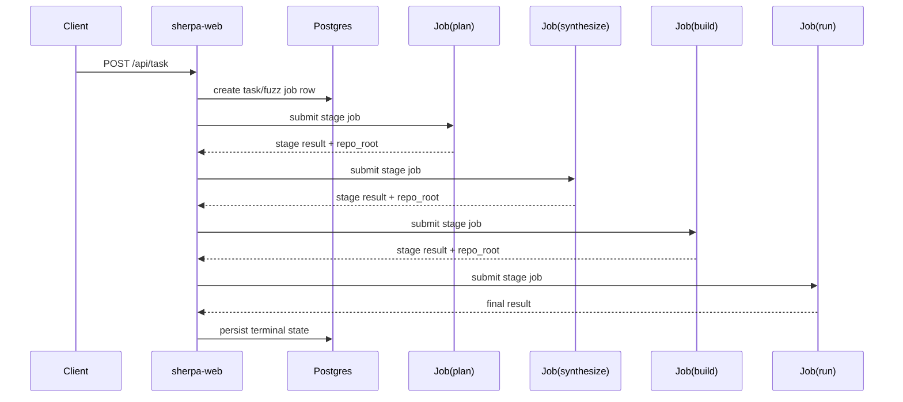

# Sherpa 对接文档（Docker 背景 -> K8s Native）

## 1. 关键结论

1. Sherpa 不再使用 `docker-compose` 作为运行基线。
2. 执行器固定为 `k8s_job`。
3. 任务子流程拆分为阶段 Job：`plan -> synthesize -> build -> run`。
4. 状态存储固定为 Postgres。
5. `docker` / `docker_image` 字段仅兼容保留，不参与 k8s runtime 决策。

## 2. 心智映射

| Docker 语义 | K8s 语义 | Sherpa 对应 |
|---|---|---|
| service | Deployment/StatefulSet | `sherpa-web`、`sherpa-frontend`、`postgres` |
| one-shot container | Job | 阶段执行 Pod |
| volume | PVC | `shared-output`、`shared-tmp`、`job-logs` |
| env file | ConfigMap/Secret | 配置与密钥注入 |

## 3. 执行时序

## 4. API 对接

| 方法 | 路径 | 用途 |
|---|---|---|
| `POST` | `/api/task` | 提交任务 |
| `GET` | `/api/task/{job_id}` | 查看详情 |
| `GET` | `/api/tasks` | 列表轮询 |
| `POST` | `/api/task/{job_id}/stop` | 停止任务 |
| `POST` | `/api/task/{job_id}/resume` | 手动续跑 |

## 5. 排障最短路径

1. 先看 `/api/task/{job_id}` 的 `phase/error_code/error_kind`。
2. 再看 `k8s_job_name/k8s_job_names` 并拉对应 Job 日志。
3. 最后看 `/api/metrics` 判定是否系统性问题。
