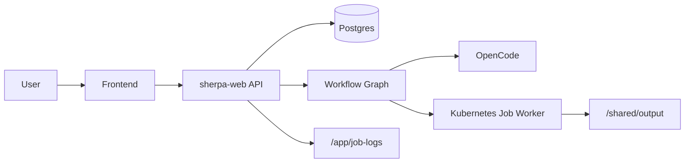
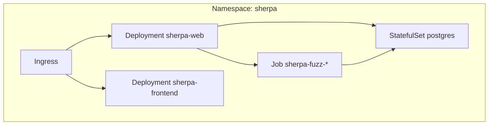
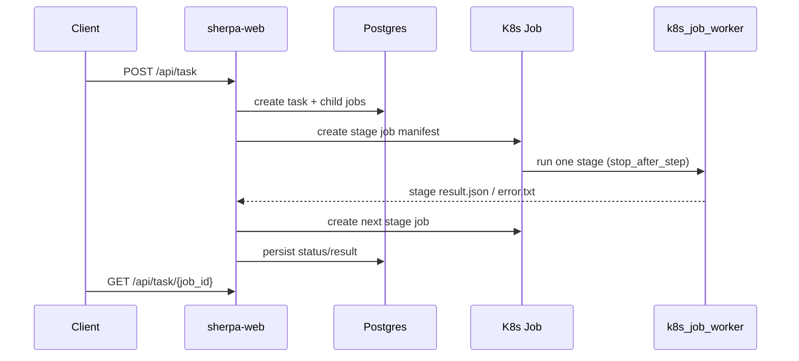
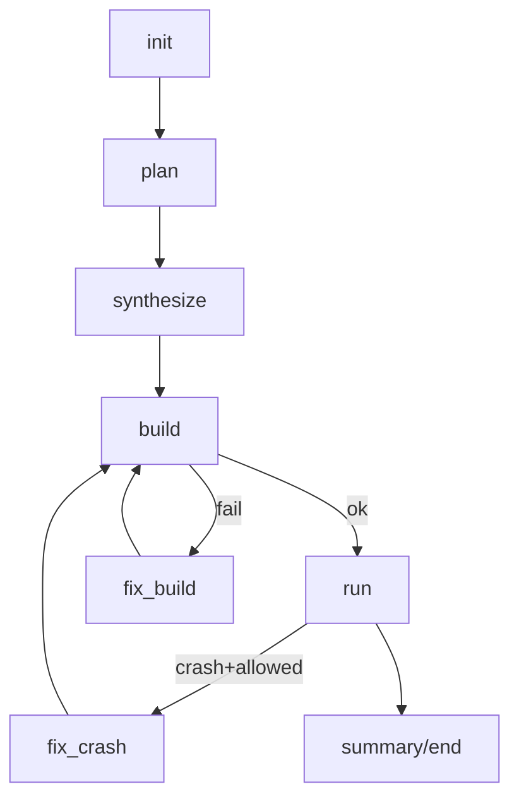

# Sherpa 对接文档（Docker 背景 -> Kubernetes-only）

## 1. 文档目标

本文用于团队对接，默认读者熟悉 Docker/Compose，但不熟悉 Kubernetes。

目标：让你在 30-60 分钟内完成以下事情：

1. 理解 Sherpa 当前执行架构（Kubernetes-only）。
2. 在本地 K8s 启动并提交一个任务。
3. 能读懂任务状态并完成基础排障。
4. 知道发布回滚路径与风险边界。

---

## 2. 关键结论（先看）

1. Sherpa 已收敛为 **Kubernetes-only** 运行模式。
2. 执行器仅支持 `k8s_job`，不再走 `local_thread`。
3. 子任务采用“多阶段多 Job”执行：`plan -> synthesize -> build -> run` 串行 Job Pod。
4. k8s worker 内部使用原生工具链执行 build/run，不再依赖 inner Docker。
5. 状态存储为 **Postgres-only**，`DATABASE_URL` 必填。
6. 对接时优先看 API 字段：`job_id`、`status`、`phase`、`error_code`。
7. 运维入口固定为：`/api/system`、`/api/metrics`、`/api/task/{job_id}`。

---

## 3. Docker 心智到 Kubernetes 心智映射

| Docker/Compose | Kubernetes | Sherpa 对应 |
|---|---|---|
| service | Deployment/StatefulSet + Service | `sherpa-web`、`sherpa-frontend`、`postgres` |
| one-shot container | Job | 每个 fuzz 子任务 |
| volume | PVC | `shared-output`、`shared-tmp`、`job-logs` |
| env file | ConfigMap/Secret | 非敏感配置/敏感凭据 |
| port mapping | Service + Ingress | `/` -> frontend, `/api/*` -> web |
| depends_on | 健康探针 + 控制器重试 | 由 k8s 管理生命周期 |

最核心差异：Compose 偏进程编排，K8s 偏声明式状态与调度。

---

## 4. Sherpa 当前架构





---

## 5. 任务执行链路



工作流节点（简化）：



---

## 6. 状态模型与字段解释

### 6.1 任务层级

1. `task`：父任务（一次提交）。
2. `fuzz`：子任务（单仓库执行单元）。

### 6.2 你需要重点关注的字段

1. `job_id`：唯一标识。
2. `status`：聚合状态（running/success/error）。
3. `runtime_mode`：执行模式（当前基线为 `native`）。
4. `phase`：当前阶段（例如 build/run/fix_build）。
5. `error_code`：结构化错误码（优先取终止原因/分类错误码）。
6. `error_kind`：错误大类（如 build/run）。
7. `error_signature`：错误签名（用于判定是否同类重复失败）。
8. `children_status`：子任务统计。

### 6.3 为什么要同时看 status 和 phase

1. `status` 只告诉你“成败”。
2. `phase` 告诉你“卡在哪一步”。
3. `error_code` 告诉你“属于哪类失败”。

---

## 7. 本地最小可运行步骤（K8s）

参考：`/Users/zuens2020/Documents/Sherpa/docs/k8s/LOCAL_K8S_QUICKSTART.md`

最短路径：

```bash
# 1) 准备 secret
cp k8s/base/minimax-secret.example.yaml k8s/base/minimax-secret.yaml
cp k8s/base/postgres-secret.example.yaml k8s/base/postgres-secret.yaml

# 2) 部署
kubectl apply -k k8s/base
kubectl -n sherpa get pods

# 3) 健康检查
kubectl -n sherpa port-forward svc/sherpa-web 8001:8001
curl -sS http://127.0.0.1:8001/api/health
curl -sS http://127.0.0.1:8001/api/metrics | head
```

提交任务示例：

```bash
curl -sS -X POST http://127.0.0.1:8001/api/task \
  -H 'Content-Type: application/json' \
  -d '{
    "jobs": [{
      "code_url": "https://github.com/madler/zlib.git",
      "total_time_budget": 900,
      "run_time_budget": 900,
      "max_tokens": 1000
    }]
  }'
```

---

## 8. API 对接清单

| 方法 | 路径 | 说明 |
|---|---|---|
| GET | `/api/config` | 读取配置（脱敏） |
| PUT | `/api/config` | 更新配置 |
| GET | `/api/system` | 系统状态快照 |
| GET | `/api/metrics` | Prometheus 指标 |
| POST | `/api/task` | 提交任务 |
| GET | `/api/task/{job_id}` | 查询任务详情 |
| POST | `/api/task/{job_id}/resume` | 手动续跑 |
| POST | `/api/task/{job_id}/stop` | 停止任务 |
| GET | `/api/tasks` | 最近任务列表 |

兼容说明：

1. 请求体中的 `docker` / `docker_image` 字段仍可传，但在当前 `k8s_job` 原生执行基线下不参与运行时决策。
2. 建议新接入方直接省略这两个字段，避免与历史文档混淆。

建议前端轮询顺序：

1. 先拉 `/api/tasks` 显示列表。
2. 选中后拉 `/api/task/{job_id}` 展示详情。
3. 异常时同时拉 `/api/system` 和 `/api/metrics`。

---

## 9. 排障路径（统一套路）

### 9.1 三步法

1. 看任务详情：`status + phase + error_code`
2. 看系统指标：`/api/metrics`
3. 看日志：web 日志 + job 日志

### 9.2 常见故障对照

| 现象 | 优先检查 | 处理建议 |
|---|---|---|
| `DATABASE_URL is required` | Secret/Config 注入 | 修复 DB 配置后重启 web |
| 任务长期 running | `phase`、children 状态 | 查看对应 Job 日志，必要时 stop/resume |
| build/run 失败 | `error_code` + job 日志 | 按错误类型修复后重试 |
| API 可用但前端空白 | Ingress 路由 + frontend pod | 检查 service/ingress 对应关系 |

---

## 10. 回滚与发布门禁

发布门禁文档：`/Users/zuens2020/Documents/Sherpa/docs/k8s/RELEASE_GATE.md`

运行手册：`/Users/zuens2020/Documents/Sherpa/docs/k8s/RUNBOOK.md`

应用回滚：

```bash
kubectl -n sherpa rollout undo deploy/sherpa-web
kubectl -n sherpa rollout undo deploy/sherpa-frontend
```

数据库回滚：按 RUNBOOK 中 `pg_dump`/`psql` 路径执行。

---

## 11. 安全与合规要点

1. API/任务日志已做敏感字段脱敏（key/token/bearer）。
2. 配置落盘文件写入后尝试 `0600`。
3. `/api/config` 不返回明文密钥。

---

## 12. 对接建议（给新同学）

1. 第一天只做本地 k8s 启动 + 一个 zlib 任务闭环。
2. 第二天再看 workflow 细节与 fix 策略。
3. 对接接口时固定依赖 `phase/error_code`，不要只看 `status`。
4. 文档冲突时，以 README + `docs/k8s/*` 为准。
