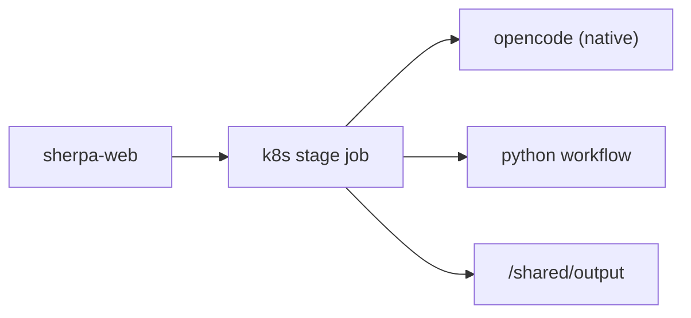

# 从旧 Docker 执行模型到当前 K8s 原生执行模型

Sherpa 历史上曾存在“外层在 k8s，内层再 `docker run opencode`”的执行方式。当前主线已经切换到：

- 调度层：Kubernetes
- worker 执行层：原生 `opencode`
- 任务状态：Postgres + output 目录

## 当前执行模型

## 旧模型的主要问题

- 依赖 Docker CLI
- k8s worker 与 Docker 镜像变量语义分裂
- 排障链路更长
- 镜像构建与运行时行为不一致

## 当前模型的优点

- stage pod 内直接运行 `opencode`
- 无需 inner Docker
- 日志更直观
- 配置更少
- 更适合按阶段 Job 调度

## 当前仍保留 Docker 的范围

- 本地开发与镜像构建
- 非 `k8s_job` 路径的旧兼容逻辑
- 容器镜像自身构建流程

## 当前不应再出现在运行时文档中的旧说法

- “worker 会再起一个 opencode 容器”
- “必须依赖 Docker CLI 才能执行 stage”
- “GitNexus 是当前线上主流程的一部分”
