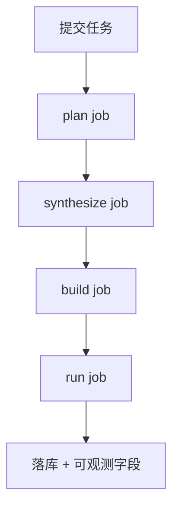

# Sherpa K8s 迁移清单（最终口径）

## 里程碑状态

- [x] M1：基础设施与路由
- [x] M2：执行链路去 inner Docker（k8s native）
- [x] M3：SQLite -> Postgres
- [x] M4：可观测性与发布门禁

## M1 基础设施

- [x] Ingress 路由：`/` -> frontend，`/api/*` -> web
- [x] ConfigMap/Secret 外置化
- [x] PVC 共享目录定义与挂载

## M2 执行链路

- [x] 执行器固定 `k8s_job`
- [x] 多阶段多 Job：`plan/synthesize/build/run`
- [x] 阶段结果回传与上下文续跑（`repo_root + resume_from_step`）
- [x] stop 清理阶段 Job 列表

## M3 数据层

- [x] `DATABASE_URL` 必填
- [x] Job 状态落库
- [x] 恢复与幂等路径稳定

## M4 可观测与发布

- [x] API 统一可观测字段
- [x] k8s runbook/release gate 文档化
- [x] zlib E2E 验收流程文档化

## 验收图

