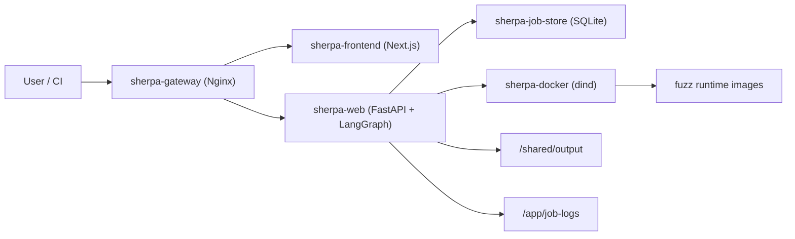
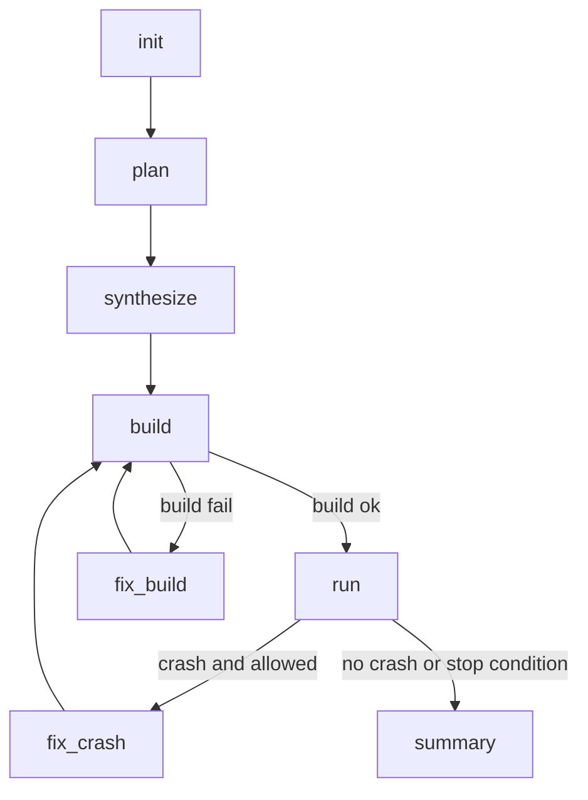
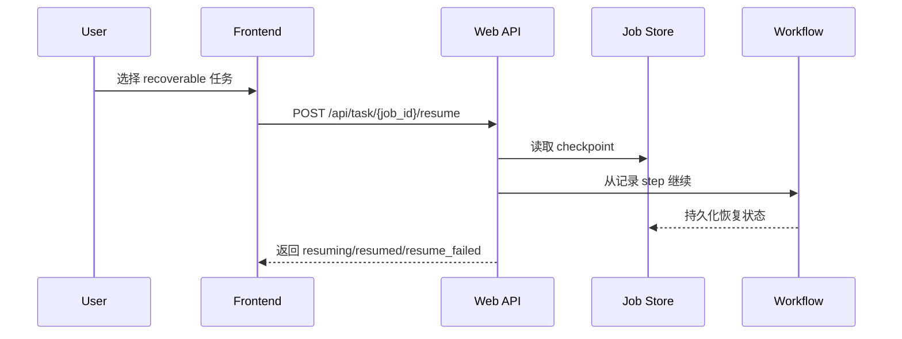

# Sherpa 对接与进度展示

- 更新日期：2026-02-26
- 仓库：`https://github.com/ZUENS2020/Sherpa.git`
- 当前分支：`main`
- 分支同步：`main...origin/main = 0/0`
- 工作区状态：`dirty`（当前有本地未提交改动）

## 1. 项目目标与当前形态

Sherpa 是一个面向 C/C++ 与 Java 仓库的自动化 fuzz 编排系统，输入代码仓库 URL 后，自动完成从计划、生成、构建、运行、修复到总结的闭环。

当前运行主链路：

`plan -> synthesize -> build -> run -> (optional fix_build/fix_crash) -> summary`

当前关键约束与默认行为：

1. 仅支持 Docker 执行（Docker-only）。
2. `decide` 节点已移除，路由由条件函数直接决策。
3. `plan` 节点负责总结策略与建议，并参与结束流程报告产出。
4. 断点续跑默认手动触发（`POST /api/task/{job_id}/resume`），不自动恢复。
5. 并行 fuzz 默认开启批次执行（`SHERPA_PARALLEL_FUZZERS=2`）。

## 2. 系统架构图（服务视角）



## 3. 工作流执行图（核心路径）



## 4. 恢复机制（手动续跑）



## 5. 当前已完成项（对接重点）

1. 前端已完成重构，重点信息（任务进度、日志、报错）展示更清晰。
2. 容器职责已拆分明确：gateway / frontend / web / dind / job-store / oss-fuzz-init。
3. 任务状态持久化完成，支持中断后手动从 checkpoint 继续。
4. 并行 fuzz 批次预算可观测（`run_batch_plan`），便于排查超时与预算分配。
5. 构建失败分类与修复链路已增强（基础设施问题与源码问题区分更清晰）。
6. 文档与品牌资产已整理：README、logo/banner、对接资料结构化。
7. `.env.example` 已与当前实现对齐，旧配置语义残余已清理。

## 6. 对接时必须对齐的运行事实

1. 对外入口统一使用 `sherpa-gateway`（默认 `http://localhost:8000`）。
2. API 与前端走同一网关，API 前缀为 `/api/*`。
3. `build/run` 与 `opencode` 不在同一执行环境，修复依赖共享 volume 与日志文件传递。
4. 如遇 Docker 网络问题，优先排查 dind 网络连通性、镜像可达性、DNS/代理设置。

## 7. 关键配置项（团队常用）

1. `OPENAI_API_KEY`：主流程 LLM key。
2. `SHERPA_PARALLEL_FUZZERS`：run 阶段并行批次数。
3. `SHERPA_DOCKER_NETWORK_PRECHECK`：Docker 网络预检查开关。
4. `SHERPA_WEB_AUTO_RESUME_ON_START=0`：默认关闭自动恢复。
5. `SHERPA_WEB_JOB_DB_PATH`：任务状态 SQLite 路径。

## 8. 当前风险与建议

风险：

1. 外部网络与镜像源可达性仍是构建失败主要来源。
2. 恢复上下文缺失时，任务会进入 `resume_failed`。
3. 并行执行提升吞吐的同时增加排障复杂度。

建议：

1. 固化一个 `zlib` smoke test 作为每日回归基线。
2. 持续补充构建失败分类样本，降低误判。
3. 前端增加 recoverable 任务筛选 + 一键 resume 入口。

## 9. 快速验证命令

```bash
# 系统状态
curl -s http://localhost:8000/api/system | jq

# 提交最小任务
curl -s http://localhost:8000/api/task \
  -H 'Content-Type: application/json' \
  -d '{
    "jobs": [{
      "code_url": "https://github.com/madler/zlib.git",
      "docker": true,
      "docker_image": "auto",
      "total_time_budget": 900,
      "run_time_budget": 300,
      "max_tokens": 1000
    }],
    "auto_init": true,
    "build_images": true
  }' | jq
```

## 10. 代码入口索引

1. `harness_generator/src/langchain_agent/main.py`（Web API 入口）
2. `harness_generator/src/langchain_agent/workflow_graph.py`（工作流图）
3. `harness_generator/src/langchain_agent/workflow_common.py`（工作流公共逻辑）
4. `harness_generator/src/langchain_agent/workflow_summary.py`（报告汇总）
5. `harness_generator/src/fuzz_unharnessed_repo.py`（构建/运行执行）
6. `docker-compose.yml`（容器编排）
7. `frontend-next/`（前端）

