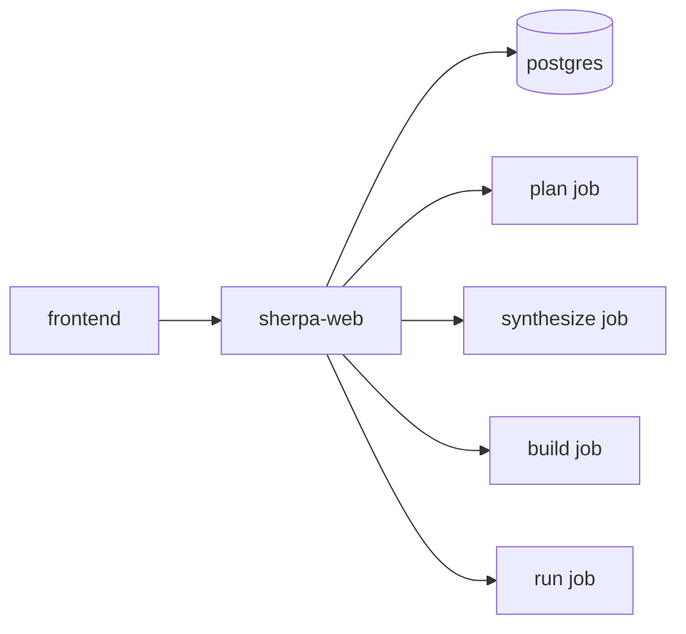

# Sherpa 对接现状

- 更新日期：2026-03-03
- 当前目标：稳定运行 K8s Native 多阶段执行

## 1. 当前能力

1. K8s-only 运行
2. Postgres-only 状态存储
3. 子任务分阶段 Job：`plan/synthesize/build/run`
4. 手动 stop/resume
5. API 统一可观测字段

## 2. 对接重点

1. 对接优先 API：`/api/task`、`/api/task/{job_id}`、`/api/tasks`
2. 排障优先字段：`phase`、`error_code`、`error_kind`、`k8s_job_names`
3. 运维入口：`/api/system`、`/api/metrics`

## 3. 当前图谱

```mermaid
flowchart LR
  FE["frontend"] --> API["sherpa-web"]
  API --> DB[("postgres")]
  API --> PJ["plan job"]
  API --> SJ["synthesize job"]
  API --> BJ["build job"]
  API --> RJ["run job"]
```

## 4. 待办收口

1. 测试补齐与回归验证（SHE-71）
2. 阶段级错误分类继续细化
