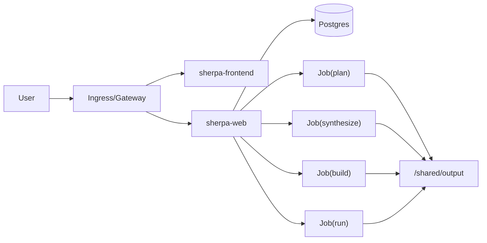

# Sherpa 对接与进度现状

- 更新日期：2026-03-03
- 仓库：`https://github.com/ZUENS2020/Sherpa.git`
- 主执行模型：`Kubernetes + Native Runtime + 多阶段多 Job`

## 1. 当前执行模型

Sherpa 在 `k8s_job` 模式下，单个 fuzz 子任务会拆分为阶段串行执行：

`plan -> synthesize -> build -> run`

每个阶段对应一个独立的 k8s Job Pod，由 `sherpa-web` 负责编排下一阶段。

## 2. 架构图（当前口径）

```mermaid
flowchart LR
  U["User"] --> G["Ingress/Gateway"]
  G --> FE["sherpa-frontend"]
  G --> API["sherpa-web"]
  API --> DB[(Postgres)]
  API --> J1["Job(plan)"]
  API --> J2["Job(synthesize)"]
  API --> J3["Job(build)"]
  API --> J4["Job(run)"]
  J1 --> OUT["/shared/output"]
  J2 --> OUT
  J3 --> OUT
  J4 --> OUT
```

## 3. 对接关键事实

1. 运行模式仅 `k8s_job`，不再使用 `local_thread`。
2. 数据存储为 Postgres-only，`DATABASE_URL` 必填。
3. `docker` / `docker_image` 为兼容字段；在 k8s runtime 下不参与运行时决策。
4. 任务停止会清理该任务对应的阶段 Job（含历史阶段 Job 名称列表）。

## 4. 关键观测字段

任务详情和任务列表对接时，建议固定消费以下字段：

1. `job_id`
2. `status`
3. `runtime_mode`
4. `phase`
5. `error_code`
6. `error_kind`
7. `error_signature`
8. `k8s_job_name` / `k8s_job_names`
9. `children_status`

## 5. 当前完成情况（高层）

1. K8s-only 基线已落地（执行器/部署口径统一）。
2. Postgres 持久化已落地（替代 SQLite）。
3. 多阶段多 Job 编排已接入主流程（plan/synthesize/build/run）。
4. 文档已更新 README 与 Docker->K8s handoff 口径。

## 6. 待收口项

1. 测试补齐与回归验证（`SHE-71`）。
2. 基于真实任务日志继续细化阶段级错误码和重试策略。

## 7. 快速对接入口

1. 主 README：`/Users/zuens2020/Documents/Sherpa/README.md`
2. 对接文档：`/Users/zuens2020/Documents/Sherpa/docs/DOCKER_TO_K8S_HANDOFF.md`
3. 运行手册：`/Users/zuens2020/Documents/Sherpa/docs/k8s/RUNBOOK.md`
