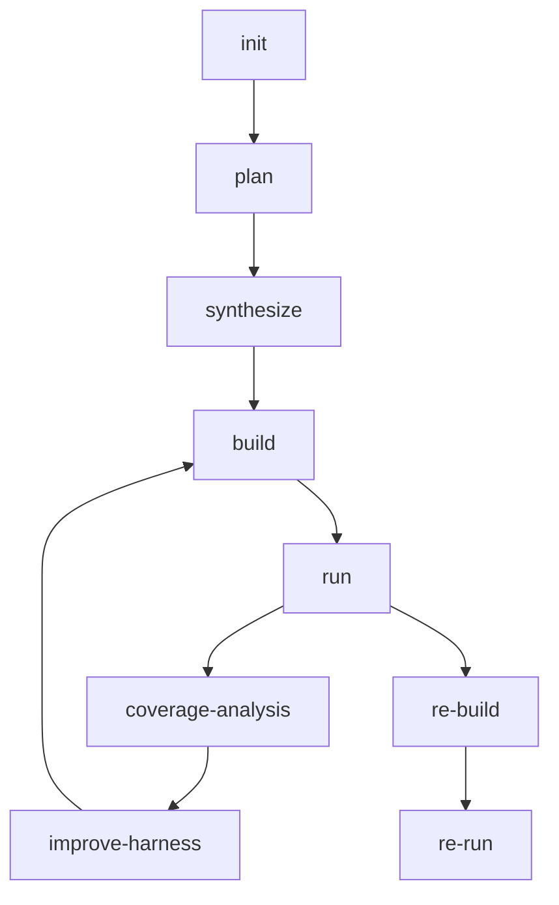

# Sherpa 文档入口

本目录记录 Sherpa 当前代码与部署状态，对齐当前仓库实现，不再保留旧版“inner Docker + 固定阶段队列”的叙述。

当前统一口径：

- Kubernetes 为唯一线上执行环境
- Postgres 为唯一任务状态持久化存储
- stage-per-job 工作流
- OpenCode 在 k8s worker 中原生执行
- 运行时不使用 GitNexus
- 真实阶段链包含 `coverage-analysis`、`improve-harness`、`re-build`、`re-run`

## 文档索引

1. `README.md`
   - 仓库总览、核心流程、当前能力边界。
2. `docs/CODEBASE_TECHNICAL_ANALYSIS.md`
   - 代码级技术解析，适合新人完整理解项目。
3. `docs/PROJECT_HANDOFF_STATUS.md`
   - 当前交付状态、仍在处理的问题、最近能力变更。
4. `docs/STANDARD_CHANGE_PROCESS.md`
   - 分支、PR、部署、验证的标准流程。
5. `docs/DOCKER_TO_K8S_HANDOFF.md`
   - 从旧执行模型迁移到当前 k8s 原生执行的对接说明。
6. `docs/K8S_MIGRATION_CHECKLIST.md`
   - 当前迁移验收清单与完成状态。
7. `docs/k8s/DEPLOY.md`
   - 简版部署说明。
8. `docs/k8s/DEPLOYMENT_DETAILED.md`
   - 详细部署说明、镜像、滚动更新、故障树。
9. `docs/k8s/RUNBOOK.md`
   - 日常排障与值班操作。
10. `docs/k8s/RELEASE_GATE.md`
    - 发布门禁与合并前检查项。
11. `docs/k8s/MAPPING.md`
    - 常驻服务、阶段 Job、路径与状态文件映射。
12. `docs/k8s/LOCAL_K8S_QUICKSTART.md`
    - 本地快速验证。
13. `docs/k8s/CLOUDFLARE_TUNNEL.md`
    - Tunnel 与域名接入。
14. `docs/k8s/DEPLOY_ISSUES_NON_NETWORK.md`
    - 非网络类部署问题与已知修复策略。
15. `docs/k8s/E2E_ZLIB_REPORT.md`
    - `zlib` 端到端验证样例。
16. `harness_generator/README.md`
    - 后端工具链与非 OSS-Fuzz 主工作流说明。
17. `harness_generator/docs/TECHNICAL_HANDOFF_ZH.md`
    - 中文技术交接摘要。
18. `harness_generator/docs/opencode_stability_plan.md`
    - 当前 OpenCode 稳定性与约束机制说明。

## 当前主流程

## 当前重点口径

- `targets.json` 必须包含 `target_type` 与 `seed_profile`
- `run` 的 seed bootstrap 由 repo examples、AI、`radamsa` 组成
- plateau 后优先在当前 target 上做 `in_place` 改进
- `replan` 必须产生实质变化，否则视为无效并停止
- `repro_context.json` 是 crash 复现链路的持久化来源
