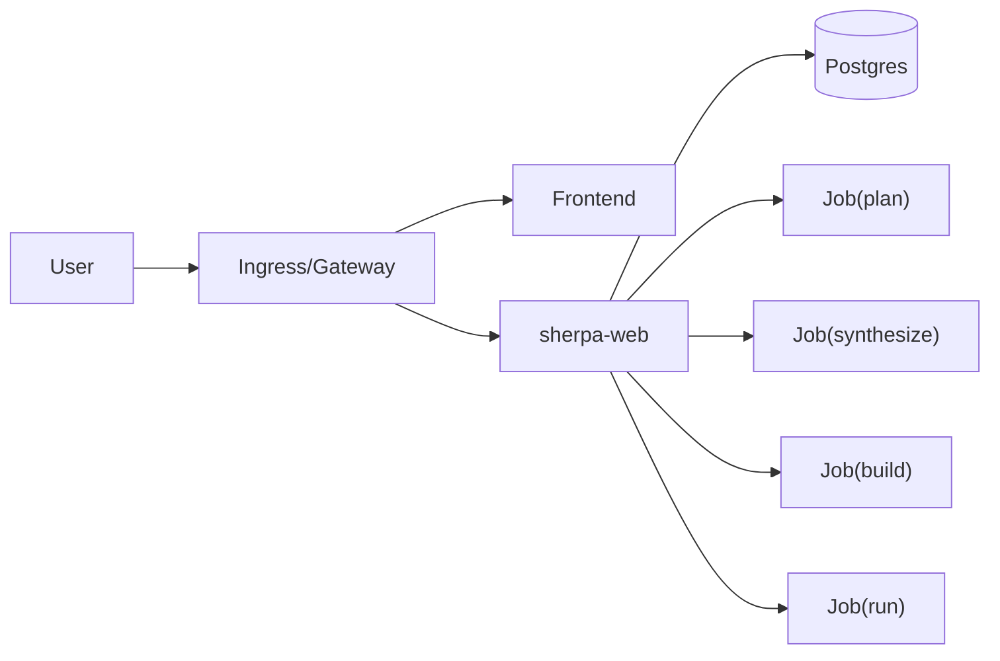

# Docs 总览

本目录为 Sherpa 的对接与运维文档入口，口径统一为：

- Kubernetes-only
- Postgres-only
- Native Runtime（无 inner Docker）
- 多阶段多 Job 执行（`plan -> synthesize -> build -> run`）

## 文档索引

1. `/Users/zuens2020/Documents/Sherpa/docs/PROJECT_TECHNICAL_REPORT_ZH.md`：项目技术报告（SHE-91，论文写作输入）
2. `/Users/zuens2020/Documents/Sherpa/docs/PROJECT_HANDOFF_STATUS.md`：当前进度与对接现状
3. `/Users/zuens2020/Documents/Sherpa/docs/DOCKER_TO_K8S_HANDOFF.md`：Docker 背景团队迁移对接
4. `/Users/zuens2020/Documents/Sherpa/docs/K8S_MIGRATION_CHECKLIST.md`：迁移里程碑与验收清单
5. `/Users/zuens2020/Documents/Sherpa/docs/STANDARD_CHANGE_PROCESS.md`：标准修改流程（SOP，个人分支先入 dev，验证通过后再由 dev 进入 main）
6. `/Users/zuens2020/Documents/Sherpa/docs/k8s/LOCAL_K8S_QUICKSTART.md`：本地最小启动
7. `/Users/zuens2020/Documents/Sherpa/docs/k8s/DEPLOY.md`：部署说明（简版）
8. `/Users/zuens2020/Documents/Sherpa/docs/k8s/DEPLOYMENT_DETAILED.md`：部署说明（详细版，含故障树）
9. `/Users/zuens2020/Documents/Sherpa/docs/k8s/RUNBOOK.md`：运行手册
10. `/Users/zuens2020/Documents/Sherpa/docs/k8s/RELEASE_GATE.md`：发布门禁
11. `/Users/zuens2020/Documents/Sherpa/docs/k8s/CLOUDFLARE_TUNNEL.md`：Cloudflare Tunnel 接入
12. `/Users/zuens2020/Documents/Sherpa/docs/k8s/MAPPING.md`：Compose 到 K8s 映射
13. `/Users/zuens2020/Documents/Sherpa/docs/k8s/E2E_ZLIB_REPORT.md`：E2E 报告模板与样例
14. `/Users/zuens2020/Documents/Sherpa/docs/k8s/DEPLOY_ISSUES_NON_NETWORK.md`：非网络部署问题总结与 CI/CD 改进项

## 核心图谱

## 字段口径

任务展示与排障固定关注：

1. `job_id`
2. `status`
3. `runtime_mode`
4. `phase`
5. `error_code`
6. `error_kind`
7. `error_signature`
8. `k8s_job_name` / `k8s_job_names`
9. `children_status`
