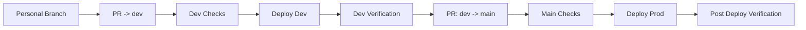

# Sherpa 标准修改流程（SOP）

本文档定义 Sherpa 项目的统一改动流程。当前仓库采用严格的双环境发布流：

1. 所有开发先在个人分支完成
2. 所有改动先进入 `dev` 做集成验证
3. 只有 `dev` 验证通过后，才允许进入 `main`
4. `main` 只用于生产发布

目标是：

1. 改动可追踪
2. 质量可验证
3. 发布可回滚
4. dev/prod 环境不互相污染
5. `main` 永远保持可发布状态

---

## 1. 适用范围

适用于以下所有改动：

1. 后端（workflow、API、调度、K8s 执行逻辑）
2. 前端（任务页面、配置页面、日志展示）
3. 基础设施（K8s 清单、CI/CD、Cloudflare Tunnel、数据库）
4. 文档（README、docs、部署与运维文档）

---

## 2. 变更分级

### 2.1 小改动（Low Risk）

定义：

1. 文案、注释、非行为性重构
2. 不影响 API 契约
3. 不影响部署与运行拓扑

要求：

1. 仍需个人分支 + PR
2. 至少通过基础校验（workflow lint / manifest check）
3. 仍需先走 `dev`

### 2.2 大改动（High Risk）

定义：

1. 影响运行链路（plan/synthesize/build/run）
2. 影响数据层（Postgres schema/连接方式）
3. 影响部署拓扑（K8s、Ingress、Tunnel、CI/CD）
4. 影响用户配置项、API 返回字段、恢复机制

要求：

1. 先创建 issue（目标、范围、风险、验收）
2. 再开个人分支开发
3. 必须补测试与文档
4. 必须经过 `dev` 验证后再进 `main`

---

## 3. 标准执行步骤

### Step 0：明确目标与边界（必须）

输出最少包含：

1. 目标问题是什么
2. 不做什么（Out of scope）
3. 验收标准（Done 定义）

### Step 1：创建 issue 与个人分支

1. 在 Linear/GitHub issue 建立任务（大改动必须）
2. 从最新 `dev` 拉出个人分支开发，不要从旧分支或脏分支继续叠加
3. 分支命名建议：
   - `codex/<topic>`
   - `<user_name>/<topic>`
4. 禁止直接在 `dev` 或 `main` 开发
5. 禁止直接 push 到受保护分支

### Step 2：设计改动方案

1. 列出改动文件清单
2. 标记影响面（API/DB/K8s/前端/工作流）
3. 明确回滚策略（配置回滚或代码回滚）

### Step 3：实现改动

1. 小步提交，保持每个提交单一目的
2. 禁止提交密钥、token、明文密码
3. 新增配置必须走环境变量或 Secret

### Step 4：本地与集成验证

至少完成：

1. 语法与单测（如 `pytest`）
2. 关键路径验证（任务提交、状态轮询、日志查看）
3. 关键部署校验（K8s manifest、workflow lint）

涉及运行链路时，建议补一轮真实仓库 E2E（如 zlib）。

### Step 5：文档同步

以下场景必须更新文档：

1. 新增/删除配置项
2. 变更流程或状态机
3. 变更部署步骤或排障步骤

至少更新：

1. `/Users/zuens2020/Documents/Sherpa/README.md`
2. `/Users/zuens2020/Documents/Sherpa/docs/README.md`
3. 对应专题文档（`/Users/zuens2020/Documents/Sherpa/docs/k8s/*.md`）

### Step 6：个人分支先提 PR 到 `dev`

1. 所有功能、修复、文档改动，默认先提 `PR -> dev`
2. 该 PR 的目标是：
   - 合并代码到测试环境
   - 触发 `Deploy Dev`
   - 验证本次改动在真实部署链路中可工作
3. 不允许个人分支直接提 `PR -> main`

### Step 7：等待 `dev` 验证通过

至少满足：

1. PR 检查通过
2. `Deploy Dev` 成功
3. dev 环境关键路径验证通过

建议验证项：

1. `/api/health`
2. `/api/system`
3. 前端可访问
4. 关键任务提交、轮询、日志查看正常
5. 若涉及 fuzz/workflow 逻辑，至少补一轮真实仓库验证

### Step 8：仅允许 `dev -> main`

1. 当 `dev` 验证通过后，再发起 `PR -> main`
2. `main` 只接受来自 `dev` 的 PR
3. 仓库已通过工作流强制校验该规则，其他来源分支即使创建 PR，也不能合并

### Step 9：合并到 `main` 并发布 `prod`

1. 合并方式遵循分支保护策略
2. 合并到 `main` 后触发 `Deploy Prod`
3. prod 发布后执行健康检查：
   - `/api/health`
   - `/api/system`
   - 前端任务提交与状态刷新
4. 若发布失败，优先回滚发布，不要在 prod 上直接做未记录变更

### Step 10：收口

1. 更新 issue 为 Done
2. 记录剩余风险与后续项
3. 清理临时文件与无用分支

---

## 4. 标准分支流



说明：

1. `dev` 用于持续验证，允许频繁发布
2. `main` 用于生产发布，必须保持稳定
3. 所有个人改动先进入 `dev`
4. 所有生产发布只能来自 `dev -> main`
5. 所有发布都应可通过 commit SHA 回滚

---

## 5. PR 规范

所有 PR 都必须写清楚最少信息，避免“看 diff 猜意图”。

### 5.1 PR 标题规范

推荐格式：

1. `feat: <summary>`
2. `fix: <summary>`
3. `refactor: <summary>`
4. `docs: <summary>`
5. `infra: <summary>`
6. `test: <summary>`

要求：

1. 标题直接说明改动结果，不写模糊标题
2. 一个 PR 只表达一个主要目标

示例：

1. `fix: prefer runner-local kubeconfig on self-hosted deploy`
2. `infra: reset dev namespace before redeploy`
3. `docs: rewrite k8s deployment handbook`

### 5.2 PR 描述规范

PR 描述至少包含以下 6 段：

1. `背景`
   - 这次为什么改
2. `目标`
   - 这次要解决什么
3. `变更范围`
   - 改了哪些模块/文件
4. `验证`
   - 跑了什么命令、看了什么结果
5. `风险`
   - 可能影响什么
6. `回滚`
   - 出问题怎么退回

推荐模板：

```md
## 背景

## 目标

## 变更范围
1.
2.

## 验证
1. 命令：
2. 结果：

## 风险
1.

## 回滚
1.
```

### 5.3 `PR -> dev` 额外要求

1. 必须写清楚 dev 需要重点验证什么
2. 若涉及配置或 secret，必须标明是否需要先配环境
3. 若涉及数据库或存储，必须说明是否会清空 dev 数据

### 5.4 `dev -> main` 额外要求

1. 必须引用 dev 验证结果
2. 必须说明 `Deploy Dev` 已成功
3. 必须说明是否已经过真实链路验证
4. 不允许带入“只在本地验证、未在 dev 验证”的改动

---

## 6. 变更前自检清单

1. 是否定义清楚目标与验收？
2. 是否评估影响面（API/DB/K8s/前端）？
3. 是否存在密钥泄漏风险？
4. 是否准备回滚策略？
5. 是否补充必要测试？
6. 是否同步文档？
7. 是否明确本次先发 `dev` 验证什么？

---

## 7. 常见违规（禁止）

1. 直接 push 到受保护分支
2. 个人分支直接提 PR 到 `main`
3. 未经过 `dev` 验证就尝试发布到 `prod`
4. 在 `dev`/`main` 上直接开发
5. 未验证即合并
6. 在代码中硬编码密钥/域名/个人镜像源
7. 只改代码不改文档
8. 改动基础设施但没有回滚方案

---

## 8. 推荐最小命令集

```bash
# 1) 同步 dev 并从 dev 拉个人分支
git checkout dev
git pull --ff-only origin dev
git checkout -b codex/<topic>

# 2) 开发后自检（示例）
pytest -q

# 3) 提交个人分支
git add -A
git commit -m "feat: <summary>"
git push origin codex/<topic>

# 4) 个人分支 -> dev
# 5) dev 验证通过后，再发起 dev -> main
```

---

## 9. 责任边界（建议）

1. 开发者：实现、测试、文档、PR 描述
2. 评审者：正确性、风险、可维护性
3. 发布人：合并、观察工作流、发布后验证

该流程为 Sherpa 默认流程。若需例外（如紧急线上修复），也必须：

1. 在 PR 中写明原因
2. 记录为什么跳过标准流
3. 记录补偿动作（补测试、补文档、补 dev 回放验证）
