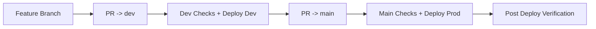

# Sherpa 标准修改流程（SOP）

本文档定义 Sherpa 项目的统一改动流程，目标是：

1. 改动可追踪
2. 质量可验证
3. 发布可回滚
4. dev/prod 环境不互相污染

---

## 1. 适用范围

适用于以下所有改动：

1. 后端（workflow、API、调度、K8s 执行逻辑）
2. 前端（任务页面、配置页面、日志展示）
3. 基础设施（K8s 清单、CI/CD、Cloudflare Tunnel、数据库）
4. 文档（README、docs、部署与运维文档）

---

## 2. 变更分级

### 2.1 小改动（Low Risk）

定义：

1. 文案、注释、非行为性重构
2. 不影响 API 契约
3. 不影响部署与运行拓扑

要求：

1. 仍需分支 + PR
2. 至少通过基础校验（workflow lint / manifest check）

### 2.2 大改动（High Risk）

定义：

1. 影响运行链路（plan/synthesize/build/run）
2. 影响数据层（Postgres schema/连接方式）
3. 影响部署拓扑（K8s、Ingress、Tunnel、CI/CD）
4. 影响用户配置项、API 返回字段、恢复机制

要求：

1. 先创建 issue（目标、范围、风险、验收）
2. 再开分支开发
3. 必须补测试与文档
4. 必须经过 PR 检查后合并

---

## 3. 标准执行步骤

### Step 0：明确目标与边界（必须）

输出最少包含：

1. 目标问题是什么
2. 不做什么（Out of scope）
3. 验收标准（Done 定义）

### Step 1：创建 issue 与分支

1. 在 Linear/GitHub issue 建立任务（大改动必须）
2. 分支命名建议：`<user_name>/<topic>`
3. 禁止直接在受保护分支开发

### Step 2：设计改动方案

1. 列出改动文件清单
2. 标记影响面（API/DB/K8s/前端/工作流）
3. 明确回滚策略（配置回滚或代码回滚）

### Step 3：实现改动

1. 小步提交，保持每个提交单一目的
2. 禁止提交密钥、token、明文密码
3. 新增配置必须走环境变量或 Secret

### Step 4：本地与集成验证

至少完成：

1. 语法与单测（如 `pytest`）
2. 关键路径验证（任务提交、状态轮询、日志查看）
3. 关键部署校验（K8s manifest、workflow lint）

涉及运行链路时，建议补一轮真实仓库 E2E（如 zlib）。

### Step 5：文档同步

以下场景必须更新文档：

1. 新增/删除配置项
2. 变更流程或状态机
3. 变更部署步骤或排障步骤

至少更新：

1. `/Users/zuens2020/Documents/Sherpa/README.md`
2. `/Users/zuens2020/Documents/Sherpa/docs/README.md`
3. 对应专题文档（`/Users/zuens2020/Documents/Sherpa/docs/k8s/*.md`）

### Step 6：发起 PR

PR 描述建议模板：

1. 背景
2. 变更点（按模块）
3. 验证结果（命令 + 结论）
4. 风险与回滚

### Step 7：检查通过后合并与部署

1. 合并方式遵循分支保护策略
2. dev/prod 通过工作流发布
3. 发布后执行健康检查：
   - `/api/health`
   - `/api/system`
   - 前端任务提交与状态刷新

### Step 8：收口

1. 更新 issue 为 Done
2. 记录剩余风险与后续项
3. 清理临时文件与无用分支

---

## 4. 发布流（当前推荐）



说明：

1. dev 用于持续验证
2. main 用于生产发布
3. 所有发布都应可通过 commit SHA 回滚

---

## 5. 变更前自检清单

1. 是否定义清楚目标与验收？
2. 是否评估影响面（API/DB/K8s/前端）？
3. 是否存在密钥泄漏风险？
4. 是否准备回滚策略？
5. 是否补充必要测试？
6. 是否同步文档？

---

## 6. 常见违规（禁止）

1. 直接 push 到受保护分支
2. 未验证即合并
3. 在代码中硬编码密钥/域名/个人镜像源
4. 只改代码不改文档
5. 改动基础设施但没有回滚方案

---

## 7. 推荐最小命令集

```bash
# 1) 新分支
git checkout -b codex/<topic>

# 2) 开发后自检（示例）
pytest -q

# 3) 提交
git add -A
git commit -m "feat: <summary>"

# 4) 推送并开 PR
git push origin codex/<topic>
```

---

## 8. 责任边界（建议）

1. 开发者：实现、测试、文档、PR 描述
2. 评审者：正确性、风险、可维护性
3. 发布人：合并、观察工作流、发布后验证

该流程为 Sherpa 默认流程。若需例外（紧急修复），也必须在 PR 中记录原因与补偿动作。
