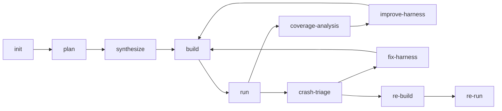

# Sherpa Technical Deep Dive

This document is for learning the project efficiently. Read it when you want to understand how the system works end to end and where to look in code.

## 1. What Sherpa Is Actually Solving

Sherpa automates the fuzz engineering loop, not just harness generation.

The hard part of practical fuzzing is chaining these steps reliably:

- choose a target worth fuzzing
- generate a scaffold that actually builds
- create seeds with semantic value
- run fuzzers long enough to get signal
- classify crashes correctly
- keep improving when there is no crash but coverage stalls

Sherpa exists to turn those repeated steps into an explicit workflow with artifacts and routing.

## 2. Build the Right Mental Model

Think in four layers:

1. UI
   Submit tasks, configure providers, and observe jobs.

2. Control plane
   `main.py` exposes APIs and dispatches stage jobs.

3. Workflow state machine
   `workflow_graph.py` decides what stage comes next and why.

4. Execution layer
   `fuzz_unharnessed_repo.py` performs clone/build/run/OpenCode actions.

If you confuse layer 3 and layer 4, the codebase becomes much harder to read.

## 3. Current Mainline Workflow

How to read the key edges:

- `build -> run`: scaffold is buildable and target mapping is acceptable
- `run -> coverage-analysis`: no crash path to triage, now decide whether improvement is justified
- `run -> crash-triage`: there is a crash candidate that needs classification
- `crash-triage -> fix-harness`: likely harness-side bug
- `crash-triage -> re-build`: likely upstream bug or at least needs repro validation
- `improve-harness -> build`: keep the same target but improve its behavior

## 4. How to Study the Code

Recommended order:

1. [../README.md](../README.md)
   Get the system map first.

2. [CODEBASE_TECHNICAL_ANALYSIS.md](CODEBASE_TECHNICAL_ANALYSIS.md)
   Understand module boundaries and current stage semantics.

3. `harness_generator/src/langchain_agent/workflow_graph.py`
   Read node functions and routing decisions.

4. `harness_generator/src/fuzz_unharnessed_repo.py`
   Read how each stage is actually executed.

5. `harness_generator/src/langchain_agent/main.py`
   Read task lifecycle, API aggregation, and stage dispatch.

6. `harness_generator/src/codex_helper.py` and `harness_generator/src/langchain_agent/opencode_skills/`
   Read how stage-specific AI behavior is constrained.

## 5. Three Core Capability Loops

### 5.1 Target planning loop

Artifacts:

- `fuzz/PLAN.md`
- `fuzz/targets.json`
- `fuzz/selected_targets.json`
- `fuzz/execution_plan.json`

What matters:

- target must be runtime-viable
- depth matters more than superficial call reachability
- target choice implies seed profile and likely harness shape

### 5.2 Seed quality loop

Artifacts:

- `fuzz/corpus/<target>/`
- `fuzz/seed_quality_<target>.json`
- workflow `SeedFeedback`

What matters:

- repo examples are preferred when meaningful
- AI seeds should cover missing semantic families
- mutation is supportive, not a substitute for valid examples
- coverage improvement depends on seed quality, not just seed count

### 5.3 Crash and repro loop

Artifacts:

- `crash_info.md`
- `crash_analysis.md`
- `crash_triage.json`
- `repro_context.json`

What matters:

- not every crash is an upstream bug
- harness bugs must be filtered before repro claims
- repro is a separate validation path, not part of exploratory fuzzing

## 6. Coverage Improvement Logic

Coverage improvement is where many systems become noisy. Sherpa uses a dedicated loop:

1. `run` emits coverage, feature, plateau, seed, and target signals
2. `coverage-analysis` decides whether there is a justified next action
3. `improve-harness` either improves the current target in place or hands off to replan

Current feedback signals worth understanding:

- `SeedFeedback`
- `HarnessFeedback`
- `coverage_quality_oracle`

The point is to avoid blind replanning or repeated no-op changes.

## 7. API Learning Path

If you need frontend/backend integration, focus on these routes first:

- `POST /api/task`
- `GET /api/tasks`
- `GET /api/task/{job_id}`
- `POST /api/task/{job_id}/stop`
- `GET /api/system`
- `PUT /api/config`

Important distinction:

- task-level rows are parent tasks
- workflow stages are child fuzz jobs or stage jobs
- `/api/system` is a system aggregate, not a raw task dump

See [API_REFERENCE.md](API_REFERENCE.md) for field-level detail.

## 8. Where Failures Usually Come From

### Target too shallow

Symptoms:

- fast build/run success
- little coverage growth
- repeated plateau

### Scaffold and execution plan drift

Symptoms:

- `execution_plan.json` points to targets that are not backed by harnesses
- undercoverage gate triggers even after “successful” synthesis

### Seed quality looks large but weak

Symptoms:

- many corpus files
- low family coverage
- high noise rejection
- little coverage gain

### Crash path is actually harness-side

Symptoms:

- invalid format string / uncaught exception / bad harness assumptions
- repro fails in a way that does not implicate upstream code

## 9. Operational Reading

When debugging a live task, check these in order:

1. `/app/job-logs/jobs/<job_id>.log`
2. `/shared/output/_k8s_jobs/<job_id>/stage-*.json`
3. `/shared/output/<repo>-<id>/run_summary.json`
4. crash and repro artifacts if present

Operational docs:

- [k8s/DEPLOY.md](k8s/DEPLOY.md)
- [k8s/RUNBOOK.md](k8s/RUNBOOK.md)

## 10. What Not to Learn from Old Material

If an older document implies that:

- historical fix stages are the main repair path
- inner Docker remains part of the required execution model
- migration checklist items are the current operating manual

then treat it as legacy context rather than current truth.

The current source of truth is the code plus the rewritten main docs in this directory.
