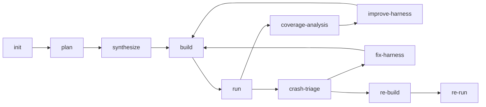

# Sherpa 技术深潜

本文档旨在帮助你高效理解项目。当你希望端到端地理解系统在做什么，以及应该先看哪些代码时，请从这里开始。

## 1. Sherpa 真正要解决的问题

Sherpa 自动化的是 fuzz 工程闭环，而不只是 harness 生成。

实践中的难点，是要把以下步骤稳定串起来：

- 选择值得 fuzz 的目标
- 生成真正能构建的脚手架
- 创建有语义价值的种子
- 让 fuzzer 跑得足够久，从而产生有效信号
- 正确分类崩溃
- 在没有崩溃但覆盖率停滞时继续改进

Sherpa 的存在，就是把这些重复步骤变成一个具有明确产物与路由决策的工作流。

## 2. 建立正确的心智模型

请按四层来理解系统：

1. UI
   提交任务、配置 provider、观察作业。

2. 控制面
   `main.py` 暴露 API，并分发阶段作业。

3. 工作流状态机
   `workflow_graph.py` 决定下一阶段是什么，以及为什么这样决策。

4. 执行层
   `fuzz_unharnessed_repo.py` 负责 clone / build / run / OpenCode 等具体动作。

如果把第 3 层和第 4 层混为一谈，代码库会非常难读。

## 3. 当前主线工作流

关键边的阅读方式：

- `build -> run`：脚手架可构建，且目标映射可接受
- `run -> coverage-analysis`：没有需要分诊的崩溃路径，此时判断是否值得继续改进
- `run -> crash-triage`：出现候选崩溃，需要进一步分类
- `crash-triage -> fix-harness`：更可能是 harness 侧问题
- `crash-triage -> re-build`：更可能是上游问题，或至少需要复现验证
- `improve-harness -> build`：保留当前目标，只改进行为

## 4. 如何阅读代码

推荐顺序：

1. [../README.md](../README.md)
   先获得系统地图。

2. [CODEBASE_TECHNICAL_ANALYSIS.md](CODEBASE_TECHNICAL_ANALYSIS.md)
   理解模块边界与当前阶段语义。

3. `harness_generator/src/langchain_agent/workflow_graph.py`
   阅读节点函数与路由决策。

4. `harness_generator/src/fuzz_unharnessed_repo.py`
   阅读各阶段实际如何执行。

5. `harness_generator/src/langchain_agent/main.py`
   阅读任务生命周期、API 聚合与阶段分发。

6. `harness_generator/src/codex_helper.py` 与 `harness_generator/src/langchain_agent/opencode_skills/`
   阅读阶段级 AI 行为是如何被约束的。

## 5. 三条核心能力循环

### 5.1 目标规划循环

产物：

- `fuzz/PLAN.md`
- `fuzz/targets.json`
- `fuzz/selected_targets.json`
- `fuzz/execution_plan.json`

关键点：

- 目标必须在运行时可行
- 深度比表面的可达性更重要
- 目标选择会直接影响种子画像与 harness 形态

### 5.2 种子质量循环

产物：

- `fuzz/corpus/<target>/`
- `fuzz/seed_quality_<target>.json`
- 工作流内的 `SeedFeedback`

关键点：

- 有意义时优先使用仓库样例
- AI 种子应补齐缺失的语义家族
- 变异只是辅助，而不是有效样例的替代品
- 覆盖率改进依赖的是种子质量，而不只是种子数量

### 5.3 崩溃与复现循环

产物：

- `crash_info.md`
- `crash_analysis.md`
- `crash_triage.json`
- `repro_context.json`

关键点：

- 并不是所有崩溃都是上游 bug
- 在宣称可复现之前，必须先滤掉 harness bug
- 复现是一条独立验证链路，不属于探索式 fuzz 本身

## 6. 覆盖率改进逻辑

覆盖率改进是很多系统噪声最重的地方。Sherpa 为此设计了专门的循环：

1. `run` 输出覆盖率、feature、平台期、种子与目标相关信号
2. `coverage-analysis` 判断是否存在合理的下一步
3. `improve-harness` 决定是在当前目标上原地改进，还是移交给 replan

当前值得重点理解的反馈信号：

- `SeedFeedback`
- `HarnessFeedback`
- `coverage_quality_oracle`

核心目标，是避免盲目 replan 或重复执行无效修改。

## 7. API 学习路径

如果你关注前后端集成，请先聚焦这些路由：

- `POST /api/task`
- `GET /api/tasks`
- `GET /api/task/{job_id}`
- `POST /api/task/{job_id}/stop`
- `GET /api/system`
- `PUT /api/config`

需要注意的区别：

- 任务表中的行是父任务
- 工作流阶段对应的是子 fuzz job 或 stage job
- `/api/system` 是系统聚合视图，而不是原始任务转储

字段细节见 [API_REFERENCE.md](API_REFERENCE.md)。

## 8. 常见失败来源

### 目标太浅

表现：

- build / run 很快成功
- 覆盖率增长很少
- 频繁进入平台期

### 脚手架与 execution plan 漂移

表现：

- `execution_plan.json` 指向的目标没有对应 harness
- 即使 synthesize 看起来成功，仍触发 undercoverage 门禁

### 种子看起来很多，但质量很弱

表现：

- 语料文件很多
- 家族覆盖不足
- 噪声拒绝率高
- 覆盖率收益很小

### 崩溃路径实际上是 harness 问题

表现：

- 无效格式字符串 / 未捕获异常 / 错误的 harness 假设
- 复现失败，且无法指向上游代码

## 9. 运维阅读顺序

调试线上任务时，建议按以下顺序查看：

1. `/app/job-logs/jobs/<job_id>.log`
2. `/shared/output/_k8s_jobs/<job_id>/stage-*.json`
3. `/shared/output/<repo>-<id>/run_summary.json`
4. 若存在，再查看 crash 与 repro 产物

运维文档：

- [k8s/DEPLOY.md](k8s/DEPLOY.md)
- [k8s/RUNBOOK.md](k8s/RUNBOOK.md)

## 10. 不要从旧材料中学到什么

如果旧文档暗示：

- 历史修复阶段仍然是主要修复路径
- inner Docker 仍是必需执行模型的一部分
- 迁移清单仍是当前操作手册

请将其视为遗留背景，而不是当前事实。

当前事实来源始终是代码，以及本目录中重写后的主文档。
