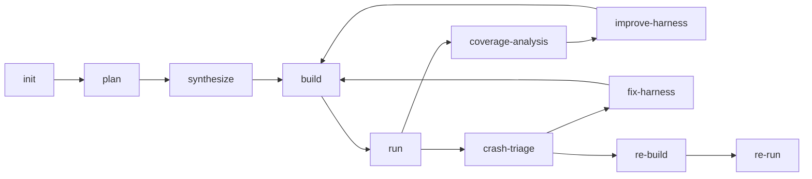

# Sherpa 技术学习指南

这份文档是给你系统学习 Sherpa 代码和工程设计的入口。  
目标是让你在最短时间内看懂：

- 这个系统到底在解决什么问题
- 当前真实工作流怎么跑
- API、状态机、K8s、seed、crash triage 之间怎么串起来
- 哪些地方最容易出问题
- 排障时该先看什么

## 1. 先建立整体认知

Sherpa 的本质是一个 fuzz 编排系统，不是一个单点 harness 生成器。

你可以把它理解成四层：

1. **前端控制台**  
   负责提交任务、展示系统总览、查看任务状态和阶段进度。

2. **控制面 API**  
   由 `main.py` 提供，负责配置、任务创建、任务状态聚合、系统指标输出。

3. **工作流状态机**  
   由 `workflow_graph.py` 实现，负责决定每个 stage 之后走向哪里。

4. **执行面**  
   由 `fuzz_unharnessed_repo.py` 和 Kubernetes worker 执行，负责 clone、build、run、triage 和复现。

如果你先把这四层分清，后面看代码会快很多。

## 2. 当前真实工作流

主线不是简单的 `plan -> build -> run`，而是一条带分流的状态机：

你在学习时要重点理解每条边的含义：

- `build -> run`：说明 scaffold 真能编过，能开始 fuzz
- `run -> coverage-analysis`：说明没有 crash，但在看是否进入 plateau
- `run -> crash-triage`：说明发现 crash，要先判断是 harness 问题还是上游问题
- `crash-triage -> fix-harness`：说明更像 harness bug
- `crash-triage -> re-build`：说明更像上游 bug 或至少需要复现链路

这套设计的核心不是“阶段很多”，而是每一步都能把失败原因变成下一步输入。

## 3. 你应该先看哪些文件

建议顺序如下：

1. [README.md](/README.md)
2. [docs/CODEBASE_TECHNICAL_ANALYSIS.md](/docs/CODEBASE_TECHNICAL_ANALYSIS.md)
3. [docs/API_REFERENCE.md](/docs/API_REFERENCE.md)
4. [harness_generator/src/langchain_agent/workflow_graph.py](/harness_generator/src/langchain_agent/workflow_graph.py)
5. [harness_generator/src/langchain_agent/main.py](/harness_generator/src/langchain_agent/main.py)

为什么这样排：

- `README.md` 给你系统地图
- `CODEBASE_TECHNICAL_ANALYSIS.md` 解释模块边界和状态机
- `API_REFERENCE.md` 解释前端和外部如何对接
- `workflow_graph.py` 是真正的决策核心
- `main.py` 是任务和 API 的控制面

## 4. 工作流里最重要的概念

### 4.1 `plan`

`plan` 不负责写 harness，只负责把仓库分析成“适合 fuzz 的目标”。

你要看懂的输出：

- `fuzz/PLAN.md`
- `fuzz/targets.json`
- `fuzz/target_analysis.json`

重点字段：

- `name`
- `api`
- `target_type`
- `seed_profile`
- `depth_score`

这里最重要的判断是：**我们 fuzz 的不是“仓库里随便一个函数”，而是“经过分析后值得 fuzz 的目标入口”。**

### 4.2 `synthesize`

`synthesize` 负责把选中的 target 变成一个能跑的 fuzz scaffold。

它通常会产出：

- harness 源文件
- `fuzz/build.py` 或 `fuzz/build.sh`
- `fuzz/README.md`
- `fuzz/build_strategy.json`
- `fuzz/observed_target.json`

学习重点：

- 为什么是外部 scaffold，而不是直接用仓库自带 fuzz target
- `build_strategy.json` 如何约束 build.py
- `observed_target.json` 记录的到底是哪个目标

### 4.3 `build`

`build` 不是简单执行命令，而是做“构建前预检 + 实际构建 + 失败分类”。

你要重点理解：

- build 失败时，错误会怎么回流到 repair mode
- `same_build_error_repeats` 为什么会阻止恶性循环
- `partial_build_undercoverage` 为什么不算真正成功
- build 成功以后为什么还要检查是否真的产出了 fuzz binary

### 4.4 `run`

`run` 负责实际 fuzz。

它会做三件事：

1. seed bootstrap
2. 运行 fuzzer
3. 提取运行质量信号

运行信号包括：

- `cov`
- `ft`
- `exec/s`
- plateau
- crash
- OOM
- timeout

你学习时要关注：`run` 不只是“跑一下”，而是把运行结果结构化成后续流程可用的数据。

### 4.5 `crash-triage`

这是 Sherpa 比较关键的一步。

它的任务不是修代码，而是先判断 crash 属于哪一类：

- `harness_bug`
- `upstream_bug`
- `inconclusive`

为什么要单独做这一步：

- 如果是 harness bug，继续把它当上游 bug 复现只会空转
- 如果是 upstream bug，应该进入复现和归档链路
- 如果证据不足，就不能贸然下结论

### 4.6 `fix-harness`

只修 harness 侧问题，比如：

- 未捕获异常
- 入口参数建模不对
- 调用内部 API 的方式不对

这一步不该碰上游库源码。

### 4.7 `coverage-analysis` / `improve-harness`

这条闭环是为了防止“跑起来就停”。

学习时重点理解：

- plateau 是怎么定义的
- 为什么会优先做 in-place 改进
- 什么情况下才允许 replan

### 4.8 `re-build` / `re-run`

这是 crash 复现链路，不是主探索链路。

你要理解它和 `run` 的区别：

- `run`：探索和发现
- `re-build` / `re-run`：验证和复现

这两个链路分开后，系统才能对 crash 结论负责。

## 5. API 学习路径

如果你要看前后端怎么对接，直接看 [docs/API_REFERENCE.md](/docs/API_REFERENCE.md)。

你至少要记住这 4 个接口：

- `POST /api/task`
- `GET /api/tasks`
- `GET /api/system`
- `PUT /api/config`

### 5.1 `/api/task`

这是创建任务的入口。

你要理解：

- 一个 parent task 怎么分成 child fuzz jobs
- `total_duration` / `single_duration` / `unlimited_round_limit` 怎么映射
- 为什么 `-1` 代表无限

### 5.2 `/api/tasks`

这是任务面板轮询的数据源。

重点字段：

- `job_id` / `id`
- `status`
- `stage`
- `repo`
- `progress`
- `active_child_status`

前端展示时，不要把 `progress` 当成严格百分比，它只是软指标。

### 5.3 `/api/system`

这是系统仪表盘的数据源。

重点是四个块：

- `overview`
- `telemetry`
- `execution.summary`
- `tasks_tab_metrics`

这个接口不是 demo 数据拼接，而是从任务状态、运行时和集群指标里聚合出来的。

### 5.4 `/api/config`

它负责运行时配置持久化。

学习重点：

- 为什么有 `apiBaseUrl`
- 为什么 secret 字段会被遮蔽
- 为什么 native k8s 模式下 `fuzz_use_docker` 只是兼容字段

## 6. 运行时产物怎么看

你以后排障时，先看这些文件：

- `/shared/output/<repo>-<id>/run_summary.json`
- `/shared/output/<repo>-<id>/repro_context.json`
- `/shared/output/<repo>-<id>/crash_triage.json`
- `/shared/output/<repo>-<id>/crash_triage.md`
- `/shared/output/_k8s_jobs/<job_id>/stage-*.json`
- `/shared/output/_k8s_jobs/<job_id>/stage-*.error.txt`

这些产物分别回答不同的问题：

- `run_summary.json`：这次任务总体干了什么
- `repro_context.json`：崩溃上下文是什么
- `crash_triage.json`：这次 crash 怎么分类
- `stage-*.json`：每个阶段为什么走向下一步
- `stage-*.error.txt`：具体哪里失败了

## 7. 你要特别留意的失败模式

### 7.1 目标过浅

风险：

- 只 fuzz 到 helper、checksum、wrapper 这种浅入口

表现：

- 运行很快，但覆盖深度上不去

### 7.2 seed 质量太差

风险：

- corpus 里全是噪声，没有覆盖真实输入族

表现：

- 运行时间很多，但 coverage 增长慢

### 7.3 build 修复空转

风险：

- 错误修了很多轮，但其实没改有效文件

表现：

- `fix_build` / `fix-harness` 没有真正改变产物

### 7.4 crash 误分类

风险：

- harness bug 被当成 upstream bug
- upstream bug 被当成 harness bug

表现：

- 复现链路不收敛，或者一直回 plan

### 7.5 前后端指标不一致

风险：

- `/api/tasks` 和 `/api/system` 不是同一份快照

表现：

- 前端数字跳动
- 同一任务在不同 tab 里状态不一致

## 8. 学习建议

如果你想真正吃透这个项目，建议按下面顺序学：

1. 先把 `README.md` 和这个文档看一遍，建立全局视角
2. 再看 `workflow_graph.py` 的节点和路由
3. 再看 `main.py` 的 API 和任务聚合
4. 然后看 `fuzz_unharnessed_repo.py` 的 seed / build / run 执行逻辑
5. 最后看 `tests/`，确认每个行为是怎么被锁住的

如果你只想抓最关键的内容，先看这三样：

- `docs/API_REFERENCE.md`
- `docs/CODEBASE_TECHNICAL_ANALYSIS.md`
- `harness_generator/src/langchain_agent/workflow_graph.py`
