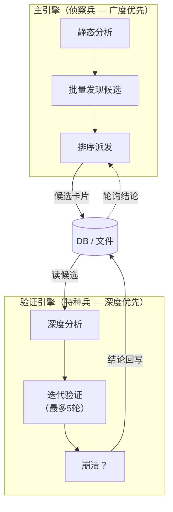
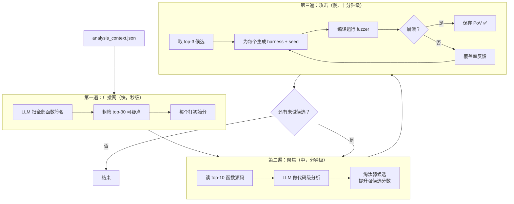
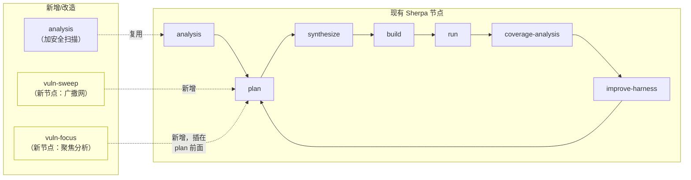
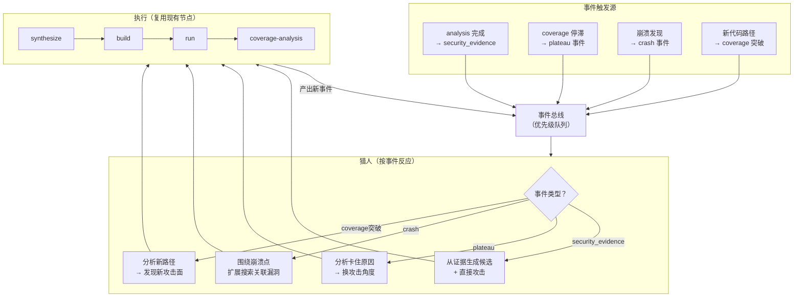
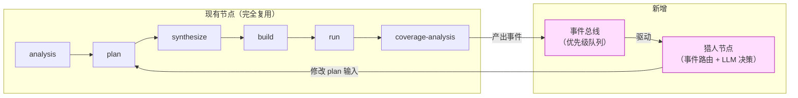
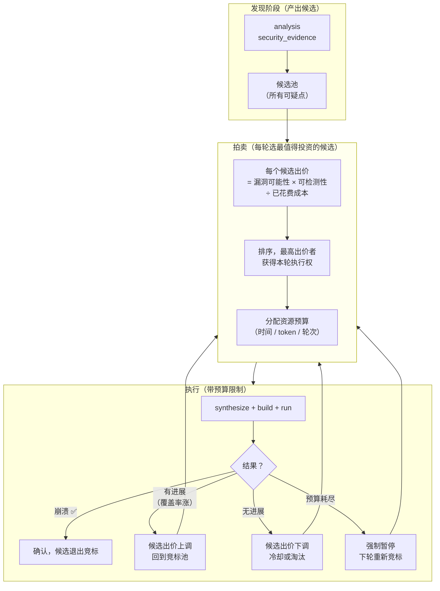
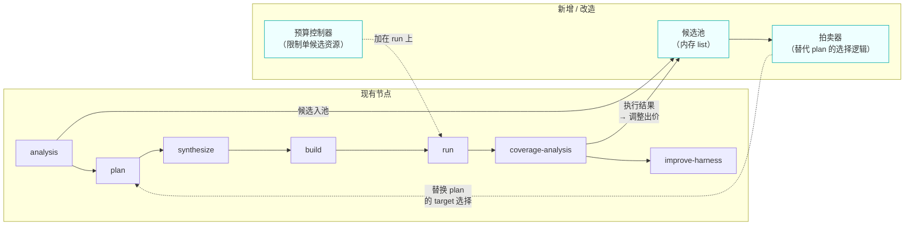
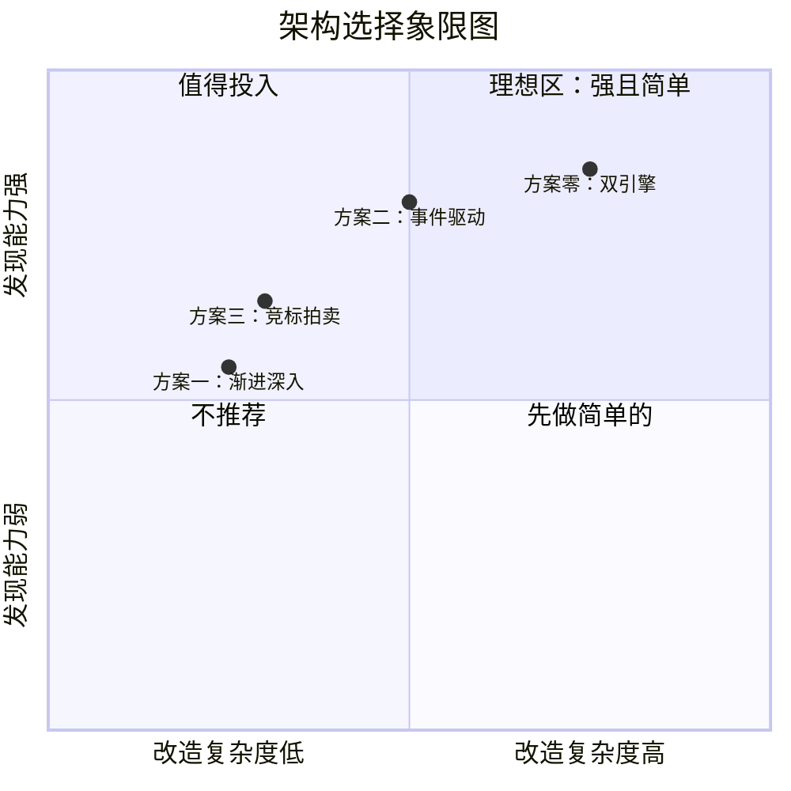
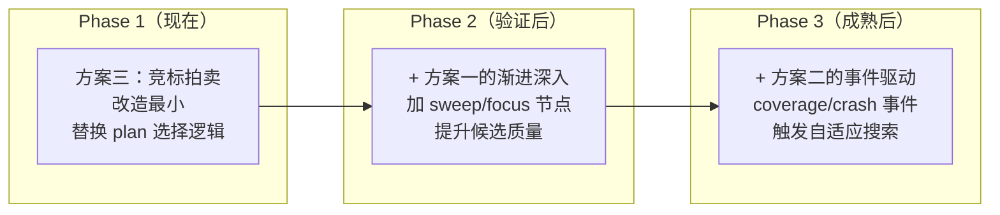

# 漏洞挖掘架构方案对比

> 三种替代架构 + 现有方案，横向对比优劣。

---

## 方案零（当前计划）：侦察兵 + 特种兵双引擎



**核心思想**：一个引擎专门找可疑点（广度），另一个引擎专门验证（深度）。两个引擎通过 DB 异步通信。

**优点**：职责清晰，互不阻塞
**缺点**：需要引入异步调度和 DB 状态机，复杂度较高

---

## 方案一：单引擎渐进深入（Progressive Deepening）



### 核心思想

**不分两个引擎，只用一个引擎按三个"放大镜"逐级深入：**

1. **广撒网**（望远镜）：LLM 看所有函数签名，快速打分，选 top-30
2. **聚焦**（放大镜）：LLM 读 top-10 的源码，做代码级分析，淘汰弱候选
3. **攻击**（显微镜）：对 top-3 生成 harness 并跑 fuzzer

每一遍的结果决定下一遍看什么。就像医生看病：先看症状（快）→ 验血化验（中）→ 做手术（慢）。

### 与现有系统的关系



**改造量**：
- 新增 2 个节点（`vuln-sweep` + `vuln-focus`），插在 `analysis → plan` 之间
- `plan` 节点改为读 focus 结果选 target
- 其余节点（synthesize/build/run/coverage-analysis）**完全复用**
- **不需要 DB 状态机，不需要异步调度**
- 整个流程仍然是 LangGraph 单链

### 优缺点

| 优点 | 缺点 |
|------|------|
| **最简单**：不引入异步/DB/多引擎 | 串行执行，验证一个候选时不能同时发现新候选 |
| **完全复用**现有节点，改造量最小 | 深度分析和验证耦合在同一引擎，互相等待 |
| **好调试**：单链路，出问题看一条线 | top-3 都失败后需要回到聚焦阶段重选，回退逻辑复杂 |
| **渐进交付**：每一遍都有可观测输出 | 不支持并发验证多个候选 |

---

## 方案二：事件驱动猎人（Event-Driven Hunter）



### 核心思想

**不预先规划"先做什么后做什么"，而是让系统根据发生的事情自动反应：**

- 分析完成 → 触发 `security_evidence` 事件 → 猎人从证据出发攻击
- 跑了一会儿覆盖率不涨了 → 触发 `plateau` 事件 → 猎人分析为什么卡住，换角度
- 发现一个崩溃 → 触发 `crash` 事件 → 猎人在崩溃点周围搜索相似漏洞
- 覆盖率突然涨了 → 触发 `coverage_breakthrough` 事件 → 猎人分析新路径有没有新攻击面

就像打猎：不是按地图从左到右扫，而是听到动静就往那个方向追。

### 事件契约

```jsonc
{
  "event_type": "plateau",           // security_evidence / plateau / crash / coverage_breakthrough
  "priority": 0.85,
  "context": {
    "current_target": "png_read_row",
    "stall_seconds": 300,
    "last_cov": 185,
    "uncovered_functions": ["png_read_filter_row", "png_check_chunk_length"]
  },
  "suggested_action": "switch_attack_angle",
  "timestamp": "2026-04-15T10:00:00Z"
}
```

### 与现有系统的关系



**改造量**：
- 新增 1 个猎人节点 + 1 个事件队列（可以用内存 list 实现）
- `coverage-analysis` 节点产出事件（在现有输出基础上追加）
- `plan` 节点增加读事件能力
- 现有执行节点（synthesize/build/run）**完全复用**

### 优缺点

| 优点 | 缺点 |
|------|------|
| **自适应**：系统自动响应运行时信号 | 事件优先级排序逻辑复杂 |
| **不浪费**：只在"有线索"时行动 | 首次运行前没有事件，需要冷启动逻辑 |
| **发现能力强**：崩溃/coverage 突破都能触发新一轮搜索 | 事件风暴风险：一个崩溃可能触发连锁反应 |
| **与现有系统兼容好**：不改变主链，只加旁路 | **调试难**：行为不可预测，日志需要非常详细 |
| **可增量部署**：先加一种事件，逐步增加 | 需要防止事件循环（A 触发 B 触发 A） |

---

## 方案三：竞标拍卖制（Auction-Based）



### 核心思想

**把候选当作"投资标的"，用拍卖机制决定谁获得下一轮执行资源：**

- 每个候选有一个"出价"（bid），由它的漏洞可能性、可检测性、以及已经花了多少成本决定
- 每轮只有出价最高的候选获得执行权
- 执行后根据结果调整出价：
  - 有进展（覆盖率涨了）→ 出价上调，下轮更容易被选中
  - 无进展 → 出价下调，可能被其他候选超过
  - 预算耗尽 → 强制暂停，下轮重新参与竞标

就像风投：每轮把钱投给最有可能成功的项目。项目出成果就追加投资，不出成果就减少投资或放弃。

### 出价公式

```
bid = (vuln_likelihood × exploitability × reachability)
    ÷ (1 + cost_spent / cost_budget)
    × progress_bonus
    × freshness_decay

progress_bonus = 1.0 + (coverage_delta / 100)    # 有进展加分
freshness_decay = 0.95 ^ hours_since_last_try     # 久不试的逐渐降权
```

### 与现有系统的关系



**改造量**：
- `plan` 节点的 target 选择逻辑替换为拍卖器
- `coverage-analysis` 节点增加出价调整逻辑
- 新增预算控制（可以复用现有的 `plateau` / `max_rounds` 机制）
- 现有执行节点完全复用
- **不需要 DB，不需要异步**——候选池就是内存中的 list

### 优缺点

| 优点 | 缺点 |
|------|------|
| **资源最优分配**：永远在最值得的候选上花时间 | 出价公式需要调参（权重、衰减系数） |
| **自动淘汰弱候选**：无进展的自然被超过 | 可能过早放弃"慢热型"候选 |
| **最小改造量**：核心就是替换 plan 的选择逻辑 | 不支持并发验证 |
| **完全透明**：每轮选择都有出价排序可解释 | 候选之间没有信息共享（A 的发现不能帮助 B） |
| **天然防空转**：成本越高出价越低，自动退出 | 新候选（未试过）可能被老候选（有进展）压制 |

---

## 四种方案横向对比



| 维度 | 方案零：双引擎 | 方案一：渐进深入 | 方案二：事件驱动 | 方案三：竞标拍卖 |
|------|:---:|:---:|:---:|:---:|
| **改造量** | 大（DB + 异步 + 调度） | 小（加 2 节点） | 中（加事件总线） | 小（改 plan 逻辑） |
| **并发验证** | ✅ 支持 | ❌ 串行 | ⚠️ 可扩展 | ❌ 串行 |
| **深度分析** | ✅ 专门引擎 | ⚠️ 聚焦阶段有 | ✅ 事件触发深挖 | ❌ 无专门深挖 |
| **自适应** | ⚠️ 轮询式 | ❌ 预设路径 | ✅ 实时反应 | ✅ 出价自动调整 |
| **调试难度** | 中 | 低 | 高 | 低 |
| **与现有系统兼容** | 需要新基础设施 | 完全兼容 | 基本兼容 | 完全兼容 |
| **冷启动** | 需要 analysis 产出候选 | 需要 analysis | 需要冷启动逻辑 | 需要 analysis |
| **防空转** | 签名去重 + cooling | 淘汰机制 | 事件驱动天然防空转 | 出价衰减天然防空转 |
| **信息流转** | 单向：主→验证→回写 | 单向：逐级传递 | 双向：事件循环 | 单向：候选池→执行→调整 |

---

## 混合方案建议

实际上这些方案并不互斥。可以**分阶段组合**：



1. **Phase 1**：先用方案三（竞标拍卖），因为改造量最小——本质上只是给 `plan` 节点的 target 选择逻辑加上出价排序和动态调权
2. **Phase 2**：在方案三基础上加方案一的渐进深入——在 analysis 和 plan 之间插入 sweep/focus 节点，提升候选质量
3. **Phase 3**：加方案二的事件驱动——让 coverage 停滞、崩溃发现等运行时事件触发新的搜索

这样每个阶段都有独立价值，且不需要一次性引入 DB 和异步调度的复杂度。
