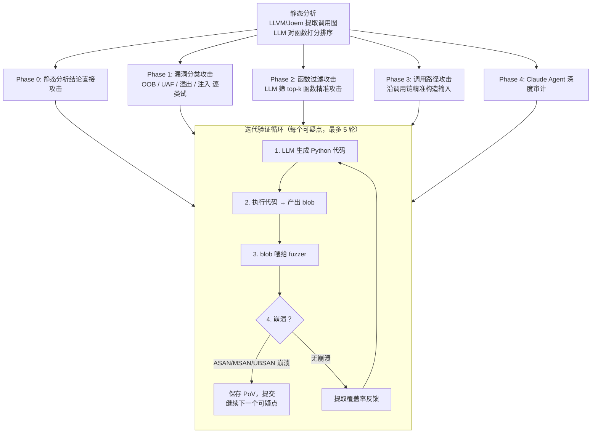
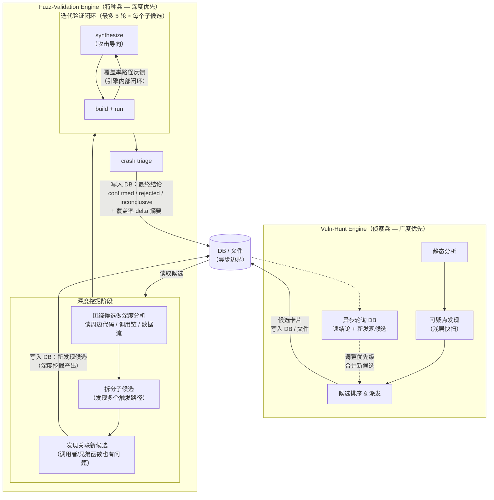
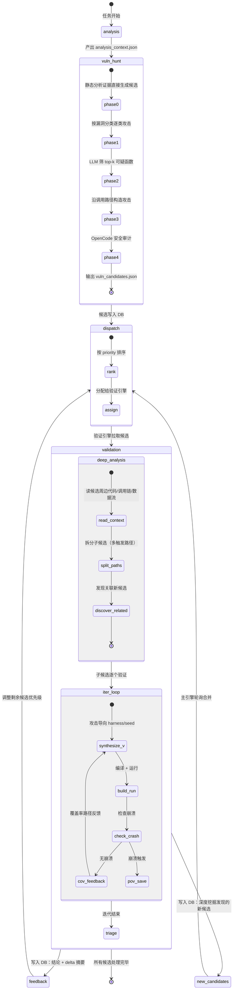
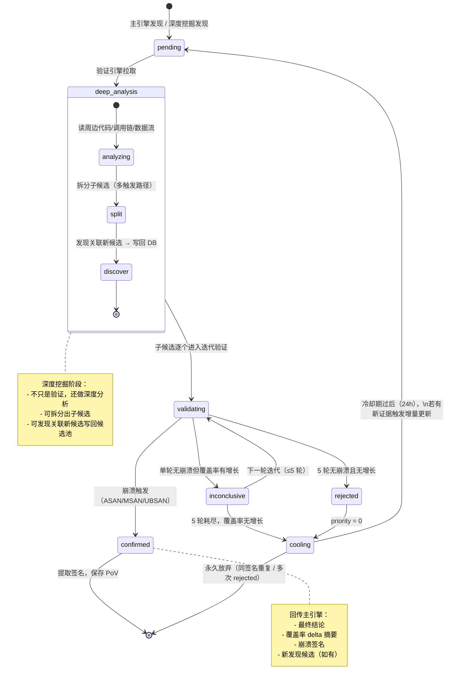
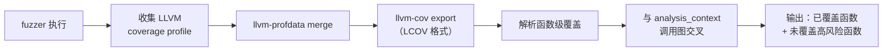
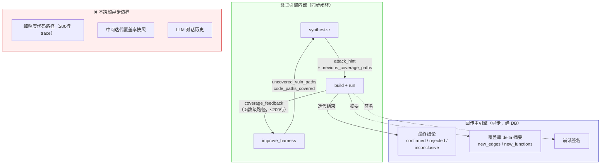
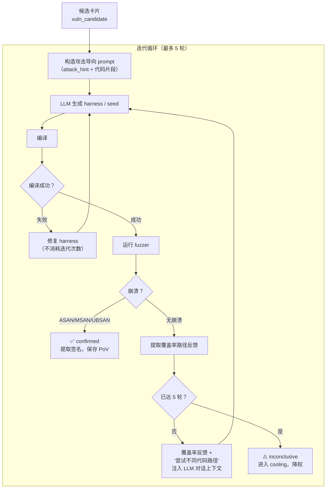
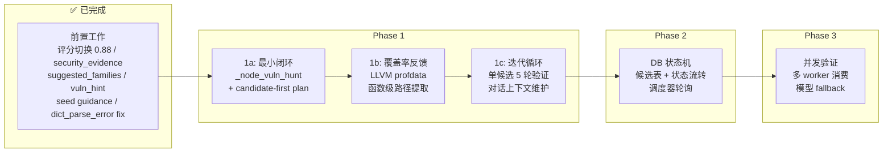

# Sherpa 全面改造计划：持续漏洞挖掘主引擎 + 异步 Fuzz 验证引擎

> 参考项目：[FuzzingBrain (o2lab/afc-crs)](https://github.com/o2lab/afc-crs-all-you-need-is-a-fuzzing-brain)
> 本地 clone：`references/afc-crs-all-you-need-is-a-fuzzing-brain` (commit `0fba44e`)

## 1. 目标与范围

### 1.1 目标
- 把 Sherpa 从单线性 `analysis → plan → synthesize → build → run → coverage-analysis` 模式，升级为"持续漏洞挖掘优先"的双引擎系统。
- 模仿 FuzzingBrain 的 **可疑点生命周期** 和 **多阶段攻击策略**，让 Sherpa 具备"发现可疑点 → 生成攻击输入 → 验证 → 反馈 → 继续发现"的完整闭环。
- 主引擎持续发现漏洞候选，验证引擎异步消费并验证，主引擎不中断继续发现下一个候选。
- 复用现有 fuzz 执行与修复能力，避免推倒重写。

### 1.2 非目标
- 本次不引入全新外部服务依赖（可优先使用现有 DB/队列/k8s 基础设施）。
- 不改变现有 API 路径语义（只做兼容扩展字段）。

---

## 2. 参考架构：FuzzingBrain 核心模式

> 以下是从参考项目提取的关键设计模式，Sherpa 的改造将模仿这些模式。

### 2.1 FuzzingBrain 的漏洞发现循环



### 2.2 FuzzingBrain 的覆盖率反馈机制（Sherpa 重点借鉴）

FuzzingBrain 在每次迭代失败后，会把**具体执行了哪些代码路径**回传给 LLM：

```
"The following shows the executed code path of the fuzzer with input x.bin.
You should generate a new x.bin to execute a different code path:
  function_a() at file.c:100-110
  function_b() at file.c:150-180
  ...
  function_x() at file.c:999-1050"
```

- C/C++：LLVM profdata → LCOV → 提取函数级控制流
- 压缩到 200 行（前 100 + 后 100）
- 直接追加到 LLM 对话上下文中

**Sherpa 现状差距**：目前 coverage loop 只看覆盖率数字（cov/ft），不告诉 LLM 具体走了哪些路径、哪些分支没覆盖。

### 2.3 FuzzingBrain 的 Security Analyzer Agent

- 基于 Claude Agent SDK
- 50 轮对话上限
- 工具：Read / Write / Bash / Glob / Grep
- 输出结构化漏洞发现：`VULNERABILITY_FOUND: { type, location, function, root_cause, trigger_condition, seed_input_path, verified, severity }`
- 发现排序：verified 优先，severity 高优先
- 可以自己跑 fuzzer 验证发现

---

## 3. 目标架构

### 3.1 双引擎架构



**双引擎角色定义**：

| 角色 | 主引擎（侦察兵） | 验证引擎（特种兵） |
|------|-----------------|-------------------|
| 策略 | **广度优先**：快速扫描全代码库，产出候选清单 | **深度优先**：围绕单个候选深挖，拆分子路径，发现关联候选 |
| 输入 | analysis_context.json（全局代码事实） | 单个候选卡片 + 周边源码 |
| 输出 | 候选清单（浅层评分 + attack_hint） | 验证结论 + 覆盖率 delta + **新发现候选** |
| 分析深度 | 函数签名级（看函数名、参数类型、调用图） | 代码行级（读实现、跟数据流、分析分支条件） |
| 运行时间 | 快（一次性产出，分钟级） | 慢（多轮迭代，每候选可能几十分钟） |

**异步边界规则**：
- 主引擎**写候选、读结论 + 读新发现候选**，不等验证完成。
- 验证引擎**读候选、写结论 + 写新发现候选**，内部迭代闭环不出引擎。
- 验证引擎深度挖掘发现的新候选，**写回 DB**，主引擎下次轮询时合并到候选池。
- 细粒度覆盖率反馈**只在验证引擎内部流转**，不回传主引擎。

### 3.2 完整工作流状态机（改造后）



### 3.3 关键层
- `Orchestrator`：预算、并发、优先级、退避、重试调度。
- `Knowledge/Memory Layer`：候选库、签名库、失败经验、约束记忆。
- `Artifacts & Observability`：decision trace、评分拆解、降级原因、验证证据链全量落盘。

---

## 4. 可疑点生命周期（模仿 FuzzingBrain）

### 4.1 发现阶段

Sherpa 的 `_node_vuln_hunt` 模仿 FuzzingBrain 的多阶段策略：

| 阶段 | FuzzingBrain | Sherpa 对应 |
|------|-------------|------------|
| Phase 0 | 静态分析结论直接攻击 | analysis_context.security_evidence 直接生成候选 |
| Phase 1 | 按漏洞分类逐类攻击 (OOB/UAF/整数溢出/注入...) | 按 `signal_type` 分类，每类生成针对性候选 |
| Phase 2 | LLM 筛 top-k 可疑函数 | LLM 从 target_analysis 中筛高风险函数 |
| Phase 3 | 沿调用路径精准构造 | 利用 analysis_context 的调用图信息构造攻击路径 |
| Phase 4 | Claude Security Agent 深度审计 | OpenCode 安全审计（analysis prompt 已实现 `security_evidence[]` 输出） |

### 4.2 候选状态机



### 4.3 候选输出契约：`vuln_candidate`

每个候选不仅有评分，还必须包含**攻击策略提示**（模仿 FuzzingBrain 的 prompt 构造）：

```jsonc
{
  "candidate_id": "mem_oob_001",           // 幂等主键
  "repo": "libpng",
  "target_api": "png_read_row",
  "target_file": "pngread.c",
  "signal_type": "mem_oob_candidate",      // 漏洞分类
  "security_signals": ["unchecked_memcpy", "external_input_length"],

  // 证据链（与 analysis_evidence.security_evidence 对齐）
  "evidence": [
    {
      "evidence_id": "ev_001",
      "signal_id": "mem_oob_candidate",
      "severity": "high",
      "confidence": 0.85,
      "source_path": "pngread.c",
      "line": 342,
      "summary": "memcpy size derived from untrusted IHDR width without bounds check"
    }
  ],

  // 攻击策略提示（给 synthesize/seed 阶段用）
  "attack_hint": {
    "trigger_condition": "width * channels > allocated row buffer size",
    "suggested_input_pattern": "valid PNG header + oversized IHDR width field (0xFFFF+)",
    "key_code_path": ["png_read_info", "png_read_row", "png_read_filter_row", "memcpy"],
    "boundary_values": ["width=0xFFFFFFFF", "height=1", "channels=4", "bit_depth=8"],
    "vuln_category": "heap-buffer-overflow",
    "sanitizer_hint": "address"             // 建议使用的 sanitizer
  },

  // 评分
  "vuln_likelihood": 0.85,
  "exploitability": 0.70,
  "reachability_confidence": 0.90,
  "detectability_confidence": 0.75,         // fuzzer+sanitizer 组合对该候选的可触发信心
  "priority": 0.82,
  "score_breakdown": {
    "vuln_likelihood": 0.85,
    "exploitability": 0.70,
    "reachability_confidence": 0.90,
    "detectability_confidence": 0.75,
    "coverage_gap": 0.60,
    "complexity_depth": 0.45
  },

  // 状态
  "status": "pending",                      // pending → deep_analysis → validating → confirmed/rejected/inconclusive → cooling
  "validation_rounds": 0,
  "max_validation_rounds": 5,               // 模仿 FuzzingBrain 的 MAX_ITERATIONS
  "created_at": "2026-04-14T12:00:00Z",
  "updated_at": "2026-04-14T12:00:00Z"
}
```

### 4.4 验证结果契约：`validation_result`

```jsonc
{
  "candidate_id": "mem_oob_001",
  "status": "confirmed",                   // confirmed / rejected / inconclusive
  "crash_signature": "heap-buffer-overflow-png_read_row-a3f2b1",
  "sanitizer": "address",
  "crash_trace_summary": "ERROR: AddressSanitizer: heap-buffer-overflow at pngread.c:342",
  "repro_artifacts": {
    "blob_path": "fuzz/povs/mem_oob_001/x1.bin",
    "fuzzer_output_path": "fuzz/povs/mem_oob_001/fuzzer_output.txt",
    "harness_path": "fuzz/png_read_row_fuzz.c"
  },
  "coverage_delta": {
    "before_cov": 120,
    "after_cov": 185,
    "new_edges": 65,
    "new_functions_hit": ["png_read_filter_row", "png_check_chunk_length"]
  },
  "iteration_used": 3,                     // 第几轮迭代触发的
  "failure_reason": "",
  "created_at": "2026-04-14T12:30:00Z"
}
```

### 4.5 签名去重：`signature_cluster`

```jsonc
{
  "signature": "address-heap-buffer-overflow-png_read_row-a3f2b1",
  "count": 1,
  "last_seen": "2026-04-14T12:30:00Z",
  "candidate_ids": ["mem_oob_001"],
  "fuzzer_names": ["png_read_row_fuzz"]
}
```

---

## 5. 细粒度覆盖率反馈（核心改进）

### 5.1 现状问题

Sherpa 当前的 coverage loop 只传递数字：
```
cov: 120, ft: 450, plateau_detected: true, plateau_idle_seconds: 180
```
LLM 只知道"覆盖率没涨"，不知道具体卡在哪、哪些分支没走到。

### 5.2 目标：代码路径级反馈

模仿 FuzzingBrain 的 `CoverageAnalyzer`，在每次 fuzzer 运行后提取**函数级执行路径**：

```
已覆盖的代码路径：
  png_read_info() at pngread.c:100-145
  png_read_update_info() at pngread.c:200-220
  png_read_row() at pngread.c:300-342 ← 到这里就停了

未覆盖的关键分支：
  png_read_filter_row() at pngrutil.c:3400-3500  ← 从未进入
  png_check_chunk_length() at pngread.c:150-180   ← 从未进入

建议：生成输入使 width * channels 超过 row_buffer 分配大小，
触发 png_read_filter_row 中的 memcpy 越界路径。
```

### 5.3 实现路径

#### 5.3.1 覆盖率数据提取



#### 5.3.2 反馈压缩（模仿 FuzzingBrain 的 200 行压缩）

- 已覆盖路径：前 50 行 + 后 50 行（大文件截断）
- 未覆盖关键函数：按 vuln_likelihood 排序，取 top 10
- 总长度控制在 200 行以内，避免 LLM context 爆炸

#### 5.3.3 反馈边界：验证引擎内部闭环 vs. 回传主引擎



细粒度覆盖率反馈**只在验证引擎内部流转**，不跨越异步边界：

**验证引擎内部（同步，迭代间流转）：**

| 注入点 | 注入方式 | 用途 |
|--------|---------|------|
| 迭代 N→N+1 的 LLM 调用 | 对话上下文追加 `coverage_feedback` | LLM 据此调整 seed/harness |
| `improve_harness` (in_place) | seed feedback 增加 `code_paths_covered` 字段 | LLM 据此调整 seed |
| `improve_harness` (seed_replan) | replan context 增加 `uncovered_vuln_paths` 字段 | LLM 重新设计 seed 策略 |
| `synthesize` (重入) | hint 增加 `previous_coverage_paths` 字段 | LLM 改写 harness 瞄准未覆盖分支 |

**回传主引擎（异步，写入 DB/文件，主引擎轮询读取）：**

| 回传内容 | 形式 | 用途 |
|----------|------|------|
| 最终结论 | `confirmed / rejected / inconclusive` | 候选状态流转 |
| 覆盖率 delta 摘要 | `new_edges: 65, new_functions: ["f1","f2"]` | 主引擎据此调整剩余候选优先级 |
| 崩溃签名 | `address-heap-buffer-overflow-png_read_row-a3f2b1` | 签名去重 |

**不回传的内容**（避免破坏异步边界）：
- 细粒度代码路径（200 行的执行 trace）
- 每轮迭代的中间覆盖率快照
- LLM 对话历史

### 5.4 覆盖率反馈数据契约

```jsonc
{
  "coverage_feedback": {
    "format": "function_level",
    "total_functions_reachable": 45,
    "functions_covered": 28,
    "functions_uncovered_high_risk": [
      {
        "function": "png_read_filter_row",
        "file": "pngrutil.c",
        "lines": "3400-3500",
        "vuln_candidate_id": "mem_oob_001",
        "reason_uncovered": "需要特定 filter_type 值才能进入此分支"
      }
    ],
    "execution_trace_compressed": [
      "png_read_info() at pngread.c:100-145",
      "png_read_update_info() at pngread.c:200-220",
      "png_read_row() at pngread.c:300-342"
    ],
    "branch_coverage_summary": {
      "total_branches": 120,
      "covered_branches": 78,
      "uncovered_critical_branches": 12
    },
    "suggestion": "当前输入未触发 filter_type=PNG_FILTER_SUB 分支，建议构造包含 SUB filter 的 IDAT chunk"
  }
}
```

---

## 6. 迭代验证循环（模仿 FuzzingBrain 的 do_pov 循环）

### 6.1 单候选验证流程



### 6.2 与 FuzzingBrain 的对比

| 维度 | FuzzingBrain | Sherpa 改造 |
|------|-------------|------------|
| 攻击输入 | LLM 生成 Python → 产出 blob 二进制 | LLM 写 C harness + 生成 seed 文件 |
| 每轮输入数 | AS0: 5 个 blob (x1~x5)；XS0: 1 个 | 每轮 1 个 harness + N 个 seed |
| 迭代上限 | 5 轮 | 5 轮（`max_validation_rounds`） |
| 覆盖率反馈 | LLVM profdata → 函数级路径 → 200行压缩 | 同，但还需要与候选的 key_code_path 交叉分析 |
| 崩溃检测 | 正则匹配 ASAN/MSAN/UBSAN/TSAN 关键词 | 同（已有） |
| 找到后继续 | 继续找下一个（最多 5 个 unique） | 标记 confirmed，继续验证下一个候选 |
| 模型 fallback | Claude → GPT → Gemini 链式 | 当前单模型，计划支持 fallback |

### 6.3 对话上下文维护

模仿 FuzzingBrain 的 `messages` 列表模式——跨迭代保持对话历史：

```python
messages = [
    {"role": "system", "content": VULN_HUNT_SYSTEM_PROMPT},
    {"role": "user", "content": initial_attack_prompt},   # 含 attack_hint + 代码
]

for iteration in range(1, MAX_ITERATIONS + 1):
    # LLM 生成 harness/seed
    response = llm_call(messages)
    messages.append({"role": "assistant", "content": response})

    # 编译 & 运行
    crash, output = run_fuzzer(...)

    if crash:
        save_pov(...)
        break
    else:
        # 覆盖率反馈追加到对话
        coverage_feedback = extract_coverage_paths(...)
        feedback_msg = f"未触发崩溃。\n\n{coverage_feedback}\n\n请调整输入，尝试覆盖不同代码路径。"
        messages.append({"role": "user", "content": feedback_msg})
```

---

## 7. 评分与选择（风险优先）

### 7.1 目标排序

主排序以风险为主，覆盖率为辅：
- `vuln_likelihood`、`exploitability`、`reachability_confidence` 主导（0.88 权重）。
- `coverage_gap`、`complexity_depth`、`api_relevance` 仅参考（0.12 权重）。

```
score_total = 0.45 * vuln_likelihood
            + 0.25 * exploitability
            + 0.18 * reachability_confidence
            + 0.05 * coverage_gap
            + 0.04 * complexity_depth
            + 0.02 * api_relevance
            + 0.01 * consumer_order_support
            - recent_yield_penalty
```

### 7.2 验证反馈调权

每轮验证后根据结果调整候选优先级：

| 验证结果 | 调整 |
|----------|------|
| confirmed | 标记完成，不再验证 |
| inconclusive + 覆盖率有增长 | priority += 0.1（值得再试） |
| inconclusive + 覆盖率无增长 | priority -= 0.2，进入 cooling |
| rejected（5 轮无崩溃）| priority = 0，cooling 24h |
| 同签名重复 | 直接 rejected，不消耗轮次 |

### 7.3 评分可解释

每个候选必须落盘：
- `score_total` + `score_breakdown`
- `penalty_reason`
- `validation_history[]`（每轮的覆盖率变化和结论）

`decision_trace.jsonl` 必含：
- `choose_candidate`：为什么选这个候选
- `choose_seed`：为什么用这个 seed 策略
- `coverage_feedback`：覆盖率反馈内容
- `strategy_delta`：策略调整说明

---

## 8. 与现有 Sherpa 功能的关系

### 8.1 保留
- 现有 `synthesize/build/run/coverage/crash-triage/repair` 执行能力。
- k8s worker、日志、工件管理、API 主体路径。

### 8.2 升级

| 现有阶段 | 升级内容 |
|----------|---------|
| `analysis` | 安全审计输出 `security_evidence[]`（✅ 已实现） |
| 新增 `vuln-hunt` | analysis 之后，产出候选清单 + 攻击策略（Phase 1a） |
| `plan` | 从 coverage-first 改为 candidate-first，读 `vuln_candidates.json`（candidate-first 声明 ✅ 已实现，读 candidates 待 Phase 1a） |
| `synthesize` | hint 注入漏洞路径（✅ 已实现 `vuln_hint_lines`），完整 `attack_hint` 契约待 Phase 1a |
| `seed_generation` | 注入 `VULN_SEED_GUIDANCE` + `VULN_DICTIONARY_TOKENS`（✅ 已实现） |
| `run` | 运行后提取细粒度覆盖率数据（新增） |
| `coverage_analysis` | 增加代码路径级反馈输出（新增） |
| `improve_harness` | 接收覆盖率路径反馈，针对性调整（新增） |

### 8.3 清理
- 移除冲突旧契约（旧字段透传、旧 seed 键、静默降级）。
- 所有降级必须可观测（禁止 silent fallback）。

---

## 9. 上下文与状态管理

### 9.1 双文件上下文继续沿用
- `fuzz/context/control_context.json`：调度硬参数。
- `fuzz/context/workflow_context.json`：业务状态与决策上下文。

### 9.2 新增文件

| 文件 | 作用 | 产出阶段 |
|------|------|---------|
| `fuzz/vuln_candidates.json` | 候选清单（含 attack_hint） | `_node_vuln_hunt` |
| `fuzz/validation_results.json` | 验证结果记录 | `_node_coverage_analysis` |
| `fuzz/coverage_feedback.json` | 细粒度覆盖率反馈 | `_node_run` 后处理 |
| `fuzz/signature_clusters.json` | 签名去重库 | `_node_crash_triage` |

### 9.3 业务字段归一
- 新增命名空间：`security_*`、`vuln_*`、`candidate_*`、`validation_*`
- 保证跨阶段保真，不回退旧 payload 透传。

---

## 10. Prompt/Skill 合同

### 10.1 `vuln-hunt` Skill 合同

输入：`analysis_context.json`（含 `security_evidence[]`、调用图、目标分类）

必须输出：
- `fuzz/vuln_candidates.json`：候选清单，每条含 `attack_hint`
- `fuzz/vuln_hunt_summary.md`：发现摘要

输出要求：
- 每个候选必须引用至少一个 `evidence_id`
- `attack_hint.key_code_path` 必须是具体的函数名列表
- `attack_hint.boundary_values` 必须是具体的触发值
- 按 `priority` 降序排列

### 10.2 `plan` 合同
- 必须声明：风险优先，coverage 仅参考。
- 输入 `vuln_candidates.json` 时，按 `priority` 选取 top-k 候选。
- 必须输出候选排序拆解与例外说明。

### 10.3 `synthesize` 合同（攻击导向增强）
- 当有 `attack_hint` 时，harness 设计必须瞄准 `key_code_path`。
- seed 设计必须包含 `boundary_values` 中的边界条件。
- 输出 harness 必须包含注释说明瞄准的漏洞类型。

### 10.4 安全渲染
- 所有节点必须走安全渲染路径。
- 模板异常只降级，不中断；必须写：`prompt_render_degraded`、`prompt_render_issue`。

---

## 11. 实施阶段



### Phase 1a：最小可验证闭环（优先）

**目标**：跑通"候选生成 → 目标选择 → fuzz 验证"单趟闭环。

- 在现有 workflow 中新增 `_node_vuln_hunt`：
  - 输入：`analysis_context.json`
  - 输出：`fuzz/vuln_candidates.json`（含 `attack_hint`）
- `_node_plan` 读取 `vuln_candidates.json`，执行 candidate-first 排序。
- `_node_synthesize` 的 hint 注入 `attack_hint`。
- 不引入新队列抽象，不改变 k8s Job 调度模型。
- 保持单任务线性主链。

### Phase 1b：细粒度覆盖率反馈

**目标**：让 LLM 知道"跑了哪些路径、卡在哪里"。

- `_node_run` 后处理增加 LLVM coverage 提取：
  - 编译时带 `-fprofile-instr-generate -fcoverage-mapping`
  - 运行后 `llvm-profdata merge` + `llvm-cov export`
  - 解析为函数级覆盖列表
- 输出 `fuzz/coverage_feedback.json`。
- `improve_harness` 阶段注入覆盖率路径反馈。
- 压缩到 200 行以内。

### Phase 1c：迭代验证循环

**目标**：单候选多轮迭代验证（模仿 FuzzingBrain 的 do_pov 循环）。

- coverage loop 增加"候选验证进展"语义。
- 每个候选最多 5 轮迭代。
- 对话上下文跨迭代保持（messages 列表模式）。
- 覆盖率反馈注入每轮 LLM 调用。

### Phase 2：状态解耦（DB 驱动）

- 落地 `vuln_candidates` 表：`pending → validating → confirmed/rejected/inconclusive → cooling`。
- 调度器轮询 `pending` 候选（按 priority），驱动验证引擎消费。
- 验证结果回写候选状态和覆盖率 delta。
- 不引入外部 MQ，用 DB 状态机实现队列语义。

### Phase 3：执行落地

- 验证引擎并行消费（DB 轮询式），并发与集群容量绑定：
  - `SHERPA_VULN_MAX_CONCURRENT_VALIDATIONS`（默认 `2`，建议上限 `3`）。
- retry / cooling 策略上线。
- seed/repair 与候选状态联动。
- 多模型 fallback 支持（Claude → GPT → Gemini）。

### Phase 4：可观测与治理

- API 字段扩展（兼容新增）。
- trace、snapshot、评分、降级全量可见。
- 监控告警（空转、重复签名、无增量循环）。
- 验证进度看板（候选完成率、平均迭代次数、崩溃发现率）。

### Phase 5：收口清理

- 删除 legacy 透传与冲突契约。
- 更新文档、测试与运维手册。
- 统一开关与默认策略。

---

## 12. 验收标准

- 主引擎可从代码库中自主发现 ≥3 个 unique 候选（含 attack_hint）。
- 候选验证端到端链路稳定（可追踪、可复现、可回写）。
- 覆盖率反馈达到函数级精度，LLM 据此调整后覆盖率 ≥10% 增长。
- 同签名重复空转显著下降（签名去重命中率 ≥80%）。
- 单候选多轮迭代验证可用（≤5 轮收敛或放弃）。
- 在长任务中可稳定观察"发现 → 验证 → 反馈 → 继续发现"闭环。
- 全量回归测试通过，且无旧契约残留。

---

## 13. 风险与控制

### 13.1 风险
- 状态复杂度提升，跨阶段一致性风险变大。
- 并发提升后资源竞争与成本上升。
- 候选质量不足时可能导致验证资源浪费。
- 覆盖率提取依赖 LLVM 工具链，非 C/C++ 项目需要适配。
- 细粒度覆盖率数据量大，context 管理不当会导致 LLM 输出质量下降。
- 现有基础设施以 k8s Job 为主，不适合直接套重型 MQ 语义。

### 13.2 控制
- 幂等主键 + 签名去重 + 限流冷却。
- 多维预算硬阈值（time/token/cost/round）。
- 覆盖率反馈压缩到 200 行以内，避免 context 爆炸。
- 强制结构化降级与死信隔离。
- 关键阶段回滚开关（策略层可回退，执行层不回退）。
- `vuln-hunt` 执行策略：首轮全量候选生成 + 验证反馈触发增量更新。
- `detectability_confidence` 定义为"当前 fuzzer/sanitizer 组合对该候选的可触发可观测信心"。
- 并发验证上限与集群容量绑定，默认 2。

---

## 14. 推荐默认配置

```env
SHERPA_VULN_HUNTING_ENABLED=1
SHERPA_VULN_SCORE_MODE=risk_first_v1
SHERPA_VULN_INTERNAL_API_MIN_SCORE=0.75
SHERPA_VULN_MIN_EVIDENCE_CONFIDENCE=0.45
SHERPA_VULN_TOPK=24
SHERPA_VULN_MAX_CONCURRENT_VALIDATIONS=2
SHERPA_VULN_MAX_ITERATIONS_PER_CANDIDATE=5
SHERPA_VULN_COVERAGE_FEEDBACK_ENABLED=1
SHERPA_VULN_COVERAGE_FEEDBACK_MAX_LINES=200
SHERPA_VULN_COOLING_HOURS=24
```

---

## 15. 已完成工作（当前进度）

以下改动已合入 `sherpa-improvements` 和 `dev` 分支：

| 改动 | 性质 | 状态 |
|------|------|------|
| 评分权重切换到 0.88 vuln-dominant（`0.45 vuln + 0.25 exploit + 0.18 reach`） | 前置：评分基础 | ✅ 已完成 |
| `required_families` → `suggested_families` 全链路重命名 | 前置：去硬约束 | ✅ 已完成 |
| analysis prompt 增加安全审计输出（`security_evidence[]`） | 前置：数据源 | ✅ 已完成 |
| `_load_security_evidence_list()` 严格合约 | 前置：数据源 | ✅ 已完成 |
| synthesize hint 注入漏洞路径（`vuln_hint_lines`） | 前置：攻击引导 | ✅ 已完成 |
| `VULN_SEED_GUIDANCE` + `VULN_DICTIONARY_TOKENS` | 前置：种子引导 | ✅ 已完成 |
| dict_parse_error 立即 exhaust target | 前置：Bug 修复 | ✅ 已完成 |
| 降级传播到 decision snapshot | 前置：可观测性 | ✅ 已完成 |
| plan prompt candidate-first 排序声明 | 前置：排序策略 | ✅ 已完成 |

**当前状态**：所有前置工作已完成，评分、数据源、种子引导、可观测性基础就绪。

**下一步**：Phase 1a — 实现 `_node_vuln_hunt` 节点（候选生成 + `attack_hint` 完整契约 + `vuln_candidates.json` 产出）。

---

## 16. 参考项目路径

### 16.1 上游参考仓库
- GitHub：[o2lab/afc-crs-all-you-need-is-a-fuzzing-brain](https://github.com/o2lab/afc-crs-all-you-need-is-a-fuzzing-brain)

### 16.2 本机 clone
- 完整 clone：`/Users/zuens2020/Documents/Sherpa/references/afc-crs-all-you-need-is-a-fuzzing-brain`
- 当前 commit：`0fba44e`

### 16.3 关键参考文件

| 文件 | Sherpa 对照点 |
|------|-------------|
| `crs/strategy/core/pov_strategy.py` | 迭代验证循环模板 |
| `crs/strategy/jeff/as0_full.py` | 多阶段攻击策略 |
| `crs/strategy/code_analysis/coverage_analyzer.py` | 细粒度覆盖率反馈 |
| `crs/strategy/common/security_analyzer/agent.py` | 安全审计 Agent 设计 |
| `crs/strategy/strategies/xs0_delta_new.py` | 简化版迭代循环 |
| `crs/internal/models/models.go` | 数据契约定义 |
| `crs/internal/executor/task_execution.go` | 任务编排 |
