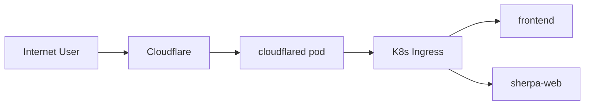

# Cloudflare Tunnel 接入

## 1. 目标

将 `sherpa.zuens2020.work` 映射到集群内 Ingress，不暴露公网 NodePort。

## 2. 部署

```bash
kubectl apply -k k8s/overlays/cloudflare
kubectl -n sherpa get pods | rg cloudflared
```

## 3. 路由要求

1. Cloudflare Tunnel 已连接
2. 公网域名路由到 tunnel
3. Ingress host 包含 `sherpa.zuens2020.work`

## 4. 连接图



## 5. 常见问题

1. 1033：Tunnel 未连接 -> 检查 cloudflared pod 状态
2. 1016：DNS 记录未生效 -> 检查域名记录与隧道路由
3. 404：Ingress host 不匹配 -> 校验 host 与 path
4. 502：Tunnel 已连通但源站不可达
   - 典型日志：`service":"http://localhost:80"` + `connect: connection refused`
   - 原因：Cloudflare 下发的源站是 `localhost:80`，但 cloudflared 容器内无本地 80 服务
   - 处理：启用 `loopback-proxy` sidecar，将 `localhost:80` 转发到 `nginx-ingress-local.ingress.svc.cluster.local:80`
