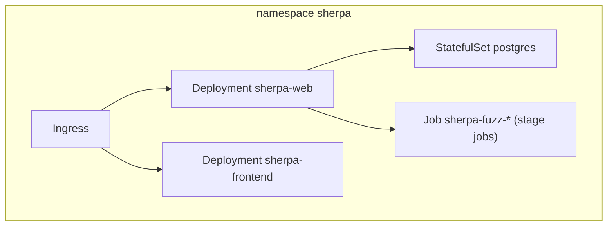

# K8s 部署说明

## 1. 部署对象

1. `sherpa-web`（API + 编排器）
2. `sherpa-frontend`（Web UI）
3. `postgres`（状态存储）
4. 可选 `cloudflared`（内网域名映射）

## 2. 部署命令

```bash
kubectl apply -k k8s/base
```

## 3. 配置要求

1. `DATABASE_URL` 必填
2. `SHERPA_EXECUTOR_MODE=k8s_job`
3. MiniMax Key 通过 Secret 注入

## 4. 架构图



## 5. 验证

```bash
kubectl -n sherpa get pods
kubectl -n sherpa get svc
kubectl -n sherpa get ingress
```
