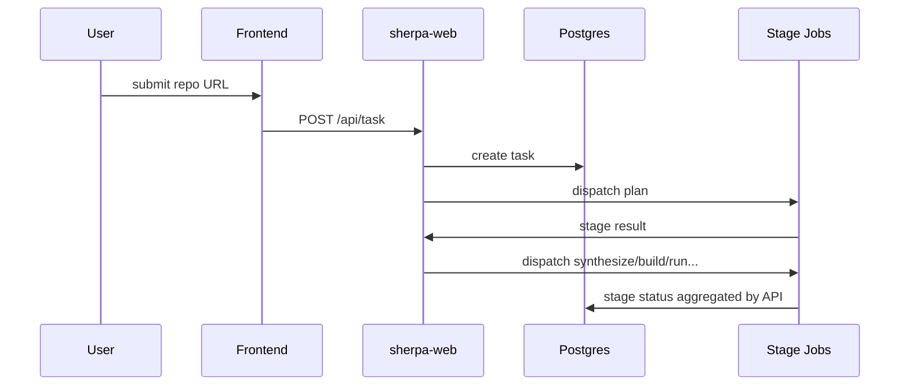

# K8s 部署说明（详细版）

## 组件

### 常驻 Deployment
- `sherpa-web`
- `frontend-next`
- `postgres`

### 短生命周期 Job
- `plan`
- `synthesize`
- `build`
- `run`
- `coverage-analysis`
- `improve-harness`
- `re-build`
- `re-run`

## 镜像职责

### `sherpa-web`
当前镜像内负责：
- Python backend
- `opencode`
- seed/bootstrap 分析依赖
- `radamsa`

worker stage job 复用该镜像或同一运行时能力，不依赖 inner Docker。

### `frontend-next`
提供配置、日志、任务进度展示。

## 关键环境约束

- `SHERPA_EXECUTOR_MODE=k8s_job`
- `SHERPA_OUTPUT_DIR=/shared/output`
- `SHERPA_VERIFY_STAGE_NO_AI` 会影响 verify/seed 相关路径
- k8s 环境中不再依赖 `SHERPA_OPENCODE_DOCKER_IMAGE` 作为 worker 运行前提

## 任务执行链

## 当前常见故障树

### 1. `plan` 失败
优先看：
- `targets.json` schema
- `target_analysis.json`
- OpenCode scaffold 输出是否完整

### 2. `build` 失败
优先看：
- `build_error_code`
- `fix_action_type`
- `fix_effect`
- `final_build_error_code`

### 3. `run` 很久不结束
优先看：
- `run_summary.json`
- `terminal_reason`
- `coverage_loop.*`
- 是否 plateau 但仍有剩余预算

### 4. `re-run` 失败
优先看：
- `repro_context.json`
- `.repro_crash/`
- `re_build_report.json`
- `run_summary.json`
