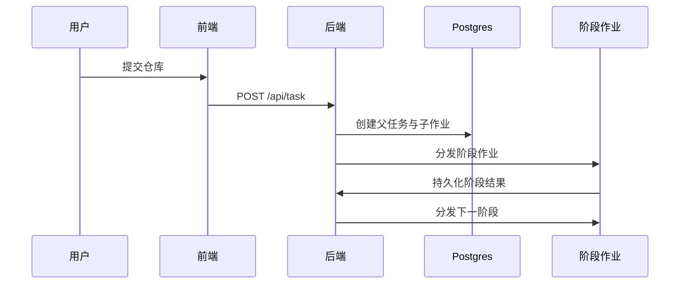

# Kubernetes 部署详解

本文档比简版部署指南更详细地说明当前 Sherpa 的部署模型。

## 1. 组件模型

### 常驻服务

- 后端 API / 控制面
- 前端 UI
- Postgres

### 阶段作业

当前工作流会为这些阶段分发短生命周期 Job：

- `plan`
- `synthesize`
- `build`
- `run`
- `coverage-analysis`
- `improve-harness`
- `crash-triage`
- `fix-harness`
- `re-build`
- `re-run`
- `crash-analysis`

## 2. 数据与产物模型

Sherpa 依赖持久化输出路径，而不是 Pod 本地状态。

重要位置：

- `/shared/output/<repo>-<id>/`
- `/shared/output/_k8s_jobs/<job_id>/`
- `/app/job-logs/jobs/<job_id>.log`

## 3. 控制流

## 4. 环境要求

- worker 与 backend 版本必须对齐
- 共享输出路径必须对所有阶段作业可访问
- metrics 只提升可观测性，不是工作流事实来源
- 应保持非 root 运行与临时目录假设

## 5. 部署后要验证什么

- 后端路由可正常响应
- 前端可以读取实时 API 数据
- 阶段作业能够被正确分发
- 持久化输出出现在预期位置
- 至少一个真实仓库任务能跨越多个阶段

## 6. 本文不覆盖的内容

- 从零开始引导集群
- 云厂商特定的 ingress / 负载均衡配置
- 历史迁移笔记

如果你需要“从零搭集群”，请看 [`ORIGINAL_K8S_CLUSTER_DEPLOYMENT.md`](ORIGINAL_K8S_CLUSTER_DEPLOYMENT.md)。
