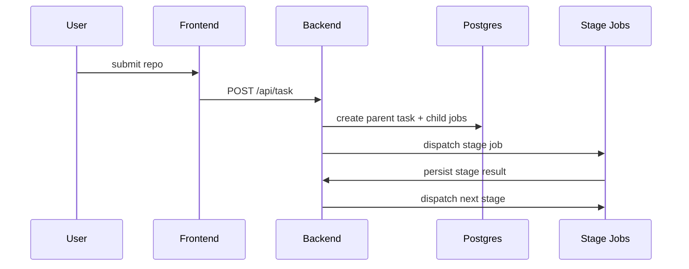

# Kubernetes Deployment Detailed Guide

This document explains the current Sherpa deployment model in more detail than the short deploy guide.

## 1. Component Model

### Long-lived services

- backend API / control plane
- frontend UI
- Postgres

### Stage jobs

The workflow dispatches short-lived Jobs for stages such as:

- `plan`
- `synthesize`
- `build`
- `run`
- `crash-triage`
- `fix-harness`
- `coverage-analysis`
- `improve-harness`
- `re-build`
- `re-run`

## 2. Data and Artifact Model

Sherpa relies on durable output paths rather than pod-local state.

Important persisted locations:

- `/shared/output/<repo>-<id>/`
- `/shared/output/_k8s_jobs/<job_id>/`
- `/app/job-logs/jobs/<job_id>.log`

## 3. Control Flow

## 4. Environment Expectations

- worker and backend versions must be aligned
- shared output must be accessible wherever stage jobs run
- metrics availability improves observability but is not the workflow source of truth
- non-root runtime and temp-dir assumptions should be preserved

## 5. What to Validate After Deploy

- backend routes respond
- frontend loads and reads live API data
- stage jobs can be dispatched
- persisted output appears where expected
- one real repository task can traverse multiple stages successfully

## 6. Not Covered Here

- cluster bootstrap from scratch
- cloud-provider-specific ingress/load-balancer setup
- historical migration notes

For cluster bootstrap, see [ORIGINAL_K8S_CLUSTER_DEPLOYMENT.md](ORIGINAL_K8S_CLUSTER_DEPLOYMENT.md).
