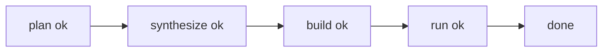

# zlib E2E 报告（模板）

- 日期：YYYY-MM-DD
- 环境：k8s/base
- 仓库：`https://github.com/madler/zlib.git`

## 1. 验收目标

1. 阶段 Job 按 `plan -> synthesize -> build -> run` 顺序执行。
2. 任务详情返回统一可观测字段。
3. 失败场景可追溯到阶段日志与结构化错误码。

## 2. 执行命令

```bash
curl -sS -X POST http://127.0.0.1:8001/api/task \
  -H 'Content-Type: application/json' \
  -d '{
    "jobs": [{
      "code_url": "https://github.com/madler/zlib.git",
      "total_time_budget": 900,
      "run_time_budget": 900,
      "max_tokens": 1000
    }]
  }'

curl -sS http://127.0.0.1:8001/api/task/<job_id>
curl -sS http://127.0.0.1:8001/api/tasks?limit=20
```

## 3. 关键观测字段

1. `phase`
2. `error_code`
3. `error_kind`
4. `error_signature`
5. `k8s_job_names`

## 4. 结果图（示意）


