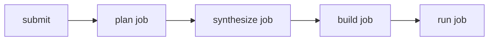

# 本地 K8s 快速启动

## 1. 前置条件

1. 已有可用 Kubernetes 集群（Docker Desktop K8s/kind/minikube）
2. 可用 `kubectl`
3. 已准备 Secret 值（MiniMax、Postgres）

## 2. 部署

```bash
kubectl apply -k k8s/base
kubectl -n sherpa get pods
```

## 3. 健康检查

```bash
kubectl -n sherpa port-forward svc/sherpa-web 8001:8001
curl -sS http://127.0.0.1:8001/api/health
curl -sS http://127.0.0.1:8001/api/system | jq
```

## 4. 提交任务

```bash
curl -sS -X POST http://127.0.0.1:8001/api/task \
  -H 'Content-Type: application/json' \
  -d '{
    "jobs": [{
      "code_url": "https://github.com/madler/zlib.git",
      "total_time_budget": 900,
      "run_time_budget": 900,
      "max_tokens": 1000
    }]
  }'
```

## 5. 轮询与控制

```bash
curl -sS http://127.0.0.1:8001/api/tasks?limit=20
curl -sS http://127.0.0.1:8001/api/task/<job_id>
curl -sS -X POST http://127.0.0.1:8001/api/task/<job_id>/stop
curl -sS -X POST http://127.0.0.1:8001/api/task/<job_id>/resume
```

## 6. 执行链路图


