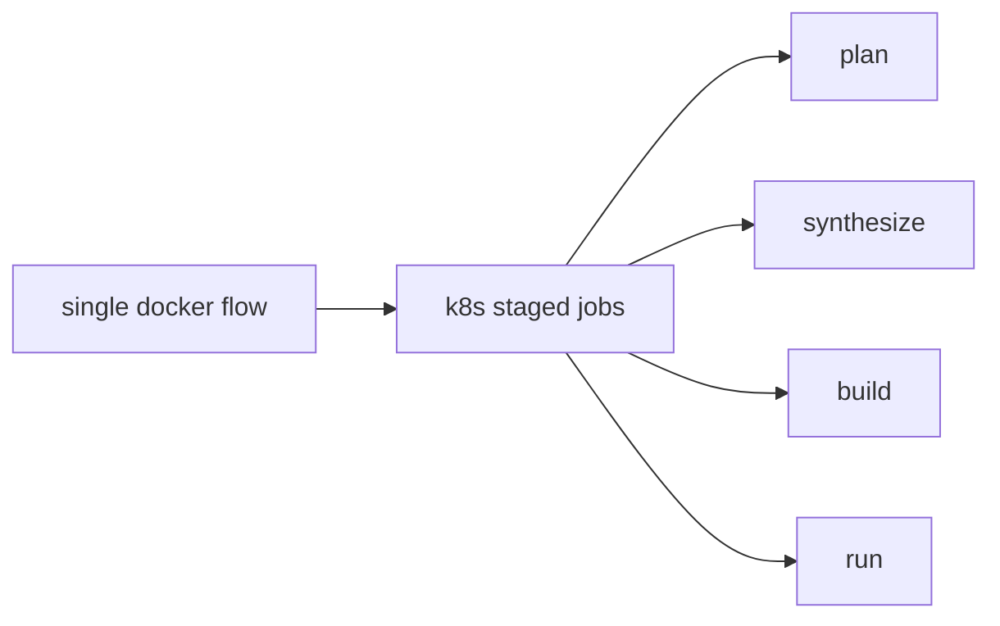

# Compose -> K8s 映射

| 旧模型 | 新模型 | Sherpa 实际对象 |
|---|---|---|
| compose service | Deployment/StatefulSet | web/frontend/postgres |
| docker run one-shot | Job | plan/synthesize/build/run 阶段 Job |
| volume | PVC | shared-output/shared-tmp/job-logs |
| env file | ConfigMap + Secret | 配置与密钥 |
| gateway | Ingress | 路由 `/` 与 `/api/*` |

## 执行映射图

