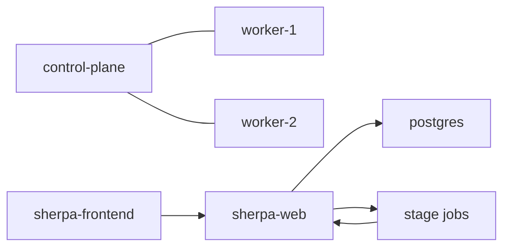

# 原版 Kubernetes 集群部署指南

本文说明如何使用原版 Kubernetes + kubeadm 把多台服务器组成 Sherpa 集群，并在这个集群上部署 `sherpa-web`、`frontend-next` 和 `postgres`。

## 适用场景

- 你已经有多台 Linux 服务器
- 你希望使用原版 Kubernetes，而不是 k3s / microk8s
- 你希望 Sherpa 的常驻服务与 stage Job 都跑在同一套集群里

## 目标架构



## 前置条件

### 机器与网络

- 至少 1 台 control-plane
- 至少 1 台 worker
- 所有节点之间网络可达
- 节点可以访问镜像仓库
- 集群时间同步正常

### 软件

每台机器都需要：

- `containerd`
- `kubelet`
- `kubeadm`
- `kubectl`

### 端口

至少确保下面端口在需要的节点上可达：

- `6443`：Kubernetes API Server
- `10250`：kubelet
- `30000-32767`：NodePort（如果你后面要用）
- CNI 相关端口按你选的插件要求开放

## 1. 初始化主控节点

在 control-plane 节点上执行：

```bash
sudo kubeadm init \
  --apiserver-advertise-address=<CONTROL_PLANE_IP> \
  --pod-network-cidr=10.244.0.0/16
```

说明：

- `--apiserver-advertise-address` 填主控节点对外可达的 IP
- `--pod-network-cidr` 要和你选择的 CNI 匹配
- 如果你用 Calico 或其他 CNI，请改成对应文档要求的网段

初始化完成后，配置 `kubectl`：

```bash
mkdir -p $HOME/.kube
sudo cp /etc/kubernetes/admin.conf $HOME/.kube/config
sudo chown $(id -u):$(id -g) $HOME/.kube/config
```

## 2. 安装 CNI 网络插件

`kubeadm init` 之后，集群还不能直接调度工作负载，必须先装 CNI。

常见做法：

- Flannel
- Calico

示例：

```bash
kubectl apply -f <CNI_MANIFEST_URL>
```

完成后检查：

```bash
kubectl get nodes
kubectl get pods -A
```

所有节点进入 `Ready` 才算网络层正常。

## 3. 让 worker 加入集群

在主控节点上生成 join 命令：

```bash
kubeadm token create --print-join-command
```

把输出的命令复制到每台 worker 节点执行。

worker 加入成功后，在主控节点检查：

```bash
kubectl get nodes -o wide
```

你应该能看到：

- control-plane 节点
- 一个或多个 worker 节点

## 4. 安装 Sherpa 基础组件

Sherpa 当前的集群部署入口在仓库里的 k8s 清单：

- [k8s/base/](/k8s/base/)
- [k8s/overlays/dev/](/k8s/overlays/dev/)
- [k8s/overlays/prod/](/k8s/overlays/prod/)

先部署基础层，再选 overlay：

```bash
kubectl apply -k k8s/base
kubectl apply -k k8s/overlays/dev
```

或者：

```bash
kubectl apply -k k8s/overlays/prod
```

### 部署顺序建议

1. `postgres`
2. `sherpa-web`
3. `frontend-next`
4. 再提交实际 fuzz 任务

## 5. 检查 Sherpa 是否可用

### 节点状态

```bash
kubectl get nodes -o wide
```

### 工作负载

```bash
kubectl get pods -A
kubectl get deploy -A
kubectl get svc -A
```

### Web/API

确认下面两个服务已经起来：

- `sherpa-web`
- `frontend-next`

### Smoke test

建议先跑这些仓库验证主链路：

- `https://github.com/yaml/libyaml.git`
- `https://github.com/fmtlib/fmt.git`
- `https://github.com/madler/zlib.git`

成功标准：

- `plan` 能正常生成目标
- `synthesize` 能输出 harness 和 scaffold
- `build` 能在集群里完成
- `run` 能产生 `run_summary.json`

## 6. Sherpa 运行时注意事项

### control-plane 与 worker 分工

建议：

- control-plane 只负责调度与控制面
- worker 负责跑 Sherpa 的 stage Job

如果你节点数很少，也可以临时去掉 control-plane 的默认调度限制，但生产环境不建议这样做。

### 共享存储

Sherpa 依赖共享输出目录：

- `/shared/output`

确认你的集群已经给这些路径准备好 PVC 或其他共享卷方案，否则 stage Job 的产物会丢失。

### 镜像拉取

worker 节点必须能拉到：

- `sherpa-web` 镜像
- `frontend-next` 镜像
- 运行 stage Job 需要的镜像

如果镜像仓库走代理或镜像源，先在节点侧验证 `crictl pull` 或等效拉取方式。

### non-root

Sherpa 默认按 non-root 思路运行。部署时要确保：

- 容器有权限写临时目录
- 共享卷挂载权限正确
- 不要依赖 root-only 的宿主机目录

## 7. 常见故障

### 节点一直 NotReady

优先检查：

- CNI 是否安装成功
- 防火墙 / 安全组是否阻断了节点通信
- `kubelet` 日志

### Pod 卡在 `ContainerCreating`

优先检查：

- 镜像是否能拉到
- PVC 是否绑定成功
- 节点资源是否足够

### Sherpa 任务卡在 `k8s_job_failed`

优先检查：

- `/shared/output/_k8s_jobs/<job_id>/stage-*.error.txt`
- `kubectl logs` 输出
- `kube-system` 命名空间里的节点与网络组件状态

## 8. 验证命令清单

```bash
kubectl get nodes -o wide
kubectl get pods -A
kubectl describe node <NODE_NAME>
kubectl logs deploy/sherpa-web
kubectl logs deploy/frontend-next
kubectl get pvc -A
```

## 9. 参考文档

- [K8s 部署说明（简版）](/docs/k8s/DEPLOY.md)
- [K8s 部署说明（详细版）](/docs/k8s/DEPLOYMENT_DETAILED.md)
- [本地 K8s 快速启动](/docs/k8s/LOCAL_K8S_QUICKSTART.md)
- [K8s Runbook](/docs/k8s/RUNBOOK.md)
