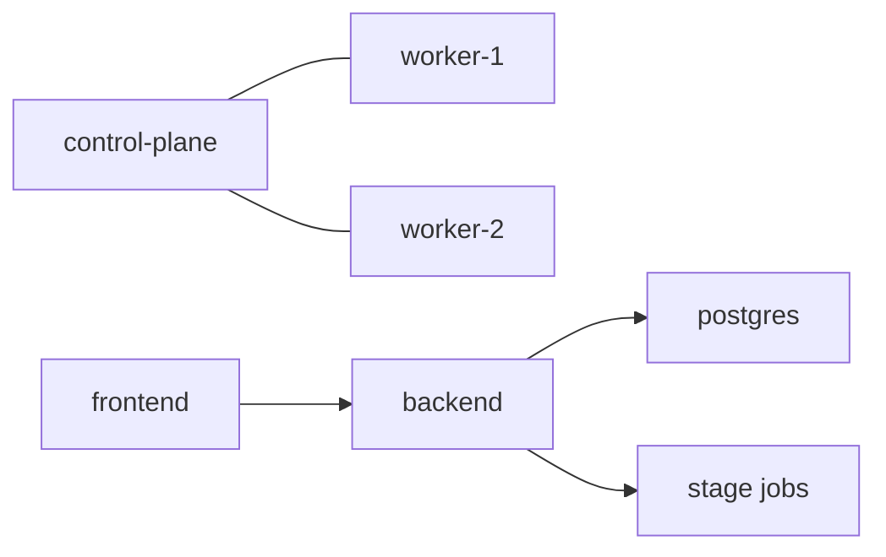

# Original Kubernetes Cluster Deployment Guide

This document explains how to bootstrap a Sherpa-ready cluster on upstream Kubernetes with kubeadm. It is for cluster creation, not day-2 task debugging.

## 1. Intended Use

Use this document when:

- you are building a kubeadm-based cluster from scratch
- you want Sherpa control-plane services and stage jobs on the same cluster

Do not use this as the primary runtime or troubleshooting manual after the cluster already exists. For that, use:

- [DEPLOY.md](DEPLOY.md)
- [DEPLOYMENT_DETAILED.md](DEPLOYMENT_DETAILED.md)
- [RUNBOOK.md](RUNBOOK.md)

## 2. Target Shape

## 3. Bootstrap Summary

1. provision Linux nodes
2. install `containerd`, `kubelet`, `kubeadm`, `kubectl`
3. initialize control plane with kubeadm
4. install a CNI
5. join worker nodes
6. confirm nodes are ready
7. deploy Sherpa services and stage-job-capable runtime configuration

## 4. Sherpa-Specific Requirements

- stage jobs and backend must have access to the same output root strategy
- image pull access must be reliable for backend and worker images
- long-lived services and short-lived jobs must share compatible runtime configuration
- non-root assumptions should be preserved when preparing storage and permissions

## 5. After Bootstrap

Once the cluster is up:

1. deploy Sherpa using the current deployment docs
2. run a smoke-test repository task
3. confirm task artifacts and logs are persisted

## 6. What This File Does Not Try To Be

- not the current workflow source of truth
- not the task runbook
- not the frontend/API contract document
