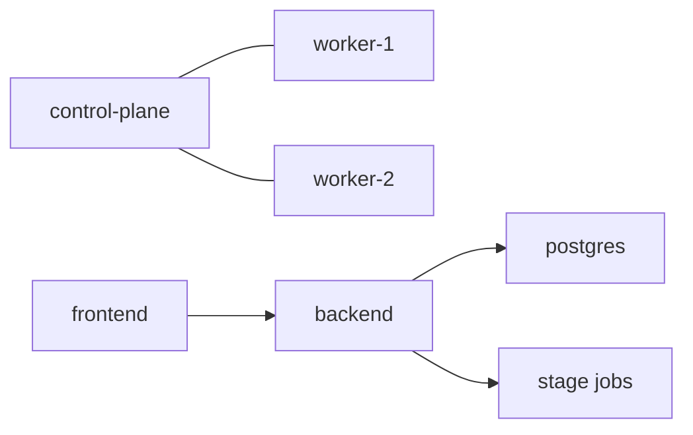

# 原始 Kubernetes 集群部署指南

本文档描述的是“从零引导一个可运行 Sherpa 集群”的历史/基础设施资料，而不是日常运行手册。

## 1. 适用场景

在以下情况使用本文：

- 你要从零开始搭建一个基于 kubeadm 的集群
- 你要把 Sherpa 控制面与阶段作业部署在同一个集群中

如果集群已经存在，不要把它当作主要运行或排障手册。那时应查看：

- [`DEPLOY.md`](DEPLOY.md)
- [`DEPLOYMENT_DETAILED.md`](DEPLOYMENT_DETAILED.md)
- [`RUNBOOK.md`](RUNBOOK.md)

## 2. 目标形态

## 3. 引导摘要

1. 准备 Linux 节点
2. 安装 `containerd`、`kubelet`、`kubeadm`、`kubectl`
3. 使用 kubeadm 初始化控制面
4. 安装 CNI
5. 将 worker 节点加入集群
6. 确认节点 ready
7. 部署 Sherpa 服务与 stage-job 运行时配置

## 4. Sherpa 特定要求

- 阶段作业与后端必须能访问同一种输出根目录策略
- 后端与 worker 镜像必须具备可靠的拉取能力
- 常驻服务与短生命周期作业必须共享兼容的运行时配置
- 存储与权限配置应保留非 root 运行假设

## 5. 集群引导完成后

集群准备好之后：

1. 使用当前部署文档部署 Sherpa
2. 跑一个 smoke-test 仓库任务
3. 确认任务产物与日志已持久化

## 6. 本文不尝试做什么

- 不是当前工作流的事实来源
- 不是任务运行手册
- 不是前端 / API 契约文档
